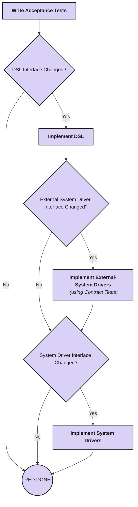
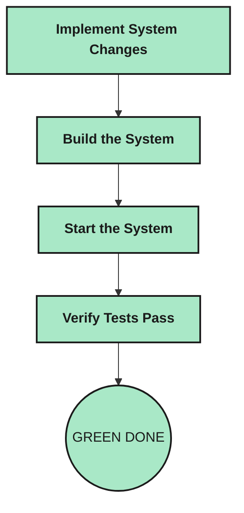
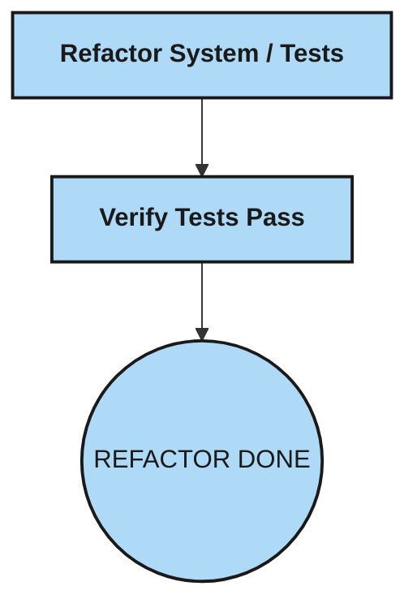

[](https://github.com/optivem/gh-optivem/actions/workflows/gh-commit-stage.yml)
[](https://github.com/optivem/gh-optivem/actions/workflows/gh-acceptance-stage.yml)
[](https://github.com/optivem/gh-optivem/actions/workflows/gh-release-stage.yml)

# gh-optivem

`gh-optivem` is a command line tool that helps you implement software in a reliable way using ATDD & AI.

# Why gh-optivem

I originally hand-rolled this as a single AI agent that owned the entire ATDD process end to end. It decided for itself when to run each step — and would sometimes skip straight to writing implementation code without ever writing the acceptance test it was meant to be red against first. It also ran up about $1,000 in extra usage on top of my Claude Pro plan, because nothing stopped it from re-exploring the whole codebase at every step. gh-optivem exists to fix both problems.

### What you get

- [x] **The ATDD process is a deterministic engine, not an agent's judgment call.** A BPMN workflow drives every red-green-refactor step in a fixed order — no agent decides what runs next or gets to skip a step.
- [x] **AI only does the steps that genuinely need judgment.** Writing acceptance tests, DSL, drivers, and implementation code goes to an agent; everything mechanical — enabling/disabling tests, committing, sequencing steps — is scripted and fully deterministic.
- [x] **Agent output is scope-checked, not just scope-requested.** Telling an agent "only write the test" doesn't stop it from also touching the implementation. After every step, gh-optivem checks the diff — e.g. a test-writing step that also touched drivers or source code fails the gate, even if the test itself looks correct.
- [x] **Human and AI responsibilities are split explicitly, not blended.** Agents write; humans review and approve before anything commits. You always know which lines came from an agent and which decision was a human's.
- [x] **Each step runs in a narrow, focused context.** Test → DSL interface → driver interface → driver implementation → API channel → UI channel, one at a time, each with its own commit checkpoint — smaller context per step means fewer mistakes and far lower token cost than handing an agent the whole ticket at once.
- [x] **Autonomy is a dial, not all-or-nothing.** Run fully autonomous, or require human approval at the red step (recommended minimum — it's the actual spec of what you're building), the green step, or both.
- [x] **Your project's architecture is declared once, in `gh-optivem.yaml`.** Repo strategy (monorepo/multirepo), architecture (monolith/multitier/microservices), per-tier language (Java/.NET/TypeScript), tier paths, license, and deploy target all live there — every command (`compile`, `implement`, `architecture show`, `process scope`) reads it instead of assuming a fixed layout.
- [x] **You can override the ATDD process itself, per project, without forking the tool.** `process_flow:`, `task_prompts:`, `node_extras:`, and `node_replacements:` in `gh-optivem.yaml` let you extend or override individual BPMN steps and agent prompts.
- [x] **Config is validated, not just trusted.** `gh optivem config validate` and `config preflight` catch a malformed or drifted YAML — including checking that every declared repo/tier path actually exists on disk — before it silently breaks a run.
- [x] **The ticket is the input, not a side note.** `gh optivem implement 42` reads issue #42's Description and Acceptance Criteria straight from its body, and every agent — writing tests, DSL, drivers, or code — works from that same parsed spec.
- [x] **Every step commits to version control as it completes.** Test → DSL → drivers → implementation each land as their own reviewed commit, not one giant commit at the end.
- [x] **The ticket's board status moves itself as work progresses.** The GitHub Project card advances through In refinement → Ready → In progress → In acceptance → Done automatically, so status always reflects where the ticket actually is in the pipeline — no one has to remember to drag the card.
- [x] **Itemized cost accounting.** `gh optivem run summary` shows per-agent, per-model, per-dispatch token and dollar cost, written incrementally so it survives a crash — the kind of tool that caused the $1,000 origin-story bill above now gives you that number before it happens.
- [x] **A ticket can be sliced across teams without a shared state file.** `--target test|driver-adapter|system` lets separate API/UI/mobile teams each own their channel independently — a slice reads how far the ticket got straight from the committed git tree.
- [x] **ATDD prompts and agent config live in the binary, not copy-pasted into each repo.** Updating the methodology across every project you've scaffolded is `gh extension upgrade optivem` — no per-repo drift to reconcile, and `gh optivem claude check` diffs each developer's local Claude Code config against the canonical one, exiting non-zero on drift, so a team can enforce everyone's setup actually matches.

**Compared to the alternatives:**

- **No ATDD:** AI ships code fast, but nothing proves it does what the ticket asked, and nothing stops it from drifting into files it shouldn't touch.
- **A hand-rolled "ATDD agent":** you get AI-authored tests and code, but the agent — not a fixed process — decides what step runs next, can skip steps under pressure to "just finish", and has no built-in check on which files each step is allowed to touch.

# Setup

One-time, before your first project: install the prerequisites, `gh-optivem` itself, and your local tooling, then set your credentials. Full walkthrough: **[docs/setup.md](docs/setup.md)**.

```bash
gh extension install optivem/gh-optivem
gh optivem environment verify
gh optivem claude setup
```

# Create your project

## Generate your project

`gh optivem init` creates your GitHub repository, applies the project template, sets up the pipeline and waits for it to pass.

Run it with your project's values. Which language flags you pass depends on `--arch`.

**Multitier** — separate `backend/` and `frontend/` trees, each with its own language:

```bash
gh optivem init --owner <owner> --repo <repo> --system-name "<system-name>" --repo-strategy <repo-strategy> --arch multitier --backend-lang <backend-lang> --frontend-lang <frontend-lang> --test-lang <test-lang>
```

**Monolith** — a single `system/` tree in one language, so there is no separate frontend flag:

```bash
gh optivem init --owner <owner> --repo <repo> --system-name "<system-name>" --repo-strategy <repo-strategy> --arch monolith --monolith-lang <monolith-lang> --test-lang <test-lang>
```

Either way, `--test-lang` is independent of the system language(s), and `--repo-strategy` works with both architectures.

Run `gh optivem init --help` for the full, current flag list and defaults, or see [docs/cli-reference.md](docs/cli-reference.md#scaffolding-init) for flag details plus how they interact.

For example:

```bash
gh optivem init --owner valentinajemuovic --repo book-shop --system-name "Book Shop" --repo-strategy monorepo --arch multitier --backend-lang dotnet --frontend-lang typescript --test-lang java
```

**Expect this to run for a long time** — `init` watches the generated pipelines on GitHub Actions until they go green, which takes tens of minutes, printing a heartbeat every 5 minutes. Leave it running until it reports success; interrupting it stops the watching, not the pipeline.

## Clone project repository

Clone your new repository to work on it locally:

```bash
gh repo clone valentinajemuovic/book-shop
cd book-shop
```

*With `--repo-strategy multirepo`, `init` creates several repositories — clone them all side by side in the same parent directory, so the cross-repo commands can find them.*

# ATDD AI Implementation

Setup and creating your project are one-offs. From here on, `gh optivem implement` is the day-to-day verb: it takes one GitHub issue — a User Story with Acceptance Criteria — and walks it through the ATDD pipeline, dispatching an AI agent at each step and running the real build, system, and test commands in between.

The pipeline follows the double-loop red-green-refactor cycle. Unless a step says otherwise, each step follows the same pattern: **AI writes · Human reviews · Commit**.

**RED** — write failing acceptance tests, DSL, and drivers:

Acceptance Tests are written at the product level — independent of UI/API/Mobile, and independent of teams.



**GREEN** — implement, build, start, and verify the system:



**REFACTOR** — refactor system and tests, then verify and commit:

AI and human decide together whether refactoring is needed; if so, AI refactors and human reviews.



The above is the short BPMN. The full BPMN is here: [docs/process-diagram.md](https://github.com/optivem/gh-optivem/blob/main/docs/process-diagram.md).

## Implement a ticket

First, create a ticket and add it to the project board `init` created: **[docs/create-ticket.md](docs/create-ticket.md)**.

Then, from your project's repo root — `56` is an example, use your actual issue number:

```bash
gh optivem implement 56
```

Every confirmation prompts by default. For an unattended run, opt into `--auto` and pick how much human approval to keep:

```bash
gh optivem --auto implement 56 --headless                           # truly autonomous: prompt only on human-tier sites (STOPs, fix-agents, release)
gh optivem --auto --confirm=system-commit implement 56 --headless   # narrower: still confirm every commit
gh optivem --auto --confirm=system-agent implement 56 --headless    # narrower still: also confirm every production-agent dispatch
gh optivem --auto --confirm=command implement 56 --headless         # narrowest: confirm everything except cheap build/test commands
```

`--confirm=<tier>` sets the auto-approve floor: that tier and everything above it still prompts, everything below auto-yeses. Tiers, low to high stakes:

| Tier | Covers |
|---|---|
| `command` | execute-command BPMN nodes (compile / build / start / test run). Cheap, no AI cost, no global state mutation. |
| `system-agent` | execute-agent for production code (`implement-*`, `update-*`, `refactor-system`). AI cost; produces reviewable diffs. |
| `test-agent` | execute-agent for tests (`write-*-tests`, `refactor-tests`). Tests-as-contract — ranked above `system-agent` because broken tests mask regressions. |
| `system-commit` | commit node after a production-agent phase. Persistent git write. |
| `test-commit` | commit node after a test-agent phase. Persistent git write of the test contract. |
| `human` | fix-`*` agents, `refine-acceptance-criteria`, BPMN STOP nodes, release. Top tier — always prompts, cannot be auto-yes'd at any reachable floor. |

Default when `--auto` is set and `--confirm` is omitted: `human`. See [Auto-approve](docs/cli-reference.md#auto-approve) for env-var overrides and more detail.

# Reference

## Everything else

See the [full CLI reference](docs/cli-reference.md) — credentials, every `init` flag, the `implement` flags and team-handoff slices, the system and test runners, cross-repo ops, and cleanup.

## Upgrade

```bash
gh extension upgrade optivem
```

## Uninstall

```bash
gh extension remove optivem
```

## Support

Something went wrong? [Open an issue](https://github.com/optivem/gh-optivem/issues).

## Maintainer

Maintained by Valentina Jemuović at Optivem — [GitHub](https://github.com/valentinajemuovic) · [LinkedIn](https://www.linkedin.com/in/valentinajemuovic/).

## License

[AGPL-3.0](LICENSE) © Optivem

gh-optivem is free to use, including for commercial purposes. If you modify the source and distribute it, or run a modified version as a network service, AGPL-3.0 requires you to release the modified source under the same license. If you want to modify or embed gh-optivem in a proprietary product without that obligation, a commercial license is available — [open an issue](https://github.com/optivem/gh-optivem/issues) or contact Optivem to discuss.
