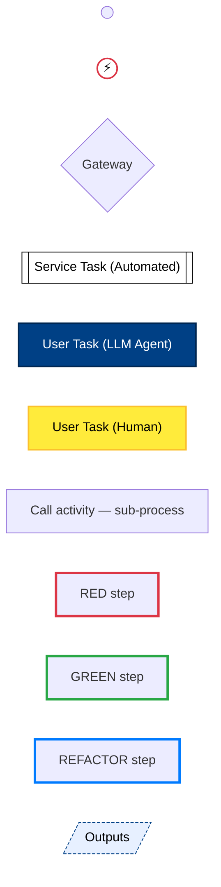

# ATDD Process Flow — Expanded

> Generated from `internal/atdd/process/process-flow.yaml` by `internal/atdd/runtime/diagram`. Do not edit by hand — edit the YAML and regenerate via `gh optivem process show --expanded > docs/process-diagram-expanded.md`.

Each section shows a top-level process with all call-activity nodes expanded inline as subgraphs. See [process-diagram.md](process-diagram.md) for the one-process-per-section reference view.

## Legend

Node **shape** encodes the BPMN type; **fill color** encodes the executor; **border color** (orthogonal) encodes the TDD stage where the author marked one.

- `(( ))` — start / end event (BPMN plain start or end; empty circle, descriptive name lives in the YAML). Start vs end is read from position in the flow — start has no incoming edge, end has no outgoing edge.
- `((⚡))` — error end event (BPMN exceptional exit; red border). Two flavors: **Unknown** (defensive guard — an unhandled gateway branch fired; should never happen at runtime) and **Rejected** (hard-abort — a runtime condition that intentionally halts the run, e.g. agent output rejected post-approve). The descriptive name is in the YAML source; the diagram keeps the icon small.
- `{diamond}` — gateway (decision)
- `[[subroutine]]` — service task — mechanical, automated step (white)
- `[rectangle]` — user task — LLM agent (dark blue) or human (yellow); `call_activity` rectangles are unfilled and link to a sub-process heading
- `[/skewed/]` — published outputs of a process (dashed border)
- **TDD-stage border** — red = RED (failing test), green = GREEN (test passes), blue = REFACTOR (improve without changing behaviour). Only applied where the call site explicitly plays that role.



## Main

```mermaid
flowchart TD
    START(( ))
    END(( ))
    subgraph IMPLEMENT_TICKET[Implement Ticket]
    IMPLEMENT_TICKET__MARK_IN_PROGRESS[[Mark IN PROGRESS]]
    IMPLEMENT_TICKET__PARSE_TICKET[[Parse Ticket]]
    IMPLEMENT_TICKET__GATE_TICKET_KIND{Ticket Kind?}
    IMPLEMENT_TICKET__GATE_TASK_SUBTYPE{Task Subtype?}
    IMPLEMENT_TICKET__UNKNOWN_TICKET_KIND((⚡))
    IMPLEMENT_TICKET__MARK_IN_ACCEPTANCE[[Mark IN ACCEPTANCE]]
    IMPLEMENT_TICKET__UNKNOWN_TASK_SUBTYPE((⚡))
    IMPLEMENT_TICKET__IMPLEMENT_TICKET_END(( ))
    subgraph IMPLEMENT_TICKET__SETUP_TESTS[Setup Tests]
    IMPLEMENT_TICKET__SETUP_TESTS__SETUP_TESTS_END(( ))
    subgraph IMPLEMENT_TICKET__SETUP_TESTS__EXECUTE_COMMAND[Execute Command]
    IMPLEMENT_TICKET__SETUP_TESTS__EXECUTE_COMMAND__APPROVE_PRE[Request Approval — see § approve]
    IMPLEMENT_TICKET__SETUP_TESTS__EXECUTE_COMMAND__GATE_APPROVED_PRE{Approval Outcome?}
    IMPLEMENT_TICKET__SETUP_TESTS__EXECUTE_COMMAND__RUN_COMMAND[["Run command ${command}"]]
    IMPLEMENT_TICKET__SETUP_TESTS__EXECUTE_COMMAND__EXECUTE_COMMAND_REJECTED_END(( ))
    IMPLEMENT_TICKET__SETUP_TESTS__EXECUTE_COMMAND__GATE_COMMAND_SUCCEEDED{Command Succeeded?}
    IMPLEMENT_TICKET__SETUP_TESTS__EXECUTE_COMMAND__EXECUTE_COMMAND_END(( ))
    IMPLEMENT_TICKET__SETUP_TESTS__EXECUTE_COMMAND__GATE_FIX_ON_FAILURE{Fix on Failure Enabled?}
    IMPLEMENT_TICKET__SETUP_TESTS__EXECUTE_COMMAND__FIX[Fix the Failure — see § fix]
    IMPLEMENT_TICKET__SETUP_TESTS__EXECUTE_COMMAND__COMMAND_FIX_EXHAUSTED((⚡))
    end
    end
    subgraph IMPLEMENT_TICKET__CHANGE_SYSTEM_BEHAVIOR[Change System Behavior]
    IMPLEMENT_TICKET__CHANGE_SYSTEM_BEHAVIOR__CHANGE_SYSTEM_BEHAVIOR_END(( ))
    subgraph IMPLEMENT_TICKET__CHANGE_SYSTEM_BEHAVIOR__WRITE_AND_VERIFY_ACCEPTANCE_TESTS_FAIL[Write and Verify Acceptance Tests Fail]
    IMPLEMENT_TICKET__CHANGE_SYSTEM_BEHAVIOR__WRITE_AND_VERIFY_ACCEPTANCE_TESTS_FAIL__WRITE_AND_VERIFY_ACCEPTANCE_TESTS["Write and Verify Acceptance Tests — see § write-and-verify-acceptance-tests<br/>expected-test-result = failure"]
    IMPLEMENT_TICKET__CHANGE_SYSTEM_BEHAVIOR__WRITE_AND_VERIFY_ACCEPTANCE_TESTS_FAIL__WAV_AT_FAIL_END(( ))
    end
    subgraph IMPLEMENT_TICKET__CHANGE_SYSTEM_BEHAVIOR__IMPLEMENT_AND_VERIFY_SYSTEM[Implement and Verify System]
    IMPLEMENT_TICKET__CHANGE_SYSTEM_BEHAVIOR__IMPLEMENT_AND_VERIFY_SYSTEM__RESOLVE_CHANNEL[[Resolve Channel]]
    IMPLEMENT_TICKET__CHANGE_SYSTEM_BEHAVIOR__IMPLEMENT_AND_VERIFY_SYSTEM__GATE_CHANNEL_TOUCHED{Channel Touched?}
    IMPLEMENT_TICKET__CHANGE_SYSTEM_BEHAVIOR__IMPLEMENT_AND_VERIFY_SYSTEM__RUN_ACTION["Run the Configured Agent — see § ${action}"]
    IMPLEMENT_TICKET__CHANGE_SYSTEM_BEHAVIOR__IMPLEMENT_AND_VERIFY_SYSTEM__CHANNEL_SKIPPED(( ))
    IMPLEMENT_TICKET__CHANGE_SYSTEM_BEHAVIOR__IMPLEMENT_AND_VERIFY_SYSTEM__BUILD_SYSTEM[Build the System — see § build-system]
    IMPLEMENT_TICKET__CHANGE_SYSTEM_BEHAVIOR__IMPLEMENT_AND_VERIFY_SYSTEM__START_SYSTEM[Start the System — see § start-system-restart]
    IMPLEMENT_TICKET__CHANGE_SYSTEM_BEHAVIOR__IMPLEMENT_AND_VERIFY_SYSTEM__VERIFY_TESTS_PASS[Verify Tests Pass — see § verify-tests-pass]
    IMPLEMENT_TICKET__CHANGE_SYSTEM_BEHAVIOR__IMPLEMENT_AND_VERIFY_SYSTEM__COMMIT_SYSTEM["Commit System Changes — see § commit<br/>category = prod-commit"]
    IMPLEMENT_TICKET__CHANGE_SYSTEM_BEHAVIOR__IMPLEMENT_AND_VERIFY_SYSTEM__IMPL_AND_VERIFY_SYSTEM_END(( ))
    end
    subgraph IMPLEMENT_TICKET__CHANGE_SYSTEM_BEHAVIOR__REFACTOR_OPPORTUNISTICALLY[Refactor]
    IMPLEMENT_TICKET__CHANGE_SYSTEM_BEHAVIOR__REFACTOR_OPPORTUNISTICALLY__GATE_REFACTOR_TYPE_CHOICE{Refactor Type?}
    IMPLEMENT_TICKET__CHANGE_SYSTEM_BEHAVIOR__REFACTOR_OPPORTUNISTICALLY__REFACTOR_SYSTEM_STRUCTURE[Refactor System Structure — see § refactor-system-structure]
    IMPLEMENT_TICKET__CHANGE_SYSTEM_BEHAVIOR__REFACTOR_OPPORTUNISTICALLY__REFACTOR_TEST_STRUCTURE[Refactor Test Structure — see § refactor-test-structure]
    IMPLEMENT_TICKET__CHANGE_SYSTEM_BEHAVIOR__REFACTOR_OPPORTUNISTICALLY__REDESIGN_SYSTEM_STRUCTURE[Redesign System Structure — see § redesign-system-structure]
    IMPLEMENT_TICKET__CHANGE_SYSTEM_BEHAVIOR__REFACTOR_OPPORTUNISTICALLY__REDESIGN_EXTERNAL_SYSTEM_STRUCTURE[Redesign External System Structure — see § redesign-external-system-structure]
    IMPLEMENT_TICKET__CHANGE_SYSTEM_BEHAVIOR__REFACTOR_OPPORTUNISTICALLY__REFACTOR_TOP_END(( ))
    end
    end
    subgraph IMPLEMENT_TICKET__COVER_SYSTEM_BEHAVIOR[Cover System Behavior]
    IMPLEMENT_TICKET__COVER_SYSTEM_BEHAVIOR__COVER_END(( ))
    subgraph IMPLEMENT_TICKET__COVER_SYSTEM_BEHAVIOR__WRITE_AND_VERIFY_ACCEPTANCE_TESTS_PASS[Write and Verify Acceptance Tests Pass]
    IMPLEMENT_TICKET__COVER_SYSTEM_BEHAVIOR__WRITE_AND_VERIFY_ACCEPTANCE_TESTS_PASS__WRITE_AND_VERIFY_ACCEPTANCE_TESTS["Write and Verify Acceptance Tests — see § write-and-verify-acceptance-tests<br/>expected-test-result = success<br/>verify-mode = green-when-complete"]
    IMPLEMENT_TICKET__COVER_SYSTEM_BEHAVIOR__WRITE_AND_VERIFY_ACCEPTANCE_TESTS_PASS__WAV_AT_PASS_END(( ))
    end
    end
    subgraph IMPLEMENT_TICKET__REDESIGN_SYSTEM_STRUCTURE[Redesign System Structure]
    IMPLEMENT_TICKET__REDESIGN_SYSTEM_STRUCTURE__REDESIGN_END(( ))
    subgraph IMPLEMENT_TICKET__REDESIGN_SYSTEM_STRUCTURE__UPDATE_SYSTEM_DRIVER_ADAPTERS[Update System Driver Adapters]
    IMPLEMENT_TICKET__REDESIGN_SYSTEM_STRUCTURE__UPDATE_SYSTEM_DRIVER_ADAPTERS__EXECUTE_AGENT["Dispatch the Agent — see § execute-agent<br/>agent = system-driver-adapter-updater<br/>category = prod-agent<br/>task-name = update-system-driver-adapters"]
    IMPLEMENT_TICKET__REDESIGN_SYSTEM_STRUCTURE__UPDATE_SYSTEM_DRIVER_ADAPTERS__UPDATE_SYS_DA_END(( ))
    end
    subgraph IMPLEMENT_TICKET__REDESIGN_SYSTEM_STRUCTURE__IMPLEMENT_AND_VERIFY_SYSTEM[Implement and Verify System]
    IMPLEMENT_TICKET__REDESIGN_SYSTEM_STRUCTURE__IMPLEMENT_AND_VERIFY_SYSTEM__RESOLVE_CHANNEL[[Resolve Channel]]
    IMPLEMENT_TICKET__REDESIGN_SYSTEM_STRUCTURE__IMPLEMENT_AND_VERIFY_SYSTEM__GATE_CHANNEL_TOUCHED{Channel Touched?}
    IMPLEMENT_TICKET__REDESIGN_SYSTEM_STRUCTURE__IMPLEMENT_AND_VERIFY_SYSTEM__RUN_ACTION["Run the Configured Agent — see § ${action}"]
    IMPLEMENT_TICKET__REDESIGN_SYSTEM_STRUCTURE__IMPLEMENT_AND_VERIFY_SYSTEM__CHANNEL_SKIPPED(( ))
    IMPLEMENT_TICKET__REDESIGN_SYSTEM_STRUCTURE__IMPLEMENT_AND_VERIFY_SYSTEM__BUILD_SYSTEM[Build the System — see § build-system]
    IMPLEMENT_TICKET__REDESIGN_SYSTEM_STRUCTURE__IMPLEMENT_AND_VERIFY_SYSTEM__START_SYSTEM[Start the System — see § start-system-restart]
    IMPLEMENT_TICKET__REDESIGN_SYSTEM_STRUCTURE__IMPLEMENT_AND_VERIFY_SYSTEM__VERIFY_TESTS_PASS[Verify Tests Pass — see § verify-tests-pass]
    IMPLEMENT_TICKET__REDESIGN_SYSTEM_STRUCTURE__IMPLEMENT_AND_VERIFY_SYSTEM__COMMIT_SYSTEM["Commit System Changes — see § commit<br/>category = prod-commit"]
    IMPLEMENT_TICKET__REDESIGN_SYSTEM_STRUCTURE__IMPLEMENT_AND_VERIFY_SYSTEM__IMPL_AND_VERIFY_SYSTEM_END(( ))
    end
    end
    subgraph IMPLEMENT_TICKET__REDESIGN_EXTERNAL_SYSTEM_STRUCTURE[Redesign External System Structure]
    IMPLEMENT_TICKET__REDESIGN_EXTERNAL_SYSTEM_STRUCTURE__VALIDATE_REDESIGN_EXTERNAL_REQUIRES_ESCC[[Validate Redesign-External Declares ESCC]]
    IMPLEMENT_TICKET__REDESIGN_EXTERNAL_SYSTEM_STRUCTURE__VALIDATE_EXTERNAL_SYSTEMS_REGISTERED[[Validate External Systems Registered]]
    IMPLEMENT_TICKET__REDESIGN_EXTERNAL_SYSTEM_STRUCTURE__REDESIGN_EXTERNAL_END(( ))
    subgraph IMPLEMENT_TICKET__REDESIGN_EXTERNAL_SYSTEM_STRUCTURE__REDESIGN_EXTERNAL_SYSTEM["Redesign External System (per system)"]
    IMPLEMENT_TICKET__REDESIGN_EXTERNAL_SYSTEM_STRUCTURE__REDESIGN_EXTERNAL_SYSTEM__RESOLVE_EXTERNAL_SYSTEM[[Resolve External System]]
    IMPLEMENT_TICKET__REDESIGN_EXTERNAL_SYSTEM_STRUCTURE__REDESIGN_EXTERNAL_SYSTEM__GATE_EXTERNAL_SYSTEM_TOUCHED{External System Touched?}
    IMPLEMENT_TICKET__REDESIGN_EXTERNAL_SYSTEM_STRUCTURE__REDESIGN_EXTERNAL_SYSTEM__UPDATE_EXTERNAL_SYSTEM_DRIVER_ADAPTERS[Update External System Driver Adapters — see § update-external-system-driver-adapters]
    IMPLEMENT_TICKET__REDESIGN_EXTERNAL_SYSTEM_STRUCTURE__REDESIGN_EXTERNAL_SYSTEM__EXTERNAL_SYSTEM_SKIPPED(( ))
    IMPLEMENT_TICKET__REDESIGN_EXTERNAL_SYSTEM_STRUCTURE__REDESIGN_EXTERNAL_SYSTEM__RECONCILE_EXTERNAL_CONTRACT_PRODUCER["Reconcile External Contract Producer — see § reconcile-external-contract-producer<br/>ct-test-names = "]
    IMPLEMENT_TICKET__REDESIGN_EXTERNAL_SYSTEM_STRUCTURE__REDESIGN_EXTERNAL_SYSTEM__REDESIGN_EXTERNAL_PER_SYSTEM_END(( ))
    end
    subgraph IMPLEMENT_TICKET__REDESIGN_EXTERNAL_SYSTEM_STRUCTURE__IMPLEMENT_AND_VERIFY_SYSTEM[Implement and Verify System]
    IMPLEMENT_TICKET__REDESIGN_EXTERNAL_SYSTEM_STRUCTURE__IMPLEMENT_AND_VERIFY_SYSTEM__RESOLVE_CHANNEL[[Resolve Channel]]
    IMPLEMENT_TICKET__REDESIGN_EXTERNAL_SYSTEM_STRUCTURE__IMPLEMENT_AND_VERIFY_SYSTEM__GATE_CHANNEL_TOUCHED{Channel Touched?}
    IMPLEMENT_TICKET__REDESIGN_EXTERNAL_SYSTEM_STRUCTURE__IMPLEMENT_AND_VERIFY_SYSTEM__RUN_ACTION["Run the Configured Agent — see § ${action}"]
    IMPLEMENT_TICKET__REDESIGN_EXTERNAL_SYSTEM_STRUCTURE__IMPLEMENT_AND_VERIFY_SYSTEM__CHANNEL_SKIPPED(( ))
    IMPLEMENT_TICKET__REDESIGN_EXTERNAL_SYSTEM_STRUCTURE__IMPLEMENT_AND_VERIFY_SYSTEM__BUILD_SYSTEM[Build the System — see § build-system]
    IMPLEMENT_TICKET__REDESIGN_EXTERNAL_SYSTEM_STRUCTURE__IMPLEMENT_AND_VERIFY_SYSTEM__START_SYSTEM[Start the System — see § start-system-restart]
    IMPLEMENT_TICKET__REDESIGN_EXTERNAL_SYSTEM_STRUCTURE__IMPLEMENT_AND_VERIFY_SYSTEM__VERIFY_TESTS_PASS[Verify Tests Pass — see § verify-tests-pass]
    IMPLEMENT_TICKET__REDESIGN_EXTERNAL_SYSTEM_STRUCTURE__IMPLEMENT_AND_VERIFY_SYSTEM__COMMIT_SYSTEM["Commit System Changes — see § commit<br/>category = prod-commit"]
    IMPLEMENT_TICKET__REDESIGN_EXTERNAL_SYSTEM_STRUCTURE__IMPLEMENT_AND_VERIFY_SYSTEM__IMPL_AND_VERIFY_SYSTEM_END(( ))
    end
    end
    subgraph IMPLEMENT_TICKET__REFACTOR_SYSTEM_STRUCTURE[Refactor System Structure]
    IMPLEMENT_TICKET__REFACTOR_SYSTEM_STRUCTURE__REFACTOR_SYSTEM_STRUCTURE_END(( ))
    subgraph IMPLEMENT_TICKET__REFACTOR_SYSTEM_STRUCTURE__IMPLEMENT_AND_VERIFY_SYSTEM[Implement and Verify System]
    IMPLEMENT_TICKET__REFACTOR_SYSTEM_STRUCTURE__IMPLEMENT_AND_VERIFY_SYSTEM__RESOLVE_CHANNEL[[Resolve Channel]]
    IMPLEMENT_TICKET__REFACTOR_SYSTEM_STRUCTURE__IMPLEMENT_AND_VERIFY_SYSTEM__GATE_CHANNEL_TOUCHED{Channel Touched?}
    IMPLEMENT_TICKET__REFACTOR_SYSTEM_STRUCTURE__IMPLEMENT_AND_VERIFY_SYSTEM__RUN_ACTION["Run the Configured Agent — see § ${action}"]
    IMPLEMENT_TICKET__REFACTOR_SYSTEM_STRUCTURE__IMPLEMENT_AND_VERIFY_SYSTEM__CHANNEL_SKIPPED(( ))
    IMPLEMENT_TICKET__REFACTOR_SYSTEM_STRUCTURE__IMPLEMENT_AND_VERIFY_SYSTEM__BUILD_SYSTEM[Build the System — see § build-system]
    IMPLEMENT_TICKET__REFACTOR_SYSTEM_STRUCTURE__IMPLEMENT_AND_VERIFY_SYSTEM__START_SYSTEM[Start the System — see § start-system-restart]
    IMPLEMENT_TICKET__REFACTOR_SYSTEM_STRUCTURE__IMPLEMENT_AND_VERIFY_SYSTEM__VERIFY_TESTS_PASS[Verify Tests Pass — see § verify-tests-pass]
    IMPLEMENT_TICKET__REFACTOR_SYSTEM_STRUCTURE__IMPLEMENT_AND_VERIFY_SYSTEM__COMMIT_SYSTEM["Commit System Changes — see § commit<br/>category = prod-commit"]
    IMPLEMENT_TICKET__REFACTOR_SYSTEM_STRUCTURE__IMPLEMENT_AND_VERIFY_SYSTEM__IMPL_AND_VERIFY_SYSTEM_END(( ))
    end
    end
    subgraph IMPLEMENT_TICKET__REFACTOR_TEST_STRUCTURE[Refactor Test Structure]
    IMPLEMENT_TICKET__REFACTOR_TEST_STRUCTURE__REFACTOR_TEST_STRUCTURE_END(( ))
    subgraph IMPLEMENT_TICKET__REFACTOR_TEST_STRUCTURE__REFACTOR_AND_VERIFY_TESTS[Refactor and Verify Tests]
    IMPLEMENT_TICKET__REFACTOR_TEST_STRUCTURE__REFACTOR_AND_VERIFY_TESTS__REFACTOR_TESTS[Refactor Tests — see § refactor-tests]
    IMPLEMENT_TICKET__REFACTOR_TEST_STRUCTURE__REFACTOR_AND_VERIFY_TESTS__COMPILE_TESTS[Compile Tests — see § compile-tests]
    IMPLEMENT_TICKET__REFACTOR_TEST_STRUCTURE__REFACTOR_AND_VERIFY_TESTS__START_SYSTEM[Start System — see § start-system]
    IMPLEMENT_TICKET__REFACTOR_TEST_STRUCTURE__REFACTOR_AND_VERIFY_TESTS__VERIFY_TESTS_PASS["Verify Tests Pass — see § verify-tests-pass<br/>suite = <br/>test-names = "]
    IMPLEMENT_TICKET__REFACTOR_TEST_STRUCTURE__REFACTOR_AND_VERIFY_TESTS__COMMIT_TESTS["Commit Test Changes — see § commit<br/>category = test-commit<br/>layer = TESTS"]
    IMPLEMENT_TICKET__REFACTOR_TEST_STRUCTURE__REFACTOR_AND_VERIFY_TESTS__REFACTOR_AND_VERIFY_TESTS_END(( ))
    end
    end
    end

    IMPLEMENT_TICKET__SETUP_TESTS__EXECUTE_COMMAND__APPROVE_PRE --> IMPLEMENT_TICKET__SETUP_TESTS__EXECUTE_COMMAND__GATE_APPROVED_PRE
    IMPLEMENT_TICKET__SETUP_TESTS__EXECUTE_COMMAND__GATE_APPROVED_PRE -- Approved --> IMPLEMENT_TICKET__SETUP_TESTS__EXECUTE_COMMAND__RUN_COMMAND
    IMPLEMENT_TICKET__SETUP_TESTS__EXECUTE_COMMAND__GATE_APPROVED_PRE -- Rejected --> IMPLEMENT_TICKET__SETUP_TESTS__EXECUTE_COMMAND__EXECUTE_COMMAND_REJECTED_END
    IMPLEMENT_TICKET__SETUP_TESTS__EXECUTE_COMMAND__RUN_COMMAND --> IMPLEMENT_TICKET__SETUP_TESTS__EXECUTE_COMMAND__GATE_COMMAND_SUCCEEDED
    IMPLEMENT_TICKET__SETUP_TESTS__EXECUTE_COMMAND__GATE_COMMAND_SUCCEEDED -- Yes --> IMPLEMENT_TICKET__SETUP_TESTS__EXECUTE_COMMAND__EXECUTE_COMMAND_END
    IMPLEMENT_TICKET__SETUP_TESTS__EXECUTE_COMMAND__GATE_COMMAND_SUCCEEDED -- No --> IMPLEMENT_TICKET__SETUP_TESTS__EXECUTE_COMMAND__GATE_FIX_ON_FAILURE
    IMPLEMENT_TICKET__SETUP_TESTS__EXECUTE_COMMAND__GATE_FIX_ON_FAILURE -- Yes --> IMPLEMENT_TICKET__SETUP_TESTS__EXECUTE_COMMAND__FIX
    IMPLEMENT_TICKET__SETUP_TESTS__EXECUTE_COMMAND__GATE_FIX_ON_FAILURE -- No --> IMPLEMENT_TICKET__SETUP_TESTS__EXECUTE_COMMAND__EXECUTE_COMMAND_END
    IMPLEMENT_TICKET__SETUP_TESTS__EXECUTE_COMMAND__FIX --> IMPLEMENT_TICKET__SETUP_TESTS__EXECUTE_COMMAND__RUN_COMMAND
    IMPLEMENT_TICKET__SETUP_TESTS__EXECUTE_COMMAND__EXECUTE_COMMAND_END --> IMPLEMENT_TICKET__SETUP_TESTS__SETUP_TESTS_END
    IMPLEMENT_TICKET__SETUP_TESTS__EXECUTE_COMMAND__EXECUTE_COMMAND_REJECTED_END --> IMPLEMENT_TICKET__SETUP_TESTS__SETUP_TESTS_END
    IMPLEMENT_TICKET__CHANGE_SYSTEM_BEHAVIOR__WRITE_AND_VERIFY_ACCEPTANCE_TESTS_FAIL__WRITE_AND_VERIFY_ACCEPTANCE_TESTS --> IMPLEMENT_TICKET__CHANGE_SYSTEM_BEHAVIOR__WRITE_AND_VERIFY_ACCEPTANCE_TESTS_FAIL__WAV_AT_FAIL_END
    IMPLEMENT_TICKET__CHANGE_SYSTEM_BEHAVIOR__IMPLEMENT_AND_VERIFY_SYSTEM__RESOLVE_CHANNEL --> IMPLEMENT_TICKET__CHANGE_SYSTEM_BEHAVIOR__IMPLEMENT_AND_VERIFY_SYSTEM__GATE_CHANNEL_TOUCHED
    IMPLEMENT_TICKET__CHANGE_SYSTEM_BEHAVIOR__IMPLEMENT_AND_VERIFY_SYSTEM__GATE_CHANNEL_TOUCHED -- Yes --> IMPLEMENT_TICKET__CHANGE_SYSTEM_BEHAVIOR__IMPLEMENT_AND_VERIFY_SYSTEM__RUN_ACTION
    IMPLEMENT_TICKET__CHANGE_SYSTEM_BEHAVIOR__IMPLEMENT_AND_VERIFY_SYSTEM__GATE_CHANNEL_TOUCHED -- No --> IMPLEMENT_TICKET__CHANGE_SYSTEM_BEHAVIOR__IMPLEMENT_AND_VERIFY_SYSTEM__CHANNEL_SKIPPED
    IMPLEMENT_TICKET__CHANGE_SYSTEM_BEHAVIOR__IMPLEMENT_AND_VERIFY_SYSTEM__RUN_ACTION --> IMPLEMENT_TICKET__CHANGE_SYSTEM_BEHAVIOR__IMPLEMENT_AND_VERIFY_SYSTEM__BUILD_SYSTEM
    IMPLEMENT_TICKET__CHANGE_SYSTEM_BEHAVIOR__IMPLEMENT_AND_VERIFY_SYSTEM__BUILD_SYSTEM --> IMPLEMENT_TICKET__CHANGE_SYSTEM_BEHAVIOR__IMPLEMENT_AND_VERIFY_SYSTEM__START_SYSTEM
    IMPLEMENT_TICKET__CHANGE_SYSTEM_BEHAVIOR__IMPLEMENT_AND_VERIFY_SYSTEM__START_SYSTEM --> IMPLEMENT_TICKET__CHANGE_SYSTEM_BEHAVIOR__IMPLEMENT_AND_VERIFY_SYSTEM__VERIFY_TESTS_PASS
    IMPLEMENT_TICKET__CHANGE_SYSTEM_BEHAVIOR__IMPLEMENT_AND_VERIFY_SYSTEM__VERIFY_TESTS_PASS --> IMPLEMENT_TICKET__CHANGE_SYSTEM_BEHAVIOR__IMPLEMENT_AND_VERIFY_SYSTEM__COMMIT_SYSTEM
    IMPLEMENT_TICKET__CHANGE_SYSTEM_BEHAVIOR__IMPLEMENT_AND_VERIFY_SYSTEM__COMMIT_SYSTEM --> IMPLEMENT_TICKET__CHANGE_SYSTEM_BEHAVIOR__IMPLEMENT_AND_VERIFY_SYSTEM__IMPL_AND_VERIFY_SYSTEM_END
    IMPLEMENT_TICKET__CHANGE_SYSTEM_BEHAVIOR__REFACTOR_OPPORTUNISTICALLY__GATE_REFACTOR_TYPE_CHOICE -- Refactor System Structure --> IMPLEMENT_TICKET__CHANGE_SYSTEM_BEHAVIOR__REFACTOR_OPPORTUNISTICALLY__REFACTOR_SYSTEM_STRUCTURE
    IMPLEMENT_TICKET__CHANGE_SYSTEM_BEHAVIOR__REFACTOR_OPPORTUNISTICALLY__GATE_REFACTOR_TYPE_CHOICE -- Refactor Test Structure --> IMPLEMENT_TICKET__CHANGE_SYSTEM_BEHAVIOR__REFACTOR_OPPORTUNISTICALLY__REFACTOR_TEST_STRUCTURE
    IMPLEMENT_TICKET__CHANGE_SYSTEM_BEHAVIOR__REFACTOR_OPPORTUNISTICALLY__GATE_REFACTOR_TYPE_CHOICE -- Redesign System Structure --> IMPLEMENT_TICKET__CHANGE_SYSTEM_BEHAVIOR__REFACTOR_OPPORTUNISTICALLY__REDESIGN_SYSTEM_STRUCTURE
    IMPLEMENT_TICKET__CHANGE_SYSTEM_BEHAVIOR__REFACTOR_OPPORTUNISTICALLY__GATE_REFACTOR_TYPE_CHOICE -- Redesign External System Structure --> IMPLEMENT_TICKET__CHANGE_SYSTEM_BEHAVIOR__REFACTOR_OPPORTUNISTICALLY__REDESIGN_EXTERNAL_SYSTEM_STRUCTURE
    IMPLEMENT_TICKET__CHANGE_SYSTEM_BEHAVIOR__REFACTOR_OPPORTUNISTICALLY__GATE_REFACTOR_TYPE_CHOICE -- None --> IMPLEMENT_TICKET__CHANGE_SYSTEM_BEHAVIOR__REFACTOR_OPPORTUNISTICALLY__REFACTOR_TOP_END
    IMPLEMENT_TICKET__CHANGE_SYSTEM_BEHAVIOR__REFACTOR_OPPORTUNISTICALLY__REFACTOR_SYSTEM_STRUCTURE --> IMPLEMENT_TICKET__CHANGE_SYSTEM_BEHAVIOR__REFACTOR_OPPORTUNISTICALLY__GATE_REFACTOR_TYPE_CHOICE
    IMPLEMENT_TICKET__CHANGE_SYSTEM_BEHAVIOR__REFACTOR_OPPORTUNISTICALLY__REFACTOR_TEST_STRUCTURE --> IMPLEMENT_TICKET__CHANGE_SYSTEM_BEHAVIOR__REFACTOR_OPPORTUNISTICALLY__GATE_REFACTOR_TYPE_CHOICE
    IMPLEMENT_TICKET__CHANGE_SYSTEM_BEHAVIOR__REFACTOR_OPPORTUNISTICALLY__REDESIGN_SYSTEM_STRUCTURE --> IMPLEMENT_TICKET__CHANGE_SYSTEM_BEHAVIOR__REFACTOR_OPPORTUNISTICALLY__GATE_REFACTOR_TYPE_CHOICE
    IMPLEMENT_TICKET__CHANGE_SYSTEM_BEHAVIOR__REFACTOR_OPPORTUNISTICALLY__REDESIGN_EXTERNAL_SYSTEM_STRUCTURE --> IMPLEMENT_TICKET__CHANGE_SYSTEM_BEHAVIOR__REFACTOR_OPPORTUNISTICALLY__GATE_REFACTOR_TYPE_CHOICE
    IMPLEMENT_TICKET__CHANGE_SYSTEM_BEHAVIOR__WRITE_AND_VERIFY_ACCEPTANCE_TESTS_FAIL__WAV_AT_FAIL_END --> IMPLEMENT_TICKET__CHANGE_SYSTEM_BEHAVIOR__IMPLEMENT_AND_VERIFY_SYSTEM__RESOLVE_CHANNEL
    IMPLEMENT_TICKET__CHANGE_SYSTEM_BEHAVIOR__IMPLEMENT_AND_VERIFY_SYSTEM__CHANNEL_SKIPPED --> IMPLEMENT_TICKET__CHANGE_SYSTEM_BEHAVIOR__REFACTOR_OPPORTUNISTICALLY__GATE_REFACTOR_TYPE_CHOICE
    IMPLEMENT_TICKET__CHANGE_SYSTEM_BEHAVIOR__IMPLEMENT_AND_VERIFY_SYSTEM__IMPL_AND_VERIFY_SYSTEM_END --> IMPLEMENT_TICKET__CHANGE_SYSTEM_BEHAVIOR__REFACTOR_OPPORTUNISTICALLY__GATE_REFACTOR_TYPE_CHOICE
    IMPLEMENT_TICKET__CHANGE_SYSTEM_BEHAVIOR__REFACTOR_OPPORTUNISTICALLY__REFACTOR_TOP_END --> IMPLEMENT_TICKET__CHANGE_SYSTEM_BEHAVIOR__CHANGE_SYSTEM_BEHAVIOR_END
    IMPLEMENT_TICKET__COVER_SYSTEM_BEHAVIOR__WRITE_AND_VERIFY_ACCEPTANCE_TESTS_PASS__WRITE_AND_VERIFY_ACCEPTANCE_TESTS --> IMPLEMENT_TICKET__COVER_SYSTEM_BEHAVIOR__WRITE_AND_VERIFY_ACCEPTANCE_TESTS_PASS__WAV_AT_PASS_END
    IMPLEMENT_TICKET__COVER_SYSTEM_BEHAVIOR__WRITE_AND_VERIFY_ACCEPTANCE_TESTS_PASS__WAV_AT_PASS_END --> IMPLEMENT_TICKET__COVER_SYSTEM_BEHAVIOR__COVER_END
    IMPLEMENT_TICKET__REDESIGN_SYSTEM_STRUCTURE__UPDATE_SYSTEM_DRIVER_ADAPTERS__EXECUTE_AGENT --> IMPLEMENT_TICKET__REDESIGN_SYSTEM_STRUCTURE__UPDATE_SYSTEM_DRIVER_ADAPTERS__UPDATE_SYS_DA_END
    IMPLEMENT_TICKET__REDESIGN_SYSTEM_STRUCTURE__IMPLEMENT_AND_VERIFY_SYSTEM__RESOLVE_CHANNEL --> IMPLEMENT_TICKET__REDESIGN_SYSTEM_STRUCTURE__IMPLEMENT_AND_VERIFY_SYSTEM__GATE_CHANNEL_TOUCHED
    IMPLEMENT_TICKET__REDESIGN_SYSTEM_STRUCTURE__IMPLEMENT_AND_VERIFY_SYSTEM__GATE_CHANNEL_TOUCHED -- Yes --> IMPLEMENT_TICKET__REDESIGN_SYSTEM_STRUCTURE__IMPLEMENT_AND_VERIFY_SYSTEM__RUN_ACTION
    IMPLEMENT_TICKET__REDESIGN_SYSTEM_STRUCTURE__IMPLEMENT_AND_VERIFY_SYSTEM__GATE_CHANNEL_TOUCHED -- No --> IMPLEMENT_TICKET__REDESIGN_SYSTEM_STRUCTURE__IMPLEMENT_AND_VERIFY_SYSTEM__CHANNEL_SKIPPED
    IMPLEMENT_TICKET__REDESIGN_SYSTEM_STRUCTURE__IMPLEMENT_AND_VERIFY_SYSTEM__RUN_ACTION --> IMPLEMENT_TICKET__REDESIGN_SYSTEM_STRUCTURE__IMPLEMENT_AND_VERIFY_SYSTEM__BUILD_SYSTEM
    IMPLEMENT_TICKET__REDESIGN_SYSTEM_STRUCTURE__IMPLEMENT_AND_VERIFY_SYSTEM__BUILD_SYSTEM --> IMPLEMENT_TICKET__REDESIGN_SYSTEM_STRUCTURE__IMPLEMENT_AND_VERIFY_SYSTEM__START_SYSTEM
    IMPLEMENT_TICKET__REDESIGN_SYSTEM_STRUCTURE__IMPLEMENT_AND_VERIFY_SYSTEM__START_SYSTEM --> IMPLEMENT_TICKET__REDESIGN_SYSTEM_STRUCTURE__IMPLEMENT_AND_VERIFY_SYSTEM__VERIFY_TESTS_PASS
    IMPLEMENT_TICKET__REDESIGN_SYSTEM_STRUCTURE__IMPLEMENT_AND_VERIFY_SYSTEM__VERIFY_TESTS_PASS --> IMPLEMENT_TICKET__REDESIGN_SYSTEM_STRUCTURE__IMPLEMENT_AND_VERIFY_SYSTEM__COMMIT_SYSTEM
    IMPLEMENT_TICKET__REDESIGN_SYSTEM_STRUCTURE__IMPLEMENT_AND_VERIFY_SYSTEM__COMMIT_SYSTEM --> IMPLEMENT_TICKET__REDESIGN_SYSTEM_STRUCTURE__IMPLEMENT_AND_VERIFY_SYSTEM__IMPL_AND_VERIFY_SYSTEM_END
    IMPLEMENT_TICKET__REDESIGN_SYSTEM_STRUCTURE__UPDATE_SYSTEM_DRIVER_ADAPTERS__UPDATE_SYS_DA_END --> IMPLEMENT_TICKET__REDESIGN_SYSTEM_STRUCTURE__IMPLEMENT_AND_VERIFY_SYSTEM__RESOLVE_CHANNEL
    IMPLEMENT_TICKET__REDESIGN_SYSTEM_STRUCTURE__IMPLEMENT_AND_VERIFY_SYSTEM__CHANNEL_SKIPPED --> IMPLEMENT_TICKET__REDESIGN_SYSTEM_STRUCTURE__REDESIGN_END
    IMPLEMENT_TICKET__REDESIGN_SYSTEM_STRUCTURE__IMPLEMENT_AND_VERIFY_SYSTEM__IMPL_AND_VERIFY_SYSTEM_END --> IMPLEMENT_TICKET__REDESIGN_SYSTEM_STRUCTURE__REDESIGN_END
    IMPLEMENT_TICKET__REDESIGN_EXTERNAL_SYSTEM_STRUCTURE__REDESIGN_EXTERNAL_SYSTEM__RESOLVE_EXTERNAL_SYSTEM --> IMPLEMENT_TICKET__REDESIGN_EXTERNAL_SYSTEM_STRUCTURE__REDESIGN_EXTERNAL_SYSTEM__GATE_EXTERNAL_SYSTEM_TOUCHED
    IMPLEMENT_TICKET__REDESIGN_EXTERNAL_SYSTEM_STRUCTURE__REDESIGN_EXTERNAL_SYSTEM__GATE_EXTERNAL_SYSTEM_TOUCHED -- Yes --> IMPLEMENT_TICKET__REDESIGN_EXTERNAL_SYSTEM_STRUCTURE__REDESIGN_EXTERNAL_SYSTEM__UPDATE_EXTERNAL_SYSTEM_DRIVER_ADAPTERS
    IMPLEMENT_TICKET__REDESIGN_EXTERNAL_SYSTEM_STRUCTURE__REDESIGN_EXTERNAL_SYSTEM__GATE_EXTERNAL_SYSTEM_TOUCHED -- No --> IMPLEMENT_TICKET__REDESIGN_EXTERNAL_SYSTEM_STRUCTURE__REDESIGN_EXTERNAL_SYSTEM__EXTERNAL_SYSTEM_SKIPPED
    IMPLEMENT_TICKET__REDESIGN_EXTERNAL_SYSTEM_STRUCTURE__REDESIGN_EXTERNAL_SYSTEM__UPDATE_EXTERNAL_SYSTEM_DRIVER_ADAPTERS --> IMPLEMENT_TICKET__REDESIGN_EXTERNAL_SYSTEM_STRUCTURE__REDESIGN_EXTERNAL_SYSTEM__RECONCILE_EXTERNAL_CONTRACT_PRODUCER
    IMPLEMENT_TICKET__REDESIGN_EXTERNAL_SYSTEM_STRUCTURE__REDESIGN_EXTERNAL_SYSTEM__RECONCILE_EXTERNAL_CONTRACT_PRODUCER --> IMPLEMENT_TICKET__REDESIGN_EXTERNAL_SYSTEM_STRUCTURE__REDESIGN_EXTERNAL_SYSTEM__REDESIGN_EXTERNAL_PER_SYSTEM_END
    IMPLEMENT_TICKET__REDESIGN_EXTERNAL_SYSTEM_STRUCTURE__IMPLEMENT_AND_VERIFY_SYSTEM__RESOLVE_CHANNEL --> IMPLEMENT_TICKET__REDESIGN_EXTERNAL_SYSTEM_STRUCTURE__IMPLEMENT_AND_VERIFY_SYSTEM__GATE_CHANNEL_TOUCHED
    IMPLEMENT_TICKET__REDESIGN_EXTERNAL_SYSTEM_STRUCTURE__IMPLEMENT_AND_VERIFY_SYSTEM__GATE_CHANNEL_TOUCHED -- Yes --> IMPLEMENT_TICKET__REDESIGN_EXTERNAL_SYSTEM_STRUCTURE__IMPLEMENT_AND_VERIFY_SYSTEM__RUN_ACTION
    IMPLEMENT_TICKET__REDESIGN_EXTERNAL_SYSTEM_STRUCTURE__IMPLEMENT_AND_VERIFY_SYSTEM__GATE_CHANNEL_TOUCHED -- No --> IMPLEMENT_TICKET__REDESIGN_EXTERNAL_SYSTEM_STRUCTURE__IMPLEMENT_AND_VERIFY_SYSTEM__CHANNEL_SKIPPED
    IMPLEMENT_TICKET__REDESIGN_EXTERNAL_SYSTEM_STRUCTURE__IMPLEMENT_AND_VERIFY_SYSTEM__RUN_ACTION --> IMPLEMENT_TICKET__REDESIGN_EXTERNAL_SYSTEM_STRUCTURE__IMPLEMENT_AND_VERIFY_SYSTEM__BUILD_SYSTEM
    IMPLEMENT_TICKET__REDESIGN_EXTERNAL_SYSTEM_STRUCTURE__IMPLEMENT_AND_VERIFY_SYSTEM__BUILD_SYSTEM --> IMPLEMENT_TICKET__REDESIGN_EXTERNAL_SYSTEM_STRUCTURE__IMPLEMENT_AND_VERIFY_SYSTEM__START_SYSTEM
    IMPLEMENT_TICKET__REDESIGN_EXTERNAL_SYSTEM_STRUCTURE__IMPLEMENT_AND_VERIFY_SYSTEM__START_SYSTEM --> IMPLEMENT_TICKET__REDESIGN_EXTERNAL_SYSTEM_STRUCTURE__IMPLEMENT_AND_VERIFY_SYSTEM__VERIFY_TESTS_PASS
    IMPLEMENT_TICKET__REDESIGN_EXTERNAL_SYSTEM_STRUCTURE__IMPLEMENT_AND_VERIFY_SYSTEM__VERIFY_TESTS_PASS --> IMPLEMENT_TICKET__REDESIGN_EXTERNAL_SYSTEM_STRUCTURE__IMPLEMENT_AND_VERIFY_SYSTEM__COMMIT_SYSTEM
    IMPLEMENT_TICKET__REDESIGN_EXTERNAL_SYSTEM_STRUCTURE__IMPLEMENT_AND_VERIFY_SYSTEM__COMMIT_SYSTEM --> IMPLEMENT_TICKET__REDESIGN_EXTERNAL_SYSTEM_STRUCTURE__IMPLEMENT_AND_VERIFY_SYSTEM__IMPL_AND_VERIFY_SYSTEM_END
    IMPLEMENT_TICKET__REDESIGN_EXTERNAL_SYSTEM_STRUCTURE__VALIDATE_REDESIGN_EXTERNAL_REQUIRES_ESCC --> IMPLEMENT_TICKET__REDESIGN_EXTERNAL_SYSTEM_STRUCTURE__VALIDATE_EXTERNAL_SYSTEMS_REGISTERED
    IMPLEMENT_TICKET__REDESIGN_EXTERNAL_SYSTEM_STRUCTURE__VALIDATE_EXTERNAL_SYSTEMS_REGISTERED --> IMPLEMENT_TICKET__REDESIGN_EXTERNAL_SYSTEM_STRUCTURE__REDESIGN_EXTERNAL_SYSTEM__RESOLVE_EXTERNAL_SYSTEM
    IMPLEMENT_TICKET__REDESIGN_EXTERNAL_SYSTEM_STRUCTURE__REDESIGN_EXTERNAL_SYSTEM__EXTERNAL_SYSTEM_SKIPPED --> IMPLEMENT_TICKET__REDESIGN_EXTERNAL_SYSTEM_STRUCTURE__IMPLEMENT_AND_VERIFY_SYSTEM__RESOLVE_CHANNEL
    IMPLEMENT_TICKET__REDESIGN_EXTERNAL_SYSTEM_STRUCTURE__REDESIGN_EXTERNAL_SYSTEM__REDESIGN_EXTERNAL_PER_SYSTEM_END --> IMPLEMENT_TICKET__REDESIGN_EXTERNAL_SYSTEM_STRUCTURE__IMPLEMENT_AND_VERIFY_SYSTEM__RESOLVE_CHANNEL
    IMPLEMENT_TICKET__REDESIGN_EXTERNAL_SYSTEM_STRUCTURE__IMPLEMENT_AND_VERIFY_SYSTEM__CHANNEL_SKIPPED --> IMPLEMENT_TICKET__REDESIGN_EXTERNAL_SYSTEM_STRUCTURE__REDESIGN_EXTERNAL_END
    IMPLEMENT_TICKET__REDESIGN_EXTERNAL_SYSTEM_STRUCTURE__IMPLEMENT_AND_VERIFY_SYSTEM__IMPL_AND_VERIFY_SYSTEM_END --> IMPLEMENT_TICKET__REDESIGN_EXTERNAL_SYSTEM_STRUCTURE__REDESIGN_EXTERNAL_END
    IMPLEMENT_TICKET__REFACTOR_SYSTEM_STRUCTURE__IMPLEMENT_AND_VERIFY_SYSTEM__RESOLVE_CHANNEL --> IMPLEMENT_TICKET__REFACTOR_SYSTEM_STRUCTURE__IMPLEMENT_AND_VERIFY_SYSTEM__GATE_CHANNEL_TOUCHED
    IMPLEMENT_TICKET__REFACTOR_SYSTEM_STRUCTURE__IMPLEMENT_AND_VERIFY_SYSTEM__GATE_CHANNEL_TOUCHED -- Yes --> IMPLEMENT_TICKET__REFACTOR_SYSTEM_STRUCTURE__IMPLEMENT_AND_VERIFY_SYSTEM__RUN_ACTION
    IMPLEMENT_TICKET__REFACTOR_SYSTEM_STRUCTURE__IMPLEMENT_AND_VERIFY_SYSTEM__GATE_CHANNEL_TOUCHED -- No --> IMPLEMENT_TICKET__REFACTOR_SYSTEM_STRUCTURE__IMPLEMENT_AND_VERIFY_SYSTEM__CHANNEL_SKIPPED
    IMPLEMENT_TICKET__REFACTOR_SYSTEM_STRUCTURE__IMPLEMENT_AND_VERIFY_SYSTEM__RUN_ACTION --> IMPLEMENT_TICKET__REFACTOR_SYSTEM_STRUCTURE__IMPLEMENT_AND_VERIFY_SYSTEM__BUILD_SYSTEM
    IMPLEMENT_TICKET__REFACTOR_SYSTEM_STRUCTURE__IMPLEMENT_AND_VERIFY_SYSTEM__BUILD_SYSTEM --> IMPLEMENT_TICKET__REFACTOR_SYSTEM_STRUCTURE__IMPLEMENT_AND_VERIFY_SYSTEM__START_SYSTEM
    IMPLEMENT_TICKET__REFACTOR_SYSTEM_STRUCTURE__IMPLEMENT_AND_VERIFY_SYSTEM__START_SYSTEM --> IMPLEMENT_TICKET__REFACTOR_SYSTEM_STRUCTURE__IMPLEMENT_AND_VERIFY_SYSTEM__VERIFY_TESTS_PASS
    IMPLEMENT_TICKET__REFACTOR_SYSTEM_STRUCTURE__IMPLEMENT_AND_VERIFY_SYSTEM__VERIFY_TESTS_PASS --> IMPLEMENT_TICKET__REFACTOR_SYSTEM_STRUCTURE__IMPLEMENT_AND_VERIFY_SYSTEM__COMMIT_SYSTEM
    IMPLEMENT_TICKET__REFACTOR_SYSTEM_STRUCTURE__IMPLEMENT_AND_VERIFY_SYSTEM__COMMIT_SYSTEM --> IMPLEMENT_TICKET__REFACTOR_SYSTEM_STRUCTURE__IMPLEMENT_AND_VERIFY_SYSTEM__IMPL_AND_VERIFY_SYSTEM_END
    IMPLEMENT_TICKET__REFACTOR_SYSTEM_STRUCTURE__IMPLEMENT_AND_VERIFY_SYSTEM__CHANNEL_SKIPPED --> IMPLEMENT_TICKET__REFACTOR_SYSTEM_STRUCTURE__REFACTOR_SYSTEM_STRUCTURE_END
    IMPLEMENT_TICKET__REFACTOR_SYSTEM_STRUCTURE__IMPLEMENT_AND_VERIFY_SYSTEM__IMPL_AND_VERIFY_SYSTEM_END --> IMPLEMENT_TICKET__REFACTOR_SYSTEM_STRUCTURE__REFACTOR_SYSTEM_STRUCTURE_END
    IMPLEMENT_TICKET__REFACTOR_TEST_STRUCTURE__REFACTOR_AND_VERIFY_TESTS__REFACTOR_TESTS --> IMPLEMENT_TICKET__REFACTOR_TEST_STRUCTURE__REFACTOR_AND_VERIFY_TESTS__COMPILE_TESTS
    IMPLEMENT_TICKET__REFACTOR_TEST_STRUCTURE__REFACTOR_AND_VERIFY_TESTS__COMPILE_TESTS --> IMPLEMENT_TICKET__REFACTOR_TEST_STRUCTURE__REFACTOR_AND_VERIFY_TESTS__START_SYSTEM
    IMPLEMENT_TICKET__REFACTOR_TEST_STRUCTURE__REFACTOR_AND_VERIFY_TESTS__START_SYSTEM --> IMPLEMENT_TICKET__REFACTOR_TEST_STRUCTURE__REFACTOR_AND_VERIFY_TESTS__VERIFY_TESTS_PASS
    IMPLEMENT_TICKET__REFACTOR_TEST_STRUCTURE__REFACTOR_AND_VERIFY_TESTS__VERIFY_TESTS_PASS --> IMPLEMENT_TICKET__REFACTOR_TEST_STRUCTURE__REFACTOR_AND_VERIFY_TESTS__COMMIT_TESTS
    IMPLEMENT_TICKET__REFACTOR_TEST_STRUCTURE__REFACTOR_AND_VERIFY_TESTS__COMMIT_TESTS --> IMPLEMENT_TICKET__REFACTOR_TEST_STRUCTURE__REFACTOR_AND_VERIFY_TESTS__REFACTOR_AND_VERIFY_TESTS_END
    IMPLEMENT_TICKET__REFACTOR_TEST_STRUCTURE__REFACTOR_AND_VERIFY_TESTS__REFACTOR_AND_VERIFY_TESTS_END --> IMPLEMENT_TICKET__REFACTOR_TEST_STRUCTURE__REFACTOR_TEST_STRUCTURE_END
    IMPLEMENT_TICKET__SETUP_TESTS__SETUP_TESTS_END --> IMPLEMENT_TICKET__MARK_IN_PROGRESS
    IMPLEMENT_TICKET__MARK_IN_PROGRESS --> IMPLEMENT_TICKET__PARSE_TICKET
    IMPLEMENT_TICKET__PARSE_TICKET --> IMPLEMENT_TICKET__GATE_TICKET_KIND
    IMPLEMENT_TICKET__GATE_TICKET_KIND -- Story --> IMPLEMENT_TICKET__CHANGE_SYSTEM_BEHAVIOR__WRITE_AND_VERIFY_ACCEPTANCE_TESTS_FAIL
    IMPLEMENT_TICKET__GATE_TICKET_KIND -- Bug --> IMPLEMENT_TICKET__CHANGE_SYSTEM_BEHAVIOR__WRITE_AND_VERIFY_ACCEPTANCE_TESTS_FAIL
    IMPLEMENT_TICKET__GATE_TICKET_KIND -- Task --> IMPLEMENT_TICKET__GATE_TASK_SUBTYPE
    IMPLEMENT_TICKET__GATE_TICKET_KIND --> IMPLEMENT_TICKET__UNKNOWN_TICKET_KIND
    IMPLEMENT_TICKET__GATE_TASK_SUBTYPE -- Legacy Coverage --> IMPLEMENT_TICKET__COVER_SYSTEM_BEHAVIOR__WRITE_AND_VERIFY_ACCEPTANCE_TESTS_PASS
    IMPLEMENT_TICKET__GATE_TASK_SUBTYPE -- System Redesign --> IMPLEMENT_TICKET__REDESIGN_SYSTEM_STRUCTURE__UPDATE_SYSTEM_DRIVER_ADAPTERS
    IMPLEMENT_TICKET__GATE_TASK_SUBTYPE -- External System Redesign --> IMPLEMENT_TICKET__REDESIGN_EXTERNAL_SYSTEM_STRUCTURE__VALIDATE_REDESIGN_EXTERNAL_REQUIRES_ESCC
    IMPLEMENT_TICKET__GATE_TASK_SUBTYPE -- System Refactor --> IMPLEMENT_TICKET__REFACTOR_SYSTEM_STRUCTURE__IMPLEMENT_AND_VERIFY_SYSTEM
    IMPLEMENT_TICKET__GATE_TASK_SUBTYPE -- Test Refactor --> IMPLEMENT_TICKET__REFACTOR_TEST_STRUCTURE__REFACTOR_AND_VERIFY_TESTS
    IMPLEMENT_TICKET__GATE_TASK_SUBTYPE --> IMPLEMENT_TICKET__UNKNOWN_TASK_SUBTYPE
    IMPLEMENT_TICKET__CHANGE_SYSTEM_BEHAVIOR__CHANGE_SYSTEM_BEHAVIOR_END --> IMPLEMENT_TICKET__MARK_IN_ACCEPTANCE
    IMPLEMENT_TICKET__COVER_SYSTEM_BEHAVIOR__COVER_END --> IMPLEMENT_TICKET__MARK_IN_ACCEPTANCE
    IMPLEMENT_TICKET__REDESIGN_SYSTEM_STRUCTURE__REDESIGN_END --> IMPLEMENT_TICKET__MARK_IN_ACCEPTANCE
    IMPLEMENT_TICKET__REDESIGN_EXTERNAL_SYSTEM_STRUCTURE__REDESIGN_EXTERNAL_END --> IMPLEMENT_TICKET__MARK_IN_ACCEPTANCE
    IMPLEMENT_TICKET__REFACTOR_SYSTEM_STRUCTURE__REFACTOR_SYSTEM_STRUCTURE_END --> IMPLEMENT_TICKET__MARK_IN_ACCEPTANCE
    IMPLEMENT_TICKET__REFACTOR_TEST_STRUCTURE__REFACTOR_TEST_STRUCTURE_END --> IMPLEMENT_TICKET__MARK_IN_ACCEPTANCE
    IMPLEMENT_TICKET__MARK_IN_ACCEPTANCE --> IMPLEMENT_TICKET__IMPLEMENT_TICKET_END
    START --> IMPLEMENT_TICKET__SETUP_TESTS
    IMPLEMENT_TICKET__IMPLEMENT_TICKET_END --> END

    classDef serviceNode fill:#ffffff,stroke:#000000,stroke-width:1px,color:#000000
    class IMPLEMENT_TICKET__SETUP_TESTS__EXECUTE_COMMAND__RUN_COMMAND,IMPLEMENT_TICKET__MARK_IN_PROGRESS,IMPLEMENT_TICKET__PARSE_TICKET,IMPLEMENT_TICKET__CHANGE_SYSTEM_BEHAVIOR__IMPLEMENT_AND_VERIFY_SYSTEM__RESOLVE_CHANNEL,IMPLEMENT_TICKET__MARK_IN_ACCEPTANCE,IMPLEMENT_TICKET__REDESIGN_SYSTEM_STRUCTURE__IMPLEMENT_AND_VERIFY_SYSTEM__RESOLVE_CHANNEL,IMPLEMENT_TICKET__REDESIGN_EXTERNAL_SYSTEM_STRUCTURE__VALIDATE_REDESIGN_EXTERNAL_REQUIRES_ESCC,IMPLEMENT_TICKET__REDESIGN_EXTERNAL_SYSTEM_STRUCTURE__VALIDATE_EXTERNAL_SYSTEMS_REGISTERED,IMPLEMENT_TICKET__REDESIGN_EXTERNAL_SYSTEM_STRUCTURE__REDESIGN_EXTERNAL_SYSTEM__RESOLVE_EXTERNAL_SYSTEM,IMPLEMENT_TICKET__REDESIGN_EXTERNAL_SYSTEM_STRUCTURE__IMPLEMENT_AND_VERIFY_SYSTEM__RESOLVE_CHANNEL,IMPLEMENT_TICKET__REFACTOR_SYSTEM_STRUCTURE__IMPLEMENT_AND_VERIFY_SYSTEM__RESOLVE_CHANNEL serviceNode

    classDef errorEndNode fill:#ffffff,stroke:#dc3545,stroke-width:2px,color:#000000
    class IMPLEMENT_TICKET__SETUP_TESTS__EXECUTE_COMMAND__COMMAND_FIX_EXHAUSTED,IMPLEMENT_TICKET__UNKNOWN_TICKET_KIND,IMPLEMENT_TICKET__UNKNOWN_TASK_SUBTYPE errorEndNode

    classDef tddRedNode stroke:#dc3545,stroke-width:3px
    class IMPLEMENT_TICKET__REDESIGN_EXTERNAL_SYSTEM_STRUCTURE__REDESIGN_EXTERNAL_SYSTEM__UPDATE_EXTERNAL_SYSTEM_DRIVER_ADAPTERS tddRedNode
```

## Refine Ticket

```mermaid
flowchart TD
    MARK_IN_REFINEMENT[[Mark IN REFINEMENT]]
    MARK_READY[[Mark READY]]
    REFINE_TICKET_END(( ))
    subgraph REFINE_BACKLOG_ITEM[Refine Backlog Item]
    REFINE_BACKLOG_ITEM__REFINE_BACKLOG_ITEM_END(( ))
    subgraph REFINE_BACKLOG_ITEM__REFINE_ACCEPTANCE_CRITERIA[Refine Acceptance Criteria]
    REFINE_BACKLOG_ITEM__REFINE_ACCEPTANCE_CRITERIA__REFINE_AC_END(( ))
    subgraph REFINE_BACKLOG_ITEM__REFINE_ACCEPTANCE_CRITERIA__EXECUTE_AGENT[Execute Agent]
    REFINE_BACKLOG_ITEM__REFINE_ACCEPTANCE_CRITERIA__EXECUTE_AGENT__APPROVE_PRE[Request Approval — see § approve]
    REFINE_BACKLOG_ITEM__REFINE_ACCEPTANCE_CRITERIA__EXECUTE_AGENT__GATE_APPROVED_PRE{Approval Outcome?}
    REFINE_BACKLOG_ITEM__REFINE_ACCEPTANCE_CRITERIA__EXECUTE_AGENT__SNAPSHOT_WORKING_TREE[["Snapshot working tree (per-phase baseline)"]]
    REFINE_BACKLOG_ITEM__REFINE_ACCEPTANCE_CRITERIA__EXECUTE_AGENT__EXECUTE_AGENT_REJECTED_END(( ))
    REFINE_BACKLOG_ITEM__REFINE_ACCEPTANCE_CRITERIA__EXECUTE_AGENT__RUN_AGENT["Run agent ${agent} (task: ${task-name})"]
    REFINE_BACKLOG_ITEM__REFINE_ACCEPTANCE_CRITERIA__EXECUTE_AGENT__VALIDATE_OUTPUTS_AND_SCOPES[["Validate outputs & scopes"]]
    REFINE_BACKLOG_ITEM__REFINE_ACCEPTANCE_CRITERIA__EXECUTE_AGENT__GATE_SCOPE_EXCEPTION_REQUESTED{Scope Exception Requested?}
    REFINE_BACKLOG_ITEM__REFINE_ACCEPTANCE_CRITERIA__EXECUTE_AGENT__CATEGORIZE_SCOPE_EXCEPTION[[Categorize Scope Exception]]
    REFINE_BACKLOG_ITEM__REFINE_ACCEPTANCE_CRITERIA__EXECUTE_AGENT__GATE_OUTPUTS_AND_SCOPES_VALID{Outputs and Scopes Valid?}
    REFINE_BACKLOG_ITEM__REFINE_ACCEPTANCE_CRITERIA__EXECUTE_AGENT__GATE_SCOPE_EXCEPTION_NEEDS_ESCC{Scope Exception Needs ESCC?}
    REFINE_BACKLOG_ITEM__REFINE_ACCEPTANCE_CRITERIA__EXECUTE_AGENT__APPROVE_POST[Confirm Approval — see § approve]
    REFINE_BACKLOG_ITEM__REFINE_ACCEPTANCE_CRITERIA__EXECUTE_AGENT__GATE_FIX_ON_FAILURE{Fix on Failure Enabled?}
    REFINE_BACKLOG_ITEM__REFINE_ACCEPTANCE_CRITERIA__EXECUTE_AGENT__ESCC_UNDECLARED_HALT((⚡))
    REFINE_BACKLOG_ITEM__REFINE_ACCEPTANCE_CRITERIA__EXECUTE_AGENT__STOP_SCOPE_VIOLATION((⚡))
    REFINE_BACKLOG_ITEM__REFINE_ACCEPTANCE_CRITERIA__EXECUTE_AGENT__GATE_APPROVED_POST{Approval Outcome?}
    REFINE_BACKLOG_ITEM__REFINE_ACCEPTANCE_CRITERIA__EXECUTE_AGENT__FIX[Fix the Failure — see § fix]
    REFINE_BACKLOG_ITEM__REFINE_ACCEPTANCE_CRITERIA__EXECUTE_AGENT__EXECUTE_AGENT_END(( ))
    REFINE_BACKLOG_ITEM__REFINE_ACCEPTANCE_CRITERIA__EXECUTE_AGENT__EXECUTE_AGENT_OUTPUT_REJECTED_END((⚡))
    REFINE_BACKLOG_ITEM__REFINE_ACCEPTANCE_CRITERIA__EXECUTE_AGENT__AGENT_FIX_EXHAUSTED((⚡))
    end
    end
    end

    REFINE_BACKLOG_ITEM__REFINE_ACCEPTANCE_CRITERIA__EXECUTE_AGENT__APPROVE_PRE --> REFINE_BACKLOG_ITEM__REFINE_ACCEPTANCE_CRITERIA__EXECUTE_AGENT__GATE_APPROVED_PRE
    REFINE_BACKLOG_ITEM__REFINE_ACCEPTANCE_CRITERIA__EXECUTE_AGENT__GATE_APPROVED_PRE -- Approved --> REFINE_BACKLOG_ITEM__REFINE_ACCEPTANCE_CRITERIA__EXECUTE_AGENT__SNAPSHOT_WORKING_TREE
    REFINE_BACKLOG_ITEM__REFINE_ACCEPTANCE_CRITERIA__EXECUTE_AGENT__GATE_APPROVED_PRE -- Rejected --> REFINE_BACKLOG_ITEM__REFINE_ACCEPTANCE_CRITERIA__EXECUTE_AGENT__EXECUTE_AGENT_REJECTED_END
    REFINE_BACKLOG_ITEM__REFINE_ACCEPTANCE_CRITERIA__EXECUTE_AGENT__SNAPSHOT_WORKING_TREE --> REFINE_BACKLOG_ITEM__REFINE_ACCEPTANCE_CRITERIA__EXECUTE_AGENT__RUN_AGENT
    REFINE_BACKLOG_ITEM__REFINE_ACCEPTANCE_CRITERIA__EXECUTE_AGENT__RUN_AGENT --> REFINE_BACKLOG_ITEM__REFINE_ACCEPTANCE_CRITERIA__EXECUTE_AGENT__VALIDATE_OUTPUTS_AND_SCOPES
    REFINE_BACKLOG_ITEM__REFINE_ACCEPTANCE_CRITERIA__EXECUTE_AGENT__VALIDATE_OUTPUTS_AND_SCOPES --> REFINE_BACKLOG_ITEM__REFINE_ACCEPTANCE_CRITERIA__EXECUTE_AGENT__GATE_SCOPE_EXCEPTION_REQUESTED
    REFINE_BACKLOG_ITEM__REFINE_ACCEPTANCE_CRITERIA__EXECUTE_AGENT__GATE_SCOPE_EXCEPTION_REQUESTED -- Yes --> REFINE_BACKLOG_ITEM__REFINE_ACCEPTANCE_CRITERIA__EXECUTE_AGENT__CATEGORIZE_SCOPE_EXCEPTION
    REFINE_BACKLOG_ITEM__REFINE_ACCEPTANCE_CRITERIA__EXECUTE_AGENT__GATE_SCOPE_EXCEPTION_REQUESTED -- No --> REFINE_BACKLOG_ITEM__REFINE_ACCEPTANCE_CRITERIA__EXECUTE_AGENT__GATE_OUTPUTS_AND_SCOPES_VALID
    REFINE_BACKLOG_ITEM__REFINE_ACCEPTANCE_CRITERIA__EXECUTE_AGENT__CATEGORIZE_SCOPE_EXCEPTION --> REFINE_BACKLOG_ITEM__REFINE_ACCEPTANCE_CRITERIA__EXECUTE_AGENT__GATE_SCOPE_EXCEPTION_NEEDS_ESCC
    REFINE_BACKLOG_ITEM__REFINE_ACCEPTANCE_CRITERIA__EXECUTE_AGENT__GATE_SCOPE_EXCEPTION_NEEDS_ESCC -- Yes --> REFINE_BACKLOG_ITEM__REFINE_ACCEPTANCE_CRITERIA__EXECUTE_AGENT__ESCC_UNDECLARED_HALT
    REFINE_BACKLOG_ITEM__REFINE_ACCEPTANCE_CRITERIA__EXECUTE_AGENT__GATE_SCOPE_EXCEPTION_NEEDS_ESCC -- No --> REFINE_BACKLOG_ITEM__REFINE_ACCEPTANCE_CRITERIA__EXECUTE_AGENT__STOP_SCOPE_VIOLATION
    REFINE_BACKLOG_ITEM__REFINE_ACCEPTANCE_CRITERIA__EXECUTE_AGENT__GATE_OUTPUTS_AND_SCOPES_VALID -- Yes --> REFINE_BACKLOG_ITEM__REFINE_ACCEPTANCE_CRITERIA__EXECUTE_AGENT__APPROVE_POST
    REFINE_BACKLOG_ITEM__REFINE_ACCEPTANCE_CRITERIA__EXECUTE_AGENT__GATE_OUTPUTS_AND_SCOPES_VALID -- No --> REFINE_BACKLOG_ITEM__REFINE_ACCEPTANCE_CRITERIA__EXECUTE_AGENT__GATE_FIX_ON_FAILURE
    REFINE_BACKLOG_ITEM__REFINE_ACCEPTANCE_CRITERIA__EXECUTE_AGENT__GATE_FIX_ON_FAILURE -- Yes --> REFINE_BACKLOG_ITEM__REFINE_ACCEPTANCE_CRITERIA__EXECUTE_AGENT__FIX
    REFINE_BACKLOG_ITEM__REFINE_ACCEPTANCE_CRITERIA__EXECUTE_AGENT__GATE_FIX_ON_FAILURE -- No --> REFINE_BACKLOG_ITEM__REFINE_ACCEPTANCE_CRITERIA__EXECUTE_AGENT__APPROVE_POST
    REFINE_BACKLOG_ITEM__REFINE_ACCEPTANCE_CRITERIA__EXECUTE_AGENT__FIX --> REFINE_BACKLOG_ITEM__REFINE_ACCEPTANCE_CRITERIA__EXECUTE_AGENT__RUN_AGENT
    REFINE_BACKLOG_ITEM__REFINE_ACCEPTANCE_CRITERIA__EXECUTE_AGENT__APPROVE_POST --> REFINE_BACKLOG_ITEM__REFINE_ACCEPTANCE_CRITERIA__EXECUTE_AGENT__GATE_APPROVED_POST
    REFINE_BACKLOG_ITEM__REFINE_ACCEPTANCE_CRITERIA__EXECUTE_AGENT__GATE_APPROVED_POST -- Approved --> REFINE_BACKLOG_ITEM__REFINE_ACCEPTANCE_CRITERIA__EXECUTE_AGENT__EXECUTE_AGENT_END
    REFINE_BACKLOG_ITEM__REFINE_ACCEPTANCE_CRITERIA__EXECUTE_AGENT__GATE_APPROVED_POST -- Rejected --> REFINE_BACKLOG_ITEM__REFINE_ACCEPTANCE_CRITERIA__EXECUTE_AGENT__EXECUTE_AGENT_OUTPUT_REJECTED_END
    REFINE_BACKLOG_ITEM__REFINE_ACCEPTANCE_CRITERIA__EXECUTE_AGENT__EXECUTE_AGENT_END --> REFINE_BACKLOG_ITEM__REFINE_ACCEPTANCE_CRITERIA__REFINE_AC_END
    REFINE_BACKLOG_ITEM__REFINE_ACCEPTANCE_CRITERIA__EXECUTE_AGENT__EXECUTE_AGENT_REJECTED_END --> REFINE_BACKLOG_ITEM__REFINE_ACCEPTANCE_CRITERIA__REFINE_AC_END
    REFINE_BACKLOG_ITEM__REFINE_ACCEPTANCE_CRITERIA__REFINE_AC_END --> REFINE_BACKLOG_ITEM__REFINE_BACKLOG_ITEM_END
    MARK_IN_REFINEMENT --> REFINE_BACKLOG_ITEM__REFINE_ACCEPTANCE_CRITERIA
    REFINE_BACKLOG_ITEM__REFINE_BACKLOG_ITEM_END --> MARK_READY
    MARK_READY --> REFINE_TICKET_END

    classDef serviceNode fill:#ffffff,stroke:#000000,stroke-width:1px,color:#000000
    class MARK_IN_REFINEMENT,REFINE_BACKLOG_ITEM__REFINE_ACCEPTANCE_CRITERIA__EXECUTE_AGENT__SNAPSHOT_WORKING_TREE,REFINE_BACKLOG_ITEM__REFINE_ACCEPTANCE_CRITERIA__EXECUTE_AGENT__VALIDATE_OUTPUTS_AND_SCOPES,REFINE_BACKLOG_ITEM__REFINE_ACCEPTANCE_CRITERIA__EXECUTE_AGENT__CATEGORIZE_SCOPE_EXCEPTION,MARK_READY serviceNode

    classDef agentNode fill:#004085,stroke:#002752,stroke-width:2px,color:#ffffff
    class REFINE_BACKLOG_ITEM__REFINE_ACCEPTANCE_CRITERIA__EXECUTE_AGENT__RUN_AGENT agentNode

    classDef errorEndNode fill:#ffffff,stroke:#dc3545,stroke-width:2px,color:#000000
    class REFINE_BACKLOG_ITEM__REFINE_ACCEPTANCE_CRITERIA__EXECUTE_AGENT__ESCC_UNDECLARED_HALT,REFINE_BACKLOG_ITEM__REFINE_ACCEPTANCE_CRITERIA__EXECUTE_AGENT__STOP_SCOPE_VIOLATION,REFINE_BACKLOG_ITEM__REFINE_ACCEPTANCE_CRITERIA__EXECUTE_AGENT__EXECUTE_AGENT_OUTPUT_REJECTED_END,REFINE_BACKLOG_ITEM__REFINE_ACCEPTANCE_CRITERIA__EXECUTE_AGENT__AGENT_FIX_EXHAUSTED errorEndNode
```



## Implement Ticket

```mermaid
flowchart TD
    MARK_IN_PROGRESS[[Mark IN PROGRESS]]
    PARSE_TICKET[[Parse Ticket]]
    GATE_TICKET_KIND{Ticket Kind?}
    GATE_TASK_SUBTYPE{Task Subtype?}
    UNKNOWN_TICKET_KIND((⚡))
    MARK_IN_ACCEPTANCE[[Mark IN ACCEPTANCE]]
    UNKNOWN_TASK_SUBTYPE((⚡))
    IMPLEMENT_TICKET_END(( ))
    subgraph SETUP_TESTS[Setup Tests]
    SETUP_TESTS__SETUP_TESTS_END(( ))
    subgraph SETUP_TESTS__EXECUTE_COMMAND[Execute Command]
    SETUP_TESTS__EXECUTE_COMMAND__GATE_APPROVED_PRE{Approval Outcome?}
    SETUP_TESTS__EXECUTE_COMMAND__RUN_COMMAND[["Run command ${command}"]]
    SETUP_TESTS__EXECUTE_COMMAND__EXECUTE_COMMAND_REJECTED_END(( ))
    SETUP_TESTS__EXECUTE_COMMAND__GATE_COMMAND_SUCCEEDED{Command Succeeded?}
    SETUP_TESTS__EXECUTE_COMMAND__EXECUTE_COMMAND_END(( ))
    SETUP_TESTS__EXECUTE_COMMAND__GATE_FIX_ON_FAILURE{Fix on Failure Enabled?}
    SETUP_TESTS__EXECUTE_COMMAND__COMMAND_FIX_EXHAUSTED((⚡))
    subgraph SETUP_TESTS__EXECUTE_COMMAND__APPROVE_PRE[Approve]
    SETUP_TESTS__EXECUTE_COMMAND__APPROVE_PRE__ASK_HUMAN["${question}"]
    SETUP_TESTS__EXECUTE_COMMAND__APPROVE_PRE__GATE_APPROVED{Approval Outcome?}
    SETUP_TESTS__EXECUTE_COMMAND__APPROVE_PRE__APPROVE_OK_END(( ))
    SETUP_TESTS__EXECUTE_COMMAND__APPROVE_PRE__APPROVE_REJECT_END(( ))
    end
    subgraph SETUP_TESTS__EXECUTE_COMMAND__FIX[Fix]
    SETUP_TESTS__EXECUTE_COMMAND__FIX__APPROVE_PRE["Request Approval — see § approve<br/>category = human"]
    SETUP_TESTS__EXECUTE_COMMAND__FIX__GATE_APPROVED_PRE{Approval Outcome?}
    SETUP_TESTS__EXECUTE_COMMAND__FIX__EXECUTE_AGENT["Dispatch the Agent — see § execute-agent<br/>category = human<br/>fix-on-failure = false"]
    SETUP_TESTS__EXECUTE_COMMAND__FIX__FIX_REJECTED_END((⚡))
    SETUP_TESTS__EXECUTE_COMMAND__FIX__FIX_END(( ))
    end
    end
    end
    subgraph CHANGE_SYSTEM_BEHAVIOR[Change System Behavior]
    CHANGE_SYSTEM_BEHAVIOR__CHANGE_SYSTEM_BEHAVIOR_END(( ))
    subgraph CHANGE_SYSTEM_BEHAVIOR__WRITE_AND_VERIFY_ACCEPTANCE_TESTS_FAIL[Write and Verify Acceptance Tests Fail]
    CHANGE_SYSTEM_BEHAVIOR__WRITE_AND_VERIFY_ACCEPTANCE_TESTS_FAIL__WAV_AT_FAIL_END(( ))
    subgraph CHANGE_SYSTEM_BEHAVIOR__WRITE_AND_VERIFY_ACCEPTANCE_TESTS_FAIL__WRITE_AND_VERIFY_ACCEPTANCE_TESTS[Write and Verify Acceptance Tests]
    CHANGE_SYSTEM_BEHAVIOR__WRITE_AND_VERIFY_ACCEPTANCE_TESTS_FAIL__WRITE_AND_VERIFY_ACCEPTANCE_TESTS__SHARED_CONTRACT[Write and Verify Channel-Shared Acceptance Tests — see § shared-contract]
    CHANGE_SYSTEM_BEHAVIOR__WRITE_AND_VERIFY_ACCEPTANCE_TESTS_FAIL__WRITE_AND_VERIFY_ACCEPTANCE_TESTS__GATE_DSL_PORT_CHANGED{DSL Port Changed?}
    CHANGE_SYSTEM_BEHAVIOR__WRITE_AND_VERIFY_ACCEPTANCE_TESTS_FAIL__WRITE_AND_VERIFY_ACCEPTANCE_TESTS__GATE_SYSTEM_DRIVER_PORTS_CHANGED{System Driver Ports Changed?}
    CHANGE_SYSTEM_BEHAVIOR__WRITE_AND_VERIFY_ACCEPTANCE_TESTS_FAIL__WRITE_AND_VERIFY_ACCEPTANCE_TESTS__WAV_AT_END(( ))
    CHANGE_SYSTEM_BEHAVIOR__WRITE_AND_VERIFY_ACCEPTANCE_TESTS_FAIL__WRITE_AND_VERIFY_ACCEPTANCE_TESTS__IMPLEMENT_AND_VERIFY_SYSTEM_DRIVER_ADAPTERS["Implement and Verify System Driver Adapters — see § implement-and-verify-system-driver-adapters<br/>layer-suffix = <br/>suite = acceptance<br/>task-name = implement-system-driver-adapters<br/>test-category = acceptance<br/>verify-pending-on = none"]
    end
    end
    subgraph CHANGE_SYSTEM_BEHAVIOR__IMPLEMENT_AND_VERIFY_SYSTEM[Implement and Verify System]
    CHANGE_SYSTEM_BEHAVIOR__IMPLEMENT_AND_VERIFY_SYSTEM__RESOLVE_CHANNEL[[Resolve Channel]]
    CHANGE_SYSTEM_BEHAVIOR__IMPLEMENT_AND_VERIFY_SYSTEM__GATE_CHANNEL_TOUCHED{Channel Touched?}
    CHANGE_SYSTEM_BEHAVIOR__IMPLEMENT_AND_VERIFY_SYSTEM__RUN_ACTION["Run the Configured Agent — see § ${action}"]
    CHANGE_SYSTEM_BEHAVIOR__IMPLEMENT_AND_VERIFY_SYSTEM__CHANNEL_SKIPPED(( ))
    CHANGE_SYSTEM_BEHAVIOR__IMPLEMENT_AND_VERIFY_SYSTEM__IMPL_AND_VERIFY_SYSTEM_END(( ))
    subgraph CHANGE_SYSTEM_BEHAVIOR__IMPLEMENT_AND_VERIFY_SYSTEM__BUILD_SYSTEM[Build System]
    CHANGE_SYSTEM_BEHAVIOR__IMPLEMENT_AND_VERIFY_SYSTEM__BUILD_SYSTEM__EXECUTE_COMMAND["Dispatch the Command — see § execute-command<br/>category = command<br/>command = gh optivem system build<br/>task-name = build-system"]
    CHANGE_SYSTEM_BEHAVIOR__IMPLEMENT_AND_VERIFY_SYSTEM__BUILD_SYSTEM__BUILD_SYS_END(( ))
    end
    subgraph CHANGE_SYSTEM_BEHAVIOR__IMPLEMENT_AND_VERIFY_SYSTEM__START_SYSTEM["Start System (Restart)"]
    CHANGE_SYSTEM_BEHAVIOR__IMPLEMENT_AND_VERIFY_SYSTEM__START_SYSTEM__EXECUTE_COMMAND["Dispatch the Command — see § execute-command<br/>category = command<br/>command = gh optivem system start --restart<br/>task-name = start-system-restart"]
    CHANGE_SYSTEM_BEHAVIOR__IMPLEMENT_AND_VERIFY_SYSTEM__START_SYSTEM__START_SYS_RESTART_END(( ))
    end
    subgraph CHANGE_SYSTEM_BEHAVIOR__IMPLEMENT_AND_VERIFY_SYSTEM__VERIFY_TESTS_PASS[Verify Tests Pass]
    CHANGE_SYSTEM_BEHAVIOR__IMPLEMENT_AND_VERIFY_SYSTEM__VERIFY_TESTS_PASS__RUN_TESTS[Run Tests — see § run-tests]
    CHANGE_SYSTEM_BEHAVIOR__IMPLEMENT_AND_VERIFY_SYSTEM__VERIFY_TESTS_PASS__GATE_TESTS_OUTCOME{Test Outcome?}
    CHANGE_SYSTEM_BEHAVIOR__IMPLEMENT_AND_VERIFY_SYSTEM__VERIFY_TESTS_PASS__VERIFY_PASS_END(( ))
    CHANGE_SYSTEM_BEHAVIOR__IMPLEMENT_AND_VERIFY_SYSTEM__VERIFY_TESTS_PASS__CHECK_FIX_PROGRESS[[Check Fix-Loop Progress]]
    CHANGE_SYSTEM_BEHAVIOR__IMPLEMENT_AND_VERIFY_SYSTEM__VERIFY_TESTS_PASS__TESTS_INFRA_HALT((⚡))
    CHANGE_SYSTEM_BEHAVIOR__IMPLEMENT_AND_VERIFY_SYSTEM__VERIFY_TESTS_PASS__UNKNOWN_TESTS_OUTCOME((⚡))
    CHANGE_SYSTEM_BEHAVIOR__IMPLEMENT_AND_VERIFY_SYSTEM__VERIFY_TESTS_PASS__GATE_FIX_PROGRESSING{Fix Loop Progressing?}
    CHANGE_SYSTEM_BEHAVIOR__IMPLEMENT_AND_VERIFY_SYSTEM__VERIFY_TESTS_PASS__FIX_UNEXPECTED_FAILING_TESTS[Fix Unexpected Test Failures — see § fix-unexpected-failing-tests]
    CHANGE_SYSTEM_BEHAVIOR__IMPLEMENT_AND_VERIFY_SYSTEM__VERIFY_TESTS_PASS__FIX_LOOP_NO_PROGRESS_EXHAUSTED((⚡))
    CHANGE_SYSTEM_BEHAVIOR__IMPLEMENT_AND_VERIFY_SYSTEM__VERIFY_TESTS_PASS__GATE_FIX_FLOW_APPROVED{Fixer Dispatch Approved?}
    CHANGE_SYSTEM_BEHAVIOR__IMPLEMENT_AND_VERIFY_SYSTEM__VERIFY_TESTS_PASS__FIX_FLOW_NOT_APPROVED((⚡))
    CHANGE_SYSTEM_BEHAVIOR__IMPLEMENT_AND_VERIFY_SYSTEM__VERIFY_TESTS_PASS__FIX_LOOP_EXHAUSTED((⚡))
    end
    subgraph CHANGE_SYSTEM_BEHAVIOR__IMPLEMENT_AND_VERIFY_SYSTEM__COMMIT_SYSTEM[Commit]
    CHANGE_SYSTEM_BEHAVIOR__IMPLEMENT_AND_VERIFY_SYSTEM__COMMIT_SYSTEM__EXECUTE_COMMAND["Dispatch the Command — see § execute-command<br/>command = gh optivem commit --yes --include-untracked<br/>task-name = commit"]
    CHANGE_SYSTEM_BEHAVIOR__IMPLEMENT_AND_VERIFY_SYSTEM__COMMIT_SYSTEM__COMMIT_MID_END(( ))
    end
    end
    subgraph CHANGE_SYSTEM_BEHAVIOR__REFACTOR_OPPORTUNISTICALLY[Refactor]
    CHANGE_SYSTEM_BEHAVIOR__REFACTOR_OPPORTUNISTICALLY__GATE_REFACTOR_TYPE_CHOICE{Refactor Type?}
    CHANGE_SYSTEM_BEHAVIOR__REFACTOR_OPPORTUNISTICALLY__REFACTOR_TOP_END(( ))
    subgraph CHANGE_SYSTEM_BEHAVIOR__REFACTOR_OPPORTUNISTICALLY__REFACTOR_SYSTEM_STRUCTURE[Refactor System Structure]
    CHANGE_SYSTEM_BEHAVIOR__REFACTOR_OPPORTUNISTICALLY__REFACTOR_SYSTEM_STRUCTURE__IMPLEMENT_AND_VERIFY_SYSTEM["Refactor System — see § implement-and-verify-system<br/>action = refactor-system<br/>layer-suffix = <br/>suite = <br/>task-name = refactor-system<br/>test-names = "]
    CHANGE_SYSTEM_BEHAVIOR__REFACTOR_OPPORTUNISTICALLY__REFACTOR_SYSTEM_STRUCTURE__REFACTOR_SYSTEM_STRUCTURE_END(( ))
    end
    subgraph CHANGE_SYSTEM_BEHAVIOR__REFACTOR_OPPORTUNISTICALLY__REFACTOR_TEST_STRUCTURE[Refactor Test Structure]
    CHANGE_SYSTEM_BEHAVIOR__REFACTOR_OPPORTUNISTICALLY__REFACTOR_TEST_STRUCTURE__REFACTOR_AND_VERIFY_TESTS["Refactor and Verify Tests — see § refactor-and-verify-tests<br/>task-name = refactor-tests"]
    CHANGE_SYSTEM_BEHAVIOR__REFACTOR_OPPORTUNISTICALLY__REFACTOR_TEST_STRUCTURE__REFACTOR_TEST_STRUCTURE_END(( ))
    end
    subgraph CHANGE_SYSTEM_BEHAVIOR__REFACTOR_OPPORTUNISTICALLY__REDESIGN_SYSTEM_STRUCTURE[Redesign System Structure]
    CHANGE_SYSTEM_BEHAVIOR__REFACTOR_OPPORTUNISTICALLY__REDESIGN_SYSTEM_STRUCTURE__UPDATE_SYSTEM_DRIVER_ADAPTERS[Update System Driver Adapters — see § update-system-driver-adapters]
    CHANGE_SYSTEM_BEHAVIOR__REFACTOR_OPPORTUNISTICALLY__REDESIGN_SYSTEM_STRUCTURE__IMPLEMENT_AND_VERIFY_SYSTEM["Update System — see § implement-and-verify-system<br/>action = update-system<br/>layer-suffix = <br/>suite = <br/>task-name = update-system<br/>test-names = "]
    CHANGE_SYSTEM_BEHAVIOR__REFACTOR_OPPORTUNISTICALLY__REDESIGN_SYSTEM_STRUCTURE__REDESIGN_END(( ))
    end
    subgraph CHANGE_SYSTEM_BEHAVIOR__REFACTOR_OPPORTUNISTICALLY__REDESIGN_EXTERNAL_SYSTEM_STRUCTURE[Redesign External System Structure]
    CHANGE_SYSTEM_BEHAVIOR__REFACTOR_OPPORTUNISTICALLY__REDESIGN_EXTERNAL_SYSTEM_STRUCTURE__VALIDATE_REDESIGN_EXTERNAL_REQUIRES_ESCC[[Validate Redesign-External Declares ESCC]]
    CHANGE_SYSTEM_BEHAVIOR__REFACTOR_OPPORTUNISTICALLY__REDESIGN_EXTERNAL_SYSTEM_STRUCTURE__VALIDATE_EXTERNAL_SYSTEMS_REGISTERED[[Validate External Systems Registered]]
    CHANGE_SYSTEM_BEHAVIOR__REFACTOR_OPPORTUNISTICALLY__REDESIGN_EXTERNAL_SYSTEM_STRUCTURE__REDESIGN_EXTERNAL_SYSTEM[Redesign External System — see § redesign-external-system-per-system]
    CHANGE_SYSTEM_BEHAVIOR__REFACTOR_OPPORTUNISTICALLY__REDESIGN_EXTERNAL_SYSTEM_STRUCTURE__IMPLEMENT_AND_VERIFY_SYSTEM["Update System — see § implement-and-verify-system<br/>action = update-system<br/>layer-suffix = <br/>suite = <br/>task-name = update-system<br/>test-names = "]
    CHANGE_SYSTEM_BEHAVIOR__REFACTOR_OPPORTUNISTICALLY__REDESIGN_EXTERNAL_SYSTEM_STRUCTURE__REDESIGN_EXTERNAL_END(( ))
    end
    end
    end
    subgraph COVER_SYSTEM_BEHAVIOR[Cover System Behavior]
    COVER_SYSTEM_BEHAVIOR__COVER_END(( ))
    subgraph COVER_SYSTEM_BEHAVIOR__WRITE_AND_VERIFY_ACCEPTANCE_TESTS_PASS[Write and Verify Acceptance Tests Pass]
    COVER_SYSTEM_BEHAVIOR__WRITE_AND_VERIFY_ACCEPTANCE_TESTS_PASS__WAV_AT_PASS_END(( ))
    subgraph COVER_SYSTEM_BEHAVIOR__WRITE_AND_VERIFY_ACCEPTANCE_TESTS_PASS__WRITE_AND_VERIFY_ACCEPTANCE_TESTS[Write and Verify Acceptance Tests]
    COVER_SYSTEM_BEHAVIOR__WRITE_AND_VERIFY_ACCEPTANCE_TESTS_PASS__WRITE_AND_VERIFY_ACCEPTANCE_TESTS__SHARED_CONTRACT[Write and Verify Channel-Shared Acceptance Tests — see § shared-contract]
    COVER_SYSTEM_BEHAVIOR__WRITE_AND_VERIFY_ACCEPTANCE_TESTS_PASS__WRITE_AND_VERIFY_ACCEPTANCE_TESTS__GATE_DSL_PORT_CHANGED{DSL Port Changed?}
    COVER_SYSTEM_BEHAVIOR__WRITE_AND_VERIFY_ACCEPTANCE_TESTS_PASS__WRITE_AND_VERIFY_ACCEPTANCE_TESTS__GATE_SYSTEM_DRIVER_PORTS_CHANGED{System Driver Ports Changed?}
    COVER_SYSTEM_BEHAVIOR__WRITE_AND_VERIFY_ACCEPTANCE_TESTS_PASS__WRITE_AND_VERIFY_ACCEPTANCE_TESTS__WAV_AT_END(( ))
    COVER_SYSTEM_BEHAVIOR__WRITE_AND_VERIFY_ACCEPTANCE_TESTS_PASS__WRITE_AND_VERIFY_ACCEPTANCE_TESTS__IMPLEMENT_AND_VERIFY_SYSTEM_DRIVER_ADAPTERS["Implement and Verify System Driver Adapters — see § implement-and-verify-system-driver-adapters<br/>layer-suffix = <br/>suite = acceptance<br/>task-name = implement-system-driver-adapters<br/>test-category = acceptance<br/>verify-pending-on = none"]
    end
    end
    end
    subgraph REDESIGN_SYSTEM_STRUCTURE[Redesign System Structure]
    REDESIGN_SYSTEM_STRUCTURE__REDESIGN_END(( ))
    subgraph REDESIGN_SYSTEM_STRUCTURE__UPDATE_SYSTEM_DRIVER_ADAPTERS[Update System Driver Adapters]
    REDESIGN_SYSTEM_STRUCTURE__UPDATE_SYSTEM_DRIVER_ADAPTERS__UPDATE_SYS_DA_END(( ))
    subgraph REDESIGN_SYSTEM_STRUCTURE__UPDATE_SYSTEM_DRIVER_ADAPTERS__EXECUTE_AGENT[Execute Agent]
    REDESIGN_SYSTEM_STRUCTURE__UPDATE_SYSTEM_DRIVER_ADAPTERS__EXECUTE_AGENT__APPROVE_PRE[Request Approval — see § approve]
    REDESIGN_SYSTEM_STRUCTURE__UPDATE_SYSTEM_DRIVER_ADAPTERS__EXECUTE_AGENT__GATE_APPROVED_PRE{Approval Outcome?}
    REDESIGN_SYSTEM_STRUCTURE__UPDATE_SYSTEM_DRIVER_ADAPTERS__EXECUTE_AGENT__SNAPSHOT_WORKING_TREE[["Snapshot working tree (per-phase baseline)"]]
    REDESIGN_SYSTEM_STRUCTURE__UPDATE_SYSTEM_DRIVER_ADAPTERS__EXECUTE_AGENT__EXECUTE_AGENT_REJECTED_END(( ))
    REDESIGN_SYSTEM_STRUCTURE__UPDATE_SYSTEM_DRIVER_ADAPTERS__EXECUTE_AGENT__RUN_AGENT["Run agent ${agent} (task: ${task-name})"]
    REDESIGN_SYSTEM_STRUCTURE__UPDATE_SYSTEM_DRIVER_ADAPTERS__EXECUTE_AGENT__VALIDATE_OUTPUTS_AND_SCOPES[["Validate outputs & scopes"]]
    REDESIGN_SYSTEM_STRUCTURE__UPDATE_SYSTEM_DRIVER_ADAPTERS__EXECUTE_AGENT__GATE_SCOPE_EXCEPTION_REQUESTED{Scope Exception Requested?}
    REDESIGN_SYSTEM_STRUCTURE__UPDATE_SYSTEM_DRIVER_ADAPTERS__EXECUTE_AGENT__CATEGORIZE_SCOPE_EXCEPTION[[Categorize Scope Exception]]
    REDESIGN_SYSTEM_STRUCTURE__UPDATE_SYSTEM_DRIVER_ADAPTERS__EXECUTE_AGENT__GATE_OUTPUTS_AND_SCOPES_VALID{Outputs and Scopes Valid?}
    REDESIGN_SYSTEM_STRUCTURE__UPDATE_SYSTEM_DRIVER_ADAPTERS__EXECUTE_AGENT__GATE_SCOPE_EXCEPTION_NEEDS_ESCC{Scope Exception Needs ESCC?}
    REDESIGN_SYSTEM_STRUCTURE__UPDATE_SYSTEM_DRIVER_ADAPTERS__EXECUTE_AGENT__APPROVE_POST[Confirm Approval — see § approve]
    REDESIGN_SYSTEM_STRUCTURE__UPDATE_SYSTEM_DRIVER_ADAPTERS__EXECUTE_AGENT__GATE_FIX_ON_FAILURE{Fix on Failure Enabled?}
    REDESIGN_SYSTEM_STRUCTURE__UPDATE_SYSTEM_DRIVER_ADAPTERS__EXECUTE_AGENT__ESCC_UNDECLARED_HALT((⚡))
    REDESIGN_SYSTEM_STRUCTURE__UPDATE_SYSTEM_DRIVER_ADAPTERS__EXECUTE_AGENT__STOP_SCOPE_VIOLATION((⚡))
    REDESIGN_SYSTEM_STRUCTURE__UPDATE_SYSTEM_DRIVER_ADAPTERS__EXECUTE_AGENT__GATE_APPROVED_POST{Approval Outcome?}
    REDESIGN_SYSTEM_STRUCTURE__UPDATE_SYSTEM_DRIVER_ADAPTERS__EXECUTE_AGENT__FIX[Fix the Failure — see § fix]
    REDESIGN_SYSTEM_STRUCTURE__UPDATE_SYSTEM_DRIVER_ADAPTERS__EXECUTE_AGENT__EXECUTE_AGENT_END(( ))
    REDESIGN_SYSTEM_STRUCTURE__UPDATE_SYSTEM_DRIVER_ADAPTERS__EXECUTE_AGENT__EXECUTE_AGENT_OUTPUT_REJECTED_END((⚡))
    REDESIGN_SYSTEM_STRUCTURE__UPDATE_SYSTEM_DRIVER_ADAPTERS__EXECUTE_AGENT__AGENT_FIX_EXHAUSTED((⚡))
    end
    end
    subgraph REDESIGN_SYSTEM_STRUCTURE__IMPLEMENT_AND_VERIFY_SYSTEM[Implement and Verify System]
    REDESIGN_SYSTEM_STRUCTURE__IMPLEMENT_AND_VERIFY_SYSTEM__RESOLVE_CHANNEL[[Resolve Channel]]
    REDESIGN_SYSTEM_STRUCTURE__IMPLEMENT_AND_VERIFY_SYSTEM__GATE_CHANNEL_TOUCHED{Channel Touched?}
    REDESIGN_SYSTEM_STRUCTURE__IMPLEMENT_AND_VERIFY_SYSTEM__RUN_ACTION["Run the Configured Agent — see § ${action}"]
    REDESIGN_SYSTEM_STRUCTURE__IMPLEMENT_AND_VERIFY_SYSTEM__CHANNEL_SKIPPED(( ))
    REDESIGN_SYSTEM_STRUCTURE__IMPLEMENT_AND_VERIFY_SYSTEM__IMPL_AND_VERIFY_SYSTEM_END(( ))
    subgraph REDESIGN_SYSTEM_STRUCTURE__IMPLEMENT_AND_VERIFY_SYSTEM__BUILD_SYSTEM[Build System]
    REDESIGN_SYSTEM_STRUCTURE__IMPLEMENT_AND_VERIFY_SYSTEM__BUILD_SYSTEM__EXECUTE_COMMAND["Dispatch the Command — see § execute-command<br/>category = command<br/>command = gh optivem system build<br/>task-name = build-system"]
    REDESIGN_SYSTEM_STRUCTURE__IMPLEMENT_AND_VERIFY_SYSTEM__BUILD_SYSTEM__BUILD_SYS_END(( ))
    end
    subgraph REDESIGN_SYSTEM_STRUCTURE__IMPLEMENT_AND_VERIFY_SYSTEM__START_SYSTEM["Start System (Restart)"]
    REDESIGN_SYSTEM_STRUCTURE__IMPLEMENT_AND_VERIFY_SYSTEM__START_SYSTEM__EXECUTE_COMMAND["Dispatch the Command — see § execute-command<br/>category = command<br/>command = gh optivem system start --restart<br/>task-name = start-system-restart"]
    REDESIGN_SYSTEM_STRUCTURE__IMPLEMENT_AND_VERIFY_SYSTEM__START_SYSTEM__START_SYS_RESTART_END(( ))
    end
    subgraph REDESIGN_SYSTEM_STRUCTURE__IMPLEMENT_AND_VERIFY_SYSTEM__VERIFY_TESTS_PASS[Verify Tests Pass]
    REDESIGN_SYSTEM_STRUCTURE__IMPLEMENT_AND_VERIFY_SYSTEM__VERIFY_TESTS_PASS__RUN_TESTS[Run Tests — see § run-tests]
    REDESIGN_SYSTEM_STRUCTURE__IMPLEMENT_AND_VERIFY_SYSTEM__VERIFY_TESTS_PASS__GATE_TESTS_OUTCOME{Test Outcome?}
    REDESIGN_SYSTEM_STRUCTURE__IMPLEMENT_AND_VERIFY_SYSTEM__VERIFY_TESTS_PASS__VERIFY_PASS_END(( ))
    REDESIGN_SYSTEM_STRUCTURE__IMPLEMENT_AND_VERIFY_SYSTEM__VERIFY_TESTS_PASS__CHECK_FIX_PROGRESS[[Check Fix-Loop Progress]]
    REDESIGN_SYSTEM_STRUCTURE__IMPLEMENT_AND_VERIFY_SYSTEM__VERIFY_TESTS_PASS__TESTS_INFRA_HALT((⚡))
    REDESIGN_SYSTEM_STRUCTURE__IMPLEMENT_AND_VERIFY_SYSTEM__VERIFY_TESTS_PASS__UNKNOWN_TESTS_OUTCOME((⚡))
    REDESIGN_SYSTEM_STRUCTURE__IMPLEMENT_AND_VERIFY_SYSTEM__VERIFY_TESTS_PASS__GATE_FIX_PROGRESSING{Fix Loop Progressing?}
    REDESIGN_SYSTEM_STRUCTURE__IMPLEMENT_AND_VERIFY_SYSTEM__VERIFY_TESTS_PASS__FIX_UNEXPECTED_FAILING_TESTS[Fix Unexpected Test Failures — see § fix-unexpected-failing-tests]
    REDESIGN_SYSTEM_STRUCTURE__IMPLEMENT_AND_VERIFY_SYSTEM__VERIFY_TESTS_PASS__FIX_LOOP_NO_PROGRESS_EXHAUSTED((⚡))
    REDESIGN_SYSTEM_STRUCTURE__IMPLEMENT_AND_VERIFY_SYSTEM__VERIFY_TESTS_PASS__GATE_FIX_FLOW_APPROVED{Fixer Dispatch Approved?}
    REDESIGN_SYSTEM_STRUCTURE__IMPLEMENT_AND_VERIFY_SYSTEM__VERIFY_TESTS_PASS__FIX_FLOW_NOT_APPROVED((⚡))
    REDESIGN_SYSTEM_STRUCTURE__IMPLEMENT_AND_VERIFY_SYSTEM__VERIFY_TESTS_PASS__FIX_LOOP_EXHAUSTED((⚡))
    end
    subgraph REDESIGN_SYSTEM_STRUCTURE__IMPLEMENT_AND_VERIFY_SYSTEM__COMMIT_SYSTEM[Commit]
    REDESIGN_SYSTEM_STRUCTURE__IMPLEMENT_AND_VERIFY_SYSTEM__COMMIT_SYSTEM__EXECUTE_COMMAND["Dispatch the Command — see § execute-command<br/>command = gh optivem commit --yes --include-untracked<br/>task-name = commit"]
    REDESIGN_SYSTEM_STRUCTURE__IMPLEMENT_AND_VERIFY_SYSTEM__COMMIT_SYSTEM__COMMIT_MID_END(( ))
    end
    end
    end
    subgraph REDESIGN_EXTERNAL_SYSTEM_STRUCTURE[Redesign External System Structure]
    REDESIGN_EXTERNAL_SYSTEM_STRUCTURE__VALIDATE_REDESIGN_EXTERNAL_REQUIRES_ESCC[[Validate Redesign-External Declares ESCC]]
    REDESIGN_EXTERNAL_SYSTEM_STRUCTURE__VALIDATE_EXTERNAL_SYSTEMS_REGISTERED[[Validate External Systems Registered]]
    REDESIGN_EXTERNAL_SYSTEM_STRUCTURE__REDESIGN_EXTERNAL_END(( ))
    subgraph REDESIGN_EXTERNAL_SYSTEM_STRUCTURE__REDESIGN_EXTERNAL_SYSTEM["Redesign External System (per system)"]
    REDESIGN_EXTERNAL_SYSTEM_STRUCTURE__REDESIGN_EXTERNAL_SYSTEM__RESOLVE_EXTERNAL_SYSTEM[[Resolve External System]]
    REDESIGN_EXTERNAL_SYSTEM_STRUCTURE__REDESIGN_EXTERNAL_SYSTEM__GATE_EXTERNAL_SYSTEM_TOUCHED{External System Touched?}
    REDESIGN_EXTERNAL_SYSTEM_STRUCTURE__REDESIGN_EXTERNAL_SYSTEM__EXTERNAL_SYSTEM_SKIPPED(( ))
    REDESIGN_EXTERNAL_SYSTEM_STRUCTURE__REDESIGN_EXTERNAL_SYSTEM__REDESIGN_EXTERNAL_PER_SYSTEM_END(( ))
    subgraph REDESIGN_EXTERNAL_SYSTEM_STRUCTURE__REDESIGN_EXTERNAL_SYSTEM__UPDATE_EXTERNAL_SYSTEM_DRIVER_ADAPTERS[Update External System Driver Adapters]
    REDESIGN_EXTERNAL_SYSTEM_STRUCTURE__REDESIGN_EXTERNAL_SYSTEM__UPDATE_EXTERNAL_SYSTEM_DRIVER_ADAPTERS__EXECUTE_AGENT["Dispatch the Agent — see § execute-agent<br/>agent = external-system-driver-adapter-updater<br/>category = prod-agent<br/>task-name = update-external-system-driver-adapters"]
    REDESIGN_EXTERNAL_SYSTEM_STRUCTURE__REDESIGN_EXTERNAL_SYSTEM__UPDATE_EXTERNAL_SYSTEM_DRIVER_ADAPTERS__UPDATE_EXT_DA_END(( ))
    end
    subgraph REDESIGN_EXTERNAL_SYSTEM_STRUCTURE__REDESIGN_EXTERNAL_SYSTEM__RECONCILE_EXTERNAL_CONTRACT_PRODUCER[Reconcile External Contract Producer]
    REDESIGN_EXTERNAL_SYSTEM_STRUCTURE__REDESIGN_EXTERNAL_SYSTEM__RECONCILE_EXTERNAL_CONTRACT_PRODUCER__BUILD_SYSTEM_AFTER_DRIVER[Build System — see § build-system]
    REDESIGN_EXTERNAL_SYSTEM_STRUCTURE__REDESIGN_EXTERNAL_SYSTEM__RECONCILE_EXTERNAL_CONTRACT_PRODUCER__START_SYSTEM_AFTER_DRIVER[Start System — see § start-system-restart]
    REDESIGN_EXTERNAL_SYSTEM_STRUCTURE__REDESIGN_EXTERNAL_SYSTEM__RECONCILE_EXTERNAL_CONTRACT_PRODUCER__PROBE_CONTRACT_REAL["Probe External System Contract Tests Against the Real System — see § run-tests<br/>suite = contract-real"]
    REDESIGN_EXTERNAL_SYSTEM_STRUCTURE__REDESIGN_EXTERNAL_SYSTEM__RECONCILE_EXTERNAL_CONTRACT_PRODUCER__GATE_CONTRACT_REAL_OUTCOME{Contract-Real Outcome?}
    REDESIGN_EXTERNAL_SYSTEM_STRUCTURE__REDESIGN_EXTERNAL_SYSTEM__RECONCILE_EXTERNAL_CONTRACT_PRODUCER__START_SYSTEM_BEFORE_STUB_PROBE[Start System — see § start-system]
    REDESIGN_EXTERNAL_SYSTEM_STRUCTURE__REDESIGN_EXTERNAL_SYSTEM__RECONCILE_EXTERNAL_CONTRACT_PRODUCER__GATE_CONTRACT_REAL_RED_KIND{Real Kind?}
    REDESIGN_EXTERNAL_SYSTEM_STRUCTURE__REDESIGN_EXTERNAL_SYSTEM__RECONCILE_EXTERNAL_CONTRACT_PRODUCER__TESTS_INFRA_HALT((⚡))
    REDESIGN_EXTERNAL_SYSTEM_STRUCTURE__REDESIGN_EXTERNAL_SYSTEM__RECONCILE_EXTERNAL_CONTRACT_PRODUCER__UNKNOWN_TESTS_OUTCOME((⚡))
    REDESIGN_EXTERNAL_SYSTEM_STRUCTURE__REDESIGN_EXTERNAL_SYSTEM__RECONCILE_EXTERNAL_CONTRACT_PRODUCER__PROBE_CONTRACT_STUB["Probe External System Contract Tests Against the Stub — see § run-tests<br/>suite = contract-stub"]
    REDESIGN_EXTERNAL_SYSTEM_STRUCTURE__REDESIGN_EXTERNAL_SYSTEM__RECONCILE_EXTERNAL_CONTRACT_PRODUCER__IMPLEMENT_EXTERNAL_SYSTEM_REAL_SIMULATOR[Implement External System Real Simulator — see § implement-external-system-real-simulator]
    REDESIGN_EXTERNAL_SYSTEM_STRUCTURE__REDESIGN_EXTERNAL_SYSTEM__RECONCILE_EXTERNAL_CONTRACT_PRODUCER__CONTRACT_REAL_UPSTREAM_GAP_HALT((⚡))
    REDESIGN_EXTERNAL_SYSTEM_STRUCTURE__REDESIGN_EXTERNAL_SYSTEM__RECONCILE_EXTERNAL_CONTRACT_PRODUCER__GATE_CONTRACT_STUB_OUTCOME{Contract-Stub Outcome?}
    REDESIGN_EXTERNAL_SYSTEM_STRUCTURE__REDESIGN_EXTERNAL_SYSTEM__RECONCILE_EXTERNAL_CONTRACT_PRODUCER__BUILD_SYSTEM_AFTER_SIMULATOR[Build System — see § build-system]
    REDESIGN_EXTERNAL_SYSTEM_STRUCTURE__REDESIGN_EXTERNAL_SYSTEM__RECONCILE_EXTERNAL_CONTRACT_PRODUCER__GATE_STUB_FIDELITY_PRESENT{Stub-Fidelity Tests Authored?}
    REDESIGN_EXTERNAL_SYSTEM_STRUCTURE__REDESIGN_EXTERNAL_SYSTEM__RECONCILE_EXTERNAL_CONTRACT_PRODUCER__IMPLEMENT_EXTERNAL_SYSTEM_STUBS[Implement External System Stubs — see § implement-external-system-stubs]
    REDESIGN_EXTERNAL_SYSTEM_STRUCTURE__REDESIGN_EXTERNAL_SYSTEM__RECONCILE_EXTERNAL_CONTRACT_PRODUCER__START_SYSTEM_AFTER_SIMULATOR[Start System — see § start-system-restart]
    REDESIGN_EXTERNAL_SYSTEM_STRUCTURE__REDESIGN_EXTERNAL_SYSTEM__RECONCILE_EXTERNAL_CONTRACT_PRODUCER__PROBE_CONTRACT_STUB_ISOLATED["Probe Stub-Fidelity Tests Against the Stub — see § run-tests<br/>suite = contract-stub"]
    REDESIGN_EXTERNAL_SYSTEM_STRUCTURE__REDESIGN_EXTERNAL_SYSTEM__RECONCILE_EXTERNAL_CONTRACT_PRODUCER__RECONCILE_PRODUCER_END(( ))
    REDESIGN_EXTERNAL_SYSTEM_STRUCTURE__REDESIGN_EXTERNAL_SYSTEM__RECONCILE_EXTERNAL_CONTRACT_PRODUCER__BUILD_SYSTEM_AFTER_STUBS[Build System — see § build-system]
    REDESIGN_EXTERNAL_SYSTEM_STRUCTURE__REDESIGN_EXTERNAL_SYSTEM__RECONCILE_EXTERNAL_CONTRACT_PRODUCER__VERIFY_TESTS_PASS_CONTRACT_REAL_AFTER_SIMULATOR["Verify External System Contract Tests Pass Against the Real Simulator — see § verify-tests-pass<br/>suite = contract-real"]
    REDESIGN_EXTERNAL_SYSTEM_STRUCTURE__REDESIGN_EXTERNAL_SYSTEM__RECONCILE_EXTERNAL_CONTRACT_PRODUCER__GATE_CONTRACT_STUB_ISOLATED_OUTCOME{Stub-Fidelity Outcome?}
    REDESIGN_EXTERNAL_SYSTEM_STRUCTURE__REDESIGN_EXTERNAL_SYSTEM__RECONCILE_EXTERNAL_CONTRACT_PRODUCER__START_SYSTEM_AFTER_STUBS[Start System — see § start-system-restart]
    REDESIGN_EXTERNAL_SYSTEM_STRUCTURE__REDESIGN_EXTERNAL_SYSTEM__RECONCILE_EXTERNAL_CONTRACT_PRODUCER__IMPLEMENT_EXTERNAL_SYSTEM_STUBS_ISOLATED[Implement External System Stubs — see § implement-external-system-stubs]
    REDESIGN_EXTERNAL_SYSTEM_STRUCTURE__REDESIGN_EXTERNAL_SYSTEM__RECONCILE_EXTERNAL_CONTRACT_PRODUCER__VERIFY_TESTS_PASS_CONTRACT_STUB["Verify External System Contract Tests Pass Against the Stub — see § verify-tests-pass<br/>suite = contract-stub"]
    REDESIGN_EXTERNAL_SYSTEM_STRUCTURE__REDESIGN_EXTERNAL_SYSTEM__RECONCILE_EXTERNAL_CONTRACT_PRODUCER__BUILD_SYSTEM_AFTER_STUBS_ISOLATED[Build System — see § build-system]
    REDESIGN_EXTERNAL_SYSTEM_STRUCTURE__REDESIGN_EXTERNAL_SYSTEM__RECONCILE_EXTERNAL_CONTRACT_PRODUCER__START_SYSTEM_AFTER_STUBS_ISOLATED[Start System — see § start-system-restart]
    REDESIGN_EXTERNAL_SYSTEM_STRUCTURE__REDESIGN_EXTERNAL_SYSTEM__RECONCILE_EXTERNAL_CONTRACT_PRODUCER__VERIFY_TESTS_PASS_CONTRACT_STUB_ISOLATED["Verify Stub-Fidelity Tests Pass Against the Stub — see § verify-tests-pass<br/>suite = contract-stub"]
    end
    end
    subgraph REDESIGN_EXTERNAL_SYSTEM_STRUCTURE__IMPLEMENT_AND_VERIFY_SYSTEM[Implement and Verify System]
    REDESIGN_EXTERNAL_SYSTEM_STRUCTURE__IMPLEMENT_AND_VERIFY_SYSTEM__RESOLVE_CHANNEL[[Resolve Channel]]
    REDESIGN_EXTERNAL_SYSTEM_STRUCTURE__IMPLEMENT_AND_VERIFY_SYSTEM__GATE_CHANNEL_TOUCHED{Channel Touched?}
    REDESIGN_EXTERNAL_SYSTEM_STRUCTURE__IMPLEMENT_AND_VERIFY_SYSTEM__RUN_ACTION["Run the Configured Agent — see § ${action}"]
    REDESIGN_EXTERNAL_SYSTEM_STRUCTURE__IMPLEMENT_AND_VERIFY_SYSTEM__CHANNEL_SKIPPED(( ))
    REDESIGN_EXTERNAL_SYSTEM_STRUCTURE__IMPLEMENT_AND_VERIFY_SYSTEM__IMPL_AND_VERIFY_SYSTEM_END(( ))
    subgraph REDESIGN_EXTERNAL_SYSTEM_STRUCTURE__IMPLEMENT_AND_VERIFY_SYSTEM__BUILD_SYSTEM[Build System]
    REDESIGN_EXTERNAL_SYSTEM_STRUCTURE__IMPLEMENT_AND_VERIFY_SYSTEM__BUILD_SYSTEM__EXECUTE_COMMAND["Dispatch the Command — see § execute-command<br/>category = command<br/>command = gh optivem system build<br/>task-name = build-system"]
    REDESIGN_EXTERNAL_SYSTEM_STRUCTURE__IMPLEMENT_AND_VERIFY_SYSTEM__BUILD_SYSTEM__BUILD_SYS_END(( ))
    end
    subgraph REDESIGN_EXTERNAL_SYSTEM_STRUCTURE__IMPLEMENT_AND_VERIFY_SYSTEM__START_SYSTEM["Start System (Restart)"]
    REDESIGN_EXTERNAL_SYSTEM_STRUCTURE__IMPLEMENT_AND_VERIFY_SYSTEM__START_SYSTEM__EXECUTE_COMMAND["Dispatch the Command — see § execute-command<br/>category = command<br/>command = gh optivem system start --restart<br/>task-name = start-system-restart"]
    REDESIGN_EXTERNAL_SYSTEM_STRUCTURE__IMPLEMENT_AND_VERIFY_SYSTEM__START_SYSTEM__START_SYS_RESTART_END(( ))
    end
    subgraph REDESIGN_EXTERNAL_SYSTEM_STRUCTURE__IMPLEMENT_AND_VERIFY_SYSTEM__VERIFY_TESTS_PASS[Verify Tests Pass]
    REDESIGN_EXTERNAL_SYSTEM_STRUCTURE__IMPLEMENT_AND_VERIFY_SYSTEM__VERIFY_TESTS_PASS__RUN_TESTS[Run Tests — see § run-tests]
    REDESIGN_EXTERNAL_SYSTEM_STRUCTURE__IMPLEMENT_AND_VERIFY_SYSTEM__VERIFY_TESTS_PASS__GATE_TESTS_OUTCOME{Test Outcome?}
    REDESIGN_EXTERNAL_SYSTEM_STRUCTURE__IMPLEMENT_AND_VERIFY_SYSTEM__VERIFY_TESTS_PASS__VERIFY_PASS_END(( ))
    REDESIGN_EXTERNAL_SYSTEM_STRUCTURE__IMPLEMENT_AND_VERIFY_SYSTEM__VERIFY_TESTS_PASS__CHECK_FIX_PROGRESS[[Check Fix-Loop Progress]]
    REDESIGN_EXTERNAL_SYSTEM_STRUCTURE__IMPLEMENT_AND_VERIFY_SYSTEM__VERIFY_TESTS_PASS__TESTS_INFRA_HALT((⚡))
    REDESIGN_EXTERNAL_SYSTEM_STRUCTURE__IMPLEMENT_AND_VERIFY_SYSTEM__VERIFY_TESTS_PASS__UNKNOWN_TESTS_OUTCOME((⚡))
    REDESIGN_EXTERNAL_SYSTEM_STRUCTURE__IMPLEMENT_AND_VERIFY_SYSTEM__VERIFY_TESTS_PASS__GATE_FIX_PROGRESSING{Fix Loop Progressing?}
    REDESIGN_EXTERNAL_SYSTEM_STRUCTURE__IMPLEMENT_AND_VERIFY_SYSTEM__VERIFY_TESTS_PASS__FIX_UNEXPECTED_FAILING_TESTS[Fix Unexpected Test Failures — see § fix-unexpected-failing-tests]
    REDESIGN_EXTERNAL_SYSTEM_STRUCTURE__IMPLEMENT_AND_VERIFY_SYSTEM__VERIFY_TESTS_PASS__FIX_LOOP_NO_PROGRESS_EXHAUSTED((⚡))
    REDESIGN_EXTERNAL_SYSTEM_STRUCTURE__IMPLEMENT_AND_VERIFY_SYSTEM__VERIFY_TESTS_PASS__GATE_FIX_FLOW_APPROVED{Fixer Dispatch Approved?}
    REDESIGN_EXTERNAL_SYSTEM_STRUCTURE__IMPLEMENT_AND_VERIFY_SYSTEM__VERIFY_TESTS_PASS__FIX_FLOW_NOT_APPROVED((⚡))
    REDESIGN_EXTERNAL_SYSTEM_STRUCTURE__IMPLEMENT_AND_VERIFY_SYSTEM__VERIFY_TESTS_PASS__FIX_LOOP_EXHAUSTED((⚡))
    end
    subgraph REDESIGN_EXTERNAL_SYSTEM_STRUCTURE__IMPLEMENT_AND_VERIFY_SYSTEM__COMMIT_SYSTEM[Commit]
    REDESIGN_EXTERNAL_SYSTEM_STRUCTURE__IMPLEMENT_AND_VERIFY_SYSTEM__COMMIT_SYSTEM__EXECUTE_COMMAND["Dispatch the Command — see § execute-command<br/>command = gh optivem commit --yes --include-untracked<br/>task-name = commit"]
    REDESIGN_EXTERNAL_SYSTEM_STRUCTURE__IMPLEMENT_AND_VERIFY_SYSTEM__COMMIT_SYSTEM__COMMIT_MID_END(( ))
    end
    end
    end
    subgraph REFACTOR_SYSTEM_STRUCTURE[Refactor System Structure]
    REFACTOR_SYSTEM_STRUCTURE__REFACTOR_SYSTEM_STRUCTURE_END(( ))
    subgraph REFACTOR_SYSTEM_STRUCTURE__IMPLEMENT_AND_VERIFY_SYSTEM[Implement and Verify System]
    REFACTOR_SYSTEM_STRUCTURE__IMPLEMENT_AND_VERIFY_SYSTEM__RESOLVE_CHANNEL[[Resolve Channel]]
    REFACTOR_SYSTEM_STRUCTURE__IMPLEMENT_AND_VERIFY_SYSTEM__GATE_CHANNEL_TOUCHED{Channel Touched?}
    REFACTOR_SYSTEM_STRUCTURE__IMPLEMENT_AND_VERIFY_SYSTEM__RUN_ACTION["Run the Configured Agent — see § ${action}"]
    REFACTOR_SYSTEM_STRUCTURE__IMPLEMENT_AND_VERIFY_SYSTEM__CHANNEL_SKIPPED(( ))
    REFACTOR_SYSTEM_STRUCTURE__IMPLEMENT_AND_VERIFY_SYSTEM__IMPL_AND_VERIFY_SYSTEM_END(( ))
    subgraph REFACTOR_SYSTEM_STRUCTURE__IMPLEMENT_AND_VERIFY_SYSTEM__BUILD_SYSTEM[Build System]
    REFACTOR_SYSTEM_STRUCTURE__IMPLEMENT_AND_VERIFY_SYSTEM__BUILD_SYSTEM__EXECUTE_COMMAND["Dispatch the Command — see § execute-command<br/>category = command<br/>command = gh optivem system build<br/>task-name = build-system"]
    REFACTOR_SYSTEM_STRUCTURE__IMPLEMENT_AND_VERIFY_SYSTEM__BUILD_SYSTEM__BUILD_SYS_END(( ))
    end
    subgraph REFACTOR_SYSTEM_STRUCTURE__IMPLEMENT_AND_VERIFY_SYSTEM__START_SYSTEM["Start System (Restart)"]
    REFACTOR_SYSTEM_STRUCTURE__IMPLEMENT_AND_VERIFY_SYSTEM__START_SYSTEM__EXECUTE_COMMAND["Dispatch the Command — see § execute-command<br/>category = command<br/>command = gh optivem system start --restart<br/>task-name = start-system-restart"]
    REFACTOR_SYSTEM_STRUCTURE__IMPLEMENT_AND_VERIFY_SYSTEM__START_SYSTEM__START_SYS_RESTART_END(( ))
    end
    subgraph REFACTOR_SYSTEM_STRUCTURE__IMPLEMENT_AND_VERIFY_SYSTEM__VERIFY_TESTS_PASS[Verify Tests Pass]
    REFACTOR_SYSTEM_STRUCTURE__IMPLEMENT_AND_VERIFY_SYSTEM__VERIFY_TESTS_PASS__RUN_TESTS[Run Tests — see § run-tests]
    REFACTOR_SYSTEM_STRUCTURE__IMPLEMENT_AND_VERIFY_SYSTEM__VERIFY_TESTS_PASS__GATE_TESTS_OUTCOME{Test Outcome?}
    REFACTOR_SYSTEM_STRUCTURE__IMPLEMENT_AND_VERIFY_SYSTEM__VERIFY_TESTS_PASS__VERIFY_PASS_END(( ))
    REFACTOR_SYSTEM_STRUCTURE__IMPLEMENT_AND_VERIFY_SYSTEM__VERIFY_TESTS_PASS__CHECK_FIX_PROGRESS[[Check Fix-Loop Progress]]
    REFACTOR_SYSTEM_STRUCTURE__IMPLEMENT_AND_VERIFY_SYSTEM__VERIFY_TESTS_PASS__TESTS_INFRA_HALT((⚡))
    REFACTOR_SYSTEM_STRUCTURE__IMPLEMENT_AND_VERIFY_SYSTEM__VERIFY_TESTS_PASS__UNKNOWN_TESTS_OUTCOME((⚡))
    REFACTOR_SYSTEM_STRUCTURE__IMPLEMENT_AND_VERIFY_SYSTEM__VERIFY_TESTS_PASS__GATE_FIX_PROGRESSING{Fix Loop Progressing?}
    REFACTOR_SYSTEM_STRUCTURE__IMPLEMENT_AND_VERIFY_SYSTEM__VERIFY_TESTS_PASS__FIX_UNEXPECTED_FAILING_TESTS[Fix Unexpected Test Failures — see § fix-unexpected-failing-tests]
    REFACTOR_SYSTEM_STRUCTURE__IMPLEMENT_AND_VERIFY_SYSTEM__VERIFY_TESTS_PASS__FIX_LOOP_NO_PROGRESS_EXHAUSTED((⚡))
    REFACTOR_SYSTEM_STRUCTURE__IMPLEMENT_AND_VERIFY_SYSTEM__VERIFY_TESTS_PASS__GATE_FIX_FLOW_APPROVED{Fixer Dispatch Approved?}
    REFACTOR_SYSTEM_STRUCTURE__IMPLEMENT_AND_VERIFY_SYSTEM__VERIFY_TESTS_PASS__FIX_FLOW_NOT_APPROVED((⚡))
    REFACTOR_SYSTEM_STRUCTURE__IMPLEMENT_AND_VERIFY_SYSTEM__VERIFY_TESTS_PASS__FIX_LOOP_EXHAUSTED((⚡))
    end
    subgraph REFACTOR_SYSTEM_STRUCTURE__IMPLEMENT_AND_VERIFY_SYSTEM__COMMIT_SYSTEM[Commit]
    REFACTOR_SYSTEM_STRUCTURE__IMPLEMENT_AND_VERIFY_SYSTEM__COMMIT_SYSTEM__EXECUTE_COMMAND["Dispatch the Command — see § execute-command<br/>command = gh optivem commit --yes --include-untracked<br/>task-name = commit"]
    REFACTOR_SYSTEM_STRUCTURE__IMPLEMENT_AND_VERIFY_SYSTEM__COMMIT_SYSTEM__COMMIT_MID_END(( ))
    end
    end
    end
    subgraph REFACTOR_TEST_STRUCTURE[Refactor Test Structure]
    REFACTOR_TEST_STRUCTURE__REFACTOR_TEST_STRUCTURE_END(( ))
    subgraph REFACTOR_TEST_STRUCTURE__REFACTOR_AND_VERIFY_TESTS[Refactor and Verify Tests]
    REFACTOR_TEST_STRUCTURE__REFACTOR_AND_VERIFY_TESTS__REFACTOR_AND_VERIFY_TESTS_END(( ))
    subgraph REFACTOR_TEST_STRUCTURE__REFACTOR_AND_VERIFY_TESTS__REFACTOR_TESTS[Refactor Tests]
    REFACTOR_TEST_STRUCTURE__REFACTOR_AND_VERIFY_TESTS__REFACTOR_TESTS__EXECUTE_AGENT["Dispatch the Agent — see § execute-agent<br/>agent = test-refactorer<br/>category = test-agent<br/>task-name = refactor-tests"]
    REFACTOR_TEST_STRUCTURE__REFACTOR_AND_VERIFY_TESTS__REFACTOR_TESTS__REFACTOR_TESTS_END(( ))
    end
    subgraph REFACTOR_TEST_STRUCTURE__REFACTOR_AND_VERIFY_TESTS__COMPILE_TESTS[Compile Tests]
    REFACTOR_TEST_STRUCTURE__REFACTOR_AND_VERIFY_TESTS__COMPILE_TESTS__EXECUTE_COMMAND["Dispatch the Command — see § execute-command<br/>category = command<br/>command = gh optivem test compile<br/>task-name = compile-tests"]
    REFACTOR_TEST_STRUCTURE__REFACTOR_AND_VERIFY_TESTS__COMPILE_TESTS__COMPILE_TESTS_END(( ))
    end
    subgraph REFACTOR_TEST_STRUCTURE__REFACTOR_AND_VERIFY_TESTS__START_SYSTEM[Start System]
    REFACTOR_TEST_STRUCTURE__REFACTOR_AND_VERIFY_TESTS__START_SYSTEM__EXECUTE_COMMAND["Dispatch the Command — see § execute-command<br/>category = command<br/>command = gh optivem system start<br/>task-name = start-system"]
    REFACTOR_TEST_STRUCTURE__REFACTOR_AND_VERIFY_TESTS__START_SYSTEM__START_SYS_END(( ))
    end
    subgraph REFACTOR_TEST_STRUCTURE__REFACTOR_AND_VERIFY_TESTS__VERIFY_TESTS_PASS[Verify Tests Pass]
    REFACTOR_TEST_STRUCTURE__REFACTOR_AND_VERIFY_TESTS__VERIFY_TESTS_PASS__RUN_TESTS[Run Tests — see § run-tests]
    REFACTOR_TEST_STRUCTURE__REFACTOR_AND_VERIFY_TESTS__VERIFY_TESTS_PASS__GATE_TESTS_OUTCOME{Test Outcome?}
    REFACTOR_TEST_STRUCTURE__REFACTOR_AND_VERIFY_TESTS__VERIFY_TESTS_PASS__VERIFY_PASS_END(( ))
    REFACTOR_TEST_STRUCTURE__REFACTOR_AND_VERIFY_TESTS__VERIFY_TESTS_PASS__CHECK_FIX_PROGRESS[[Check Fix-Loop Progress]]
    REFACTOR_TEST_STRUCTURE__REFACTOR_AND_VERIFY_TESTS__VERIFY_TESTS_PASS__TESTS_INFRA_HALT((⚡))
    REFACTOR_TEST_STRUCTURE__REFACTOR_AND_VERIFY_TESTS__VERIFY_TESTS_PASS__UNKNOWN_TESTS_OUTCOME((⚡))
    REFACTOR_TEST_STRUCTURE__REFACTOR_AND_VERIFY_TESTS__VERIFY_TESTS_PASS__GATE_FIX_PROGRESSING{Fix Loop Progressing?}
    REFACTOR_TEST_STRUCTURE__REFACTOR_AND_VERIFY_TESTS__VERIFY_TESTS_PASS__FIX_UNEXPECTED_FAILING_TESTS[Fix Unexpected Test Failures — see § fix-unexpected-failing-tests]
    REFACTOR_TEST_STRUCTURE__REFACTOR_AND_VERIFY_TESTS__VERIFY_TESTS_PASS__FIX_LOOP_NO_PROGRESS_EXHAUSTED((⚡))
    REFACTOR_TEST_STRUCTURE__REFACTOR_AND_VERIFY_TESTS__VERIFY_TESTS_PASS__GATE_FIX_FLOW_APPROVED{Fixer Dispatch Approved?}
    REFACTOR_TEST_STRUCTURE__REFACTOR_AND_VERIFY_TESTS__VERIFY_TESTS_PASS__FIX_FLOW_NOT_APPROVED((⚡))
    REFACTOR_TEST_STRUCTURE__REFACTOR_AND_VERIFY_TESTS__VERIFY_TESTS_PASS__FIX_LOOP_EXHAUSTED((⚡))
    end
    subgraph REFACTOR_TEST_STRUCTURE__REFACTOR_AND_VERIFY_TESTS__COMMIT_TESTS[Commit]
    REFACTOR_TEST_STRUCTURE__REFACTOR_AND_VERIFY_TESTS__COMMIT_TESTS__EXECUTE_COMMAND["Dispatch the Command — see § execute-command<br/>command = gh optivem commit --yes --include-untracked<br/>task-name = commit"]
    REFACTOR_TEST_STRUCTURE__REFACTOR_AND_VERIFY_TESTS__COMMIT_TESTS__COMMIT_MID_END(( ))
    end
    end
    end

    SETUP_TESTS__EXECUTE_COMMAND__APPROVE_PRE__ASK_HUMAN --> SETUP_TESTS__EXECUTE_COMMAND__APPROVE_PRE__GATE_APPROVED
    SETUP_TESTS__EXECUTE_COMMAND__APPROVE_PRE__GATE_APPROVED -- Approved --> SETUP_TESTS__EXECUTE_COMMAND__APPROVE_PRE__APPROVE_OK_END
    SETUP_TESTS__EXECUTE_COMMAND__APPROVE_PRE__GATE_APPROVED -- Rejected --> SETUP_TESTS__EXECUTE_COMMAND__APPROVE_PRE__APPROVE_REJECT_END
    SETUP_TESTS__EXECUTE_COMMAND__FIX__APPROVE_PRE --> SETUP_TESTS__EXECUTE_COMMAND__FIX__GATE_APPROVED_PRE
    SETUP_TESTS__EXECUTE_COMMAND__FIX__GATE_APPROVED_PRE -- Approved --> SETUP_TESTS__EXECUTE_COMMAND__FIX__EXECUTE_AGENT
    SETUP_TESTS__EXECUTE_COMMAND__FIX__GATE_APPROVED_PRE -- Rejected --> SETUP_TESTS__EXECUTE_COMMAND__FIX__FIX_REJECTED_END
    SETUP_TESTS__EXECUTE_COMMAND__FIX__EXECUTE_AGENT --> SETUP_TESTS__EXECUTE_COMMAND__FIX__FIX_END
    SETUP_TESTS__EXECUTE_COMMAND__APPROVE_PRE__APPROVE_OK_END --> SETUP_TESTS__EXECUTE_COMMAND__GATE_APPROVED_PRE
    SETUP_TESTS__EXECUTE_COMMAND__APPROVE_PRE__APPROVE_REJECT_END --> SETUP_TESTS__EXECUTE_COMMAND__GATE_APPROVED_PRE
    SETUP_TESTS__EXECUTE_COMMAND__GATE_APPROVED_PRE -- Approved --> SETUP_TESTS__EXECUTE_COMMAND__RUN_COMMAND
    SETUP_TESTS__EXECUTE_COMMAND__GATE_APPROVED_PRE -- Rejected --> SETUP_TESTS__EXECUTE_COMMAND__EXECUTE_COMMAND_REJECTED_END
    SETUP_TESTS__EXECUTE_COMMAND__RUN_COMMAND --> SETUP_TESTS__EXECUTE_COMMAND__GATE_COMMAND_SUCCEEDED
    SETUP_TESTS__EXECUTE_COMMAND__GATE_COMMAND_SUCCEEDED -- Yes --> SETUP_TESTS__EXECUTE_COMMAND__EXECUTE_COMMAND_END
    SETUP_TESTS__EXECUTE_COMMAND__GATE_COMMAND_SUCCEEDED -- No --> SETUP_TESTS__EXECUTE_COMMAND__GATE_FIX_ON_FAILURE
    SETUP_TESTS__EXECUTE_COMMAND__GATE_FIX_ON_FAILURE -- Yes --> SETUP_TESTS__EXECUTE_COMMAND__FIX__APPROVE_PRE
    SETUP_TESTS__EXECUTE_COMMAND__GATE_FIX_ON_FAILURE -- No --> SETUP_TESTS__EXECUTE_COMMAND__EXECUTE_COMMAND_END
    SETUP_TESTS__EXECUTE_COMMAND__FIX__FIX_END --> SETUP_TESTS__EXECUTE_COMMAND__RUN_COMMAND
    SETUP_TESTS__EXECUTE_COMMAND__EXECUTE_COMMAND_END --> SETUP_TESTS__SETUP_TESTS_END
    SETUP_TESTS__EXECUTE_COMMAND__EXECUTE_COMMAND_REJECTED_END --> SETUP_TESTS__SETUP_TESTS_END
    CHANGE_SYSTEM_BEHAVIOR__WRITE_AND_VERIFY_ACCEPTANCE_TESTS_FAIL__WRITE_AND_VERIFY_ACCEPTANCE_TESTS__SHARED_CONTRACT --> CHANGE_SYSTEM_BEHAVIOR__WRITE_AND_VERIFY_ACCEPTANCE_TESTS_FAIL__WRITE_AND_VERIFY_ACCEPTANCE_TESTS__GATE_DSL_PORT_CHANGED
    CHANGE_SYSTEM_BEHAVIOR__WRITE_AND_VERIFY_ACCEPTANCE_TESTS_FAIL__WRITE_AND_VERIFY_ACCEPTANCE_TESTS__GATE_DSL_PORT_CHANGED -- Yes --> CHANGE_SYSTEM_BEHAVIOR__WRITE_AND_VERIFY_ACCEPTANCE_TESTS_FAIL__WRITE_AND_VERIFY_ACCEPTANCE_TESTS__GATE_SYSTEM_DRIVER_PORTS_CHANGED
    CHANGE_SYSTEM_BEHAVIOR__WRITE_AND_VERIFY_ACCEPTANCE_TESTS_FAIL__WRITE_AND_VERIFY_ACCEPTANCE_TESTS__GATE_DSL_PORT_CHANGED -- No --> CHANGE_SYSTEM_BEHAVIOR__WRITE_AND_VERIFY_ACCEPTANCE_TESTS_FAIL__WRITE_AND_VERIFY_ACCEPTANCE_TESTS__WAV_AT_END
    CHANGE_SYSTEM_BEHAVIOR__WRITE_AND_VERIFY_ACCEPTANCE_TESTS_FAIL__WRITE_AND_VERIFY_ACCEPTANCE_TESTS__GATE_SYSTEM_DRIVER_PORTS_CHANGED -- Yes --> CHANGE_SYSTEM_BEHAVIOR__WRITE_AND_VERIFY_ACCEPTANCE_TESTS_FAIL__WRITE_AND_VERIFY_ACCEPTANCE_TESTS__IMPLEMENT_AND_VERIFY_SYSTEM_DRIVER_ADAPTERS
    CHANGE_SYSTEM_BEHAVIOR__WRITE_AND_VERIFY_ACCEPTANCE_TESTS_FAIL__WRITE_AND_VERIFY_ACCEPTANCE_TESTS__GATE_SYSTEM_DRIVER_PORTS_CHANGED -- No --> CHANGE_SYSTEM_BEHAVIOR__WRITE_AND_VERIFY_ACCEPTANCE_TESTS_FAIL__WRITE_AND_VERIFY_ACCEPTANCE_TESTS__WAV_AT_END
    CHANGE_SYSTEM_BEHAVIOR__WRITE_AND_VERIFY_ACCEPTANCE_TESTS_FAIL__WRITE_AND_VERIFY_ACCEPTANCE_TESTS__IMPLEMENT_AND_VERIFY_SYSTEM_DRIVER_ADAPTERS --> CHANGE_SYSTEM_BEHAVIOR__WRITE_AND_VERIFY_ACCEPTANCE_TESTS_FAIL__WRITE_AND_VERIFY_ACCEPTANCE_TESTS__WAV_AT_END
    CHANGE_SYSTEM_BEHAVIOR__WRITE_AND_VERIFY_ACCEPTANCE_TESTS_FAIL__WRITE_AND_VERIFY_ACCEPTANCE_TESTS__WAV_AT_END --> CHANGE_SYSTEM_BEHAVIOR__WRITE_AND_VERIFY_ACCEPTANCE_TESTS_FAIL__WAV_AT_FAIL_END
    CHANGE_SYSTEM_BEHAVIOR__IMPLEMENT_AND_VERIFY_SYSTEM__BUILD_SYSTEM__EXECUTE_COMMAND --> CHANGE_SYSTEM_BEHAVIOR__IMPLEMENT_AND_VERIFY_SYSTEM__BUILD_SYSTEM__BUILD_SYS_END
    CHANGE_SYSTEM_BEHAVIOR__IMPLEMENT_AND_VERIFY_SYSTEM__START_SYSTEM__EXECUTE_COMMAND --> CHANGE_SYSTEM_BEHAVIOR__IMPLEMENT_AND_VERIFY_SYSTEM__START_SYSTEM__START_SYS_RESTART_END
    CHANGE_SYSTEM_BEHAVIOR__IMPLEMENT_AND_VERIFY_SYSTEM__VERIFY_TESTS_PASS__RUN_TESTS --> CHANGE_SYSTEM_BEHAVIOR__IMPLEMENT_AND_VERIFY_SYSTEM__VERIFY_TESTS_PASS__GATE_TESTS_OUTCOME
    CHANGE_SYSTEM_BEHAVIOR__IMPLEMENT_AND_VERIFY_SYSTEM__VERIFY_TESTS_PASS__GATE_TESTS_OUTCOME -- Pass --> CHANGE_SYSTEM_BEHAVIOR__IMPLEMENT_AND_VERIFY_SYSTEM__VERIFY_TESTS_PASS__VERIFY_PASS_END
    CHANGE_SYSTEM_BEHAVIOR__IMPLEMENT_AND_VERIFY_SYSTEM__VERIFY_TESTS_PASS__GATE_TESTS_OUTCOME -- Fail --> CHANGE_SYSTEM_BEHAVIOR__IMPLEMENT_AND_VERIFY_SYSTEM__VERIFY_TESTS_PASS__CHECK_FIX_PROGRESS
    CHANGE_SYSTEM_BEHAVIOR__IMPLEMENT_AND_VERIFY_SYSTEM__VERIFY_TESTS_PASS__GATE_TESTS_OUTCOME -- Infra --> CHANGE_SYSTEM_BEHAVIOR__IMPLEMENT_AND_VERIFY_SYSTEM__VERIFY_TESTS_PASS__TESTS_INFRA_HALT
    CHANGE_SYSTEM_BEHAVIOR__IMPLEMENT_AND_VERIFY_SYSTEM__VERIFY_TESTS_PASS__GATE_TESTS_OUTCOME --> CHANGE_SYSTEM_BEHAVIOR__IMPLEMENT_AND_VERIFY_SYSTEM__VERIFY_TESTS_PASS__UNKNOWN_TESTS_OUTCOME
    CHANGE_SYSTEM_BEHAVIOR__IMPLEMENT_AND_VERIFY_SYSTEM__VERIFY_TESTS_PASS__CHECK_FIX_PROGRESS --> CHANGE_SYSTEM_BEHAVIOR__IMPLEMENT_AND_VERIFY_SYSTEM__VERIFY_TESTS_PASS__GATE_FIX_PROGRESSING
    CHANGE_SYSTEM_BEHAVIOR__IMPLEMENT_AND_VERIFY_SYSTEM__VERIFY_TESTS_PASS__GATE_FIX_PROGRESSING -- Yes --> CHANGE_SYSTEM_BEHAVIOR__IMPLEMENT_AND_VERIFY_SYSTEM__VERIFY_TESTS_PASS__FIX_UNEXPECTED_FAILING_TESTS
    CHANGE_SYSTEM_BEHAVIOR__IMPLEMENT_AND_VERIFY_SYSTEM__VERIFY_TESTS_PASS__GATE_FIX_PROGRESSING -- No --> CHANGE_SYSTEM_BEHAVIOR__IMPLEMENT_AND_VERIFY_SYSTEM__VERIFY_TESTS_PASS__FIX_LOOP_NO_PROGRESS_EXHAUSTED
    CHANGE_SYSTEM_BEHAVIOR__IMPLEMENT_AND_VERIFY_SYSTEM__VERIFY_TESTS_PASS__FIX_UNEXPECTED_FAILING_TESTS --> CHANGE_SYSTEM_BEHAVIOR__IMPLEMENT_AND_VERIFY_SYSTEM__VERIFY_TESTS_PASS__GATE_FIX_FLOW_APPROVED
    CHANGE_SYSTEM_BEHAVIOR__IMPLEMENT_AND_VERIFY_SYSTEM__VERIFY_TESTS_PASS__GATE_FIX_FLOW_APPROVED -- Rejected --> CHANGE_SYSTEM_BEHAVIOR__IMPLEMENT_AND_VERIFY_SYSTEM__VERIFY_TESTS_PASS__FIX_FLOW_NOT_APPROVED
    CHANGE_SYSTEM_BEHAVIOR__IMPLEMENT_AND_VERIFY_SYSTEM__VERIFY_TESTS_PASS__GATE_FIX_FLOW_APPROVED --> CHANGE_SYSTEM_BEHAVIOR__IMPLEMENT_AND_VERIFY_SYSTEM__VERIFY_TESTS_PASS__RUN_TESTS
    CHANGE_SYSTEM_BEHAVIOR__IMPLEMENT_AND_VERIFY_SYSTEM__COMMIT_SYSTEM__EXECUTE_COMMAND --> CHANGE_SYSTEM_BEHAVIOR__IMPLEMENT_AND_VERIFY_SYSTEM__COMMIT_SYSTEM__COMMIT_MID_END
    CHANGE_SYSTEM_BEHAVIOR__IMPLEMENT_AND_VERIFY_SYSTEM__RESOLVE_CHANNEL --> CHANGE_SYSTEM_BEHAVIOR__IMPLEMENT_AND_VERIFY_SYSTEM__GATE_CHANNEL_TOUCHED
    CHANGE_SYSTEM_BEHAVIOR__IMPLEMENT_AND_VERIFY_SYSTEM__GATE_CHANNEL_TOUCHED -- Yes --> CHANGE_SYSTEM_BEHAVIOR__IMPLEMENT_AND_VERIFY_SYSTEM__RUN_ACTION
    CHANGE_SYSTEM_BEHAVIOR__IMPLEMENT_AND_VERIFY_SYSTEM__GATE_CHANNEL_TOUCHED -- No --> CHANGE_SYSTEM_BEHAVIOR__IMPLEMENT_AND_VERIFY_SYSTEM__CHANNEL_SKIPPED
    CHANGE_SYSTEM_BEHAVIOR__IMPLEMENT_AND_VERIFY_SYSTEM__RUN_ACTION --> CHANGE_SYSTEM_BEHAVIOR__IMPLEMENT_AND_VERIFY_SYSTEM__BUILD_SYSTEM__EXECUTE_COMMAND
    CHANGE_SYSTEM_BEHAVIOR__IMPLEMENT_AND_VERIFY_SYSTEM__BUILD_SYSTEM__BUILD_SYS_END --> CHANGE_SYSTEM_BEHAVIOR__IMPLEMENT_AND_VERIFY_SYSTEM__START_SYSTEM__EXECUTE_COMMAND
    CHANGE_SYSTEM_BEHAVIOR__IMPLEMENT_AND_VERIFY_SYSTEM__START_SYSTEM__START_SYS_RESTART_END --> CHANGE_SYSTEM_BEHAVIOR__IMPLEMENT_AND_VERIFY_SYSTEM__VERIFY_TESTS_PASS__RUN_TESTS
    CHANGE_SYSTEM_BEHAVIOR__IMPLEMENT_AND_VERIFY_SYSTEM__VERIFY_TESTS_PASS__VERIFY_PASS_END --> CHANGE_SYSTEM_BEHAVIOR__IMPLEMENT_AND_VERIFY_SYSTEM__COMMIT_SYSTEM__EXECUTE_COMMAND
    CHANGE_SYSTEM_BEHAVIOR__IMPLEMENT_AND_VERIFY_SYSTEM__COMMIT_SYSTEM__COMMIT_MID_END --> CHANGE_SYSTEM_BEHAVIOR__IMPLEMENT_AND_VERIFY_SYSTEM__IMPL_AND_VERIFY_SYSTEM_END
    CHANGE_SYSTEM_BEHAVIOR__REFACTOR_OPPORTUNISTICALLY__REFACTOR_SYSTEM_STRUCTURE__IMPLEMENT_AND_VERIFY_SYSTEM --> CHANGE_SYSTEM_BEHAVIOR__REFACTOR_OPPORTUNISTICALLY__REFACTOR_SYSTEM_STRUCTURE__REFACTOR_SYSTEM_STRUCTURE_END
    CHANGE_SYSTEM_BEHAVIOR__REFACTOR_OPPORTUNISTICALLY__REFACTOR_TEST_STRUCTURE__REFACTOR_AND_VERIFY_TESTS --> CHANGE_SYSTEM_BEHAVIOR__REFACTOR_OPPORTUNISTICALLY__REFACTOR_TEST_STRUCTURE__REFACTOR_TEST_STRUCTURE_END
    CHANGE_SYSTEM_BEHAVIOR__REFACTOR_OPPORTUNISTICALLY__REDESIGN_SYSTEM_STRUCTURE__UPDATE_SYSTEM_DRIVER_ADAPTERS --> CHANGE_SYSTEM_BEHAVIOR__REFACTOR_OPPORTUNISTICALLY__REDESIGN_SYSTEM_STRUCTURE__IMPLEMENT_AND_VERIFY_SYSTEM
    CHANGE_SYSTEM_BEHAVIOR__REFACTOR_OPPORTUNISTICALLY__REDESIGN_SYSTEM_STRUCTURE__IMPLEMENT_AND_VERIFY_SYSTEM --> CHANGE_SYSTEM_BEHAVIOR__REFACTOR_OPPORTUNISTICALLY__REDESIGN_SYSTEM_STRUCTURE__REDESIGN_END
    CHANGE_SYSTEM_BEHAVIOR__REFACTOR_OPPORTUNISTICALLY__REDESIGN_EXTERNAL_SYSTEM_STRUCTURE__VALIDATE_REDESIGN_EXTERNAL_REQUIRES_ESCC --> CHANGE_SYSTEM_BEHAVIOR__REFACTOR_OPPORTUNISTICALLY__REDESIGN_EXTERNAL_SYSTEM_STRUCTURE__VALIDATE_EXTERNAL_SYSTEMS_REGISTERED
    CHANGE_SYSTEM_BEHAVIOR__REFACTOR_OPPORTUNISTICALLY__REDESIGN_EXTERNAL_SYSTEM_STRUCTURE__VALIDATE_EXTERNAL_SYSTEMS_REGISTERED --> CHANGE_SYSTEM_BEHAVIOR__REFACTOR_OPPORTUNISTICALLY__REDESIGN_EXTERNAL_SYSTEM_STRUCTURE__REDESIGN_EXTERNAL_SYSTEM
    CHANGE_SYSTEM_BEHAVIOR__REFACTOR_OPPORTUNISTICALLY__REDESIGN_EXTERNAL_SYSTEM_STRUCTURE__REDESIGN_EXTERNAL_SYSTEM --> CHANGE_SYSTEM_BEHAVIOR__REFACTOR_OPPORTUNISTICALLY__REDESIGN_EXTERNAL_SYSTEM_STRUCTURE__IMPLEMENT_AND_VERIFY_SYSTEM
    CHANGE_SYSTEM_BEHAVIOR__REFACTOR_OPPORTUNISTICALLY__REDESIGN_EXTERNAL_SYSTEM_STRUCTURE__IMPLEMENT_AND_VERIFY_SYSTEM --> CHANGE_SYSTEM_BEHAVIOR__REFACTOR_OPPORTUNISTICALLY__REDESIGN_EXTERNAL_SYSTEM_STRUCTURE__REDESIGN_EXTERNAL_END
    CHANGE_SYSTEM_BEHAVIOR__REFACTOR_OPPORTUNISTICALLY__GATE_REFACTOR_TYPE_CHOICE -- Refactor System Structure --> CHANGE_SYSTEM_BEHAVIOR__REFACTOR_OPPORTUNISTICALLY__REFACTOR_SYSTEM_STRUCTURE__IMPLEMENT_AND_VERIFY_SYSTEM
    CHANGE_SYSTEM_BEHAVIOR__REFACTOR_OPPORTUNISTICALLY__GATE_REFACTOR_TYPE_CHOICE -- Refactor Test Structure --> CHANGE_SYSTEM_BEHAVIOR__REFACTOR_OPPORTUNISTICALLY__REFACTOR_TEST_STRUCTURE__REFACTOR_AND_VERIFY_TESTS
    CHANGE_SYSTEM_BEHAVIOR__REFACTOR_OPPORTUNISTICALLY__GATE_REFACTOR_TYPE_CHOICE -- Redesign System Structure --> CHANGE_SYSTEM_BEHAVIOR__REFACTOR_OPPORTUNISTICALLY__REDESIGN_SYSTEM_STRUCTURE__UPDATE_SYSTEM_DRIVER_ADAPTERS
    CHANGE_SYSTEM_BEHAVIOR__REFACTOR_OPPORTUNISTICALLY__GATE_REFACTOR_TYPE_CHOICE -- Redesign External System Structure --> CHANGE_SYSTEM_BEHAVIOR__REFACTOR_OPPORTUNISTICALLY__REDESIGN_EXTERNAL_SYSTEM_STRUCTURE__VALIDATE_REDESIGN_EXTERNAL_REQUIRES_ESCC
    CHANGE_SYSTEM_BEHAVIOR__REFACTOR_OPPORTUNISTICALLY__GATE_REFACTOR_TYPE_CHOICE -- None --> CHANGE_SYSTEM_BEHAVIOR__REFACTOR_OPPORTUNISTICALLY__REFACTOR_TOP_END
    CHANGE_SYSTEM_BEHAVIOR__REFACTOR_OPPORTUNISTICALLY__REFACTOR_SYSTEM_STRUCTURE__REFACTOR_SYSTEM_STRUCTURE_END --> CHANGE_SYSTEM_BEHAVIOR__REFACTOR_OPPORTUNISTICALLY__GATE_REFACTOR_TYPE_CHOICE
    CHANGE_SYSTEM_BEHAVIOR__REFACTOR_OPPORTUNISTICALLY__REFACTOR_TEST_STRUCTURE__REFACTOR_TEST_STRUCTURE_END --> CHANGE_SYSTEM_BEHAVIOR__REFACTOR_OPPORTUNISTICALLY__GATE_REFACTOR_TYPE_CHOICE
    CHANGE_SYSTEM_BEHAVIOR__REFACTOR_OPPORTUNISTICALLY__REDESIGN_SYSTEM_STRUCTURE__REDESIGN_END --> CHANGE_SYSTEM_BEHAVIOR__REFACTOR_OPPORTUNISTICALLY__GATE_REFACTOR_TYPE_CHOICE
    CHANGE_SYSTEM_BEHAVIOR__REFACTOR_OPPORTUNISTICALLY__REDESIGN_EXTERNAL_SYSTEM_STRUCTURE__REDESIGN_EXTERNAL_END --> CHANGE_SYSTEM_BEHAVIOR__REFACTOR_OPPORTUNISTICALLY__GATE_REFACTOR_TYPE_CHOICE
    CHANGE_SYSTEM_BEHAVIOR__WRITE_AND_VERIFY_ACCEPTANCE_TESTS_FAIL__WAV_AT_FAIL_END --> CHANGE_SYSTEM_BEHAVIOR__IMPLEMENT_AND_VERIFY_SYSTEM__RESOLVE_CHANNEL
    CHANGE_SYSTEM_BEHAVIOR__IMPLEMENT_AND_VERIFY_SYSTEM__CHANNEL_SKIPPED --> CHANGE_SYSTEM_BEHAVIOR__REFACTOR_OPPORTUNISTICALLY__GATE_REFACTOR_TYPE_CHOICE
    CHANGE_SYSTEM_BEHAVIOR__IMPLEMENT_AND_VERIFY_SYSTEM__IMPL_AND_VERIFY_SYSTEM_END --> CHANGE_SYSTEM_BEHAVIOR__REFACTOR_OPPORTUNISTICALLY__GATE_REFACTOR_TYPE_CHOICE
    CHANGE_SYSTEM_BEHAVIOR__REFACTOR_OPPORTUNISTICALLY__REFACTOR_TOP_END --> CHANGE_SYSTEM_BEHAVIOR__CHANGE_SYSTEM_BEHAVIOR_END
    COVER_SYSTEM_BEHAVIOR__WRITE_AND_VERIFY_ACCEPTANCE_TESTS_PASS__WRITE_AND_VERIFY_ACCEPTANCE_TESTS__SHARED_CONTRACT --> COVER_SYSTEM_BEHAVIOR__WRITE_AND_VERIFY_ACCEPTANCE_TESTS_PASS__WRITE_AND_VERIFY_ACCEPTANCE_TESTS__GATE_DSL_PORT_CHANGED
    COVER_SYSTEM_BEHAVIOR__WRITE_AND_VERIFY_ACCEPTANCE_TESTS_PASS__WRITE_AND_VERIFY_ACCEPTANCE_TESTS__GATE_DSL_PORT_CHANGED -- Yes --> COVER_SYSTEM_BEHAVIOR__WRITE_AND_VERIFY_ACCEPTANCE_TESTS_PASS__WRITE_AND_VERIFY_ACCEPTANCE_TESTS__GATE_SYSTEM_DRIVER_PORTS_CHANGED
    COVER_SYSTEM_BEHAVIOR__WRITE_AND_VERIFY_ACCEPTANCE_TESTS_PASS__WRITE_AND_VERIFY_ACCEPTANCE_TESTS__GATE_DSL_PORT_CHANGED -- No --> COVER_SYSTEM_BEHAVIOR__WRITE_AND_VERIFY_ACCEPTANCE_TESTS_PASS__WRITE_AND_VERIFY_ACCEPTANCE_TESTS__WAV_AT_END
    COVER_SYSTEM_BEHAVIOR__WRITE_AND_VERIFY_ACCEPTANCE_TESTS_PASS__WRITE_AND_VERIFY_ACCEPTANCE_TESTS__GATE_SYSTEM_DRIVER_PORTS_CHANGED -- Yes --> COVER_SYSTEM_BEHAVIOR__WRITE_AND_VERIFY_ACCEPTANCE_TESTS_PASS__WRITE_AND_VERIFY_ACCEPTANCE_TESTS__IMPLEMENT_AND_VERIFY_SYSTEM_DRIVER_ADAPTERS
    COVER_SYSTEM_BEHAVIOR__WRITE_AND_VERIFY_ACCEPTANCE_TESTS_PASS__WRITE_AND_VERIFY_ACCEPTANCE_TESTS__GATE_SYSTEM_DRIVER_PORTS_CHANGED -- No --> COVER_SYSTEM_BEHAVIOR__WRITE_AND_VERIFY_ACCEPTANCE_TESTS_PASS__WRITE_AND_VERIFY_ACCEPTANCE_TESTS__WAV_AT_END
    COVER_SYSTEM_BEHAVIOR__WRITE_AND_VERIFY_ACCEPTANCE_TESTS_PASS__WRITE_AND_VERIFY_ACCEPTANCE_TESTS__IMPLEMENT_AND_VERIFY_SYSTEM_DRIVER_ADAPTERS --> COVER_SYSTEM_BEHAVIOR__WRITE_AND_VERIFY_ACCEPTANCE_TESTS_PASS__WRITE_AND_VERIFY_ACCEPTANCE_TESTS__WAV_AT_END
    COVER_SYSTEM_BEHAVIOR__WRITE_AND_VERIFY_ACCEPTANCE_TESTS_PASS__WRITE_AND_VERIFY_ACCEPTANCE_TESTS__WAV_AT_END --> COVER_SYSTEM_BEHAVIOR__WRITE_AND_VERIFY_ACCEPTANCE_TESTS_PASS__WAV_AT_PASS_END
    COVER_SYSTEM_BEHAVIOR__WRITE_AND_VERIFY_ACCEPTANCE_TESTS_PASS__WAV_AT_PASS_END --> COVER_SYSTEM_BEHAVIOR__COVER_END
    REDESIGN_SYSTEM_STRUCTURE__UPDATE_SYSTEM_DRIVER_ADAPTERS__EXECUTE_AGENT__APPROVE_PRE --> REDESIGN_SYSTEM_STRUCTURE__UPDATE_SYSTEM_DRIVER_ADAPTERS__EXECUTE_AGENT__GATE_APPROVED_PRE
    REDESIGN_SYSTEM_STRUCTURE__UPDATE_SYSTEM_DRIVER_ADAPTERS__EXECUTE_AGENT__GATE_APPROVED_PRE -- Approved --> REDESIGN_SYSTEM_STRUCTURE__UPDATE_SYSTEM_DRIVER_ADAPTERS__EXECUTE_AGENT__SNAPSHOT_WORKING_TREE
    REDESIGN_SYSTEM_STRUCTURE__UPDATE_SYSTEM_DRIVER_ADAPTERS__EXECUTE_AGENT__GATE_APPROVED_PRE -- Rejected --> REDESIGN_SYSTEM_STRUCTURE__UPDATE_SYSTEM_DRIVER_ADAPTERS__EXECUTE_AGENT__EXECUTE_AGENT_REJECTED_END
    REDESIGN_SYSTEM_STRUCTURE__UPDATE_SYSTEM_DRIVER_ADAPTERS__EXECUTE_AGENT__SNAPSHOT_WORKING_TREE --> REDESIGN_SYSTEM_STRUCTURE__UPDATE_SYSTEM_DRIVER_ADAPTERS__EXECUTE_AGENT__RUN_AGENT
    REDESIGN_SYSTEM_STRUCTURE__UPDATE_SYSTEM_DRIVER_ADAPTERS__EXECUTE_AGENT__RUN_AGENT --> REDESIGN_SYSTEM_STRUCTURE__UPDATE_SYSTEM_DRIVER_ADAPTERS__EXECUTE_AGENT__VALIDATE_OUTPUTS_AND_SCOPES
    REDESIGN_SYSTEM_STRUCTURE__UPDATE_SYSTEM_DRIVER_ADAPTERS__EXECUTE_AGENT__VALIDATE_OUTPUTS_AND_SCOPES --> REDESIGN_SYSTEM_STRUCTURE__UPDATE_SYSTEM_DRIVER_ADAPTERS__EXECUTE_AGENT__GATE_SCOPE_EXCEPTION_REQUESTED
    REDESIGN_SYSTEM_STRUCTURE__UPDATE_SYSTEM_DRIVER_ADAPTERS__EXECUTE_AGENT__GATE_SCOPE_EXCEPTION_REQUESTED -- Yes --> REDESIGN_SYSTEM_STRUCTURE__UPDATE_SYSTEM_DRIVER_ADAPTERS__EXECUTE_AGENT__CATEGORIZE_SCOPE_EXCEPTION
    REDESIGN_SYSTEM_STRUCTURE__UPDATE_SYSTEM_DRIVER_ADAPTERS__EXECUTE_AGENT__GATE_SCOPE_EXCEPTION_REQUESTED -- No --> REDESIGN_SYSTEM_STRUCTURE__UPDATE_SYSTEM_DRIVER_ADAPTERS__EXECUTE_AGENT__GATE_OUTPUTS_AND_SCOPES_VALID
    REDESIGN_SYSTEM_STRUCTURE__UPDATE_SYSTEM_DRIVER_ADAPTERS__EXECUTE_AGENT__CATEGORIZE_SCOPE_EXCEPTION --> REDESIGN_SYSTEM_STRUCTURE__UPDATE_SYSTEM_DRIVER_ADAPTERS__EXECUTE_AGENT__GATE_SCOPE_EXCEPTION_NEEDS_ESCC
    REDESIGN_SYSTEM_STRUCTURE__UPDATE_SYSTEM_DRIVER_ADAPTERS__EXECUTE_AGENT__GATE_SCOPE_EXCEPTION_NEEDS_ESCC -- Yes --> REDESIGN_SYSTEM_STRUCTURE__UPDATE_SYSTEM_DRIVER_ADAPTERS__EXECUTE_AGENT__ESCC_UNDECLARED_HALT
    REDESIGN_SYSTEM_STRUCTURE__UPDATE_SYSTEM_DRIVER_ADAPTERS__EXECUTE_AGENT__GATE_SCOPE_EXCEPTION_NEEDS_ESCC -- No --> REDESIGN_SYSTEM_STRUCTURE__UPDATE_SYSTEM_DRIVER_ADAPTERS__EXECUTE_AGENT__STOP_SCOPE_VIOLATION
    REDESIGN_SYSTEM_STRUCTURE__UPDATE_SYSTEM_DRIVER_ADAPTERS__EXECUTE_AGENT__GATE_OUTPUTS_AND_SCOPES_VALID -- Yes --> REDESIGN_SYSTEM_STRUCTURE__UPDATE_SYSTEM_DRIVER_ADAPTERS__EXECUTE_AGENT__APPROVE_POST
    REDESIGN_SYSTEM_STRUCTURE__UPDATE_SYSTEM_DRIVER_ADAPTERS__EXECUTE_AGENT__GATE_OUTPUTS_AND_SCOPES_VALID -- No --> REDESIGN_SYSTEM_STRUCTURE__UPDATE_SYSTEM_DRIVER_ADAPTERS__EXECUTE_AGENT__GATE_FIX_ON_FAILURE
    REDESIGN_SYSTEM_STRUCTURE__UPDATE_SYSTEM_DRIVER_ADAPTERS__EXECUTE_AGENT__GATE_FIX_ON_FAILURE -- Yes --> REDESIGN_SYSTEM_STRUCTURE__UPDATE_SYSTEM_DRIVER_ADAPTERS__EXECUTE_AGENT__FIX
    REDESIGN_SYSTEM_STRUCTURE__UPDATE_SYSTEM_DRIVER_ADAPTERS__EXECUTE_AGENT__GATE_FIX_ON_FAILURE -- No --> REDESIGN_SYSTEM_STRUCTURE__UPDATE_SYSTEM_DRIVER_ADAPTERS__EXECUTE_AGENT__APPROVE_POST
    REDESIGN_SYSTEM_STRUCTURE__UPDATE_SYSTEM_DRIVER_ADAPTERS__EXECUTE_AGENT__FIX --> REDESIGN_SYSTEM_STRUCTURE__UPDATE_SYSTEM_DRIVER_ADAPTERS__EXECUTE_AGENT__RUN_AGENT
    REDESIGN_SYSTEM_STRUCTURE__UPDATE_SYSTEM_DRIVER_ADAPTERS__EXECUTE_AGENT__APPROVE_POST --> REDESIGN_SYSTEM_STRUCTURE__UPDATE_SYSTEM_DRIVER_ADAPTERS__EXECUTE_AGENT__GATE_APPROVED_POST
    REDESIGN_SYSTEM_STRUCTURE__UPDATE_SYSTEM_DRIVER_ADAPTERS__EXECUTE_AGENT__GATE_APPROVED_POST -- Approved --> REDESIGN_SYSTEM_STRUCTURE__UPDATE_SYSTEM_DRIVER_ADAPTERS__EXECUTE_AGENT__EXECUTE_AGENT_END
    REDESIGN_SYSTEM_STRUCTURE__UPDATE_SYSTEM_DRIVER_ADAPTERS__EXECUTE_AGENT__GATE_APPROVED_POST -- Rejected --> REDESIGN_SYSTEM_STRUCTURE__UPDATE_SYSTEM_DRIVER_ADAPTERS__EXECUTE_AGENT__EXECUTE_AGENT_OUTPUT_REJECTED_END
    REDESIGN_SYSTEM_STRUCTURE__UPDATE_SYSTEM_DRIVER_ADAPTERS__EXECUTE_AGENT__EXECUTE_AGENT_END --> REDESIGN_SYSTEM_STRUCTURE__UPDATE_SYSTEM_DRIVER_ADAPTERS__UPDATE_SYS_DA_END
    REDESIGN_SYSTEM_STRUCTURE__UPDATE_SYSTEM_DRIVER_ADAPTERS__EXECUTE_AGENT__EXECUTE_AGENT_REJECTED_END --> REDESIGN_SYSTEM_STRUCTURE__UPDATE_SYSTEM_DRIVER_ADAPTERS__UPDATE_SYS_DA_END
    REDESIGN_SYSTEM_STRUCTURE__IMPLEMENT_AND_VERIFY_SYSTEM__BUILD_SYSTEM__EXECUTE_COMMAND --> REDESIGN_SYSTEM_STRUCTURE__IMPLEMENT_AND_VERIFY_SYSTEM__BUILD_SYSTEM__BUILD_SYS_END
    REDESIGN_SYSTEM_STRUCTURE__IMPLEMENT_AND_VERIFY_SYSTEM__START_SYSTEM__EXECUTE_COMMAND --> REDESIGN_SYSTEM_STRUCTURE__IMPLEMENT_AND_VERIFY_SYSTEM__START_SYSTEM__START_SYS_RESTART_END
    REDESIGN_SYSTEM_STRUCTURE__IMPLEMENT_AND_VERIFY_SYSTEM__VERIFY_TESTS_PASS__RUN_TESTS --> REDESIGN_SYSTEM_STRUCTURE__IMPLEMENT_AND_VERIFY_SYSTEM__VERIFY_TESTS_PASS__GATE_TESTS_OUTCOME
    REDESIGN_SYSTEM_STRUCTURE__IMPLEMENT_AND_VERIFY_SYSTEM__VERIFY_TESTS_PASS__GATE_TESTS_OUTCOME -- Pass --> REDESIGN_SYSTEM_STRUCTURE__IMPLEMENT_AND_VERIFY_SYSTEM__VERIFY_TESTS_PASS__VERIFY_PASS_END
    REDESIGN_SYSTEM_STRUCTURE__IMPLEMENT_AND_VERIFY_SYSTEM__VERIFY_TESTS_PASS__GATE_TESTS_OUTCOME -- Fail --> REDESIGN_SYSTEM_STRUCTURE__IMPLEMENT_AND_VERIFY_SYSTEM__VERIFY_TESTS_PASS__CHECK_FIX_PROGRESS
    REDESIGN_SYSTEM_STRUCTURE__IMPLEMENT_AND_VERIFY_SYSTEM__VERIFY_TESTS_PASS__GATE_TESTS_OUTCOME -- Infra --> REDESIGN_SYSTEM_STRUCTURE__IMPLEMENT_AND_VERIFY_SYSTEM__VERIFY_TESTS_PASS__TESTS_INFRA_HALT
    REDESIGN_SYSTEM_STRUCTURE__IMPLEMENT_AND_VERIFY_SYSTEM__VERIFY_TESTS_PASS__GATE_TESTS_OUTCOME --> REDESIGN_SYSTEM_STRUCTURE__IMPLEMENT_AND_VERIFY_SYSTEM__VERIFY_TESTS_PASS__UNKNOWN_TESTS_OUTCOME
    REDESIGN_SYSTEM_STRUCTURE__IMPLEMENT_AND_VERIFY_SYSTEM__VERIFY_TESTS_PASS__CHECK_FIX_PROGRESS --> REDESIGN_SYSTEM_STRUCTURE__IMPLEMENT_AND_VERIFY_SYSTEM__VERIFY_TESTS_PASS__GATE_FIX_PROGRESSING
    REDESIGN_SYSTEM_STRUCTURE__IMPLEMENT_AND_VERIFY_SYSTEM__VERIFY_TESTS_PASS__GATE_FIX_PROGRESSING -- Yes --> REDESIGN_SYSTEM_STRUCTURE__IMPLEMENT_AND_VERIFY_SYSTEM__VERIFY_TESTS_PASS__FIX_UNEXPECTED_FAILING_TESTS
    REDESIGN_SYSTEM_STRUCTURE__IMPLEMENT_AND_VERIFY_SYSTEM__VERIFY_TESTS_PASS__GATE_FIX_PROGRESSING -- No --> REDESIGN_SYSTEM_STRUCTURE__IMPLEMENT_AND_VERIFY_SYSTEM__VERIFY_TESTS_PASS__FIX_LOOP_NO_PROGRESS_EXHAUSTED
    REDESIGN_SYSTEM_STRUCTURE__IMPLEMENT_AND_VERIFY_SYSTEM__VERIFY_TESTS_PASS__FIX_UNEXPECTED_FAILING_TESTS --> REDESIGN_SYSTEM_STRUCTURE__IMPLEMENT_AND_VERIFY_SYSTEM__VERIFY_TESTS_PASS__GATE_FIX_FLOW_APPROVED
    REDESIGN_SYSTEM_STRUCTURE__IMPLEMENT_AND_VERIFY_SYSTEM__VERIFY_TESTS_PASS__GATE_FIX_FLOW_APPROVED -- Rejected --> REDESIGN_SYSTEM_STRUCTURE__IMPLEMENT_AND_VERIFY_SYSTEM__VERIFY_TESTS_PASS__FIX_FLOW_NOT_APPROVED
    REDESIGN_SYSTEM_STRUCTURE__IMPLEMENT_AND_VERIFY_SYSTEM__VERIFY_TESTS_PASS__GATE_FIX_FLOW_APPROVED --> REDESIGN_SYSTEM_STRUCTURE__IMPLEMENT_AND_VERIFY_SYSTEM__VERIFY_TESTS_PASS__RUN_TESTS
    REDESIGN_SYSTEM_STRUCTURE__IMPLEMENT_AND_VERIFY_SYSTEM__COMMIT_SYSTEM__EXECUTE_COMMAND --> REDESIGN_SYSTEM_STRUCTURE__IMPLEMENT_AND_VERIFY_SYSTEM__COMMIT_SYSTEM__COMMIT_MID_END
    REDESIGN_SYSTEM_STRUCTURE__IMPLEMENT_AND_VERIFY_SYSTEM__RESOLVE_CHANNEL --> REDESIGN_SYSTEM_STRUCTURE__IMPLEMENT_AND_VERIFY_SYSTEM__GATE_CHANNEL_TOUCHED
    REDESIGN_SYSTEM_STRUCTURE__IMPLEMENT_AND_VERIFY_SYSTEM__GATE_CHANNEL_TOUCHED -- Yes --> REDESIGN_SYSTEM_STRUCTURE__IMPLEMENT_AND_VERIFY_SYSTEM__RUN_ACTION
    REDESIGN_SYSTEM_STRUCTURE__IMPLEMENT_AND_VERIFY_SYSTEM__GATE_CHANNEL_TOUCHED -- No --> REDESIGN_SYSTEM_STRUCTURE__IMPLEMENT_AND_VERIFY_SYSTEM__CHANNEL_SKIPPED
    REDESIGN_SYSTEM_STRUCTURE__IMPLEMENT_AND_VERIFY_SYSTEM__RUN_ACTION --> REDESIGN_SYSTEM_STRUCTURE__IMPLEMENT_AND_VERIFY_SYSTEM__BUILD_SYSTEM__EXECUTE_COMMAND
    REDESIGN_SYSTEM_STRUCTURE__IMPLEMENT_AND_VERIFY_SYSTEM__BUILD_SYSTEM__BUILD_SYS_END --> REDESIGN_SYSTEM_STRUCTURE__IMPLEMENT_AND_VERIFY_SYSTEM__START_SYSTEM__EXECUTE_COMMAND
    REDESIGN_SYSTEM_STRUCTURE__IMPLEMENT_AND_VERIFY_SYSTEM__START_SYSTEM__START_SYS_RESTART_END --> REDESIGN_SYSTEM_STRUCTURE__IMPLEMENT_AND_VERIFY_SYSTEM__VERIFY_TESTS_PASS__RUN_TESTS
    REDESIGN_SYSTEM_STRUCTURE__IMPLEMENT_AND_VERIFY_SYSTEM__VERIFY_TESTS_PASS__VERIFY_PASS_END --> REDESIGN_SYSTEM_STRUCTURE__IMPLEMENT_AND_VERIFY_SYSTEM__COMMIT_SYSTEM__EXECUTE_COMMAND
    REDESIGN_SYSTEM_STRUCTURE__IMPLEMENT_AND_VERIFY_SYSTEM__COMMIT_SYSTEM__COMMIT_MID_END --> REDESIGN_SYSTEM_STRUCTURE__IMPLEMENT_AND_VERIFY_SYSTEM__IMPL_AND_VERIFY_SYSTEM_END
    REDESIGN_SYSTEM_STRUCTURE__UPDATE_SYSTEM_DRIVER_ADAPTERS__UPDATE_SYS_DA_END --> REDESIGN_SYSTEM_STRUCTURE__IMPLEMENT_AND_VERIFY_SYSTEM__RESOLVE_CHANNEL
    REDESIGN_SYSTEM_STRUCTURE__IMPLEMENT_AND_VERIFY_SYSTEM__CHANNEL_SKIPPED --> REDESIGN_SYSTEM_STRUCTURE__REDESIGN_END
    REDESIGN_SYSTEM_STRUCTURE__IMPLEMENT_AND_VERIFY_SYSTEM__IMPL_AND_VERIFY_SYSTEM_END --> REDESIGN_SYSTEM_STRUCTURE__REDESIGN_END
    REDESIGN_EXTERNAL_SYSTEM_STRUCTURE__REDESIGN_EXTERNAL_SYSTEM__UPDATE_EXTERNAL_SYSTEM_DRIVER_ADAPTERS__EXECUTE_AGENT --> REDESIGN_EXTERNAL_SYSTEM_STRUCTURE__REDESIGN_EXTERNAL_SYSTEM__UPDATE_EXTERNAL_SYSTEM_DRIVER_ADAPTERS__UPDATE_EXT_DA_END
    REDESIGN_EXTERNAL_SYSTEM_STRUCTURE__REDESIGN_EXTERNAL_SYSTEM__RECONCILE_EXTERNAL_CONTRACT_PRODUCER__BUILD_SYSTEM_AFTER_DRIVER --> REDESIGN_EXTERNAL_SYSTEM_STRUCTURE__REDESIGN_EXTERNAL_SYSTEM__RECONCILE_EXTERNAL_CONTRACT_PRODUCER__START_SYSTEM_AFTER_DRIVER
    REDESIGN_EXTERNAL_SYSTEM_STRUCTURE__REDESIGN_EXTERNAL_SYSTEM__RECONCILE_EXTERNAL_CONTRACT_PRODUCER__START_SYSTEM_AFTER_DRIVER --> REDESIGN_EXTERNAL_SYSTEM_STRUCTURE__REDESIGN_EXTERNAL_SYSTEM__RECONCILE_EXTERNAL_CONTRACT_PRODUCER__PROBE_CONTRACT_REAL
    REDESIGN_EXTERNAL_SYSTEM_STRUCTURE__REDESIGN_EXTERNAL_SYSTEM__RECONCILE_EXTERNAL_CONTRACT_PRODUCER__PROBE_CONTRACT_REAL --> REDESIGN_EXTERNAL_SYSTEM_STRUCTURE__REDESIGN_EXTERNAL_SYSTEM__RECONCILE_EXTERNAL_CONTRACT_PRODUCER__GATE_CONTRACT_REAL_OUTCOME
    REDESIGN_EXTERNAL_SYSTEM_STRUCTURE__REDESIGN_EXTERNAL_SYSTEM__RECONCILE_EXTERNAL_CONTRACT_PRODUCER__GATE_CONTRACT_REAL_OUTCOME -- Pass --> REDESIGN_EXTERNAL_SYSTEM_STRUCTURE__REDESIGN_EXTERNAL_SYSTEM__RECONCILE_EXTERNAL_CONTRACT_PRODUCER__START_SYSTEM_BEFORE_STUB_PROBE
    REDESIGN_EXTERNAL_SYSTEM_STRUCTURE__REDESIGN_EXTERNAL_SYSTEM__RECONCILE_EXTERNAL_CONTRACT_PRODUCER__GATE_CONTRACT_REAL_OUTCOME -- Fail --> REDESIGN_EXTERNAL_SYSTEM_STRUCTURE__REDESIGN_EXTERNAL_SYSTEM__RECONCILE_EXTERNAL_CONTRACT_PRODUCER__GATE_CONTRACT_REAL_RED_KIND
    REDESIGN_EXTERNAL_SYSTEM_STRUCTURE__REDESIGN_EXTERNAL_SYSTEM__RECONCILE_EXTERNAL_CONTRACT_PRODUCER__GATE_CONTRACT_REAL_OUTCOME -- Infra --> REDESIGN_EXTERNAL_SYSTEM_STRUCTURE__REDESIGN_EXTERNAL_SYSTEM__RECONCILE_EXTERNAL_CONTRACT_PRODUCER__TESTS_INFRA_HALT
    REDESIGN_EXTERNAL_SYSTEM_STRUCTURE__REDESIGN_EXTERNAL_SYSTEM__RECONCILE_EXTERNAL_CONTRACT_PRODUCER__GATE_CONTRACT_REAL_OUTCOME --> REDESIGN_EXTERNAL_SYSTEM_STRUCTURE__REDESIGN_EXTERNAL_SYSTEM__RECONCILE_EXTERNAL_CONTRACT_PRODUCER__UNKNOWN_TESTS_OUTCOME
    REDESIGN_EXTERNAL_SYSTEM_STRUCTURE__REDESIGN_EXTERNAL_SYSTEM__RECONCILE_EXTERNAL_CONTRACT_PRODUCER__GATE_CONTRACT_REAL_RED_KIND -- Simulator --> REDESIGN_EXTERNAL_SYSTEM_STRUCTURE__REDESIGN_EXTERNAL_SYSTEM__RECONCILE_EXTERNAL_CONTRACT_PRODUCER__IMPLEMENT_EXTERNAL_SYSTEM_REAL_SIMULATOR
    REDESIGN_EXTERNAL_SYSTEM_STRUCTURE__REDESIGN_EXTERNAL_SYSTEM__RECONCILE_EXTERNAL_CONTRACT_PRODUCER__GATE_CONTRACT_REAL_RED_KIND -- Test Instance --> REDESIGN_EXTERNAL_SYSTEM_STRUCTURE__REDESIGN_EXTERNAL_SYSTEM__RECONCILE_EXTERNAL_CONTRACT_PRODUCER__CONTRACT_REAL_UPSTREAM_GAP_HALT
    REDESIGN_EXTERNAL_SYSTEM_STRUCTURE__REDESIGN_EXTERNAL_SYSTEM__RECONCILE_EXTERNAL_CONTRACT_PRODUCER__IMPLEMENT_EXTERNAL_SYSTEM_REAL_SIMULATOR --> REDESIGN_EXTERNAL_SYSTEM_STRUCTURE__REDESIGN_EXTERNAL_SYSTEM__RECONCILE_EXTERNAL_CONTRACT_PRODUCER__BUILD_SYSTEM_AFTER_SIMULATOR
    REDESIGN_EXTERNAL_SYSTEM_STRUCTURE__REDESIGN_EXTERNAL_SYSTEM__RECONCILE_EXTERNAL_CONTRACT_PRODUCER__BUILD_SYSTEM_AFTER_SIMULATOR --> REDESIGN_EXTERNAL_SYSTEM_STRUCTURE__REDESIGN_EXTERNAL_SYSTEM__RECONCILE_EXTERNAL_CONTRACT_PRODUCER__START_SYSTEM_AFTER_SIMULATOR
    REDESIGN_EXTERNAL_SYSTEM_STRUCTURE__REDESIGN_EXTERNAL_SYSTEM__RECONCILE_EXTERNAL_CONTRACT_PRODUCER__START_SYSTEM_AFTER_SIMULATOR --> REDESIGN_EXTERNAL_SYSTEM_STRUCTURE__REDESIGN_EXTERNAL_SYSTEM__RECONCILE_EXTERNAL_CONTRACT_PRODUCER__VERIFY_TESTS_PASS_CONTRACT_REAL_AFTER_SIMULATOR
    REDESIGN_EXTERNAL_SYSTEM_STRUCTURE__REDESIGN_EXTERNAL_SYSTEM__RECONCILE_EXTERNAL_CONTRACT_PRODUCER__VERIFY_TESTS_PASS_CONTRACT_REAL_AFTER_SIMULATOR --> REDESIGN_EXTERNAL_SYSTEM_STRUCTURE__REDESIGN_EXTERNAL_SYSTEM__RECONCILE_EXTERNAL_CONTRACT_PRODUCER__START_SYSTEM_BEFORE_STUB_PROBE
    REDESIGN_EXTERNAL_SYSTEM_STRUCTURE__REDESIGN_EXTERNAL_SYSTEM__RECONCILE_EXTERNAL_CONTRACT_PRODUCER__START_SYSTEM_BEFORE_STUB_PROBE --> REDESIGN_EXTERNAL_SYSTEM_STRUCTURE__REDESIGN_EXTERNAL_SYSTEM__RECONCILE_EXTERNAL_CONTRACT_PRODUCER__PROBE_CONTRACT_STUB
    REDESIGN_EXTERNAL_SYSTEM_STRUCTURE__REDESIGN_EXTERNAL_SYSTEM__RECONCILE_EXTERNAL_CONTRACT_PRODUCER__PROBE_CONTRACT_STUB --> REDESIGN_EXTERNAL_SYSTEM_STRUCTURE__REDESIGN_EXTERNAL_SYSTEM__RECONCILE_EXTERNAL_CONTRACT_PRODUCER__GATE_CONTRACT_STUB_OUTCOME
    REDESIGN_EXTERNAL_SYSTEM_STRUCTURE__REDESIGN_EXTERNAL_SYSTEM__RECONCILE_EXTERNAL_CONTRACT_PRODUCER__GATE_CONTRACT_STUB_OUTCOME -- Pass --> REDESIGN_EXTERNAL_SYSTEM_STRUCTURE__REDESIGN_EXTERNAL_SYSTEM__RECONCILE_EXTERNAL_CONTRACT_PRODUCER__GATE_STUB_FIDELITY_PRESENT
    REDESIGN_EXTERNAL_SYSTEM_STRUCTURE__REDESIGN_EXTERNAL_SYSTEM__RECONCILE_EXTERNAL_CONTRACT_PRODUCER__GATE_CONTRACT_STUB_OUTCOME -- Fail --> REDESIGN_EXTERNAL_SYSTEM_STRUCTURE__REDESIGN_EXTERNAL_SYSTEM__RECONCILE_EXTERNAL_CONTRACT_PRODUCER__IMPLEMENT_EXTERNAL_SYSTEM_STUBS
    REDESIGN_EXTERNAL_SYSTEM_STRUCTURE__REDESIGN_EXTERNAL_SYSTEM__RECONCILE_EXTERNAL_CONTRACT_PRODUCER__GATE_CONTRACT_STUB_OUTCOME -- Infra --> REDESIGN_EXTERNAL_SYSTEM_STRUCTURE__REDESIGN_EXTERNAL_SYSTEM__RECONCILE_EXTERNAL_CONTRACT_PRODUCER__TESTS_INFRA_HALT
    REDESIGN_EXTERNAL_SYSTEM_STRUCTURE__REDESIGN_EXTERNAL_SYSTEM__RECONCILE_EXTERNAL_CONTRACT_PRODUCER__GATE_CONTRACT_STUB_OUTCOME --> REDESIGN_EXTERNAL_SYSTEM_STRUCTURE__REDESIGN_EXTERNAL_SYSTEM__RECONCILE_EXTERNAL_CONTRACT_PRODUCER__UNKNOWN_TESTS_OUTCOME
    REDESIGN_EXTERNAL_SYSTEM_STRUCTURE__REDESIGN_EXTERNAL_SYSTEM__RECONCILE_EXTERNAL_CONTRACT_PRODUCER__IMPLEMENT_EXTERNAL_SYSTEM_STUBS --> REDESIGN_EXTERNAL_SYSTEM_STRUCTURE__REDESIGN_EXTERNAL_SYSTEM__RECONCILE_EXTERNAL_CONTRACT_PRODUCER__BUILD_SYSTEM_AFTER_STUBS
    REDESIGN_EXTERNAL_SYSTEM_STRUCTURE__REDESIGN_EXTERNAL_SYSTEM__RECONCILE_EXTERNAL_CONTRACT_PRODUCER__BUILD_SYSTEM_AFTER_STUBS --> REDESIGN_EXTERNAL_SYSTEM_STRUCTURE__REDESIGN_EXTERNAL_SYSTEM__RECONCILE_EXTERNAL_CONTRACT_PRODUCER__START_SYSTEM_AFTER_STUBS
    REDESIGN_EXTERNAL_SYSTEM_STRUCTURE__REDESIGN_EXTERNAL_SYSTEM__RECONCILE_EXTERNAL_CONTRACT_PRODUCER__START_SYSTEM_AFTER_STUBS --> REDESIGN_EXTERNAL_SYSTEM_STRUCTURE__REDESIGN_EXTERNAL_SYSTEM__RECONCILE_EXTERNAL_CONTRACT_PRODUCER__VERIFY_TESTS_PASS_CONTRACT_STUB
    REDESIGN_EXTERNAL_SYSTEM_STRUCTURE__REDESIGN_EXTERNAL_SYSTEM__RECONCILE_EXTERNAL_CONTRACT_PRODUCER__VERIFY_TESTS_PASS_CONTRACT_STUB --> REDESIGN_EXTERNAL_SYSTEM_STRUCTURE__REDESIGN_EXTERNAL_SYSTEM__RECONCILE_EXTERNAL_CONTRACT_PRODUCER__GATE_STUB_FIDELITY_PRESENT
    REDESIGN_EXTERNAL_SYSTEM_STRUCTURE__REDESIGN_EXTERNAL_SYSTEM__RECONCILE_EXTERNAL_CONTRACT_PRODUCER__GATE_STUB_FIDELITY_PRESENT -- Yes --> REDESIGN_EXTERNAL_SYSTEM_STRUCTURE__REDESIGN_EXTERNAL_SYSTEM__RECONCILE_EXTERNAL_CONTRACT_PRODUCER__PROBE_CONTRACT_STUB_ISOLATED
    REDESIGN_EXTERNAL_SYSTEM_STRUCTURE__REDESIGN_EXTERNAL_SYSTEM__RECONCILE_EXTERNAL_CONTRACT_PRODUCER__GATE_STUB_FIDELITY_PRESENT -- No --> REDESIGN_EXTERNAL_SYSTEM_STRUCTURE__REDESIGN_EXTERNAL_SYSTEM__RECONCILE_EXTERNAL_CONTRACT_PRODUCER__RECONCILE_PRODUCER_END
    REDESIGN_EXTERNAL_SYSTEM_STRUCTURE__REDESIGN_EXTERNAL_SYSTEM__RECONCILE_EXTERNAL_CONTRACT_PRODUCER__PROBE_CONTRACT_STUB_ISOLATED --> REDESIGN_EXTERNAL_SYSTEM_STRUCTURE__REDESIGN_EXTERNAL_SYSTEM__RECONCILE_EXTERNAL_CONTRACT_PRODUCER__GATE_CONTRACT_STUB_ISOLATED_OUTCOME
    REDESIGN_EXTERNAL_SYSTEM_STRUCTURE__REDESIGN_EXTERNAL_SYSTEM__RECONCILE_EXTERNAL_CONTRACT_PRODUCER__GATE_CONTRACT_STUB_ISOLATED_OUTCOME -- Pass --> REDESIGN_EXTERNAL_SYSTEM_STRUCTURE__REDESIGN_EXTERNAL_SYSTEM__RECONCILE_EXTERNAL_CONTRACT_PRODUCER__RECONCILE_PRODUCER_END
    REDESIGN_EXTERNAL_SYSTEM_STRUCTURE__REDESIGN_EXTERNAL_SYSTEM__RECONCILE_EXTERNAL_CONTRACT_PRODUCER__GATE_CONTRACT_STUB_ISOLATED_OUTCOME -- Fail --> REDESIGN_EXTERNAL_SYSTEM_STRUCTURE__REDESIGN_EXTERNAL_SYSTEM__RECONCILE_EXTERNAL_CONTRACT_PRODUCER__IMPLEMENT_EXTERNAL_SYSTEM_STUBS_ISOLATED
    REDESIGN_EXTERNAL_SYSTEM_STRUCTURE__REDESIGN_EXTERNAL_SYSTEM__RECONCILE_EXTERNAL_CONTRACT_PRODUCER__GATE_CONTRACT_STUB_ISOLATED_OUTCOME -- Infra --> REDESIGN_EXTERNAL_SYSTEM_STRUCTURE__REDESIGN_EXTERNAL_SYSTEM__RECONCILE_EXTERNAL_CONTRACT_PRODUCER__TESTS_INFRA_HALT
    REDESIGN_EXTERNAL_SYSTEM_STRUCTURE__REDESIGN_EXTERNAL_SYSTEM__RECONCILE_EXTERNAL_CONTRACT_PRODUCER__GATE_CONTRACT_STUB_ISOLATED_OUTCOME --> REDESIGN_EXTERNAL_SYSTEM_STRUCTURE__REDESIGN_EXTERNAL_SYSTEM__RECONCILE_EXTERNAL_CONTRACT_PRODUCER__UNKNOWN_TESTS_OUTCOME
    REDESIGN_EXTERNAL_SYSTEM_STRUCTURE__REDESIGN_EXTERNAL_SYSTEM__RECONCILE_EXTERNAL_CONTRACT_PRODUCER__IMPLEMENT_EXTERNAL_SYSTEM_STUBS_ISOLATED --> REDESIGN_EXTERNAL_SYSTEM_STRUCTURE__REDESIGN_EXTERNAL_SYSTEM__RECONCILE_EXTERNAL_CONTRACT_PRODUCER__BUILD_SYSTEM_AFTER_STUBS_ISOLATED
    REDESIGN_EXTERNAL_SYSTEM_STRUCTURE__REDESIGN_EXTERNAL_SYSTEM__RECONCILE_EXTERNAL_CONTRACT_PRODUCER__BUILD_SYSTEM_AFTER_STUBS_ISOLATED --> REDESIGN_EXTERNAL_SYSTEM_STRUCTURE__REDESIGN_EXTERNAL_SYSTEM__RECONCILE_EXTERNAL_CONTRACT_PRODUCER__START_SYSTEM_AFTER_STUBS_ISOLATED
    REDESIGN_EXTERNAL_SYSTEM_STRUCTURE__REDESIGN_EXTERNAL_SYSTEM__RECONCILE_EXTERNAL_CONTRACT_PRODUCER__START_SYSTEM_AFTER_STUBS_ISOLATED --> REDESIGN_EXTERNAL_SYSTEM_STRUCTURE__REDESIGN_EXTERNAL_SYSTEM__RECONCILE_EXTERNAL_CONTRACT_PRODUCER__VERIFY_TESTS_PASS_CONTRACT_STUB_ISOLATED
    REDESIGN_EXTERNAL_SYSTEM_STRUCTURE__REDESIGN_EXTERNAL_SYSTEM__RECONCILE_EXTERNAL_CONTRACT_PRODUCER__VERIFY_TESTS_PASS_CONTRACT_STUB_ISOLATED --> REDESIGN_EXTERNAL_SYSTEM_STRUCTURE__REDESIGN_EXTERNAL_SYSTEM__RECONCILE_EXTERNAL_CONTRACT_PRODUCER__RECONCILE_PRODUCER_END
    REDESIGN_EXTERNAL_SYSTEM_STRUCTURE__REDESIGN_EXTERNAL_SYSTEM__RESOLVE_EXTERNAL_SYSTEM --> REDESIGN_EXTERNAL_SYSTEM_STRUCTURE__REDESIGN_EXTERNAL_SYSTEM__GATE_EXTERNAL_SYSTEM_TOUCHED
    REDESIGN_EXTERNAL_SYSTEM_STRUCTURE__REDESIGN_EXTERNAL_SYSTEM__GATE_EXTERNAL_SYSTEM_TOUCHED -- Yes --> REDESIGN_EXTERNAL_SYSTEM_STRUCTURE__REDESIGN_EXTERNAL_SYSTEM__UPDATE_EXTERNAL_SYSTEM_DRIVER_ADAPTERS__EXECUTE_AGENT
    REDESIGN_EXTERNAL_SYSTEM_STRUCTURE__REDESIGN_EXTERNAL_SYSTEM__GATE_EXTERNAL_SYSTEM_TOUCHED -- No --> REDESIGN_EXTERNAL_SYSTEM_STRUCTURE__REDESIGN_EXTERNAL_SYSTEM__EXTERNAL_SYSTEM_SKIPPED
    REDESIGN_EXTERNAL_SYSTEM_STRUCTURE__REDESIGN_EXTERNAL_SYSTEM__UPDATE_EXTERNAL_SYSTEM_DRIVER_ADAPTERS__UPDATE_EXT_DA_END --> REDESIGN_EXTERNAL_SYSTEM_STRUCTURE__REDESIGN_EXTERNAL_SYSTEM__RECONCILE_EXTERNAL_CONTRACT_PRODUCER__BUILD_SYSTEM_AFTER_DRIVER
    REDESIGN_EXTERNAL_SYSTEM_STRUCTURE__REDESIGN_EXTERNAL_SYSTEM__RECONCILE_EXTERNAL_CONTRACT_PRODUCER__RECONCILE_PRODUCER_END --> REDESIGN_EXTERNAL_SYSTEM_STRUCTURE__REDESIGN_EXTERNAL_SYSTEM__REDESIGN_EXTERNAL_PER_SYSTEM_END
    REDESIGN_EXTERNAL_SYSTEM_STRUCTURE__IMPLEMENT_AND_VERIFY_SYSTEM__BUILD_SYSTEM__EXECUTE_COMMAND --> REDESIGN_EXTERNAL_SYSTEM_STRUCTURE__IMPLEMENT_AND_VERIFY_SYSTEM__BUILD_SYSTEM__BUILD_SYS_END
    REDESIGN_EXTERNAL_SYSTEM_STRUCTURE__IMPLEMENT_AND_VERIFY_SYSTEM__START_SYSTEM__EXECUTE_COMMAND --> REDESIGN_EXTERNAL_SYSTEM_STRUCTURE__IMPLEMENT_AND_VERIFY_SYSTEM__START_SYSTEM__START_SYS_RESTART_END
    REDESIGN_EXTERNAL_SYSTEM_STRUCTURE__IMPLEMENT_AND_VERIFY_SYSTEM__VERIFY_TESTS_PASS__RUN_TESTS --> REDESIGN_EXTERNAL_SYSTEM_STRUCTURE__IMPLEMENT_AND_VERIFY_SYSTEM__VERIFY_TESTS_PASS__GATE_TESTS_OUTCOME
    REDESIGN_EXTERNAL_SYSTEM_STRUCTURE__IMPLEMENT_AND_VERIFY_SYSTEM__VERIFY_TESTS_PASS__GATE_TESTS_OUTCOME -- Pass --> REDESIGN_EXTERNAL_SYSTEM_STRUCTURE__IMPLEMENT_AND_VERIFY_SYSTEM__VERIFY_TESTS_PASS__VERIFY_PASS_END
    REDESIGN_EXTERNAL_SYSTEM_STRUCTURE__IMPLEMENT_AND_VERIFY_SYSTEM__VERIFY_TESTS_PASS__GATE_TESTS_OUTCOME -- Fail --> REDESIGN_EXTERNAL_SYSTEM_STRUCTURE__IMPLEMENT_AND_VERIFY_SYSTEM__VERIFY_TESTS_PASS__CHECK_FIX_PROGRESS
    REDESIGN_EXTERNAL_SYSTEM_STRUCTURE__IMPLEMENT_AND_VERIFY_SYSTEM__VERIFY_TESTS_PASS__GATE_TESTS_OUTCOME -- Infra --> REDESIGN_EXTERNAL_SYSTEM_STRUCTURE__IMPLEMENT_AND_VERIFY_SYSTEM__VERIFY_TESTS_PASS__TESTS_INFRA_HALT
    REDESIGN_EXTERNAL_SYSTEM_STRUCTURE__IMPLEMENT_AND_VERIFY_SYSTEM__VERIFY_TESTS_PASS__GATE_TESTS_OUTCOME --> REDESIGN_EXTERNAL_SYSTEM_STRUCTURE__IMPLEMENT_AND_VERIFY_SYSTEM__VERIFY_TESTS_PASS__UNKNOWN_TESTS_OUTCOME
    REDESIGN_EXTERNAL_SYSTEM_STRUCTURE__IMPLEMENT_AND_VERIFY_SYSTEM__VERIFY_TESTS_PASS__CHECK_FIX_PROGRESS --> REDESIGN_EXTERNAL_SYSTEM_STRUCTURE__IMPLEMENT_AND_VERIFY_SYSTEM__VERIFY_TESTS_PASS__GATE_FIX_PROGRESSING
    REDESIGN_EXTERNAL_SYSTEM_STRUCTURE__IMPLEMENT_AND_VERIFY_SYSTEM__VERIFY_TESTS_PASS__GATE_FIX_PROGRESSING -- Yes --> REDESIGN_EXTERNAL_SYSTEM_STRUCTURE__IMPLEMENT_AND_VERIFY_SYSTEM__VERIFY_TESTS_PASS__FIX_UNEXPECTED_FAILING_TESTS
    REDESIGN_EXTERNAL_SYSTEM_STRUCTURE__IMPLEMENT_AND_VERIFY_SYSTEM__VERIFY_TESTS_PASS__GATE_FIX_PROGRESSING -- No --> REDESIGN_EXTERNAL_SYSTEM_STRUCTURE__IMPLEMENT_AND_VERIFY_SYSTEM__VERIFY_TESTS_PASS__FIX_LOOP_NO_PROGRESS_EXHAUSTED
    REDESIGN_EXTERNAL_SYSTEM_STRUCTURE__IMPLEMENT_AND_VERIFY_SYSTEM__VERIFY_TESTS_PASS__FIX_UNEXPECTED_FAILING_TESTS --> REDESIGN_EXTERNAL_SYSTEM_STRUCTURE__IMPLEMENT_AND_VERIFY_SYSTEM__VERIFY_TESTS_PASS__GATE_FIX_FLOW_APPROVED
    REDESIGN_EXTERNAL_SYSTEM_STRUCTURE__IMPLEMENT_AND_VERIFY_SYSTEM__VERIFY_TESTS_PASS__GATE_FIX_FLOW_APPROVED -- Rejected --> REDESIGN_EXTERNAL_SYSTEM_STRUCTURE__IMPLEMENT_AND_VERIFY_SYSTEM__VERIFY_TESTS_PASS__FIX_FLOW_NOT_APPROVED
    REDESIGN_EXTERNAL_SYSTEM_STRUCTURE__IMPLEMENT_AND_VERIFY_SYSTEM__VERIFY_TESTS_PASS__GATE_FIX_FLOW_APPROVED --> REDESIGN_EXTERNAL_SYSTEM_STRUCTURE__IMPLEMENT_AND_VERIFY_SYSTEM__VERIFY_TESTS_PASS__RUN_TESTS
    REDESIGN_EXTERNAL_SYSTEM_STRUCTURE__IMPLEMENT_AND_VERIFY_SYSTEM__COMMIT_SYSTEM__EXECUTE_COMMAND --> REDESIGN_EXTERNAL_SYSTEM_STRUCTURE__IMPLEMENT_AND_VERIFY_SYSTEM__COMMIT_SYSTEM__COMMIT_MID_END
    REDESIGN_EXTERNAL_SYSTEM_STRUCTURE__IMPLEMENT_AND_VERIFY_SYSTEM__RESOLVE_CHANNEL --> REDESIGN_EXTERNAL_SYSTEM_STRUCTURE__IMPLEMENT_AND_VERIFY_SYSTEM__GATE_CHANNEL_TOUCHED
    REDESIGN_EXTERNAL_SYSTEM_STRUCTURE__IMPLEMENT_AND_VERIFY_SYSTEM__GATE_CHANNEL_TOUCHED -- Yes --> REDESIGN_EXTERNAL_SYSTEM_STRUCTURE__IMPLEMENT_AND_VERIFY_SYSTEM__RUN_ACTION
    REDESIGN_EXTERNAL_SYSTEM_STRUCTURE__IMPLEMENT_AND_VERIFY_SYSTEM__GATE_CHANNEL_TOUCHED -- No --> REDESIGN_EXTERNAL_SYSTEM_STRUCTURE__IMPLEMENT_AND_VERIFY_SYSTEM__CHANNEL_SKIPPED
    REDESIGN_EXTERNAL_SYSTEM_STRUCTURE__IMPLEMENT_AND_VERIFY_SYSTEM__RUN_ACTION --> REDESIGN_EXTERNAL_SYSTEM_STRUCTURE__IMPLEMENT_AND_VERIFY_SYSTEM__BUILD_SYSTEM__EXECUTE_COMMAND
    REDESIGN_EXTERNAL_SYSTEM_STRUCTURE__IMPLEMENT_AND_VERIFY_SYSTEM__BUILD_SYSTEM__BUILD_SYS_END --> REDESIGN_EXTERNAL_SYSTEM_STRUCTURE__IMPLEMENT_AND_VERIFY_SYSTEM__START_SYSTEM__EXECUTE_COMMAND
    REDESIGN_EXTERNAL_SYSTEM_STRUCTURE__IMPLEMENT_AND_VERIFY_SYSTEM__START_SYSTEM__START_SYS_RESTART_END --> REDESIGN_EXTERNAL_SYSTEM_STRUCTURE__IMPLEMENT_AND_VERIFY_SYSTEM__VERIFY_TESTS_PASS__RUN_TESTS
    REDESIGN_EXTERNAL_SYSTEM_STRUCTURE__IMPLEMENT_AND_VERIFY_SYSTEM__VERIFY_TESTS_PASS__VERIFY_PASS_END --> REDESIGN_EXTERNAL_SYSTEM_STRUCTURE__IMPLEMENT_AND_VERIFY_SYSTEM__COMMIT_SYSTEM__EXECUTE_COMMAND
    REDESIGN_EXTERNAL_SYSTEM_STRUCTURE__IMPLEMENT_AND_VERIFY_SYSTEM__COMMIT_SYSTEM__COMMIT_MID_END --> REDESIGN_EXTERNAL_SYSTEM_STRUCTURE__IMPLEMENT_AND_VERIFY_SYSTEM__IMPL_AND_VERIFY_SYSTEM_END
    REDESIGN_EXTERNAL_SYSTEM_STRUCTURE__VALIDATE_REDESIGN_EXTERNAL_REQUIRES_ESCC --> REDESIGN_EXTERNAL_SYSTEM_STRUCTURE__VALIDATE_EXTERNAL_SYSTEMS_REGISTERED
    REDESIGN_EXTERNAL_SYSTEM_STRUCTURE__VALIDATE_EXTERNAL_SYSTEMS_REGISTERED --> REDESIGN_EXTERNAL_SYSTEM_STRUCTURE__REDESIGN_EXTERNAL_SYSTEM__RESOLVE_EXTERNAL_SYSTEM
    REDESIGN_EXTERNAL_SYSTEM_STRUCTURE__REDESIGN_EXTERNAL_SYSTEM__EXTERNAL_SYSTEM_SKIPPED --> REDESIGN_EXTERNAL_SYSTEM_STRUCTURE__IMPLEMENT_AND_VERIFY_SYSTEM__RESOLVE_CHANNEL
    REDESIGN_EXTERNAL_SYSTEM_STRUCTURE__REDESIGN_EXTERNAL_SYSTEM__REDESIGN_EXTERNAL_PER_SYSTEM_END --> REDESIGN_EXTERNAL_SYSTEM_STRUCTURE__IMPLEMENT_AND_VERIFY_SYSTEM__RESOLVE_CHANNEL
    REDESIGN_EXTERNAL_SYSTEM_STRUCTURE__IMPLEMENT_AND_VERIFY_SYSTEM__CHANNEL_SKIPPED --> REDESIGN_EXTERNAL_SYSTEM_STRUCTURE__REDESIGN_EXTERNAL_END
    REDESIGN_EXTERNAL_SYSTEM_STRUCTURE__IMPLEMENT_AND_VERIFY_SYSTEM__IMPL_AND_VERIFY_SYSTEM_END --> REDESIGN_EXTERNAL_SYSTEM_STRUCTURE__REDESIGN_EXTERNAL_END
    REFACTOR_SYSTEM_STRUCTURE__IMPLEMENT_AND_VERIFY_SYSTEM__BUILD_SYSTEM__EXECUTE_COMMAND --> REFACTOR_SYSTEM_STRUCTURE__IMPLEMENT_AND_VERIFY_SYSTEM__BUILD_SYSTEM__BUILD_SYS_END
    REFACTOR_SYSTEM_STRUCTURE__IMPLEMENT_AND_VERIFY_SYSTEM__START_SYSTEM__EXECUTE_COMMAND --> REFACTOR_SYSTEM_STRUCTURE__IMPLEMENT_AND_VERIFY_SYSTEM__START_SYSTEM__START_SYS_RESTART_END
    REFACTOR_SYSTEM_STRUCTURE__IMPLEMENT_AND_VERIFY_SYSTEM__VERIFY_TESTS_PASS__RUN_TESTS --> REFACTOR_SYSTEM_STRUCTURE__IMPLEMENT_AND_VERIFY_SYSTEM__VERIFY_TESTS_PASS__GATE_TESTS_OUTCOME
    REFACTOR_SYSTEM_STRUCTURE__IMPLEMENT_AND_VERIFY_SYSTEM__VERIFY_TESTS_PASS__GATE_TESTS_OUTCOME -- Pass --> REFACTOR_SYSTEM_STRUCTURE__IMPLEMENT_AND_VERIFY_SYSTEM__VERIFY_TESTS_PASS__VERIFY_PASS_END
    REFACTOR_SYSTEM_STRUCTURE__IMPLEMENT_AND_VERIFY_SYSTEM__VERIFY_TESTS_PASS__GATE_TESTS_OUTCOME -- Fail --> REFACTOR_SYSTEM_STRUCTURE__IMPLEMENT_AND_VERIFY_SYSTEM__VERIFY_TESTS_PASS__CHECK_FIX_PROGRESS
    REFACTOR_SYSTEM_STRUCTURE__IMPLEMENT_AND_VERIFY_SYSTEM__VERIFY_TESTS_PASS__GATE_TESTS_OUTCOME -- Infra --> REFACTOR_SYSTEM_STRUCTURE__IMPLEMENT_AND_VERIFY_SYSTEM__VERIFY_TESTS_PASS__TESTS_INFRA_HALT
    REFACTOR_SYSTEM_STRUCTURE__IMPLEMENT_AND_VERIFY_SYSTEM__VERIFY_TESTS_PASS__GATE_TESTS_OUTCOME --> REFACTOR_SYSTEM_STRUCTURE__IMPLEMENT_AND_VERIFY_SYSTEM__VERIFY_TESTS_PASS__UNKNOWN_TESTS_OUTCOME
    REFACTOR_SYSTEM_STRUCTURE__IMPLEMENT_AND_VERIFY_SYSTEM__VERIFY_TESTS_PASS__CHECK_FIX_PROGRESS --> REFACTOR_SYSTEM_STRUCTURE__IMPLEMENT_AND_VERIFY_SYSTEM__VERIFY_TESTS_PASS__GATE_FIX_PROGRESSING
    REFACTOR_SYSTEM_STRUCTURE__IMPLEMENT_AND_VERIFY_SYSTEM__VERIFY_TESTS_PASS__GATE_FIX_PROGRESSING -- Yes --> REFACTOR_SYSTEM_STRUCTURE__IMPLEMENT_AND_VERIFY_SYSTEM__VERIFY_TESTS_PASS__FIX_UNEXPECTED_FAILING_TESTS
    REFACTOR_SYSTEM_STRUCTURE__IMPLEMENT_AND_VERIFY_SYSTEM__VERIFY_TESTS_PASS__GATE_FIX_PROGRESSING -- No --> REFACTOR_SYSTEM_STRUCTURE__IMPLEMENT_AND_VERIFY_SYSTEM__VERIFY_TESTS_PASS__FIX_LOOP_NO_PROGRESS_EXHAUSTED
    REFACTOR_SYSTEM_STRUCTURE__IMPLEMENT_AND_VERIFY_SYSTEM__VERIFY_TESTS_PASS__FIX_UNEXPECTED_FAILING_TESTS --> REFACTOR_SYSTEM_STRUCTURE__IMPLEMENT_AND_VERIFY_SYSTEM__VERIFY_TESTS_PASS__GATE_FIX_FLOW_APPROVED
    REFACTOR_SYSTEM_STRUCTURE__IMPLEMENT_AND_VERIFY_SYSTEM__VERIFY_TESTS_PASS__GATE_FIX_FLOW_APPROVED -- Rejected --> REFACTOR_SYSTEM_STRUCTURE__IMPLEMENT_AND_VERIFY_SYSTEM__VERIFY_TESTS_PASS__FIX_FLOW_NOT_APPROVED
    REFACTOR_SYSTEM_STRUCTURE__IMPLEMENT_AND_VERIFY_SYSTEM__VERIFY_TESTS_PASS__GATE_FIX_FLOW_APPROVED --> REFACTOR_SYSTEM_STRUCTURE__IMPLEMENT_AND_VERIFY_SYSTEM__VERIFY_TESTS_PASS__RUN_TESTS
    REFACTOR_SYSTEM_STRUCTURE__IMPLEMENT_AND_VERIFY_SYSTEM__COMMIT_SYSTEM__EXECUTE_COMMAND --> REFACTOR_SYSTEM_STRUCTURE__IMPLEMENT_AND_VERIFY_SYSTEM__COMMIT_SYSTEM__COMMIT_MID_END
    REFACTOR_SYSTEM_STRUCTURE__IMPLEMENT_AND_VERIFY_SYSTEM__RESOLVE_CHANNEL --> REFACTOR_SYSTEM_STRUCTURE__IMPLEMENT_AND_VERIFY_SYSTEM__GATE_CHANNEL_TOUCHED
    REFACTOR_SYSTEM_STRUCTURE__IMPLEMENT_AND_VERIFY_SYSTEM__GATE_CHANNEL_TOUCHED -- Yes --> REFACTOR_SYSTEM_STRUCTURE__IMPLEMENT_AND_VERIFY_SYSTEM__RUN_ACTION
    REFACTOR_SYSTEM_STRUCTURE__IMPLEMENT_AND_VERIFY_SYSTEM__GATE_CHANNEL_TOUCHED -- No --> REFACTOR_SYSTEM_STRUCTURE__IMPLEMENT_AND_VERIFY_SYSTEM__CHANNEL_SKIPPED
    REFACTOR_SYSTEM_STRUCTURE__IMPLEMENT_AND_VERIFY_SYSTEM__RUN_ACTION --> REFACTOR_SYSTEM_STRUCTURE__IMPLEMENT_AND_VERIFY_SYSTEM__BUILD_SYSTEM__EXECUTE_COMMAND
    REFACTOR_SYSTEM_STRUCTURE__IMPLEMENT_AND_VERIFY_SYSTEM__BUILD_SYSTEM__BUILD_SYS_END --> REFACTOR_SYSTEM_STRUCTURE__IMPLEMENT_AND_VERIFY_SYSTEM__START_SYSTEM__EXECUTE_COMMAND
    REFACTOR_SYSTEM_STRUCTURE__IMPLEMENT_AND_VERIFY_SYSTEM__START_SYSTEM__START_SYS_RESTART_END --> REFACTOR_SYSTEM_STRUCTURE__IMPLEMENT_AND_VERIFY_SYSTEM__VERIFY_TESTS_PASS__RUN_TESTS
    REFACTOR_SYSTEM_STRUCTURE__IMPLEMENT_AND_VERIFY_SYSTEM__VERIFY_TESTS_PASS__VERIFY_PASS_END --> REFACTOR_SYSTEM_STRUCTURE__IMPLEMENT_AND_VERIFY_SYSTEM__COMMIT_SYSTEM__EXECUTE_COMMAND
    REFACTOR_SYSTEM_STRUCTURE__IMPLEMENT_AND_VERIFY_SYSTEM__COMMIT_SYSTEM__COMMIT_MID_END --> REFACTOR_SYSTEM_STRUCTURE__IMPLEMENT_AND_VERIFY_SYSTEM__IMPL_AND_VERIFY_SYSTEM_END
    REFACTOR_SYSTEM_STRUCTURE__IMPLEMENT_AND_VERIFY_SYSTEM__CHANNEL_SKIPPED --> REFACTOR_SYSTEM_STRUCTURE__REFACTOR_SYSTEM_STRUCTURE_END
    REFACTOR_SYSTEM_STRUCTURE__IMPLEMENT_AND_VERIFY_SYSTEM__IMPL_AND_VERIFY_SYSTEM_END --> REFACTOR_SYSTEM_STRUCTURE__REFACTOR_SYSTEM_STRUCTURE_END
    REFACTOR_TEST_STRUCTURE__REFACTOR_AND_VERIFY_TESTS__REFACTOR_TESTS__EXECUTE_AGENT --> REFACTOR_TEST_STRUCTURE__REFACTOR_AND_VERIFY_TESTS__REFACTOR_TESTS__REFACTOR_TESTS_END
    REFACTOR_TEST_STRUCTURE__REFACTOR_AND_VERIFY_TESTS__COMPILE_TESTS__EXECUTE_COMMAND --> REFACTOR_TEST_STRUCTURE__REFACTOR_AND_VERIFY_TESTS__COMPILE_TESTS__COMPILE_TESTS_END
    REFACTOR_TEST_STRUCTURE__REFACTOR_AND_VERIFY_TESTS__START_SYSTEM__EXECUTE_COMMAND --> REFACTOR_TEST_STRUCTURE__REFACTOR_AND_VERIFY_TESTS__START_SYSTEM__START_SYS_END
    REFACTOR_TEST_STRUCTURE__REFACTOR_AND_VERIFY_TESTS__VERIFY_TESTS_PASS__RUN_TESTS --> REFACTOR_TEST_STRUCTURE__REFACTOR_AND_VERIFY_TESTS__VERIFY_TESTS_PASS__GATE_TESTS_OUTCOME
    REFACTOR_TEST_STRUCTURE__REFACTOR_AND_VERIFY_TESTS__VERIFY_TESTS_PASS__GATE_TESTS_OUTCOME -- Pass --> REFACTOR_TEST_STRUCTURE__REFACTOR_AND_VERIFY_TESTS__VERIFY_TESTS_PASS__VERIFY_PASS_END
    REFACTOR_TEST_STRUCTURE__REFACTOR_AND_VERIFY_TESTS__VERIFY_TESTS_PASS__GATE_TESTS_OUTCOME -- Fail --> REFACTOR_TEST_STRUCTURE__REFACTOR_AND_VERIFY_TESTS__VERIFY_TESTS_PASS__CHECK_FIX_PROGRESS
    REFACTOR_TEST_STRUCTURE__REFACTOR_AND_VERIFY_TESTS__VERIFY_TESTS_PASS__GATE_TESTS_OUTCOME -- Infra --> REFACTOR_TEST_STRUCTURE__REFACTOR_AND_VERIFY_TESTS__VERIFY_TESTS_PASS__TESTS_INFRA_HALT
    REFACTOR_TEST_STRUCTURE__REFACTOR_AND_VERIFY_TESTS__VERIFY_TESTS_PASS__GATE_TESTS_OUTCOME --> REFACTOR_TEST_STRUCTURE__REFACTOR_AND_VERIFY_TESTS__VERIFY_TESTS_PASS__UNKNOWN_TESTS_OUTCOME
    REFACTOR_TEST_STRUCTURE__REFACTOR_AND_VERIFY_TESTS__VERIFY_TESTS_PASS__CHECK_FIX_PROGRESS --> REFACTOR_TEST_STRUCTURE__REFACTOR_AND_VERIFY_TESTS__VERIFY_TESTS_PASS__GATE_FIX_PROGRESSING
    REFACTOR_TEST_STRUCTURE__REFACTOR_AND_VERIFY_TESTS__VERIFY_TESTS_PASS__GATE_FIX_PROGRESSING -- Yes --> REFACTOR_TEST_STRUCTURE__REFACTOR_AND_VERIFY_TESTS__VERIFY_TESTS_PASS__FIX_UNEXPECTED_FAILING_TESTS
    REFACTOR_TEST_STRUCTURE__REFACTOR_AND_VERIFY_TESTS__VERIFY_TESTS_PASS__GATE_FIX_PROGRESSING -- No --> REFACTOR_TEST_STRUCTURE__REFACTOR_AND_VERIFY_TESTS__VERIFY_TESTS_PASS__FIX_LOOP_NO_PROGRESS_EXHAUSTED
    REFACTOR_TEST_STRUCTURE__REFACTOR_AND_VERIFY_TESTS__VERIFY_TESTS_PASS__FIX_UNEXPECTED_FAILING_TESTS --> REFACTOR_TEST_STRUCTURE__REFACTOR_AND_VERIFY_TESTS__VERIFY_TESTS_PASS__GATE_FIX_FLOW_APPROVED
    REFACTOR_TEST_STRUCTURE__REFACTOR_AND_VERIFY_TESTS__VERIFY_TESTS_PASS__GATE_FIX_FLOW_APPROVED -- Rejected --> REFACTOR_TEST_STRUCTURE__REFACTOR_AND_VERIFY_TESTS__VERIFY_TESTS_PASS__FIX_FLOW_NOT_APPROVED
    REFACTOR_TEST_STRUCTURE__REFACTOR_AND_VERIFY_TESTS__VERIFY_TESTS_PASS__GATE_FIX_FLOW_APPROVED --> REFACTOR_TEST_STRUCTURE__REFACTOR_AND_VERIFY_TESTS__VERIFY_TESTS_PASS__RUN_TESTS
    REFACTOR_TEST_STRUCTURE__REFACTOR_AND_VERIFY_TESTS__COMMIT_TESTS__EXECUTE_COMMAND --> REFACTOR_TEST_STRUCTURE__REFACTOR_AND_VERIFY_TESTS__COMMIT_TESTS__COMMIT_MID_END
    REFACTOR_TEST_STRUCTURE__REFACTOR_AND_VERIFY_TESTS__REFACTOR_TESTS__REFACTOR_TESTS_END --> REFACTOR_TEST_STRUCTURE__REFACTOR_AND_VERIFY_TESTS__COMPILE_TESTS__EXECUTE_COMMAND
    REFACTOR_TEST_STRUCTURE__REFACTOR_AND_VERIFY_TESTS__COMPILE_TESTS__COMPILE_TESTS_END --> REFACTOR_TEST_STRUCTURE__REFACTOR_AND_VERIFY_TESTS__START_SYSTEM__EXECUTE_COMMAND
    REFACTOR_TEST_STRUCTURE__REFACTOR_AND_VERIFY_TESTS__START_SYSTEM__START_SYS_END --> REFACTOR_TEST_STRUCTURE__REFACTOR_AND_VERIFY_TESTS__VERIFY_TESTS_PASS__RUN_TESTS
    REFACTOR_TEST_STRUCTURE__REFACTOR_AND_VERIFY_TESTS__VERIFY_TESTS_PASS__VERIFY_PASS_END --> REFACTOR_TEST_STRUCTURE__REFACTOR_AND_VERIFY_TESTS__COMMIT_TESTS__EXECUTE_COMMAND
    REFACTOR_TEST_STRUCTURE__REFACTOR_AND_VERIFY_TESTS__COMMIT_TESTS__COMMIT_MID_END --> REFACTOR_TEST_STRUCTURE__REFACTOR_AND_VERIFY_TESTS__REFACTOR_AND_VERIFY_TESTS_END
    REFACTOR_TEST_STRUCTURE__REFACTOR_AND_VERIFY_TESTS__REFACTOR_AND_VERIFY_TESTS_END --> REFACTOR_TEST_STRUCTURE__REFACTOR_TEST_STRUCTURE_END
    SETUP_TESTS__SETUP_TESTS_END --> MARK_IN_PROGRESS
    MARK_IN_PROGRESS --> PARSE_TICKET
    PARSE_TICKET --> GATE_TICKET_KIND
    GATE_TICKET_KIND -- Story --> CHANGE_SYSTEM_BEHAVIOR__WRITE_AND_VERIFY_ACCEPTANCE_TESTS_FAIL
    GATE_TICKET_KIND -- Bug --> CHANGE_SYSTEM_BEHAVIOR__WRITE_AND_VERIFY_ACCEPTANCE_TESTS_FAIL
    GATE_TICKET_KIND -- Task --> GATE_TASK_SUBTYPE
    GATE_TICKET_KIND --> UNKNOWN_TICKET_KIND
    GATE_TASK_SUBTYPE -- Legacy Coverage --> COVER_SYSTEM_BEHAVIOR__WRITE_AND_VERIFY_ACCEPTANCE_TESTS_PASS
    GATE_TASK_SUBTYPE -- System Redesign --> REDESIGN_SYSTEM_STRUCTURE__UPDATE_SYSTEM_DRIVER_ADAPTERS
    GATE_TASK_SUBTYPE -- External System Redesign --> REDESIGN_EXTERNAL_SYSTEM_STRUCTURE__VALIDATE_REDESIGN_EXTERNAL_REQUIRES_ESCC
    GATE_TASK_SUBTYPE -- System Refactor --> REFACTOR_SYSTEM_STRUCTURE__IMPLEMENT_AND_VERIFY_SYSTEM
    GATE_TASK_SUBTYPE -- Test Refactor --> REFACTOR_TEST_STRUCTURE__REFACTOR_AND_VERIFY_TESTS
    GATE_TASK_SUBTYPE --> UNKNOWN_TASK_SUBTYPE
    CHANGE_SYSTEM_BEHAVIOR__CHANGE_SYSTEM_BEHAVIOR_END --> MARK_IN_ACCEPTANCE
    COVER_SYSTEM_BEHAVIOR__COVER_END --> MARK_IN_ACCEPTANCE
    REDESIGN_SYSTEM_STRUCTURE__REDESIGN_END --> MARK_IN_ACCEPTANCE
    REDESIGN_EXTERNAL_SYSTEM_STRUCTURE__REDESIGN_EXTERNAL_END --> MARK_IN_ACCEPTANCE
    REFACTOR_SYSTEM_STRUCTURE__REFACTOR_SYSTEM_STRUCTURE_END --> MARK_IN_ACCEPTANCE
    REFACTOR_TEST_STRUCTURE__REFACTOR_TEST_STRUCTURE_END --> MARK_IN_ACCEPTANCE
    MARK_IN_ACCEPTANCE --> IMPLEMENT_TICKET_END

    classDef serviceNode fill:#ffffff,stroke:#000000,stroke-width:1px,color:#000000
    class SETUP_TESTS__EXECUTE_COMMAND__RUN_COMMAND,MARK_IN_PROGRESS,PARSE_TICKET,CHANGE_SYSTEM_BEHAVIOR__IMPLEMENT_AND_VERIFY_SYSTEM__RESOLVE_CHANNEL,CHANGE_SYSTEM_BEHAVIOR__IMPLEMENT_AND_VERIFY_SYSTEM__VERIFY_TESTS_PASS__CHECK_FIX_PROGRESS,CHANGE_SYSTEM_BEHAVIOR__REFACTOR_OPPORTUNISTICALLY__REDESIGN_EXTERNAL_SYSTEM_STRUCTURE__VALIDATE_REDESIGN_EXTERNAL_REQUIRES_ESCC,CHANGE_SYSTEM_BEHAVIOR__REFACTOR_OPPORTUNISTICALLY__REDESIGN_EXTERNAL_SYSTEM_STRUCTURE__VALIDATE_EXTERNAL_SYSTEMS_REGISTERED,MARK_IN_ACCEPTANCE,REDESIGN_SYSTEM_STRUCTURE__UPDATE_SYSTEM_DRIVER_ADAPTERS__EXECUTE_AGENT__SNAPSHOT_WORKING_TREE,REDESIGN_SYSTEM_STRUCTURE__UPDATE_SYSTEM_DRIVER_ADAPTERS__EXECUTE_AGENT__VALIDATE_OUTPUTS_AND_SCOPES,REDESIGN_SYSTEM_STRUCTURE__UPDATE_SYSTEM_DRIVER_ADAPTERS__EXECUTE_AGENT__CATEGORIZE_SCOPE_EXCEPTION,REDESIGN_SYSTEM_STRUCTURE__IMPLEMENT_AND_VERIFY_SYSTEM__RESOLVE_CHANNEL,REDESIGN_SYSTEM_STRUCTURE__IMPLEMENT_AND_VERIFY_SYSTEM__VERIFY_TESTS_PASS__CHECK_FIX_PROGRESS,REDESIGN_EXTERNAL_SYSTEM_STRUCTURE__VALIDATE_REDESIGN_EXTERNAL_REQUIRES_ESCC,REDESIGN_EXTERNAL_SYSTEM_STRUCTURE__VALIDATE_EXTERNAL_SYSTEMS_REGISTERED,REDESIGN_EXTERNAL_SYSTEM_STRUCTURE__REDESIGN_EXTERNAL_SYSTEM__RESOLVE_EXTERNAL_SYSTEM,REDESIGN_EXTERNAL_SYSTEM_STRUCTURE__IMPLEMENT_AND_VERIFY_SYSTEM__RESOLVE_CHANNEL,REDESIGN_EXTERNAL_SYSTEM_STRUCTURE__IMPLEMENT_AND_VERIFY_SYSTEM__VERIFY_TESTS_PASS__CHECK_FIX_PROGRESS,REFACTOR_SYSTEM_STRUCTURE__IMPLEMENT_AND_VERIFY_SYSTEM__RESOLVE_CHANNEL,REFACTOR_SYSTEM_STRUCTURE__IMPLEMENT_AND_VERIFY_SYSTEM__VERIFY_TESTS_PASS__CHECK_FIX_PROGRESS,REFACTOR_TEST_STRUCTURE__REFACTOR_AND_VERIFY_TESTS__VERIFY_TESTS_PASS__CHECK_FIX_PROGRESS serviceNode

    classDef agentNode fill:#004085,stroke:#002752,stroke-width:2px,color:#ffffff
    class REDESIGN_SYSTEM_STRUCTURE__UPDATE_SYSTEM_DRIVER_ADAPTERS__EXECUTE_AGENT__RUN_AGENT agentNode

    classDef humanNode fill:#ffeb3b,stroke:#fbc02d,stroke-width:2px,color:#000000
    class SETUP_TESTS__EXECUTE_COMMAND__APPROVE_PRE__ASK_HUMAN humanNode

    classDef errorEndNode fill:#ffffff,stroke:#dc3545,stroke-width:2px,color:#000000
    class SETUP_TESTS__EXECUTE_COMMAND__FIX__FIX_REJECTED_END,SETUP_TESTS__EXECUTE_COMMAND__COMMAND_FIX_EXHAUSTED,CHANGE_SYSTEM_BEHAVIOR__IMPLEMENT_AND_VERIFY_SYSTEM__VERIFY_TESTS_PASS__TESTS_INFRA_HALT,CHANGE_SYSTEM_BEHAVIOR__IMPLEMENT_AND_VERIFY_SYSTEM__VERIFY_TESTS_PASS__UNKNOWN_TESTS_OUTCOME,CHANGE_SYSTEM_BEHAVIOR__IMPLEMENT_AND_VERIFY_SYSTEM__VERIFY_TESTS_PASS__FIX_LOOP_NO_PROGRESS_EXHAUSTED,CHANGE_SYSTEM_BEHAVIOR__IMPLEMENT_AND_VERIFY_SYSTEM__VERIFY_TESTS_PASS__FIX_FLOW_NOT_APPROVED,CHANGE_SYSTEM_BEHAVIOR__IMPLEMENT_AND_VERIFY_SYSTEM__VERIFY_TESTS_PASS__FIX_LOOP_EXHAUSTED,UNKNOWN_TICKET_KIND,REDESIGN_SYSTEM_STRUCTURE__UPDATE_SYSTEM_DRIVER_ADAPTERS__EXECUTE_AGENT__ESCC_UNDECLARED_HALT,REDESIGN_SYSTEM_STRUCTURE__UPDATE_SYSTEM_DRIVER_ADAPTERS__EXECUTE_AGENT__STOP_SCOPE_VIOLATION,REDESIGN_SYSTEM_STRUCTURE__UPDATE_SYSTEM_DRIVER_ADAPTERS__EXECUTE_AGENT__EXECUTE_AGENT_OUTPUT_REJECTED_END,REDESIGN_SYSTEM_STRUCTURE__UPDATE_SYSTEM_DRIVER_ADAPTERS__EXECUTE_AGENT__AGENT_FIX_EXHAUSTED,REDESIGN_SYSTEM_STRUCTURE__IMPLEMENT_AND_VERIFY_SYSTEM__VERIFY_TESTS_PASS__TESTS_INFRA_HALT,REDESIGN_SYSTEM_STRUCTURE__IMPLEMENT_AND_VERIFY_SYSTEM__VERIFY_TESTS_PASS__UNKNOWN_TESTS_OUTCOME,REDESIGN_SYSTEM_STRUCTURE__IMPLEMENT_AND_VERIFY_SYSTEM__VERIFY_TESTS_PASS__FIX_LOOP_NO_PROGRESS_EXHAUSTED,REDESIGN_SYSTEM_STRUCTURE__IMPLEMENT_AND_VERIFY_SYSTEM__VERIFY_TESTS_PASS__FIX_FLOW_NOT_APPROVED,REDESIGN_SYSTEM_STRUCTURE__IMPLEMENT_AND_VERIFY_SYSTEM__VERIFY_TESTS_PASS__FIX_LOOP_EXHAUSTED,REDESIGN_EXTERNAL_SYSTEM_STRUCTURE__REDESIGN_EXTERNAL_SYSTEM__RECONCILE_EXTERNAL_CONTRACT_PRODUCER__TESTS_INFRA_HALT,REDESIGN_EXTERNAL_SYSTEM_STRUCTURE__REDESIGN_EXTERNAL_SYSTEM__RECONCILE_EXTERNAL_CONTRACT_PRODUCER__UNKNOWN_TESTS_OUTCOME,REDESIGN_EXTERNAL_SYSTEM_STRUCTURE__REDESIGN_EXTERNAL_SYSTEM__RECONCILE_EXTERNAL_CONTRACT_PRODUCER__CONTRACT_REAL_UPSTREAM_GAP_HALT,REDESIGN_EXTERNAL_SYSTEM_STRUCTURE__IMPLEMENT_AND_VERIFY_SYSTEM__VERIFY_TESTS_PASS__TESTS_INFRA_HALT,REDESIGN_EXTERNAL_SYSTEM_STRUCTURE__IMPLEMENT_AND_VERIFY_SYSTEM__VERIFY_TESTS_PASS__UNKNOWN_TESTS_OUTCOME,REDESIGN_EXTERNAL_SYSTEM_STRUCTURE__IMPLEMENT_AND_VERIFY_SYSTEM__VERIFY_TESTS_PASS__FIX_LOOP_NO_PROGRESS_EXHAUSTED,REDESIGN_EXTERNAL_SYSTEM_STRUCTURE__IMPLEMENT_AND_VERIFY_SYSTEM__VERIFY_TESTS_PASS__FIX_FLOW_NOT_APPROVED,REDESIGN_EXTERNAL_SYSTEM_STRUCTURE__IMPLEMENT_AND_VERIFY_SYSTEM__VERIFY_TESTS_PASS__FIX_LOOP_EXHAUSTED,REFACTOR_SYSTEM_STRUCTURE__IMPLEMENT_AND_VERIFY_SYSTEM__VERIFY_TESTS_PASS__TESTS_INFRA_HALT,REFACTOR_SYSTEM_STRUCTURE__IMPLEMENT_AND_VERIFY_SYSTEM__VERIFY_TESTS_PASS__UNKNOWN_TESTS_OUTCOME,REFACTOR_SYSTEM_STRUCTURE__IMPLEMENT_AND_VERIFY_SYSTEM__VERIFY_TESTS_PASS__FIX_LOOP_NO_PROGRESS_EXHAUSTED,REFACTOR_SYSTEM_STRUCTURE__IMPLEMENT_AND_VERIFY_SYSTEM__VERIFY_TESTS_PASS__FIX_FLOW_NOT_APPROVED,REFACTOR_SYSTEM_STRUCTURE__IMPLEMENT_AND_VERIFY_SYSTEM__VERIFY_TESTS_PASS__FIX_LOOP_EXHAUSTED,REFACTOR_TEST_STRUCTURE__REFACTOR_AND_VERIFY_TESTS__VERIFY_TESTS_PASS__TESTS_INFRA_HALT,REFACTOR_TEST_STRUCTURE__REFACTOR_AND_VERIFY_TESTS__VERIFY_TESTS_PASS__UNKNOWN_TESTS_OUTCOME,REFACTOR_TEST_STRUCTURE__REFACTOR_AND_VERIFY_TESTS__VERIFY_TESTS_PASS__FIX_LOOP_NO_PROGRESS_EXHAUSTED,REFACTOR_TEST_STRUCTURE__REFACTOR_AND_VERIFY_TESTS__VERIFY_TESTS_PASS__FIX_FLOW_NOT_APPROVED,REFACTOR_TEST_STRUCTURE__REFACTOR_AND_VERIFY_TESTS__VERIFY_TESTS_PASS__FIX_LOOP_EXHAUSTED,UNKNOWN_TASK_SUBTYPE errorEndNode

    classDef tddRedNode stroke:#dc3545,stroke-width:3px
    class CHANGE_SYSTEM_BEHAVIOR__REFACTOR_OPPORTUNISTICALLY__REDESIGN_SYSTEM_STRUCTURE__UPDATE_SYSTEM_DRIVER_ADAPTERS,CHANGE_SYSTEM_BEHAVIOR__REFACTOR_OPPORTUNISTICALLY__REDESIGN_EXTERNAL_SYSTEM_STRUCTURE__REDESIGN_EXTERNAL_SYSTEM tddRedNode

    classDef tddGreenNode stroke:#28a745,stroke-width:3px
    class CHANGE_SYSTEM_BEHAVIOR__REFACTOR_OPPORTUNISTICALLY__REDESIGN_SYSTEM_STRUCTURE__IMPLEMENT_AND_VERIFY_SYSTEM,CHANGE_SYSTEM_BEHAVIOR__REFACTOR_OPPORTUNISTICALLY__REDESIGN_EXTERNAL_SYSTEM_STRUCTURE__IMPLEMENT_AND_VERIFY_SYSTEM tddGreenNode

    classDef tddRefactorNode stroke:#007bff,stroke-width:3px
    class CHANGE_SYSTEM_BEHAVIOR__REFACTOR_OPPORTUNISTICALLY__REFACTOR_SYSTEM_STRUCTURE__IMPLEMENT_AND_VERIFY_SYSTEM,CHANGE_SYSTEM_BEHAVIOR__REFACTOR_OPPORTUNISTICALLY__REFACTOR_TEST_STRUCTURE__REFACTOR_AND_VERIFY_TESTS tddRefactorNode
```

## Refactor

```mermaid
flowchart TD
    GATE_REFACTOR_TYPE_CHOICE{Refactor Type?}
    REFACTOR_TOP_END(( ))
    subgraph REFACTOR_SYSTEM_STRUCTURE[Refactor System Structure]
    REFACTOR_SYSTEM_STRUCTURE__REFACTOR_SYSTEM_STRUCTURE_END(( ))
    subgraph REFACTOR_SYSTEM_STRUCTURE__IMPLEMENT_AND_VERIFY_SYSTEM[Implement and Verify System]
    REFACTOR_SYSTEM_STRUCTURE__IMPLEMENT_AND_VERIFY_SYSTEM__RESOLVE_CHANNEL[[Resolve Channel]]
    REFACTOR_SYSTEM_STRUCTURE__IMPLEMENT_AND_VERIFY_SYSTEM__GATE_CHANNEL_TOUCHED{Channel Touched?}
    REFACTOR_SYSTEM_STRUCTURE__IMPLEMENT_AND_VERIFY_SYSTEM__RUN_ACTION["Run the Configured Agent — see § ${action}"]
    REFACTOR_SYSTEM_STRUCTURE__IMPLEMENT_AND_VERIFY_SYSTEM__CHANNEL_SKIPPED(( ))
    REFACTOR_SYSTEM_STRUCTURE__IMPLEMENT_AND_VERIFY_SYSTEM__IMPL_AND_VERIFY_SYSTEM_END(( ))
    subgraph REFACTOR_SYSTEM_STRUCTURE__IMPLEMENT_AND_VERIFY_SYSTEM__BUILD_SYSTEM[Build System]
    REFACTOR_SYSTEM_STRUCTURE__IMPLEMENT_AND_VERIFY_SYSTEM__BUILD_SYSTEM__EXECUTE_COMMAND["Dispatch the Command — see § execute-command<br/>category = command<br/>command = gh optivem system build<br/>task-name = build-system"]
    REFACTOR_SYSTEM_STRUCTURE__IMPLEMENT_AND_VERIFY_SYSTEM__BUILD_SYSTEM__BUILD_SYS_END(( ))
    end
    subgraph REFACTOR_SYSTEM_STRUCTURE__IMPLEMENT_AND_VERIFY_SYSTEM__START_SYSTEM["Start System (Restart)"]
    REFACTOR_SYSTEM_STRUCTURE__IMPLEMENT_AND_VERIFY_SYSTEM__START_SYSTEM__EXECUTE_COMMAND["Dispatch the Command — see § execute-command<br/>category = command<br/>command = gh optivem system start --restart<br/>task-name = start-system-restart"]
    REFACTOR_SYSTEM_STRUCTURE__IMPLEMENT_AND_VERIFY_SYSTEM__START_SYSTEM__START_SYS_RESTART_END(( ))
    end
    subgraph REFACTOR_SYSTEM_STRUCTURE__IMPLEMENT_AND_VERIFY_SYSTEM__VERIFY_TESTS_PASS[Verify Tests Pass]
    REFACTOR_SYSTEM_STRUCTURE__IMPLEMENT_AND_VERIFY_SYSTEM__VERIFY_TESTS_PASS__RUN_TESTS[Run Tests — see § run-tests]
    REFACTOR_SYSTEM_STRUCTURE__IMPLEMENT_AND_VERIFY_SYSTEM__VERIFY_TESTS_PASS__GATE_TESTS_OUTCOME{Test Outcome?}
    REFACTOR_SYSTEM_STRUCTURE__IMPLEMENT_AND_VERIFY_SYSTEM__VERIFY_TESTS_PASS__VERIFY_PASS_END(( ))
    REFACTOR_SYSTEM_STRUCTURE__IMPLEMENT_AND_VERIFY_SYSTEM__VERIFY_TESTS_PASS__CHECK_FIX_PROGRESS[[Check Fix-Loop Progress]]
    REFACTOR_SYSTEM_STRUCTURE__IMPLEMENT_AND_VERIFY_SYSTEM__VERIFY_TESTS_PASS__TESTS_INFRA_HALT((⚡))
    REFACTOR_SYSTEM_STRUCTURE__IMPLEMENT_AND_VERIFY_SYSTEM__VERIFY_TESTS_PASS__UNKNOWN_TESTS_OUTCOME((⚡))
    REFACTOR_SYSTEM_STRUCTURE__IMPLEMENT_AND_VERIFY_SYSTEM__VERIFY_TESTS_PASS__GATE_FIX_PROGRESSING{Fix Loop Progressing?}
    REFACTOR_SYSTEM_STRUCTURE__IMPLEMENT_AND_VERIFY_SYSTEM__VERIFY_TESTS_PASS__FIX_UNEXPECTED_FAILING_TESTS[Fix Unexpected Test Failures — see § fix-unexpected-failing-tests]
    REFACTOR_SYSTEM_STRUCTURE__IMPLEMENT_AND_VERIFY_SYSTEM__VERIFY_TESTS_PASS__FIX_LOOP_NO_PROGRESS_EXHAUSTED((⚡))
    REFACTOR_SYSTEM_STRUCTURE__IMPLEMENT_AND_VERIFY_SYSTEM__VERIFY_TESTS_PASS__GATE_FIX_FLOW_APPROVED{Fixer Dispatch Approved?}
    REFACTOR_SYSTEM_STRUCTURE__IMPLEMENT_AND_VERIFY_SYSTEM__VERIFY_TESTS_PASS__FIX_FLOW_NOT_APPROVED((⚡))
    REFACTOR_SYSTEM_STRUCTURE__IMPLEMENT_AND_VERIFY_SYSTEM__VERIFY_TESTS_PASS__FIX_LOOP_EXHAUSTED((⚡))
    end
    subgraph REFACTOR_SYSTEM_STRUCTURE__IMPLEMENT_AND_VERIFY_SYSTEM__COMMIT_SYSTEM[Commit]
    REFACTOR_SYSTEM_STRUCTURE__IMPLEMENT_AND_VERIFY_SYSTEM__COMMIT_SYSTEM__EXECUTE_COMMAND["Dispatch the Command — see § execute-command<br/>command = gh optivem commit --yes --include-untracked<br/>task-name = commit"]
    REFACTOR_SYSTEM_STRUCTURE__IMPLEMENT_AND_VERIFY_SYSTEM__COMMIT_SYSTEM__COMMIT_MID_END(( ))
    end
    end
    end
    subgraph REFACTOR_TEST_STRUCTURE[Refactor Test Structure]
    REFACTOR_TEST_STRUCTURE__REFACTOR_TEST_STRUCTURE_END(( ))
    subgraph REFACTOR_TEST_STRUCTURE__REFACTOR_AND_VERIFY_TESTS[Refactor and Verify Tests]
    REFACTOR_TEST_STRUCTURE__REFACTOR_AND_VERIFY_TESTS__REFACTOR_AND_VERIFY_TESTS_END(( ))
    subgraph REFACTOR_TEST_STRUCTURE__REFACTOR_AND_VERIFY_TESTS__REFACTOR_TESTS[Refactor Tests]
    REFACTOR_TEST_STRUCTURE__REFACTOR_AND_VERIFY_TESTS__REFACTOR_TESTS__EXECUTE_AGENT["Dispatch the Agent — see § execute-agent<br/>agent = test-refactorer<br/>category = test-agent<br/>task-name = refactor-tests"]
    REFACTOR_TEST_STRUCTURE__REFACTOR_AND_VERIFY_TESTS__REFACTOR_TESTS__REFACTOR_TESTS_END(( ))
    end
    subgraph REFACTOR_TEST_STRUCTURE__REFACTOR_AND_VERIFY_TESTS__COMPILE_TESTS[Compile Tests]
    REFACTOR_TEST_STRUCTURE__REFACTOR_AND_VERIFY_TESTS__COMPILE_TESTS__EXECUTE_COMMAND["Dispatch the Command — see § execute-command<br/>category = command<br/>command = gh optivem test compile<br/>task-name = compile-tests"]
    REFACTOR_TEST_STRUCTURE__REFACTOR_AND_VERIFY_TESTS__COMPILE_TESTS__COMPILE_TESTS_END(( ))
    end
    subgraph REFACTOR_TEST_STRUCTURE__REFACTOR_AND_VERIFY_TESTS__START_SYSTEM[Start System]
    REFACTOR_TEST_STRUCTURE__REFACTOR_AND_VERIFY_TESTS__START_SYSTEM__EXECUTE_COMMAND["Dispatch the Command — see § execute-command<br/>category = command<br/>command = gh optivem system start<br/>task-name = start-system"]
    REFACTOR_TEST_STRUCTURE__REFACTOR_AND_VERIFY_TESTS__START_SYSTEM__START_SYS_END(( ))
    end
    subgraph REFACTOR_TEST_STRUCTURE__REFACTOR_AND_VERIFY_TESTS__VERIFY_TESTS_PASS[Verify Tests Pass]
    REFACTOR_TEST_STRUCTURE__REFACTOR_AND_VERIFY_TESTS__VERIFY_TESTS_PASS__RUN_TESTS[Run Tests — see § run-tests]
    REFACTOR_TEST_STRUCTURE__REFACTOR_AND_VERIFY_TESTS__VERIFY_TESTS_PASS__GATE_TESTS_OUTCOME{Test Outcome?}
    REFACTOR_TEST_STRUCTURE__REFACTOR_AND_VERIFY_TESTS__VERIFY_TESTS_PASS__VERIFY_PASS_END(( ))
    REFACTOR_TEST_STRUCTURE__REFACTOR_AND_VERIFY_TESTS__VERIFY_TESTS_PASS__CHECK_FIX_PROGRESS[[Check Fix-Loop Progress]]
    REFACTOR_TEST_STRUCTURE__REFACTOR_AND_VERIFY_TESTS__VERIFY_TESTS_PASS__TESTS_INFRA_HALT((⚡))
    REFACTOR_TEST_STRUCTURE__REFACTOR_AND_VERIFY_TESTS__VERIFY_TESTS_PASS__UNKNOWN_TESTS_OUTCOME((⚡))
    REFACTOR_TEST_STRUCTURE__REFACTOR_AND_VERIFY_TESTS__VERIFY_TESTS_PASS__GATE_FIX_PROGRESSING{Fix Loop Progressing?}
    REFACTOR_TEST_STRUCTURE__REFACTOR_AND_VERIFY_TESTS__VERIFY_TESTS_PASS__FIX_UNEXPECTED_FAILING_TESTS[Fix Unexpected Test Failures — see § fix-unexpected-failing-tests]
    REFACTOR_TEST_STRUCTURE__REFACTOR_AND_VERIFY_TESTS__VERIFY_TESTS_PASS__FIX_LOOP_NO_PROGRESS_EXHAUSTED((⚡))
    REFACTOR_TEST_STRUCTURE__REFACTOR_AND_VERIFY_TESTS__VERIFY_TESTS_PASS__GATE_FIX_FLOW_APPROVED{Fixer Dispatch Approved?}
    REFACTOR_TEST_STRUCTURE__REFACTOR_AND_VERIFY_TESTS__VERIFY_TESTS_PASS__FIX_FLOW_NOT_APPROVED((⚡))
    REFACTOR_TEST_STRUCTURE__REFACTOR_AND_VERIFY_TESTS__VERIFY_TESTS_PASS__FIX_LOOP_EXHAUSTED((⚡))
    end
    subgraph REFACTOR_TEST_STRUCTURE__REFACTOR_AND_VERIFY_TESTS__COMMIT_TESTS[Commit]
    REFACTOR_TEST_STRUCTURE__REFACTOR_AND_VERIFY_TESTS__COMMIT_TESTS__EXECUTE_COMMAND["Dispatch the Command — see § execute-command<br/>command = gh optivem commit --yes --include-untracked<br/>task-name = commit"]
    REFACTOR_TEST_STRUCTURE__REFACTOR_AND_VERIFY_TESTS__COMMIT_TESTS__COMMIT_MID_END(( ))
    end
    end
    end
    subgraph REDESIGN_SYSTEM_STRUCTURE[Redesign System Structure]
    REDESIGN_SYSTEM_STRUCTURE__REDESIGN_END(( ))
    subgraph REDESIGN_SYSTEM_STRUCTURE__UPDATE_SYSTEM_DRIVER_ADAPTERS[Update System Driver Adapters]
    REDESIGN_SYSTEM_STRUCTURE__UPDATE_SYSTEM_DRIVER_ADAPTERS__UPDATE_SYS_DA_END(( ))
    subgraph REDESIGN_SYSTEM_STRUCTURE__UPDATE_SYSTEM_DRIVER_ADAPTERS__EXECUTE_AGENT[Execute Agent]
    REDESIGN_SYSTEM_STRUCTURE__UPDATE_SYSTEM_DRIVER_ADAPTERS__EXECUTE_AGENT__APPROVE_PRE[Request Approval — see § approve]
    REDESIGN_SYSTEM_STRUCTURE__UPDATE_SYSTEM_DRIVER_ADAPTERS__EXECUTE_AGENT__GATE_APPROVED_PRE{Approval Outcome?}
    REDESIGN_SYSTEM_STRUCTURE__UPDATE_SYSTEM_DRIVER_ADAPTERS__EXECUTE_AGENT__SNAPSHOT_WORKING_TREE[["Snapshot working tree (per-phase baseline)"]]
    REDESIGN_SYSTEM_STRUCTURE__UPDATE_SYSTEM_DRIVER_ADAPTERS__EXECUTE_AGENT__EXECUTE_AGENT_REJECTED_END(( ))
    REDESIGN_SYSTEM_STRUCTURE__UPDATE_SYSTEM_DRIVER_ADAPTERS__EXECUTE_AGENT__RUN_AGENT["Run agent ${agent} (task: ${task-name})"]
    REDESIGN_SYSTEM_STRUCTURE__UPDATE_SYSTEM_DRIVER_ADAPTERS__EXECUTE_AGENT__VALIDATE_OUTPUTS_AND_SCOPES[["Validate outputs & scopes"]]
    REDESIGN_SYSTEM_STRUCTURE__UPDATE_SYSTEM_DRIVER_ADAPTERS__EXECUTE_AGENT__GATE_SCOPE_EXCEPTION_REQUESTED{Scope Exception Requested?}
    REDESIGN_SYSTEM_STRUCTURE__UPDATE_SYSTEM_DRIVER_ADAPTERS__EXECUTE_AGENT__CATEGORIZE_SCOPE_EXCEPTION[[Categorize Scope Exception]]
    REDESIGN_SYSTEM_STRUCTURE__UPDATE_SYSTEM_DRIVER_ADAPTERS__EXECUTE_AGENT__GATE_OUTPUTS_AND_SCOPES_VALID{Outputs and Scopes Valid?}
    REDESIGN_SYSTEM_STRUCTURE__UPDATE_SYSTEM_DRIVER_ADAPTERS__EXECUTE_AGENT__GATE_SCOPE_EXCEPTION_NEEDS_ESCC{Scope Exception Needs ESCC?}
    REDESIGN_SYSTEM_STRUCTURE__UPDATE_SYSTEM_DRIVER_ADAPTERS__EXECUTE_AGENT__APPROVE_POST[Confirm Approval — see § approve]
    REDESIGN_SYSTEM_STRUCTURE__UPDATE_SYSTEM_DRIVER_ADAPTERS__EXECUTE_AGENT__GATE_FIX_ON_FAILURE{Fix on Failure Enabled?}
    REDESIGN_SYSTEM_STRUCTURE__UPDATE_SYSTEM_DRIVER_ADAPTERS__EXECUTE_AGENT__ESCC_UNDECLARED_HALT((⚡))
    REDESIGN_SYSTEM_STRUCTURE__UPDATE_SYSTEM_DRIVER_ADAPTERS__EXECUTE_AGENT__STOP_SCOPE_VIOLATION((⚡))
    REDESIGN_SYSTEM_STRUCTURE__UPDATE_SYSTEM_DRIVER_ADAPTERS__EXECUTE_AGENT__GATE_APPROVED_POST{Approval Outcome?}
    REDESIGN_SYSTEM_STRUCTURE__UPDATE_SYSTEM_DRIVER_ADAPTERS__EXECUTE_AGENT__FIX[Fix the Failure — see § fix]
    REDESIGN_SYSTEM_STRUCTURE__UPDATE_SYSTEM_DRIVER_ADAPTERS__EXECUTE_AGENT__EXECUTE_AGENT_END(( ))
    REDESIGN_SYSTEM_STRUCTURE__UPDATE_SYSTEM_DRIVER_ADAPTERS__EXECUTE_AGENT__EXECUTE_AGENT_OUTPUT_REJECTED_END((⚡))
    REDESIGN_SYSTEM_STRUCTURE__UPDATE_SYSTEM_DRIVER_ADAPTERS__EXECUTE_AGENT__AGENT_FIX_EXHAUSTED((⚡))
    end
    end
    subgraph REDESIGN_SYSTEM_STRUCTURE__IMPLEMENT_AND_VERIFY_SYSTEM[Implement and Verify System]
    REDESIGN_SYSTEM_STRUCTURE__IMPLEMENT_AND_VERIFY_SYSTEM__RESOLVE_CHANNEL[[Resolve Channel]]
    REDESIGN_SYSTEM_STRUCTURE__IMPLEMENT_AND_VERIFY_SYSTEM__GATE_CHANNEL_TOUCHED{Channel Touched?}
    REDESIGN_SYSTEM_STRUCTURE__IMPLEMENT_AND_VERIFY_SYSTEM__RUN_ACTION["Run the Configured Agent — see § ${action}"]
    REDESIGN_SYSTEM_STRUCTURE__IMPLEMENT_AND_VERIFY_SYSTEM__CHANNEL_SKIPPED(( ))
    REDESIGN_SYSTEM_STRUCTURE__IMPLEMENT_AND_VERIFY_SYSTEM__IMPL_AND_VERIFY_SYSTEM_END(( ))
    subgraph REDESIGN_SYSTEM_STRUCTURE__IMPLEMENT_AND_VERIFY_SYSTEM__BUILD_SYSTEM[Build System]
    REDESIGN_SYSTEM_STRUCTURE__IMPLEMENT_AND_VERIFY_SYSTEM__BUILD_SYSTEM__EXECUTE_COMMAND["Dispatch the Command — see § execute-command<br/>category = command<br/>command = gh optivem system build<br/>task-name = build-system"]
    REDESIGN_SYSTEM_STRUCTURE__IMPLEMENT_AND_VERIFY_SYSTEM__BUILD_SYSTEM__BUILD_SYS_END(( ))
    end
    subgraph REDESIGN_SYSTEM_STRUCTURE__IMPLEMENT_AND_VERIFY_SYSTEM__START_SYSTEM["Start System (Restart)"]
    REDESIGN_SYSTEM_STRUCTURE__IMPLEMENT_AND_VERIFY_SYSTEM__START_SYSTEM__EXECUTE_COMMAND["Dispatch the Command — see § execute-command<br/>category = command<br/>command = gh optivem system start --restart<br/>task-name = start-system-restart"]
    REDESIGN_SYSTEM_STRUCTURE__IMPLEMENT_AND_VERIFY_SYSTEM__START_SYSTEM__START_SYS_RESTART_END(( ))
    end
    subgraph REDESIGN_SYSTEM_STRUCTURE__IMPLEMENT_AND_VERIFY_SYSTEM__VERIFY_TESTS_PASS[Verify Tests Pass]
    REDESIGN_SYSTEM_STRUCTURE__IMPLEMENT_AND_VERIFY_SYSTEM__VERIFY_TESTS_PASS__RUN_TESTS[Run Tests — see § run-tests]
    REDESIGN_SYSTEM_STRUCTURE__IMPLEMENT_AND_VERIFY_SYSTEM__VERIFY_TESTS_PASS__GATE_TESTS_OUTCOME{Test Outcome?}
    REDESIGN_SYSTEM_STRUCTURE__IMPLEMENT_AND_VERIFY_SYSTEM__VERIFY_TESTS_PASS__VERIFY_PASS_END(( ))
    REDESIGN_SYSTEM_STRUCTURE__IMPLEMENT_AND_VERIFY_SYSTEM__VERIFY_TESTS_PASS__CHECK_FIX_PROGRESS[[Check Fix-Loop Progress]]
    REDESIGN_SYSTEM_STRUCTURE__IMPLEMENT_AND_VERIFY_SYSTEM__VERIFY_TESTS_PASS__TESTS_INFRA_HALT((⚡))
    REDESIGN_SYSTEM_STRUCTURE__IMPLEMENT_AND_VERIFY_SYSTEM__VERIFY_TESTS_PASS__UNKNOWN_TESTS_OUTCOME((⚡))
    REDESIGN_SYSTEM_STRUCTURE__IMPLEMENT_AND_VERIFY_SYSTEM__VERIFY_TESTS_PASS__GATE_FIX_PROGRESSING{Fix Loop Progressing?}
    REDESIGN_SYSTEM_STRUCTURE__IMPLEMENT_AND_VERIFY_SYSTEM__VERIFY_TESTS_PASS__FIX_UNEXPECTED_FAILING_TESTS[Fix Unexpected Test Failures — see § fix-unexpected-failing-tests]
    REDESIGN_SYSTEM_STRUCTURE__IMPLEMENT_AND_VERIFY_SYSTEM__VERIFY_TESTS_PASS__FIX_LOOP_NO_PROGRESS_EXHAUSTED((⚡))
    REDESIGN_SYSTEM_STRUCTURE__IMPLEMENT_AND_VERIFY_SYSTEM__VERIFY_TESTS_PASS__GATE_FIX_FLOW_APPROVED{Fixer Dispatch Approved?}
    REDESIGN_SYSTEM_STRUCTURE__IMPLEMENT_AND_VERIFY_SYSTEM__VERIFY_TESTS_PASS__FIX_FLOW_NOT_APPROVED((⚡))
    REDESIGN_SYSTEM_STRUCTURE__IMPLEMENT_AND_VERIFY_SYSTEM__VERIFY_TESTS_PASS__FIX_LOOP_EXHAUSTED((⚡))
    end
    subgraph REDESIGN_SYSTEM_STRUCTURE__IMPLEMENT_AND_VERIFY_SYSTEM__COMMIT_SYSTEM[Commit]
    REDESIGN_SYSTEM_STRUCTURE__IMPLEMENT_AND_VERIFY_SYSTEM__COMMIT_SYSTEM__EXECUTE_COMMAND["Dispatch the Command — see § execute-command<br/>command = gh optivem commit --yes --include-untracked<br/>task-name = commit"]
    REDESIGN_SYSTEM_STRUCTURE__IMPLEMENT_AND_VERIFY_SYSTEM__COMMIT_SYSTEM__COMMIT_MID_END(( ))
    end
    end
    end
    subgraph REDESIGN_EXTERNAL_SYSTEM_STRUCTURE[Redesign External System Structure]
    REDESIGN_EXTERNAL_SYSTEM_STRUCTURE__VALIDATE_REDESIGN_EXTERNAL_REQUIRES_ESCC[[Validate Redesign-External Declares ESCC]]
    REDESIGN_EXTERNAL_SYSTEM_STRUCTURE__VALIDATE_EXTERNAL_SYSTEMS_REGISTERED[[Validate External Systems Registered]]
    REDESIGN_EXTERNAL_SYSTEM_STRUCTURE__REDESIGN_EXTERNAL_END(( ))
    subgraph REDESIGN_EXTERNAL_SYSTEM_STRUCTURE__REDESIGN_EXTERNAL_SYSTEM["Redesign External System (per system)"]
    REDESIGN_EXTERNAL_SYSTEM_STRUCTURE__REDESIGN_EXTERNAL_SYSTEM__RESOLVE_EXTERNAL_SYSTEM[[Resolve External System]]
    REDESIGN_EXTERNAL_SYSTEM_STRUCTURE__REDESIGN_EXTERNAL_SYSTEM__GATE_EXTERNAL_SYSTEM_TOUCHED{External System Touched?}
    REDESIGN_EXTERNAL_SYSTEM_STRUCTURE__REDESIGN_EXTERNAL_SYSTEM__EXTERNAL_SYSTEM_SKIPPED(( ))
    REDESIGN_EXTERNAL_SYSTEM_STRUCTURE__REDESIGN_EXTERNAL_SYSTEM__REDESIGN_EXTERNAL_PER_SYSTEM_END(( ))
    subgraph REDESIGN_EXTERNAL_SYSTEM_STRUCTURE__REDESIGN_EXTERNAL_SYSTEM__UPDATE_EXTERNAL_SYSTEM_DRIVER_ADAPTERS[Update External System Driver Adapters]
    REDESIGN_EXTERNAL_SYSTEM_STRUCTURE__REDESIGN_EXTERNAL_SYSTEM__UPDATE_EXTERNAL_SYSTEM_DRIVER_ADAPTERS__EXECUTE_AGENT["Dispatch the Agent — see § execute-agent<br/>agent = external-system-driver-adapter-updater<br/>category = prod-agent<br/>task-name = update-external-system-driver-adapters"]
    REDESIGN_EXTERNAL_SYSTEM_STRUCTURE__REDESIGN_EXTERNAL_SYSTEM__UPDATE_EXTERNAL_SYSTEM_DRIVER_ADAPTERS__UPDATE_EXT_DA_END(( ))
    end
    subgraph REDESIGN_EXTERNAL_SYSTEM_STRUCTURE__REDESIGN_EXTERNAL_SYSTEM__RECONCILE_EXTERNAL_CONTRACT_PRODUCER[Reconcile External Contract Producer]
    REDESIGN_EXTERNAL_SYSTEM_STRUCTURE__REDESIGN_EXTERNAL_SYSTEM__RECONCILE_EXTERNAL_CONTRACT_PRODUCER__BUILD_SYSTEM_AFTER_DRIVER[Build System — see § build-system]
    REDESIGN_EXTERNAL_SYSTEM_STRUCTURE__REDESIGN_EXTERNAL_SYSTEM__RECONCILE_EXTERNAL_CONTRACT_PRODUCER__START_SYSTEM_AFTER_DRIVER[Start System — see § start-system-restart]
    REDESIGN_EXTERNAL_SYSTEM_STRUCTURE__REDESIGN_EXTERNAL_SYSTEM__RECONCILE_EXTERNAL_CONTRACT_PRODUCER__PROBE_CONTRACT_REAL["Probe External System Contract Tests Against the Real System — see § run-tests<br/>suite = contract-real"]
    REDESIGN_EXTERNAL_SYSTEM_STRUCTURE__REDESIGN_EXTERNAL_SYSTEM__RECONCILE_EXTERNAL_CONTRACT_PRODUCER__GATE_CONTRACT_REAL_OUTCOME{Contract-Real Outcome?}
    REDESIGN_EXTERNAL_SYSTEM_STRUCTURE__REDESIGN_EXTERNAL_SYSTEM__RECONCILE_EXTERNAL_CONTRACT_PRODUCER__START_SYSTEM_BEFORE_STUB_PROBE[Start System — see § start-system]
    REDESIGN_EXTERNAL_SYSTEM_STRUCTURE__REDESIGN_EXTERNAL_SYSTEM__RECONCILE_EXTERNAL_CONTRACT_PRODUCER__GATE_CONTRACT_REAL_RED_KIND{Real Kind?}
    REDESIGN_EXTERNAL_SYSTEM_STRUCTURE__REDESIGN_EXTERNAL_SYSTEM__RECONCILE_EXTERNAL_CONTRACT_PRODUCER__TESTS_INFRA_HALT((⚡))
    REDESIGN_EXTERNAL_SYSTEM_STRUCTURE__REDESIGN_EXTERNAL_SYSTEM__RECONCILE_EXTERNAL_CONTRACT_PRODUCER__UNKNOWN_TESTS_OUTCOME((⚡))
    REDESIGN_EXTERNAL_SYSTEM_STRUCTURE__REDESIGN_EXTERNAL_SYSTEM__RECONCILE_EXTERNAL_CONTRACT_PRODUCER__PROBE_CONTRACT_STUB["Probe External System Contract Tests Against the Stub — see § run-tests<br/>suite = contract-stub"]
    REDESIGN_EXTERNAL_SYSTEM_STRUCTURE__REDESIGN_EXTERNAL_SYSTEM__RECONCILE_EXTERNAL_CONTRACT_PRODUCER__IMPLEMENT_EXTERNAL_SYSTEM_REAL_SIMULATOR[Implement External System Real Simulator — see § implement-external-system-real-simulator]
    REDESIGN_EXTERNAL_SYSTEM_STRUCTURE__REDESIGN_EXTERNAL_SYSTEM__RECONCILE_EXTERNAL_CONTRACT_PRODUCER__CONTRACT_REAL_UPSTREAM_GAP_HALT((⚡))
    REDESIGN_EXTERNAL_SYSTEM_STRUCTURE__REDESIGN_EXTERNAL_SYSTEM__RECONCILE_EXTERNAL_CONTRACT_PRODUCER__GATE_CONTRACT_STUB_OUTCOME{Contract-Stub Outcome?}
    REDESIGN_EXTERNAL_SYSTEM_STRUCTURE__REDESIGN_EXTERNAL_SYSTEM__RECONCILE_EXTERNAL_CONTRACT_PRODUCER__BUILD_SYSTEM_AFTER_SIMULATOR[Build System — see § build-system]
    REDESIGN_EXTERNAL_SYSTEM_STRUCTURE__REDESIGN_EXTERNAL_SYSTEM__RECONCILE_EXTERNAL_CONTRACT_PRODUCER__GATE_STUB_FIDELITY_PRESENT{Stub-Fidelity Tests Authored?}
    REDESIGN_EXTERNAL_SYSTEM_STRUCTURE__REDESIGN_EXTERNAL_SYSTEM__RECONCILE_EXTERNAL_CONTRACT_PRODUCER__IMPLEMENT_EXTERNAL_SYSTEM_STUBS[Implement External System Stubs — see § implement-external-system-stubs]
    REDESIGN_EXTERNAL_SYSTEM_STRUCTURE__REDESIGN_EXTERNAL_SYSTEM__RECONCILE_EXTERNAL_CONTRACT_PRODUCER__START_SYSTEM_AFTER_SIMULATOR[Start System — see § start-system-restart]
    REDESIGN_EXTERNAL_SYSTEM_STRUCTURE__REDESIGN_EXTERNAL_SYSTEM__RECONCILE_EXTERNAL_CONTRACT_PRODUCER__PROBE_CONTRACT_STUB_ISOLATED["Probe Stub-Fidelity Tests Against the Stub — see § run-tests<br/>suite = contract-stub"]
    REDESIGN_EXTERNAL_SYSTEM_STRUCTURE__REDESIGN_EXTERNAL_SYSTEM__RECONCILE_EXTERNAL_CONTRACT_PRODUCER__RECONCILE_PRODUCER_END(( ))
    REDESIGN_EXTERNAL_SYSTEM_STRUCTURE__REDESIGN_EXTERNAL_SYSTEM__RECONCILE_EXTERNAL_CONTRACT_PRODUCER__BUILD_SYSTEM_AFTER_STUBS[Build System — see § build-system]
    REDESIGN_EXTERNAL_SYSTEM_STRUCTURE__REDESIGN_EXTERNAL_SYSTEM__RECONCILE_EXTERNAL_CONTRACT_PRODUCER__VERIFY_TESTS_PASS_CONTRACT_REAL_AFTER_SIMULATOR["Verify External System Contract Tests Pass Against the Real Simulator — see § verify-tests-pass<br/>suite = contract-real"]
    REDESIGN_EXTERNAL_SYSTEM_STRUCTURE__REDESIGN_EXTERNAL_SYSTEM__RECONCILE_EXTERNAL_CONTRACT_PRODUCER__GATE_CONTRACT_STUB_ISOLATED_OUTCOME{Stub-Fidelity Outcome?}
    REDESIGN_EXTERNAL_SYSTEM_STRUCTURE__REDESIGN_EXTERNAL_SYSTEM__RECONCILE_EXTERNAL_CONTRACT_PRODUCER__START_SYSTEM_AFTER_STUBS[Start System — see § start-system-restart]
    REDESIGN_EXTERNAL_SYSTEM_STRUCTURE__REDESIGN_EXTERNAL_SYSTEM__RECONCILE_EXTERNAL_CONTRACT_PRODUCER__IMPLEMENT_EXTERNAL_SYSTEM_STUBS_ISOLATED[Implement External System Stubs — see § implement-external-system-stubs]
    REDESIGN_EXTERNAL_SYSTEM_STRUCTURE__REDESIGN_EXTERNAL_SYSTEM__RECONCILE_EXTERNAL_CONTRACT_PRODUCER__VERIFY_TESTS_PASS_CONTRACT_STUB["Verify External System Contract Tests Pass Against the Stub — see § verify-tests-pass<br/>suite = contract-stub"]
    REDESIGN_EXTERNAL_SYSTEM_STRUCTURE__REDESIGN_EXTERNAL_SYSTEM__RECONCILE_EXTERNAL_CONTRACT_PRODUCER__BUILD_SYSTEM_AFTER_STUBS_ISOLATED[Build System — see § build-system]
    REDESIGN_EXTERNAL_SYSTEM_STRUCTURE__REDESIGN_EXTERNAL_SYSTEM__RECONCILE_EXTERNAL_CONTRACT_PRODUCER__START_SYSTEM_AFTER_STUBS_ISOLATED[Start System — see § start-system-restart]
    REDESIGN_EXTERNAL_SYSTEM_STRUCTURE__REDESIGN_EXTERNAL_SYSTEM__RECONCILE_EXTERNAL_CONTRACT_PRODUCER__VERIFY_TESTS_PASS_CONTRACT_STUB_ISOLATED["Verify Stub-Fidelity Tests Pass Against the Stub — see § verify-tests-pass<br/>suite = contract-stub"]
    end
    end
    subgraph REDESIGN_EXTERNAL_SYSTEM_STRUCTURE__IMPLEMENT_AND_VERIFY_SYSTEM[Implement and Verify System]
    REDESIGN_EXTERNAL_SYSTEM_STRUCTURE__IMPLEMENT_AND_VERIFY_SYSTEM__RESOLVE_CHANNEL[[Resolve Channel]]
    REDESIGN_EXTERNAL_SYSTEM_STRUCTURE__IMPLEMENT_AND_VERIFY_SYSTEM__GATE_CHANNEL_TOUCHED{Channel Touched?}
    REDESIGN_EXTERNAL_SYSTEM_STRUCTURE__IMPLEMENT_AND_VERIFY_SYSTEM__RUN_ACTION["Run the Configured Agent — see § ${action}"]
    REDESIGN_EXTERNAL_SYSTEM_STRUCTURE__IMPLEMENT_AND_VERIFY_SYSTEM__CHANNEL_SKIPPED(( ))
    REDESIGN_EXTERNAL_SYSTEM_STRUCTURE__IMPLEMENT_AND_VERIFY_SYSTEM__IMPL_AND_VERIFY_SYSTEM_END(( ))
    subgraph REDESIGN_EXTERNAL_SYSTEM_STRUCTURE__IMPLEMENT_AND_VERIFY_SYSTEM__BUILD_SYSTEM[Build System]
    REDESIGN_EXTERNAL_SYSTEM_STRUCTURE__IMPLEMENT_AND_VERIFY_SYSTEM__BUILD_SYSTEM__EXECUTE_COMMAND["Dispatch the Command — see § execute-command<br/>category = command<br/>command = gh optivem system build<br/>task-name = build-system"]
    REDESIGN_EXTERNAL_SYSTEM_STRUCTURE__IMPLEMENT_AND_VERIFY_SYSTEM__BUILD_SYSTEM__BUILD_SYS_END(( ))
    end
    subgraph REDESIGN_EXTERNAL_SYSTEM_STRUCTURE__IMPLEMENT_AND_VERIFY_SYSTEM__START_SYSTEM["Start System (Restart)"]
    REDESIGN_EXTERNAL_SYSTEM_STRUCTURE__IMPLEMENT_AND_VERIFY_SYSTEM__START_SYSTEM__EXECUTE_COMMAND["Dispatch the Command — see § execute-command<br/>category = command<br/>command = gh optivem system start --restart<br/>task-name = start-system-restart"]
    REDESIGN_EXTERNAL_SYSTEM_STRUCTURE__IMPLEMENT_AND_VERIFY_SYSTEM__START_SYSTEM__START_SYS_RESTART_END(( ))
    end
    subgraph REDESIGN_EXTERNAL_SYSTEM_STRUCTURE__IMPLEMENT_AND_VERIFY_SYSTEM__VERIFY_TESTS_PASS[Verify Tests Pass]
    REDESIGN_EXTERNAL_SYSTEM_STRUCTURE__IMPLEMENT_AND_VERIFY_SYSTEM__VERIFY_TESTS_PASS__RUN_TESTS[Run Tests — see § run-tests]
    REDESIGN_EXTERNAL_SYSTEM_STRUCTURE__IMPLEMENT_AND_VERIFY_SYSTEM__VERIFY_TESTS_PASS__GATE_TESTS_OUTCOME{Test Outcome?}
    REDESIGN_EXTERNAL_SYSTEM_STRUCTURE__IMPLEMENT_AND_VERIFY_SYSTEM__VERIFY_TESTS_PASS__VERIFY_PASS_END(( ))
    REDESIGN_EXTERNAL_SYSTEM_STRUCTURE__IMPLEMENT_AND_VERIFY_SYSTEM__VERIFY_TESTS_PASS__CHECK_FIX_PROGRESS[[Check Fix-Loop Progress]]
    REDESIGN_EXTERNAL_SYSTEM_STRUCTURE__IMPLEMENT_AND_VERIFY_SYSTEM__VERIFY_TESTS_PASS__TESTS_INFRA_HALT((⚡))
    REDESIGN_EXTERNAL_SYSTEM_STRUCTURE__IMPLEMENT_AND_VERIFY_SYSTEM__VERIFY_TESTS_PASS__UNKNOWN_TESTS_OUTCOME((⚡))
    REDESIGN_EXTERNAL_SYSTEM_STRUCTURE__IMPLEMENT_AND_VERIFY_SYSTEM__VERIFY_TESTS_PASS__GATE_FIX_PROGRESSING{Fix Loop Progressing?}
    REDESIGN_EXTERNAL_SYSTEM_STRUCTURE__IMPLEMENT_AND_VERIFY_SYSTEM__VERIFY_TESTS_PASS__FIX_UNEXPECTED_FAILING_TESTS[Fix Unexpected Test Failures — see § fix-unexpected-failing-tests]
    REDESIGN_EXTERNAL_SYSTEM_STRUCTURE__IMPLEMENT_AND_VERIFY_SYSTEM__VERIFY_TESTS_PASS__FIX_LOOP_NO_PROGRESS_EXHAUSTED((⚡))
    REDESIGN_EXTERNAL_SYSTEM_STRUCTURE__IMPLEMENT_AND_VERIFY_SYSTEM__VERIFY_TESTS_PASS__GATE_FIX_FLOW_APPROVED{Fixer Dispatch Approved?}
    REDESIGN_EXTERNAL_SYSTEM_STRUCTURE__IMPLEMENT_AND_VERIFY_SYSTEM__VERIFY_TESTS_PASS__FIX_FLOW_NOT_APPROVED((⚡))
    REDESIGN_EXTERNAL_SYSTEM_STRUCTURE__IMPLEMENT_AND_VERIFY_SYSTEM__VERIFY_TESTS_PASS__FIX_LOOP_EXHAUSTED((⚡))
    end
    subgraph REDESIGN_EXTERNAL_SYSTEM_STRUCTURE__IMPLEMENT_AND_VERIFY_SYSTEM__COMMIT_SYSTEM[Commit]
    REDESIGN_EXTERNAL_SYSTEM_STRUCTURE__IMPLEMENT_AND_VERIFY_SYSTEM__COMMIT_SYSTEM__EXECUTE_COMMAND["Dispatch the Command — see § execute-command<br/>command = gh optivem commit --yes --include-untracked<br/>task-name = commit"]
    REDESIGN_EXTERNAL_SYSTEM_STRUCTURE__IMPLEMENT_AND_VERIFY_SYSTEM__COMMIT_SYSTEM__COMMIT_MID_END(( ))
    end
    end
    end

    REFACTOR_SYSTEM_STRUCTURE__IMPLEMENT_AND_VERIFY_SYSTEM__BUILD_SYSTEM__EXECUTE_COMMAND --> REFACTOR_SYSTEM_STRUCTURE__IMPLEMENT_AND_VERIFY_SYSTEM__BUILD_SYSTEM__BUILD_SYS_END
    REFACTOR_SYSTEM_STRUCTURE__IMPLEMENT_AND_VERIFY_SYSTEM__START_SYSTEM__EXECUTE_COMMAND --> REFACTOR_SYSTEM_STRUCTURE__IMPLEMENT_AND_VERIFY_SYSTEM__START_SYSTEM__START_SYS_RESTART_END
    REFACTOR_SYSTEM_STRUCTURE__IMPLEMENT_AND_VERIFY_SYSTEM__VERIFY_TESTS_PASS__RUN_TESTS --> REFACTOR_SYSTEM_STRUCTURE__IMPLEMENT_AND_VERIFY_SYSTEM__VERIFY_TESTS_PASS__GATE_TESTS_OUTCOME
    REFACTOR_SYSTEM_STRUCTURE__IMPLEMENT_AND_VERIFY_SYSTEM__VERIFY_TESTS_PASS__GATE_TESTS_OUTCOME -- Pass --> REFACTOR_SYSTEM_STRUCTURE__IMPLEMENT_AND_VERIFY_SYSTEM__VERIFY_TESTS_PASS__VERIFY_PASS_END
    REFACTOR_SYSTEM_STRUCTURE__IMPLEMENT_AND_VERIFY_SYSTEM__VERIFY_TESTS_PASS__GATE_TESTS_OUTCOME -- Fail --> REFACTOR_SYSTEM_STRUCTURE__IMPLEMENT_AND_VERIFY_SYSTEM__VERIFY_TESTS_PASS__CHECK_FIX_PROGRESS
    REFACTOR_SYSTEM_STRUCTURE__IMPLEMENT_AND_VERIFY_SYSTEM__VERIFY_TESTS_PASS__GATE_TESTS_OUTCOME -- Infra --> REFACTOR_SYSTEM_STRUCTURE__IMPLEMENT_AND_VERIFY_SYSTEM__VERIFY_TESTS_PASS__TESTS_INFRA_HALT
    REFACTOR_SYSTEM_STRUCTURE__IMPLEMENT_AND_VERIFY_SYSTEM__VERIFY_TESTS_PASS__GATE_TESTS_OUTCOME --> REFACTOR_SYSTEM_STRUCTURE__IMPLEMENT_AND_VERIFY_SYSTEM__VERIFY_TESTS_PASS__UNKNOWN_TESTS_OUTCOME
    REFACTOR_SYSTEM_STRUCTURE__IMPLEMENT_AND_VERIFY_SYSTEM__VERIFY_TESTS_PASS__CHECK_FIX_PROGRESS --> REFACTOR_SYSTEM_STRUCTURE__IMPLEMENT_AND_VERIFY_SYSTEM__VERIFY_TESTS_PASS__GATE_FIX_PROGRESSING
    REFACTOR_SYSTEM_STRUCTURE__IMPLEMENT_AND_VERIFY_SYSTEM__VERIFY_TESTS_PASS__GATE_FIX_PROGRESSING -- Yes --> REFACTOR_SYSTEM_STRUCTURE__IMPLEMENT_AND_VERIFY_SYSTEM__VERIFY_TESTS_PASS__FIX_UNEXPECTED_FAILING_TESTS
    REFACTOR_SYSTEM_STRUCTURE__IMPLEMENT_AND_VERIFY_SYSTEM__VERIFY_TESTS_PASS__GATE_FIX_PROGRESSING -- No --> REFACTOR_SYSTEM_STRUCTURE__IMPLEMENT_AND_VERIFY_SYSTEM__VERIFY_TESTS_PASS__FIX_LOOP_NO_PROGRESS_EXHAUSTED
    REFACTOR_SYSTEM_STRUCTURE__IMPLEMENT_AND_VERIFY_SYSTEM__VERIFY_TESTS_PASS__FIX_UNEXPECTED_FAILING_TESTS --> REFACTOR_SYSTEM_STRUCTURE__IMPLEMENT_AND_VERIFY_SYSTEM__VERIFY_TESTS_PASS__GATE_FIX_FLOW_APPROVED
    REFACTOR_SYSTEM_STRUCTURE__IMPLEMENT_AND_VERIFY_SYSTEM__VERIFY_TESTS_PASS__GATE_FIX_FLOW_APPROVED -- Rejected --> REFACTOR_SYSTEM_STRUCTURE__IMPLEMENT_AND_VERIFY_SYSTEM__VERIFY_TESTS_PASS__FIX_FLOW_NOT_APPROVED
    REFACTOR_SYSTEM_STRUCTURE__IMPLEMENT_AND_VERIFY_SYSTEM__VERIFY_TESTS_PASS__GATE_FIX_FLOW_APPROVED --> REFACTOR_SYSTEM_STRUCTURE__IMPLEMENT_AND_VERIFY_SYSTEM__VERIFY_TESTS_PASS__RUN_TESTS
    REFACTOR_SYSTEM_STRUCTURE__IMPLEMENT_AND_VERIFY_SYSTEM__COMMIT_SYSTEM__EXECUTE_COMMAND --> REFACTOR_SYSTEM_STRUCTURE__IMPLEMENT_AND_VERIFY_SYSTEM__COMMIT_SYSTEM__COMMIT_MID_END
    REFACTOR_SYSTEM_STRUCTURE__IMPLEMENT_AND_VERIFY_SYSTEM__RESOLVE_CHANNEL --> REFACTOR_SYSTEM_STRUCTURE__IMPLEMENT_AND_VERIFY_SYSTEM__GATE_CHANNEL_TOUCHED
    REFACTOR_SYSTEM_STRUCTURE__IMPLEMENT_AND_VERIFY_SYSTEM__GATE_CHANNEL_TOUCHED -- Yes --> REFACTOR_SYSTEM_STRUCTURE__IMPLEMENT_AND_VERIFY_SYSTEM__RUN_ACTION
    REFACTOR_SYSTEM_STRUCTURE__IMPLEMENT_AND_VERIFY_SYSTEM__GATE_CHANNEL_TOUCHED -- No --> REFACTOR_SYSTEM_STRUCTURE__IMPLEMENT_AND_VERIFY_SYSTEM__CHANNEL_SKIPPED
    REFACTOR_SYSTEM_STRUCTURE__IMPLEMENT_AND_VERIFY_SYSTEM__RUN_ACTION --> REFACTOR_SYSTEM_STRUCTURE__IMPLEMENT_AND_VERIFY_SYSTEM__BUILD_SYSTEM__EXECUTE_COMMAND
    REFACTOR_SYSTEM_STRUCTURE__IMPLEMENT_AND_VERIFY_SYSTEM__BUILD_SYSTEM__BUILD_SYS_END --> REFACTOR_SYSTEM_STRUCTURE__IMPLEMENT_AND_VERIFY_SYSTEM__START_SYSTEM__EXECUTE_COMMAND
    REFACTOR_SYSTEM_STRUCTURE__IMPLEMENT_AND_VERIFY_SYSTEM__START_SYSTEM__START_SYS_RESTART_END --> REFACTOR_SYSTEM_STRUCTURE__IMPLEMENT_AND_VERIFY_SYSTEM__VERIFY_TESTS_PASS__RUN_TESTS
    REFACTOR_SYSTEM_STRUCTURE__IMPLEMENT_AND_VERIFY_SYSTEM__VERIFY_TESTS_PASS__VERIFY_PASS_END --> REFACTOR_SYSTEM_STRUCTURE__IMPLEMENT_AND_VERIFY_SYSTEM__COMMIT_SYSTEM__EXECUTE_COMMAND
    REFACTOR_SYSTEM_STRUCTURE__IMPLEMENT_AND_VERIFY_SYSTEM__COMMIT_SYSTEM__COMMIT_MID_END --> REFACTOR_SYSTEM_STRUCTURE__IMPLEMENT_AND_VERIFY_SYSTEM__IMPL_AND_VERIFY_SYSTEM_END
    REFACTOR_SYSTEM_STRUCTURE__IMPLEMENT_AND_VERIFY_SYSTEM__CHANNEL_SKIPPED --> REFACTOR_SYSTEM_STRUCTURE__REFACTOR_SYSTEM_STRUCTURE_END
    REFACTOR_SYSTEM_STRUCTURE__IMPLEMENT_AND_VERIFY_SYSTEM__IMPL_AND_VERIFY_SYSTEM_END --> REFACTOR_SYSTEM_STRUCTURE__REFACTOR_SYSTEM_STRUCTURE_END
    REFACTOR_TEST_STRUCTURE__REFACTOR_AND_VERIFY_TESTS__REFACTOR_TESTS__EXECUTE_AGENT --> REFACTOR_TEST_STRUCTURE__REFACTOR_AND_VERIFY_TESTS__REFACTOR_TESTS__REFACTOR_TESTS_END
    REFACTOR_TEST_STRUCTURE__REFACTOR_AND_VERIFY_TESTS__COMPILE_TESTS__EXECUTE_COMMAND --> REFACTOR_TEST_STRUCTURE__REFACTOR_AND_VERIFY_TESTS__COMPILE_TESTS__COMPILE_TESTS_END
    REFACTOR_TEST_STRUCTURE__REFACTOR_AND_VERIFY_TESTS__START_SYSTEM__EXECUTE_COMMAND --> REFACTOR_TEST_STRUCTURE__REFACTOR_AND_VERIFY_TESTS__START_SYSTEM__START_SYS_END
    REFACTOR_TEST_STRUCTURE__REFACTOR_AND_VERIFY_TESTS__VERIFY_TESTS_PASS__RUN_TESTS --> REFACTOR_TEST_STRUCTURE__REFACTOR_AND_VERIFY_TESTS__VERIFY_TESTS_PASS__GATE_TESTS_OUTCOME
    REFACTOR_TEST_STRUCTURE__REFACTOR_AND_VERIFY_TESTS__VERIFY_TESTS_PASS__GATE_TESTS_OUTCOME -- Pass --> REFACTOR_TEST_STRUCTURE__REFACTOR_AND_VERIFY_TESTS__VERIFY_TESTS_PASS__VERIFY_PASS_END
    REFACTOR_TEST_STRUCTURE__REFACTOR_AND_VERIFY_TESTS__VERIFY_TESTS_PASS__GATE_TESTS_OUTCOME -- Fail --> REFACTOR_TEST_STRUCTURE__REFACTOR_AND_VERIFY_TESTS__VERIFY_TESTS_PASS__CHECK_FIX_PROGRESS
    REFACTOR_TEST_STRUCTURE__REFACTOR_AND_VERIFY_TESTS__VERIFY_TESTS_PASS__GATE_TESTS_OUTCOME -- Infra --> REFACTOR_TEST_STRUCTURE__REFACTOR_AND_VERIFY_TESTS__VERIFY_TESTS_PASS__TESTS_INFRA_HALT
    REFACTOR_TEST_STRUCTURE__REFACTOR_AND_VERIFY_TESTS__VERIFY_TESTS_PASS__GATE_TESTS_OUTCOME --> REFACTOR_TEST_STRUCTURE__REFACTOR_AND_VERIFY_TESTS__VERIFY_TESTS_PASS__UNKNOWN_TESTS_OUTCOME
    REFACTOR_TEST_STRUCTURE__REFACTOR_AND_VERIFY_TESTS__VERIFY_TESTS_PASS__CHECK_FIX_PROGRESS --> REFACTOR_TEST_STRUCTURE__REFACTOR_AND_VERIFY_TESTS__VERIFY_TESTS_PASS__GATE_FIX_PROGRESSING
    REFACTOR_TEST_STRUCTURE__REFACTOR_AND_VERIFY_TESTS__VERIFY_TESTS_PASS__GATE_FIX_PROGRESSING -- Yes --> REFACTOR_TEST_STRUCTURE__REFACTOR_AND_VERIFY_TESTS__VERIFY_TESTS_PASS__FIX_UNEXPECTED_FAILING_TESTS
    REFACTOR_TEST_STRUCTURE__REFACTOR_AND_VERIFY_TESTS__VERIFY_TESTS_PASS__GATE_FIX_PROGRESSING -- No --> REFACTOR_TEST_STRUCTURE__REFACTOR_AND_VERIFY_TESTS__VERIFY_TESTS_PASS__FIX_LOOP_NO_PROGRESS_EXHAUSTED
    REFACTOR_TEST_STRUCTURE__REFACTOR_AND_VERIFY_TESTS__VERIFY_TESTS_PASS__FIX_UNEXPECTED_FAILING_TESTS --> REFACTOR_TEST_STRUCTURE__REFACTOR_AND_VERIFY_TESTS__VERIFY_TESTS_PASS__GATE_FIX_FLOW_APPROVED
    REFACTOR_TEST_STRUCTURE__REFACTOR_AND_VERIFY_TESTS__VERIFY_TESTS_PASS__GATE_FIX_FLOW_APPROVED -- Rejected --> REFACTOR_TEST_STRUCTURE__REFACTOR_AND_VERIFY_TESTS__VERIFY_TESTS_PASS__FIX_FLOW_NOT_APPROVED
    REFACTOR_TEST_STRUCTURE__REFACTOR_AND_VERIFY_TESTS__VERIFY_TESTS_PASS__GATE_FIX_FLOW_APPROVED --> REFACTOR_TEST_STRUCTURE__REFACTOR_AND_VERIFY_TESTS__VERIFY_TESTS_PASS__RUN_TESTS
    REFACTOR_TEST_STRUCTURE__REFACTOR_AND_VERIFY_TESTS__COMMIT_TESTS__EXECUTE_COMMAND --> REFACTOR_TEST_STRUCTURE__REFACTOR_AND_VERIFY_TESTS__COMMIT_TESTS__COMMIT_MID_END
    REFACTOR_TEST_STRUCTURE__REFACTOR_AND_VERIFY_TESTS__REFACTOR_TESTS__REFACTOR_TESTS_END --> REFACTOR_TEST_STRUCTURE__REFACTOR_AND_VERIFY_TESTS__COMPILE_TESTS__EXECUTE_COMMAND
    REFACTOR_TEST_STRUCTURE__REFACTOR_AND_VERIFY_TESTS__COMPILE_TESTS__COMPILE_TESTS_END --> REFACTOR_TEST_STRUCTURE__REFACTOR_AND_VERIFY_TESTS__START_SYSTEM__EXECUTE_COMMAND
    REFACTOR_TEST_STRUCTURE__REFACTOR_AND_VERIFY_TESTS__START_SYSTEM__START_SYS_END --> REFACTOR_TEST_STRUCTURE__REFACTOR_AND_VERIFY_TESTS__VERIFY_TESTS_PASS__RUN_TESTS
    REFACTOR_TEST_STRUCTURE__REFACTOR_AND_VERIFY_TESTS__VERIFY_TESTS_PASS__VERIFY_PASS_END --> REFACTOR_TEST_STRUCTURE__REFACTOR_AND_VERIFY_TESTS__COMMIT_TESTS__EXECUTE_COMMAND
    REFACTOR_TEST_STRUCTURE__REFACTOR_AND_VERIFY_TESTS__COMMIT_TESTS__COMMIT_MID_END --> REFACTOR_TEST_STRUCTURE__REFACTOR_AND_VERIFY_TESTS__REFACTOR_AND_VERIFY_TESTS_END
    REFACTOR_TEST_STRUCTURE__REFACTOR_AND_VERIFY_TESTS__REFACTOR_AND_VERIFY_TESTS_END --> REFACTOR_TEST_STRUCTURE__REFACTOR_TEST_STRUCTURE_END
    REDESIGN_SYSTEM_STRUCTURE__UPDATE_SYSTEM_DRIVER_ADAPTERS__EXECUTE_AGENT__APPROVE_PRE --> REDESIGN_SYSTEM_STRUCTURE__UPDATE_SYSTEM_DRIVER_ADAPTERS__EXECUTE_AGENT__GATE_APPROVED_PRE
    REDESIGN_SYSTEM_STRUCTURE__UPDATE_SYSTEM_DRIVER_ADAPTERS__EXECUTE_AGENT__GATE_APPROVED_PRE -- Approved --> REDESIGN_SYSTEM_STRUCTURE__UPDATE_SYSTEM_DRIVER_ADAPTERS__EXECUTE_AGENT__SNAPSHOT_WORKING_TREE
    REDESIGN_SYSTEM_STRUCTURE__UPDATE_SYSTEM_DRIVER_ADAPTERS__EXECUTE_AGENT__GATE_APPROVED_PRE -- Rejected --> REDESIGN_SYSTEM_STRUCTURE__UPDATE_SYSTEM_DRIVER_ADAPTERS__EXECUTE_AGENT__EXECUTE_AGENT_REJECTED_END
    REDESIGN_SYSTEM_STRUCTURE__UPDATE_SYSTEM_DRIVER_ADAPTERS__EXECUTE_AGENT__SNAPSHOT_WORKING_TREE --> REDESIGN_SYSTEM_STRUCTURE__UPDATE_SYSTEM_DRIVER_ADAPTERS__EXECUTE_AGENT__RUN_AGENT
    REDESIGN_SYSTEM_STRUCTURE__UPDATE_SYSTEM_DRIVER_ADAPTERS__EXECUTE_AGENT__RUN_AGENT --> REDESIGN_SYSTEM_STRUCTURE__UPDATE_SYSTEM_DRIVER_ADAPTERS__EXECUTE_AGENT__VALIDATE_OUTPUTS_AND_SCOPES
    REDESIGN_SYSTEM_STRUCTURE__UPDATE_SYSTEM_DRIVER_ADAPTERS__EXECUTE_AGENT__VALIDATE_OUTPUTS_AND_SCOPES --> REDESIGN_SYSTEM_STRUCTURE__UPDATE_SYSTEM_DRIVER_ADAPTERS__EXECUTE_AGENT__GATE_SCOPE_EXCEPTION_REQUESTED
    REDESIGN_SYSTEM_STRUCTURE__UPDATE_SYSTEM_DRIVER_ADAPTERS__EXECUTE_AGENT__GATE_SCOPE_EXCEPTION_REQUESTED -- Yes --> REDESIGN_SYSTEM_STRUCTURE__UPDATE_SYSTEM_DRIVER_ADAPTERS__EXECUTE_AGENT__CATEGORIZE_SCOPE_EXCEPTION
    REDESIGN_SYSTEM_STRUCTURE__UPDATE_SYSTEM_DRIVER_ADAPTERS__EXECUTE_AGENT__GATE_SCOPE_EXCEPTION_REQUESTED -- No --> REDESIGN_SYSTEM_STRUCTURE__UPDATE_SYSTEM_DRIVER_ADAPTERS__EXECUTE_AGENT__GATE_OUTPUTS_AND_SCOPES_VALID
    REDESIGN_SYSTEM_STRUCTURE__UPDATE_SYSTEM_DRIVER_ADAPTERS__EXECUTE_AGENT__CATEGORIZE_SCOPE_EXCEPTION --> REDESIGN_SYSTEM_STRUCTURE__UPDATE_SYSTEM_DRIVER_ADAPTERS__EXECUTE_AGENT__GATE_SCOPE_EXCEPTION_NEEDS_ESCC
    REDESIGN_SYSTEM_STRUCTURE__UPDATE_SYSTEM_DRIVER_ADAPTERS__EXECUTE_AGENT__GATE_SCOPE_EXCEPTION_NEEDS_ESCC -- Yes --> REDESIGN_SYSTEM_STRUCTURE__UPDATE_SYSTEM_DRIVER_ADAPTERS__EXECUTE_AGENT__ESCC_UNDECLARED_HALT
    REDESIGN_SYSTEM_STRUCTURE__UPDATE_SYSTEM_DRIVER_ADAPTERS__EXECUTE_AGENT__GATE_SCOPE_EXCEPTION_NEEDS_ESCC -- No --> REDESIGN_SYSTEM_STRUCTURE__UPDATE_SYSTEM_DRIVER_ADAPTERS__EXECUTE_AGENT__STOP_SCOPE_VIOLATION
    REDESIGN_SYSTEM_STRUCTURE__UPDATE_SYSTEM_DRIVER_ADAPTERS__EXECUTE_AGENT__GATE_OUTPUTS_AND_SCOPES_VALID -- Yes --> REDESIGN_SYSTEM_STRUCTURE__UPDATE_SYSTEM_DRIVER_ADAPTERS__EXECUTE_AGENT__APPROVE_POST
    REDESIGN_SYSTEM_STRUCTURE__UPDATE_SYSTEM_DRIVER_ADAPTERS__EXECUTE_AGENT__GATE_OUTPUTS_AND_SCOPES_VALID -- No --> REDESIGN_SYSTEM_STRUCTURE__UPDATE_SYSTEM_DRIVER_ADAPTERS__EXECUTE_AGENT__GATE_FIX_ON_FAILURE
    REDESIGN_SYSTEM_STRUCTURE__UPDATE_SYSTEM_DRIVER_ADAPTERS__EXECUTE_AGENT__GATE_FIX_ON_FAILURE -- Yes --> REDESIGN_SYSTEM_STRUCTURE__UPDATE_SYSTEM_DRIVER_ADAPTERS__EXECUTE_AGENT__FIX
    REDESIGN_SYSTEM_STRUCTURE__UPDATE_SYSTEM_DRIVER_ADAPTERS__EXECUTE_AGENT__GATE_FIX_ON_FAILURE -- No --> REDESIGN_SYSTEM_STRUCTURE__UPDATE_SYSTEM_DRIVER_ADAPTERS__EXECUTE_AGENT__APPROVE_POST
    REDESIGN_SYSTEM_STRUCTURE__UPDATE_SYSTEM_DRIVER_ADAPTERS__EXECUTE_AGENT__FIX --> REDESIGN_SYSTEM_STRUCTURE__UPDATE_SYSTEM_DRIVER_ADAPTERS__EXECUTE_AGENT__RUN_AGENT
    REDESIGN_SYSTEM_STRUCTURE__UPDATE_SYSTEM_DRIVER_ADAPTERS__EXECUTE_AGENT__APPROVE_POST --> REDESIGN_SYSTEM_STRUCTURE__UPDATE_SYSTEM_DRIVER_ADAPTERS__EXECUTE_AGENT__GATE_APPROVED_POST
    REDESIGN_SYSTEM_STRUCTURE__UPDATE_SYSTEM_DRIVER_ADAPTERS__EXECUTE_AGENT__GATE_APPROVED_POST -- Approved --> REDESIGN_SYSTEM_STRUCTURE__UPDATE_SYSTEM_DRIVER_ADAPTERS__EXECUTE_AGENT__EXECUTE_AGENT_END
    REDESIGN_SYSTEM_STRUCTURE__UPDATE_SYSTEM_DRIVER_ADAPTERS__EXECUTE_AGENT__GATE_APPROVED_POST -- Rejected --> REDESIGN_SYSTEM_STRUCTURE__UPDATE_SYSTEM_DRIVER_ADAPTERS__EXECUTE_AGENT__EXECUTE_AGENT_OUTPUT_REJECTED_END
    REDESIGN_SYSTEM_STRUCTURE__UPDATE_SYSTEM_DRIVER_ADAPTERS__EXECUTE_AGENT__EXECUTE_AGENT_END --> REDESIGN_SYSTEM_STRUCTURE__UPDATE_SYSTEM_DRIVER_ADAPTERS__UPDATE_SYS_DA_END
    REDESIGN_SYSTEM_STRUCTURE__UPDATE_SYSTEM_DRIVER_ADAPTERS__EXECUTE_AGENT__EXECUTE_AGENT_REJECTED_END --> REDESIGN_SYSTEM_STRUCTURE__UPDATE_SYSTEM_DRIVER_ADAPTERS__UPDATE_SYS_DA_END
    REDESIGN_SYSTEM_STRUCTURE__IMPLEMENT_AND_VERIFY_SYSTEM__BUILD_SYSTEM__EXECUTE_COMMAND --> REDESIGN_SYSTEM_STRUCTURE__IMPLEMENT_AND_VERIFY_SYSTEM__BUILD_SYSTEM__BUILD_SYS_END
    REDESIGN_SYSTEM_STRUCTURE__IMPLEMENT_AND_VERIFY_SYSTEM__START_SYSTEM__EXECUTE_COMMAND --> REDESIGN_SYSTEM_STRUCTURE__IMPLEMENT_AND_VERIFY_SYSTEM__START_SYSTEM__START_SYS_RESTART_END
    REDESIGN_SYSTEM_STRUCTURE__IMPLEMENT_AND_VERIFY_SYSTEM__VERIFY_TESTS_PASS__RUN_TESTS --> REDESIGN_SYSTEM_STRUCTURE__IMPLEMENT_AND_VERIFY_SYSTEM__VERIFY_TESTS_PASS__GATE_TESTS_OUTCOME
    REDESIGN_SYSTEM_STRUCTURE__IMPLEMENT_AND_VERIFY_SYSTEM__VERIFY_TESTS_PASS__GATE_TESTS_OUTCOME -- Pass --> REDESIGN_SYSTEM_STRUCTURE__IMPLEMENT_AND_VERIFY_SYSTEM__VERIFY_TESTS_PASS__VERIFY_PASS_END
    REDESIGN_SYSTEM_STRUCTURE__IMPLEMENT_AND_VERIFY_SYSTEM__VERIFY_TESTS_PASS__GATE_TESTS_OUTCOME -- Fail --> REDESIGN_SYSTEM_STRUCTURE__IMPLEMENT_AND_VERIFY_SYSTEM__VERIFY_TESTS_PASS__CHECK_FIX_PROGRESS
    REDESIGN_SYSTEM_STRUCTURE__IMPLEMENT_AND_VERIFY_SYSTEM__VERIFY_TESTS_PASS__GATE_TESTS_OUTCOME -- Infra --> REDESIGN_SYSTEM_STRUCTURE__IMPLEMENT_AND_VERIFY_SYSTEM__VERIFY_TESTS_PASS__TESTS_INFRA_HALT
    REDESIGN_SYSTEM_STRUCTURE__IMPLEMENT_AND_VERIFY_SYSTEM__VERIFY_TESTS_PASS__GATE_TESTS_OUTCOME --> REDESIGN_SYSTEM_STRUCTURE__IMPLEMENT_AND_VERIFY_SYSTEM__VERIFY_TESTS_PASS__UNKNOWN_TESTS_OUTCOME
    REDESIGN_SYSTEM_STRUCTURE__IMPLEMENT_AND_VERIFY_SYSTEM__VERIFY_TESTS_PASS__CHECK_FIX_PROGRESS --> REDESIGN_SYSTEM_STRUCTURE__IMPLEMENT_AND_VERIFY_SYSTEM__VERIFY_TESTS_PASS__GATE_FIX_PROGRESSING
    REDESIGN_SYSTEM_STRUCTURE__IMPLEMENT_AND_VERIFY_SYSTEM__VERIFY_TESTS_PASS__GATE_FIX_PROGRESSING -- Yes --> REDESIGN_SYSTEM_STRUCTURE__IMPLEMENT_AND_VERIFY_SYSTEM__VERIFY_TESTS_PASS__FIX_UNEXPECTED_FAILING_TESTS
    REDESIGN_SYSTEM_STRUCTURE__IMPLEMENT_AND_VERIFY_SYSTEM__VERIFY_TESTS_PASS__GATE_FIX_PROGRESSING -- No --> REDESIGN_SYSTEM_STRUCTURE__IMPLEMENT_AND_VERIFY_SYSTEM__VERIFY_TESTS_PASS__FIX_LOOP_NO_PROGRESS_EXHAUSTED
    REDESIGN_SYSTEM_STRUCTURE__IMPLEMENT_AND_VERIFY_SYSTEM__VERIFY_TESTS_PASS__FIX_UNEXPECTED_FAILING_TESTS --> REDESIGN_SYSTEM_STRUCTURE__IMPLEMENT_AND_VERIFY_SYSTEM__VERIFY_TESTS_PASS__GATE_FIX_FLOW_APPROVED
    REDESIGN_SYSTEM_STRUCTURE__IMPLEMENT_AND_VERIFY_SYSTEM__VERIFY_TESTS_PASS__GATE_FIX_FLOW_APPROVED -- Rejected --> REDESIGN_SYSTEM_STRUCTURE__IMPLEMENT_AND_VERIFY_SYSTEM__VERIFY_TESTS_PASS__FIX_FLOW_NOT_APPROVED
    REDESIGN_SYSTEM_STRUCTURE__IMPLEMENT_AND_VERIFY_SYSTEM__VERIFY_TESTS_PASS__GATE_FIX_FLOW_APPROVED --> REDESIGN_SYSTEM_STRUCTURE__IMPLEMENT_AND_VERIFY_SYSTEM__VERIFY_TESTS_PASS__RUN_TESTS
    REDESIGN_SYSTEM_STRUCTURE__IMPLEMENT_AND_VERIFY_SYSTEM__COMMIT_SYSTEM__EXECUTE_COMMAND --> REDESIGN_SYSTEM_STRUCTURE__IMPLEMENT_AND_VERIFY_SYSTEM__COMMIT_SYSTEM__COMMIT_MID_END
    REDESIGN_SYSTEM_STRUCTURE__IMPLEMENT_AND_VERIFY_SYSTEM__RESOLVE_CHANNEL --> REDESIGN_SYSTEM_STRUCTURE__IMPLEMENT_AND_VERIFY_SYSTEM__GATE_CHANNEL_TOUCHED
    REDESIGN_SYSTEM_STRUCTURE__IMPLEMENT_AND_VERIFY_SYSTEM__GATE_CHANNEL_TOUCHED -- Yes --> REDESIGN_SYSTEM_STRUCTURE__IMPLEMENT_AND_VERIFY_SYSTEM__RUN_ACTION
    REDESIGN_SYSTEM_STRUCTURE__IMPLEMENT_AND_VERIFY_SYSTEM__GATE_CHANNEL_TOUCHED -- No --> REDESIGN_SYSTEM_STRUCTURE__IMPLEMENT_AND_VERIFY_SYSTEM__CHANNEL_SKIPPED
    REDESIGN_SYSTEM_STRUCTURE__IMPLEMENT_AND_VERIFY_SYSTEM__RUN_ACTION --> REDESIGN_SYSTEM_STRUCTURE__IMPLEMENT_AND_VERIFY_SYSTEM__BUILD_SYSTEM__EXECUTE_COMMAND
    REDESIGN_SYSTEM_STRUCTURE__IMPLEMENT_AND_VERIFY_SYSTEM__BUILD_SYSTEM__BUILD_SYS_END --> REDESIGN_SYSTEM_STRUCTURE__IMPLEMENT_AND_VERIFY_SYSTEM__START_SYSTEM__EXECUTE_COMMAND
    REDESIGN_SYSTEM_STRUCTURE__IMPLEMENT_AND_VERIFY_SYSTEM__START_SYSTEM__START_SYS_RESTART_END --> REDESIGN_SYSTEM_STRUCTURE__IMPLEMENT_AND_VERIFY_SYSTEM__VERIFY_TESTS_PASS__RUN_TESTS
    REDESIGN_SYSTEM_STRUCTURE__IMPLEMENT_AND_VERIFY_SYSTEM__VERIFY_TESTS_PASS__VERIFY_PASS_END --> REDESIGN_SYSTEM_STRUCTURE__IMPLEMENT_AND_VERIFY_SYSTEM__COMMIT_SYSTEM__EXECUTE_COMMAND
    REDESIGN_SYSTEM_STRUCTURE__IMPLEMENT_AND_VERIFY_SYSTEM__COMMIT_SYSTEM__COMMIT_MID_END --> REDESIGN_SYSTEM_STRUCTURE__IMPLEMENT_AND_VERIFY_SYSTEM__IMPL_AND_VERIFY_SYSTEM_END
    REDESIGN_SYSTEM_STRUCTURE__UPDATE_SYSTEM_DRIVER_ADAPTERS__UPDATE_SYS_DA_END --> REDESIGN_SYSTEM_STRUCTURE__IMPLEMENT_AND_VERIFY_SYSTEM__RESOLVE_CHANNEL
    REDESIGN_SYSTEM_STRUCTURE__IMPLEMENT_AND_VERIFY_SYSTEM__CHANNEL_SKIPPED --> REDESIGN_SYSTEM_STRUCTURE__REDESIGN_END
    REDESIGN_SYSTEM_STRUCTURE__IMPLEMENT_AND_VERIFY_SYSTEM__IMPL_AND_VERIFY_SYSTEM_END --> REDESIGN_SYSTEM_STRUCTURE__REDESIGN_END
    REDESIGN_EXTERNAL_SYSTEM_STRUCTURE__REDESIGN_EXTERNAL_SYSTEM__UPDATE_EXTERNAL_SYSTEM_DRIVER_ADAPTERS__EXECUTE_AGENT --> REDESIGN_EXTERNAL_SYSTEM_STRUCTURE__REDESIGN_EXTERNAL_SYSTEM__UPDATE_EXTERNAL_SYSTEM_DRIVER_ADAPTERS__UPDATE_EXT_DA_END
    REDESIGN_EXTERNAL_SYSTEM_STRUCTURE__REDESIGN_EXTERNAL_SYSTEM__RECONCILE_EXTERNAL_CONTRACT_PRODUCER__BUILD_SYSTEM_AFTER_DRIVER --> REDESIGN_EXTERNAL_SYSTEM_STRUCTURE__REDESIGN_EXTERNAL_SYSTEM__RECONCILE_EXTERNAL_CONTRACT_PRODUCER__START_SYSTEM_AFTER_DRIVER
    REDESIGN_EXTERNAL_SYSTEM_STRUCTURE__REDESIGN_EXTERNAL_SYSTEM__RECONCILE_EXTERNAL_CONTRACT_PRODUCER__START_SYSTEM_AFTER_DRIVER --> REDESIGN_EXTERNAL_SYSTEM_STRUCTURE__REDESIGN_EXTERNAL_SYSTEM__RECONCILE_EXTERNAL_CONTRACT_PRODUCER__PROBE_CONTRACT_REAL
    REDESIGN_EXTERNAL_SYSTEM_STRUCTURE__REDESIGN_EXTERNAL_SYSTEM__RECONCILE_EXTERNAL_CONTRACT_PRODUCER__PROBE_CONTRACT_REAL --> REDESIGN_EXTERNAL_SYSTEM_STRUCTURE__REDESIGN_EXTERNAL_SYSTEM__RECONCILE_EXTERNAL_CONTRACT_PRODUCER__GATE_CONTRACT_REAL_OUTCOME
    REDESIGN_EXTERNAL_SYSTEM_STRUCTURE__REDESIGN_EXTERNAL_SYSTEM__RECONCILE_EXTERNAL_CONTRACT_PRODUCER__GATE_CONTRACT_REAL_OUTCOME -- Pass --> REDESIGN_EXTERNAL_SYSTEM_STRUCTURE__REDESIGN_EXTERNAL_SYSTEM__RECONCILE_EXTERNAL_CONTRACT_PRODUCER__START_SYSTEM_BEFORE_STUB_PROBE
    REDESIGN_EXTERNAL_SYSTEM_STRUCTURE__REDESIGN_EXTERNAL_SYSTEM__RECONCILE_EXTERNAL_CONTRACT_PRODUCER__GATE_CONTRACT_REAL_OUTCOME -- Fail --> REDESIGN_EXTERNAL_SYSTEM_STRUCTURE__REDESIGN_EXTERNAL_SYSTEM__RECONCILE_EXTERNAL_CONTRACT_PRODUCER__GATE_CONTRACT_REAL_RED_KIND
    REDESIGN_EXTERNAL_SYSTEM_STRUCTURE__REDESIGN_EXTERNAL_SYSTEM__RECONCILE_EXTERNAL_CONTRACT_PRODUCER__GATE_CONTRACT_REAL_OUTCOME -- Infra --> REDESIGN_EXTERNAL_SYSTEM_STRUCTURE__REDESIGN_EXTERNAL_SYSTEM__RECONCILE_EXTERNAL_CONTRACT_PRODUCER__TESTS_INFRA_HALT
    REDESIGN_EXTERNAL_SYSTEM_STRUCTURE__REDESIGN_EXTERNAL_SYSTEM__RECONCILE_EXTERNAL_CONTRACT_PRODUCER__GATE_CONTRACT_REAL_OUTCOME --> REDESIGN_EXTERNAL_SYSTEM_STRUCTURE__REDESIGN_EXTERNAL_SYSTEM__RECONCILE_EXTERNAL_CONTRACT_PRODUCER__UNKNOWN_TESTS_OUTCOME
    REDESIGN_EXTERNAL_SYSTEM_STRUCTURE__REDESIGN_EXTERNAL_SYSTEM__RECONCILE_EXTERNAL_CONTRACT_PRODUCER__GATE_CONTRACT_REAL_RED_KIND -- Simulator --> REDESIGN_EXTERNAL_SYSTEM_STRUCTURE__REDESIGN_EXTERNAL_SYSTEM__RECONCILE_EXTERNAL_CONTRACT_PRODUCER__IMPLEMENT_EXTERNAL_SYSTEM_REAL_SIMULATOR
    REDESIGN_EXTERNAL_SYSTEM_STRUCTURE__REDESIGN_EXTERNAL_SYSTEM__RECONCILE_EXTERNAL_CONTRACT_PRODUCER__GATE_CONTRACT_REAL_RED_KIND -- Test Instance --> REDESIGN_EXTERNAL_SYSTEM_STRUCTURE__REDESIGN_EXTERNAL_SYSTEM__RECONCILE_EXTERNAL_CONTRACT_PRODUCER__CONTRACT_REAL_UPSTREAM_GAP_HALT
    REDESIGN_EXTERNAL_SYSTEM_STRUCTURE__REDESIGN_EXTERNAL_SYSTEM__RECONCILE_EXTERNAL_CONTRACT_PRODUCER__IMPLEMENT_EXTERNAL_SYSTEM_REAL_SIMULATOR --> REDESIGN_EXTERNAL_SYSTEM_STRUCTURE__REDESIGN_EXTERNAL_SYSTEM__RECONCILE_EXTERNAL_CONTRACT_PRODUCER__BUILD_SYSTEM_AFTER_SIMULATOR
    REDESIGN_EXTERNAL_SYSTEM_STRUCTURE__REDESIGN_EXTERNAL_SYSTEM__RECONCILE_EXTERNAL_CONTRACT_PRODUCER__BUILD_SYSTEM_AFTER_SIMULATOR --> REDESIGN_EXTERNAL_SYSTEM_STRUCTURE__REDESIGN_EXTERNAL_SYSTEM__RECONCILE_EXTERNAL_CONTRACT_PRODUCER__START_SYSTEM_AFTER_SIMULATOR
    REDESIGN_EXTERNAL_SYSTEM_STRUCTURE__REDESIGN_EXTERNAL_SYSTEM__RECONCILE_EXTERNAL_CONTRACT_PRODUCER__START_SYSTEM_AFTER_SIMULATOR --> REDESIGN_EXTERNAL_SYSTEM_STRUCTURE__REDESIGN_EXTERNAL_SYSTEM__RECONCILE_EXTERNAL_CONTRACT_PRODUCER__VERIFY_TESTS_PASS_CONTRACT_REAL_AFTER_SIMULATOR
    REDESIGN_EXTERNAL_SYSTEM_STRUCTURE__REDESIGN_EXTERNAL_SYSTEM__RECONCILE_EXTERNAL_CONTRACT_PRODUCER__VERIFY_TESTS_PASS_CONTRACT_REAL_AFTER_SIMULATOR --> REDESIGN_EXTERNAL_SYSTEM_STRUCTURE__REDESIGN_EXTERNAL_SYSTEM__RECONCILE_EXTERNAL_CONTRACT_PRODUCER__START_SYSTEM_BEFORE_STUB_PROBE
    REDESIGN_EXTERNAL_SYSTEM_STRUCTURE__REDESIGN_EXTERNAL_SYSTEM__RECONCILE_EXTERNAL_CONTRACT_PRODUCER__START_SYSTEM_BEFORE_STUB_PROBE --> REDESIGN_EXTERNAL_SYSTEM_STRUCTURE__REDESIGN_EXTERNAL_SYSTEM__RECONCILE_EXTERNAL_CONTRACT_PRODUCER__PROBE_CONTRACT_STUB
    REDESIGN_EXTERNAL_SYSTEM_STRUCTURE__REDESIGN_EXTERNAL_SYSTEM__RECONCILE_EXTERNAL_CONTRACT_PRODUCER__PROBE_CONTRACT_STUB --> REDESIGN_EXTERNAL_SYSTEM_STRUCTURE__REDESIGN_EXTERNAL_SYSTEM__RECONCILE_EXTERNAL_CONTRACT_PRODUCER__GATE_CONTRACT_STUB_OUTCOME
    REDESIGN_EXTERNAL_SYSTEM_STRUCTURE__REDESIGN_EXTERNAL_SYSTEM__RECONCILE_EXTERNAL_CONTRACT_PRODUCER__GATE_CONTRACT_STUB_OUTCOME -- Pass --> REDESIGN_EXTERNAL_SYSTEM_STRUCTURE__REDESIGN_EXTERNAL_SYSTEM__RECONCILE_EXTERNAL_CONTRACT_PRODUCER__GATE_STUB_FIDELITY_PRESENT
    REDESIGN_EXTERNAL_SYSTEM_STRUCTURE__REDESIGN_EXTERNAL_SYSTEM__RECONCILE_EXTERNAL_CONTRACT_PRODUCER__GATE_CONTRACT_STUB_OUTCOME -- Fail --> REDESIGN_EXTERNAL_SYSTEM_STRUCTURE__REDESIGN_EXTERNAL_SYSTEM__RECONCILE_EXTERNAL_CONTRACT_PRODUCER__IMPLEMENT_EXTERNAL_SYSTEM_STUBS
    REDESIGN_EXTERNAL_SYSTEM_STRUCTURE__REDESIGN_EXTERNAL_SYSTEM__RECONCILE_EXTERNAL_CONTRACT_PRODUCER__GATE_CONTRACT_STUB_OUTCOME -- Infra --> REDESIGN_EXTERNAL_SYSTEM_STRUCTURE__REDESIGN_EXTERNAL_SYSTEM__RECONCILE_EXTERNAL_CONTRACT_PRODUCER__TESTS_INFRA_HALT
    REDESIGN_EXTERNAL_SYSTEM_STRUCTURE__REDESIGN_EXTERNAL_SYSTEM__RECONCILE_EXTERNAL_CONTRACT_PRODUCER__GATE_CONTRACT_STUB_OUTCOME --> REDESIGN_EXTERNAL_SYSTEM_STRUCTURE__REDESIGN_EXTERNAL_SYSTEM__RECONCILE_EXTERNAL_CONTRACT_PRODUCER__UNKNOWN_TESTS_OUTCOME
    REDESIGN_EXTERNAL_SYSTEM_STRUCTURE__REDESIGN_EXTERNAL_SYSTEM__RECONCILE_EXTERNAL_CONTRACT_PRODUCER__IMPLEMENT_EXTERNAL_SYSTEM_STUBS --> REDESIGN_EXTERNAL_SYSTEM_STRUCTURE__REDESIGN_EXTERNAL_SYSTEM__RECONCILE_EXTERNAL_CONTRACT_PRODUCER__BUILD_SYSTEM_AFTER_STUBS
    REDESIGN_EXTERNAL_SYSTEM_STRUCTURE__REDESIGN_EXTERNAL_SYSTEM__RECONCILE_EXTERNAL_CONTRACT_PRODUCER__BUILD_SYSTEM_AFTER_STUBS --> REDESIGN_EXTERNAL_SYSTEM_STRUCTURE__REDESIGN_EXTERNAL_SYSTEM__RECONCILE_EXTERNAL_CONTRACT_PRODUCER__START_SYSTEM_AFTER_STUBS
    REDESIGN_EXTERNAL_SYSTEM_STRUCTURE__REDESIGN_EXTERNAL_SYSTEM__RECONCILE_EXTERNAL_CONTRACT_PRODUCER__START_SYSTEM_AFTER_STUBS --> REDESIGN_EXTERNAL_SYSTEM_STRUCTURE__REDESIGN_EXTERNAL_SYSTEM__RECONCILE_EXTERNAL_CONTRACT_PRODUCER__VERIFY_TESTS_PASS_CONTRACT_STUB
    REDESIGN_EXTERNAL_SYSTEM_STRUCTURE__REDESIGN_EXTERNAL_SYSTEM__RECONCILE_EXTERNAL_CONTRACT_PRODUCER__VERIFY_TESTS_PASS_CONTRACT_STUB --> REDESIGN_EXTERNAL_SYSTEM_STRUCTURE__REDESIGN_EXTERNAL_SYSTEM__RECONCILE_EXTERNAL_CONTRACT_PRODUCER__GATE_STUB_FIDELITY_PRESENT
    REDESIGN_EXTERNAL_SYSTEM_STRUCTURE__REDESIGN_EXTERNAL_SYSTEM__RECONCILE_EXTERNAL_CONTRACT_PRODUCER__GATE_STUB_FIDELITY_PRESENT -- Yes --> REDESIGN_EXTERNAL_SYSTEM_STRUCTURE__REDESIGN_EXTERNAL_SYSTEM__RECONCILE_EXTERNAL_CONTRACT_PRODUCER__PROBE_CONTRACT_STUB_ISOLATED
    REDESIGN_EXTERNAL_SYSTEM_STRUCTURE__REDESIGN_EXTERNAL_SYSTEM__RECONCILE_EXTERNAL_CONTRACT_PRODUCER__GATE_STUB_FIDELITY_PRESENT -- No --> REDESIGN_EXTERNAL_SYSTEM_STRUCTURE__REDESIGN_EXTERNAL_SYSTEM__RECONCILE_EXTERNAL_CONTRACT_PRODUCER__RECONCILE_PRODUCER_END
    REDESIGN_EXTERNAL_SYSTEM_STRUCTURE__REDESIGN_EXTERNAL_SYSTEM__RECONCILE_EXTERNAL_CONTRACT_PRODUCER__PROBE_CONTRACT_STUB_ISOLATED --> REDESIGN_EXTERNAL_SYSTEM_STRUCTURE__REDESIGN_EXTERNAL_SYSTEM__RECONCILE_EXTERNAL_CONTRACT_PRODUCER__GATE_CONTRACT_STUB_ISOLATED_OUTCOME
    REDESIGN_EXTERNAL_SYSTEM_STRUCTURE__REDESIGN_EXTERNAL_SYSTEM__RECONCILE_EXTERNAL_CONTRACT_PRODUCER__GATE_CONTRACT_STUB_ISOLATED_OUTCOME -- Pass --> REDESIGN_EXTERNAL_SYSTEM_STRUCTURE__REDESIGN_EXTERNAL_SYSTEM__RECONCILE_EXTERNAL_CONTRACT_PRODUCER__RECONCILE_PRODUCER_END
    REDESIGN_EXTERNAL_SYSTEM_STRUCTURE__REDESIGN_EXTERNAL_SYSTEM__RECONCILE_EXTERNAL_CONTRACT_PRODUCER__GATE_CONTRACT_STUB_ISOLATED_OUTCOME -- Fail --> REDESIGN_EXTERNAL_SYSTEM_STRUCTURE__REDESIGN_EXTERNAL_SYSTEM__RECONCILE_EXTERNAL_CONTRACT_PRODUCER__IMPLEMENT_EXTERNAL_SYSTEM_STUBS_ISOLATED
    REDESIGN_EXTERNAL_SYSTEM_STRUCTURE__REDESIGN_EXTERNAL_SYSTEM__RECONCILE_EXTERNAL_CONTRACT_PRODUCER__GATE_CONTRACT_STUB_ISOLATED_OUTCOME -- Infra --> REDESIGN_EXTERNAL_SYSTEM_STRUCTURE__REDESIGN_EXTERNAL_SYSTEM__RECONCILE_EXTERNAL_CONTRACT_PRODUCER__TESTS_INFRA_HALT
    REDESIGN_EXTERNAL_SYSTEM_STRUCTURE__REDESIGN_EXTERNAL_SYSTEM__RECONCILE_EXTERNAL_CONTRACT_PRODUCER__GATE_CONTRACT_STUB_ISOLATED_OUTCOME --> REDESIGN_EXTERNAL_SYSTEM_STRUCTURE__REDESIGN_EXTERNAL_SYSTEM__RECONCILE_EXTERNAL_CONTRACT_PRODUCER__UNKNOWN_TESTS_OUTCOME
    REDESIGN_EXTERNAL_SYSTEM_STRUCTURE__REDESIGN_EXTERNAL_SYSTEM__RECONCILE_EXTERNAL_CONTRACT_PRODUCER__IMPLEMENT_EXTERNAL_SYSTEM_STUBS_ISOLATED --> REDESIGN_EXTERNAL_SYSTEM_STRUCTURE__REDESIGN_EXTERNAL_SYSTEM__RECONCILE_EXTERNAL_CONTRACT_PRODUCER__BUILD_SYSTEM_AFTER_STUBS_ISOLATED
    REDESIGN_EXTERNAL_SYSTEM_STRUCTURE__REDESIGN_EXTERNAL_SYSTEM__RECONCILE_EXTERNAL_CONTRACT_PRODUCER__BUILD_SYSTEM_AFTER_STUBS_ISOLATED --> REDESIGN_EXTERNAL_SYSTEM_STRUCTURE__REDESIGN_EXTERNAL_SYSTEM__RECONCILE_EXTERNAL_CONTRACT_PRODUCER__START_SYSTEM_AFTER_STUBS_ISOLATED
    REDESIGN_EXTERNAL_SYSTEM_STRUCTURE__REDESIGN_EXTERNAL_SYSTEM__RECONCILE_EXTERNAL_CONTRACT_PRODUCER__START_SYSTEM_AFTER_STUBS_ISOLATED --> REDESIGN_EXTERNAL_SYSTEM_STRUCTURE__REDESIGN_EXTERNAL_SYSTEM__RECONCILE_EXTERNAL_CONTRACT_PRODUCER__VERIFY_TESTS_PASS_CONTRACT_STUB_ISOLATED
    REDESIGN_EXTERNAL_SYSTEM_STRUCTURE__REDESIGN_EXTERNAL_SYSTEM__RECONCILE_EXTERNAL_CONTRACT_PRODUCER__VERIFY_TESTS_PASS_CONTRACT_STUB_ISOLATED --> REDESIGN_EXTERNAL_SYSTEM_STRUCTURE__REDESIGN_EXTERNAL_SYSTEM__RECONCILE_EXTERNAL_CONTRACT_PRODUCER__RECONCILE_PRODUCER_END
    REDESIGN_EXTERNAL_SYSTEM_STRUCTURE__REDESIGN_EXTERNAL_SYSTEM__RESOLVE_EXTERNAL_SYSTEM --> REDESIGN_EXTERNAL_SYSTEM_STRUCTURE__REDESIGN_EXTERNAL_SYSTEM__GATE_EXTERNAL_SYSTEM_TOUCHED
    REDESIGN_EXTERNAL_SYSTEM_STRUCTURE__REDESIGN_EXTERNAL_SYSTEM__GATE_EXTERNAL_SYSTEM_TOUCHED -- Yes --> REDESIGN_EXTERNAL_SYSTEM_STRUCTURE__REDESIGN_EXTERNAL_SYSTEM__UPDATE_EXTERNAL_SYSTEM_DRIVER_ADAPTERS__EXECUTE_AGENT
    REDESIGN_EXTERNAL_SYSTEM_STRUCTURE__REDESIGN_EXTERNAL_SYSTEM__GATE_EXTERNAL_SYSTEM_TOUCHED -- No --> REDESIGN_EXTERNAL_SYSTEM_STRUCTURE__REDESIGN_EXTERNAL_SYSTEM__EXTERNAL_SYSTEM_SKIPPED
    REDESIGN_EXTERNAL_SYSTEM_STRUCTURE__REDESIGN_EXTERNAL_SYSTEM__UPDATE_EXTERNAL_SYSTEM_DRIVER_ADAPTERS__UPDATE_EXT_DA_END --> REDESIGN_EXTERNAL_SYSTEM_STRUCTURE__REDESIGN_EXTERNAL_SYSTEM__RECONCILE_EXTERNAL_CONTRACT_PRODUCER__BUILD_SYSTEM_AFTER_DRIVER
    REDESIGN_EXTERNAL_SYSTEM_STRUCTURE__REDESIGN_EXTERNAL_SYSTEM__RECONCILE_EXTERNAL_CONTRACT_PRODUCER__RECONCILE_PRODUCER_END --> REDESIGN_EXTERNAL_SYSTEM_STRUCTURE__REDESIGN_EXTERNAL_SYSTEM__REDESIGN_EXTERNAL_PER_SYSTEM_END
    REDESIGN_EXTERNAL_SYSTEM_STRUCTURE__IMPLEMENT_AND_VERIFY_SYSTEM__BUILD_SYSTEM__EXECUTE_COMMAND --> REDESIGN_EXTERNAL_SYSTEM_STRUCTURE__IMPLEMENT_AND_VERIFY_SYSTEM__BUILD_SYSTEM__BUILD_SYS_END
    REDESIGN_EXTERNAL_SYSTEM_STRUCTURE__IMPLEMENT_AND_VERIFY_SYSTEM__START_SYSTEM__EXECUTE_COMMAND --> REDESIGN_EXTERNAL_SYSTEM_STRUCTURE__IMPLEMENT_AND_VERIFY_SYSTEM__START_SYSTEM__START_SYS_RESTART_END
    REDESIGN_EXTERNAL_SYSTEM_STRUCTURE__IMPLEMENT_AND_VERIFY_SYSTEM__VERIFY_TESTS_PASS__RUN_TESTS --> REDESIGN_EXTERNAL_SYSTEM_STRUCTURE__IMPLEMENT_AND_VERIFY_SYSTEM__VERIFY_TESTS_PASS__GATE_TESTS_OUTCOME
    REDESIGN_EXTERNAL_SYSTEM_STRUCTURE__IMPLEMENT_AND_VERIFY_SYSTEM__VERIFY_TESTS_PASS__GATE_TESTS_OUTCOME -- Pass --> REDESIGN_EXTERNAL_SYSTEM_STRUCTURE__IMPLEMENT_AND_VERIFY_SYSTEM__VERIFY_TESTS_PASS__VERIFY_PASS_END
    REDESIGN_EXTERNAL_SYSTEM_STRUCTURE__IMPLEMENT_AND_VERIFY_SYSTEM__VERIFY_TESTS_PASS__GATE_TESTS_OUTCOME -- Fail --> REDESIGN_EXTERNAL_SYSTEM_STRUCTURE__IMPLEMENT_AND_VERIFY_SYSTEM__VERIFY_TESTS_PASS__CHECK_FIX_PROGRESS
    REDESIGN_EXTERNAL_SYSTEM_STRUCTURE__IMPLEMENT_AND_VERIFY_SYSTEM__VERIFY_TESTS_PASS__GATE_TESTS_OUTCOME -- Infra --> REDESIGN_EXTERNAL_SYSTEM_STRUCTURE__IMPLEMENT_AND_VERIFY_SYSTEM__VERIFY_TESTS_PASS__TESTS_INFRA_HALT
    REDESIGN_EXTERNAL_SYSTEM_STRUCTURE__IMPLEMENT_AND_VERIFY_SYSTEM__VERIFY_TESTS_PASS__GATE_TESTS_OUTCOME --> REDESIGN_EXTERNAL_SYSTEM_STRUCTURE__IMPLEMENT_AND_VERIFY_SYSTEM__VERIFY_TESTS_PASS__UNKNOWN_TESTS_OUTCOME
    REDESIGN_EXTERNAL_SYSTEM_STRUCTURE__IMPLEMENT_AND_VERIFY_SYSTEM__VERIFY_TESTS_PASS__CHECK_FIX_PROGRESS --> REDESIGN_EXTERNAL_SYSTEM_STRUCTURE__IMPLEMENT_AND_VERIFY_SYSTEM__VERIFY_TESTS_PASS__GATE_FIX_PROGRESSING
    REDESIGN_EXTERNAL_SYSTEM_STRUCTURE__IMPLEMENT_AND_VERIFY_SYSTEM__VERIFY_TESTS_PASS__GATE_FIX_PROGRESSING -- Yes --> REDESIGN_EXTERNAL_SYSTEM_STRUCTURE__IMPLEMENT_AND_VERIFY_SYSTEM__VERIFY_TESTS_PASS__FIX_UNEXPECTED_FAILING_TESTS
    REDESIGN_EXTERNAL_SYSTEM_STRUCTURE__IMPLEMENT_AND_VERIFY_SYSTEM__VERIFY_TESTS_PASS__GATE_FIX_PROGRESSING -- No --> REDESIGN_EXTERNAL_SYSTEM_STRUCTURE__IMPLEMENT_AND_VERIFY_SYSTEM__VERIFY_TESTS_PASS__FIX_LOOP_NO_PROGRESS_EXHAUSTED
    REDESIGN_EXTERNAL_SYSTEM_STRUCTURE__IMPLEMENT_AND_VERIFY_SYSTEM__VERIFY_TESTS_PASS__FIX_UNEXPECTED_FAILING_TESTS --> REDESIGN_EXTERNAL_SYSTEM_STRUCTURE__IMPLEMENT_AND_VERIFY_SYSTEM__VERIFY_TESTS_PASS__GATE_FIX_FLOW_APPROVED
    REDESIGN_EXTERNAL_SYSTEM_STRUCTURE__IMPLEMENT_AND_VERIFY_SYSTEM__VERIFY_TESTS_PASS__GATE_FIX_FLOW_APPROVED -- Rejected --> REDESIGN_EXTERNAL_SYSTEM_STRUCTURE__IMPLEMENT_AND_VERIFY_SYSTEM__VERIFY_TESTS_PASS__FIX_FLOW_NOT_APPROVED
    REDESIGN_EXTERNAL_SYSTEM_STRUCTURE__IMPLEMENT_AND_VERIFY_SYSTEM__VERIFY_TESTS_PASS__GATE_FIX_FLOW_APPROVED --> REDESIGN_EXTERNAL_SYSTEM_STRUCTURE__IMPLEMENT_AND_VERIFY_SYSTEM__VERIFY_TESTS_PASS__RUN_TESTS
    REDESIGN_EXTERNAL_SYSTEM_STRUCTURE__IMPLEMENT_AND_VERIFY_SYSTEM__COMMIT_SYSTEM__EXECUTE_COMMAND --> REDESIGN_EXTERNAL_SYSTEM_STRUCTURE__IMPLEMENT_AND_VERIFY_SYSTEM__COMMIT_SYSTEM__COMMIT_MID_END
    REDESIGN_EXTERNAL_SYSTEM_STRUCTURE__IMPLEMENT_AND_VERIFY_SYSTEM__RESOLVE_CHANNEL --> REDESIGN_EXTERNAL_SYSTEM_STRUCTURE__IMPLEMENT_AND_VERIFY_SYSTEM__GATE_CHANNEL_TOUCHED
    REDESIGN_EXTERNAL_SYSTEM_STRUCTURE__IMPLEMENT_AND_VERIFY_SYSTEM__GATE_CHANNEL_TOUCHED -- Yes --> REDESIGN_EXTERNAL_SYSTEM_STRUCTURE__IMPLEMENT_AND_VERIFY_SYSTEM__RUN_ACTION
    REDESIGN_EXTERNAL_SYSTEM_STRUCTURE__IMPLEMENT_AND_VERIFY_SYSTEM__GATE_CHANNEL_TOUCHED -- No --> REDESIGN_EXTERNAL_SYSTEM_STRUCTURE__IMPLEMENT_AND_VERIFY_SYSTEM__CHANNEL_SKIPPED
    REDESIGN_EXTERNAL_SYSTEM_STRUCTURE__IMPLEMENT_AND_VERIFY_SYSTEM__RUN_ACTION --> REDESIGN_EXTERNAL_SYSTEM_STRUCTURE__IMPLEMENT_AND_VERIFY_SYSTEM__BUILD_SYSTEM__EXECUTE_COMMAND
    REDESIGN_EXTERNAL_SYSTEM_STRUCTURE__IMPLEMENT_AND_VERIFY_SYSTEM__BUILD_SYSTEM__BUILD_SYS_END --> REDESIGN_EXTERNAL_SYSTEM_STRUCTURE__IMPLEMENT_AND_VERIFY_SYSTEM__START_SYSTEM__EXECUTE_COMMAND
    REDESIGN_EXTERNAL_SYSTEM_STRUCTURE__IMPLEMENT_AND_VERIFY_SYSTEM__START_SYSTEM__START_SYS_RESTART_END --> REDESIGN_EXTERNAL_SYSTEM_STRUCTURE__IMPLEMENT_AND_VERIFY_SYSTEM__VERIFY_TESTS_PASS__RUN_TESTS
    REDESIGN_EXTERNAL_SYSTEM_STRUCTURE__IMPLEMENT_AND_VERIFY_SYSTEM__VERIFY_TESTS_PASS__VERIFY_PASS_END --> REDESIGN_EXTERNAL_SYSTEM_STRUCTURE__IMPLEMENT_AND_VERIFY_SYSTEM__COMMIT_SYSTEM__EXECUTE_COMMAND
    REDESIGN_EXTERNAL_SYSTEM_STRUCTURE__IMPLEMENT_AND_VERIFY_SYSTEM__COMMIT_SYSTEM__COMMIT_MID_END --> REDESIGN_EXTERNAL_SYSTEM_STRUCTURE__IMPLEMENT_AND_VERIFY_SYSTEM__IMPL_AND_VERIFY_SYSTEM_END
    REDESIGN_EXTERNAL_SYSTEM_STRUCTURE__VALIDATE_REDESIGN_EXTERNAL_REQUIRES_ESCC --> REDESIGN_EXTERNAL_SYSTEM_STRUCTURE__VALIDATE_EXTERNAL_SYSTEMS_REGISTERED
    REDESIGN_EXTERNAL_SYSTEM_STRUCTURE__VALIDATE_EXTERNAL_SYSTEMS_REGISTERED --> REDESIGN_EXTERNAL_SYSTEM_STRUCTURE__REDESIGN_EXTERNAL_SYSTEM__RESOLVE_EXTERNAL_SYSTEM
    REDESIGN_EXTERNAL_SYSTEM_STRUCTURE__REDESIGN_EXTERNAL_SYSTEM__EXTERNAL_SYSTEM_SKIPPED --> REDESIGN_EXTERNAL_SYSTEM_STRUCTURE__IMPLEMENT_AND_VERIFY_SYSTEM__RESOLVE_CHANNEL
    REDESIGN_EXTERNAL_SYSTEM_STRUCTURE__REDESIGN_EXTERNAL_SYSTEM__REDESIGN_EXTERNAL_PER_SYSTEM_END --> REDESIGN_EXTERNAL_SYSTEM_STRUCTURE__IMPLEMENT_AND_VERIFY_SYSTEM__RESOLVE_CHANNEL
    REDESIGN_EXTERNAL_SYSTEM_STRUCTURE__IMPLEMENT_AND_VERIFY_SYSTEM__CHANNEL_SKIPPED --> REDESIGN_EXTERNAL_SYSTEM_STRUCTURE__REDESIGN_EXTERNAL_END
    REDESIGN_EXTERNAL_SYSTEM_STRUCTURE__IMPLEMENT_AND_VERIFY_SYSTEM__IMPL_AND_VERIFY_SYSTEM_END --> REDESIGN_EXTERNAL_SYSTEM_STRUCTURE__REDESIGN_EXTERNAL_END
    GATE_REFACTOR_TYPE_CHOICE -- Refactor System Structure --> REFACTOR_SYSTEM_STRUCTURE__IMPLEMENT_AND_VERIFY_SYSTEM
    GATE_REFACTOR_TYPE_CHOICE -- Refactor Test Structure --> REFACTOR_TEST_STRUCTURE__REFACTOR_AND_VERIFY_TESTS
    GATE_REFACTOR_TYPE_CHOICE -- Redesign System Structure --> REDESIGN_SYSTEM_STRUCTURE__UPDATE_SYSTEM_DRIVER_ADAPTERS
    GATE_REFACTOR_TYPE_CHOICE -- Redesign External System Structure --> REDESIGN_EXTERNAL_SYSTEM_STRUCTURE__VALIDATE_REDESIGN_EXTERNAL_REQUIRES_ESCC
    GATE_REFACTOR_TYPE_CHOICE -- None --> REFACTOR_TOP_END
    REFACTOR_SYSTEM_STRUCTURE__REFACTOR_SYSTEM_STRUCTURE_END --> GATE_REFACTOR_TYPE_CHOICE
    REFACTOR_TEST_STRUCTURE__REFACTOR_TEST_STRUCTURE_END --> GATE_REFACTOR_TYPE_CHOICE
    REDESIGN_SYSTEM_STRUCTURE__REDESIGN_END --> GATE_REFACTOR_TYPE_CHOICE
    REDESIGN_EXTERNAL_SYSTEM_STRUCTURE__REDESIGN_EXTERNAL_END --> GATE_REFACTOR_TYPE_CHOICE

    classDef serviceNode fill:#ffffff,stroke:#000000,stroke-width:1px,color:#000000
    class REFACTOR_SYSTEM_STRUCTURE__IMPLEMENT_AND_VERIFY_SYSTEM__RESOLVE_CHANNEL,REFACTOR_SYSTEM_STRUCTURE__IMPLEMENT_AND_VERIFY_SYSTEM__VERIFY_TESTS_PASS__CHECK_FIX_PROGRESS,REFACTOR_TEST_STRUCTURE__REFACTOR_AND_VERIFY_TESTS__VERIFY_TESTS_PASS__CHECK_FIX_PROGRESS,REDESIGN_SYSTEM_STRUCTURE__UPDATE_SYSTEM_DRIVER_ADAPTERS__EXECUTE_AGENT__SNAPSHOT_WORKING_TREE,REDESIGN_SYSTEM_STRUCTURE__UPDATE_SYSTEM_DRIVER_ADAPTERS__EXECUTE_AGENT__VALIDATE_OUTPUTS_AND_SCOPES,REDESIGN_SYSTEM_STRUCTURE__UPDATE_SYSTEM_DRIVER_ADAPTERS__EXECUTE_AGENT__CATEGORIZE_SCOPE_EXCEPTION,REDESIGN_SYSTEM_STRUCTURE__IMPLEMENT_AND_VERIFY_SYSTEM__RESOLVE_CHANNEL,REDESIGN_SYSTEM_STRUCTURE__IMPLEMENT_AND_VERIFY_SYSTEM__VERIFY_TESTS_PASS__CHECK_FIX_PROGRESS,REDESIGN_EXTERNAL_SYSTEM_STRUCTURE__VALIDATE_REDESIGN_EXTERNAL_REQUIRES_ESCC,REDESIGN_EXTERNAL_SYSTEM_STRUCTURE__VALIDATE_EXTERNAL_SYSTEMS_REGISTERED,REDESIGN_EXTERNAL_SYSTEM_STRUCTURE__REDESIGN_EXTERNAL_SYSTEM__RESOLVE_EXTERNAL_SYSTEM,REDESIGN_EXTERNAL_SYSTEM_STRUCTURE__IMPLEMENT_AND_VERIFY_SYSTEM__RESOLVE_CHANNEL,REDESIGN_EXTERNAL_SYSTEM_STRUCTURE__IMPLEMENT_AND_VERIFY_SYSTEM__VERIFY_TESTS_PASS__CHECK_FIX_PROGRESS serviceNode

    classDef agentNode fill:#004085,stroke:#002752,stroke-width:2px,color:#ffffff
    class REDESIGN_SYSTEM_STRUCTURE__UPDATE_SYSTEM_DRIVER_ADAPTERS__EXECUTE_AGENT__RUN_AGENT agentNode

    classDef errorEndNode fill:#ffffff,stroke:#dc3545,stroke-width:2px,color:#000000
    class REFACTOR_SYSTEM_STRUCTURE__IMPLEMENT_AND_VERIFY_SYSTEM__VERIFY_TESTS_PASS__TESTS_INFRA_HALT,REFACTOR_SYSTEM_STRUCTURE__IMPLEMENT_AND_VERIFY_SYSTEM__VERIFY_TESTS_PASS__UNKNOWN_TESTS_OUTCOME,REFACTOR_SYSTEM_STRUCTURE__IMPLEMENT_AND_VERIFY_SYSTEM__VERIFY_TESTS_PASS__FIX_LOOP_NO_PROGRESS_EXHAUSTED,REFACTOR_SYSTEM_STRUCTURE__IMPLEMENT_AND_VERIFY_SYSTEM__VERIFY_TESTS_PASS__FIX_FLOW_NOT_APPROVED,REFACTOR_SYSTEM_STRUCTURE__IMPLEMENT_AND_VERIFY_SYSTEM__VERIFY_TESTS_PASS__FIX_LOOP_EXHAUSTED,REFACTOR_TEST_STRUCTURE__REFACTOR_AND_VERIFY_TESTS__VERIFY_TESTS_PASS__TESTS_INFRA_HALT,REFACTOR_TEST_STRUCTURE__REFACTOR_AND_VERIFY_TESTS__VERIFY_TESTS_PASS__UNKNOWN_TESTS_OUTCOME,REFACTOR_TEST_STRUCTURE__REFACTOR_AND_VERIFY_TESTS__VERIFY_TESTS_PASS__FIX_LOOP_NO_PROGRESS_EXHAUSTED,REFACTOR_TEST_STRUCTURE__REFACTOR_AND_VERIFY_TESTS__VERIFY_TESTS_PASS__FIX_FLOW_NOT_APPROVED,REFACTOR_TEST_STRUCTURE__REFACTOR_AND_VERIFY_TESTS__VERIFY_TESTS_PASS__FIX_LOOP_EXHAUSTED,REDESIGN_SYSTEM_STRUCTURE__UPDATE_SYSTEM_DRIVER_ADAPTERS__EXECUTE_AGENT__ESCC_UNDECLARED_HALT,REDESIGN_SYSTEM_STRUCTURE__UPDATE_SYSTEM_DRIVER_ADAPTERS__EXECUTE_AGENT__STOP_SCOPE_VIOLATION,REDESIGN_SYSTEM_STRUCTURE__UPDATE_SYSTEM_DRIVER_ADAPTERS__EXECUTE_AGENT__EXECUTE_AGENT_OUTPUT_REJECTED_END,REDESIGN_SYSTEM_STRUCTURE__UPDATE_SYSTEM_DRIVER_ADAPTERS__EXECUTE_AGENT__AGENT_FIX_EXHAUSTED,REDESIGN_SYSTEM_STRUCTURE__IMPLEMENT_AND_VERIFY_SYSTEM__VERIFY_TESTS_PASS__TESTS_INFRA_HALT,REDESIGN_SYSTEM_STRUCTURE__IMPLEMENT_AND_VERIFY_SYSTEM__VERIFY_TESTS_PASS__UNKNOWN_TESTS_OUTCOME,REDESIGN_SYSTEM_STRUCTURE__IMPLEMENT_AND_VERIFY_SYSTEM__VERIFY_TESTS_PASS__FIX_LOOP_NO_PROGRESS_EXHAUSTED,REDESIGN_SYSTEM_STRUCTURE__IMPLEMENT_AND_VERIFY_SYSTEM__VERIFY_TESTS_PASS__FIX_FLOW_NOT_APPROVED,REDESIGN_SYSTEM_STRUCTURE__IMPLEMENT_AND_VERIFY_SYSTEM__VERIFY_TESTS_PASS__FIX_LOOP_EXHAUSTED,REDESIGN_EXTERNAL_SYSTEM_STRUCTURE__REDESIGN_EXTERNAL_SYSTEM__RECONCILE_EXTERNAL_CONTRACT_PRODUCER__TESTS_INFRA_HALT,REDESIGN_EXTERNAL_SYSTEM_STRUCTURE__REDESIGN_EXTERNAL_SYSTEM__RECONCILE_EXTERNAL_CONTRACT_PRODUCER__UNKNOWN_TESTS_OUTCOME,REDESIGN_EXTERNAL_SYSTEM_STRUCTURE__REDESIGN_EXTERNAL_SYSTEM__RECONCILE_EXTERNAL_CONTRACT_PRODUCER__CONTRACT_REAL_UPSTREAM_GAP_HALT,REDESIGN_EXTERNAL_SYSTEM_STRUCTURE__IMPLEMENT_AND_VERIFY_SYSTEM__VERIFY_TESTS_PASS__TESTS_INFRA_HALT,REDESIGN_EXTERNAL_SYSTEM_STRUCTURE__IMPLEMENT_AND_VERIFY_SYSTEM__VERIFY_TESTS_PASS__UNKNOWN_TESTS_OUTCOME,REDESIGN_EXTERNAL_SYSTEM_STRUCTURE__IMPLEMENT_AND_VERIFY_SYSTEM__VERIFY_TESTS_PASS__FIX_LOOP_NO_PROGRESS_EXHAUSTED,REDESIGN_EXTERNAL_SYSTEM_STRUCTURE__IMPLEMENT_AND_VERIFY_SYSTEM__VERIFY_TESTS_PASS__FIX_FLOW_NOT_APPROVED,REDESIGN_EXTERNAL_SYSTEM_STRUCTURE__IMPLEMENT_AND_VERIFY_SYSTEM__VERIFY_TESTS_PASS__FIX_LOOP_EXHAUSTED errorEndNode
```

