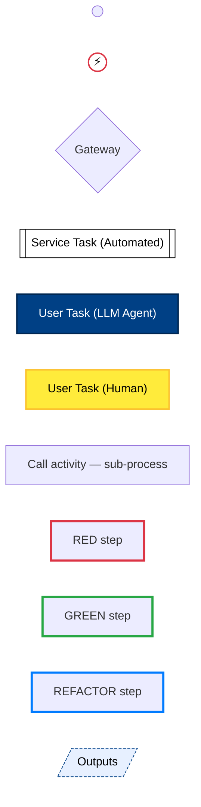
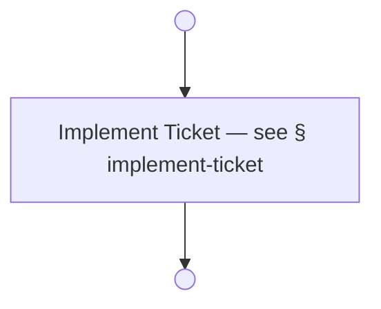
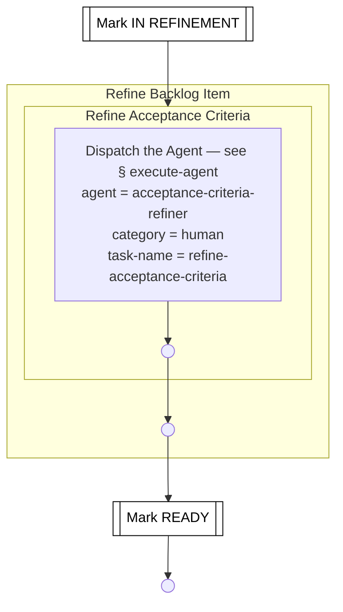
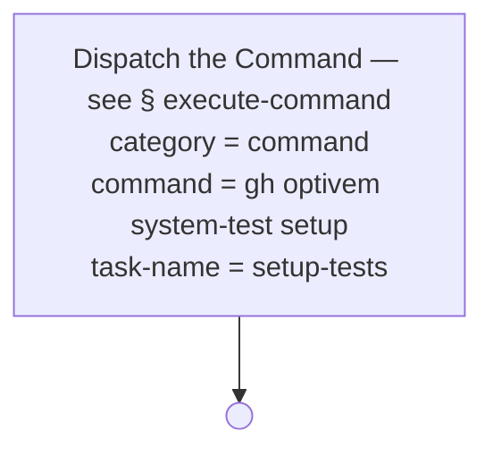

# ATDD Process Flow — Expanded

> Generated from `internal/atdd/process/process-flow.yaml` by `internal/atdd/runtime/diagram`. Do not edit by hand — edit the YAML and regenerate via `gh optivem process show --expanded > docs/process-diagram-expanded.md`.

Each section shows a top-level process with all call-activity nodes expanded inline as subgraphs. See [process-diagram.md](process-diagram.md) for the one-process-per-section reference view.

## Legend

Node **shape** encodes the BPMN type; **fill color** encodes the executor; **border color** (orthogonal) encodes the TDD stage where the author marked one.

- `(( ))` — start / end event (BPMN plain start or end; empty circle, descriptive name lives in the YAML). Start vs end is read from position in the flow — start has no incoming edge, end has no outgoing edge.
- `((⚡))` — error end event (BPMN exceptional exit; red border). Two flavors: **Unknown** (defensive guard — an unhandled gateway branch fired; should never happen at runtime) and **Rejected** (hard-abort — a runtime condition that intentionally halts the run, e.g. agent output rejected post-approve). The descriptive name is in the YAML source; the diagram keeps the icon small.
- `{diamond}` — gateway (decision)
- `[[subroutine]]` — service task — mechanical, automated step (white)
- `[rectangle]` — user task — LLM agent (dark blue) or human (yellow); `call_activity` rectangles are unfilled and link to a sub-process heading
- `[/skewed/]` — published outputs of a process (dashed border)
- **TDD-stage border** — red = RED (failing test), green = GREEN (test passes), blue = REFACTOR (improve without changing behaviour). Only applied where the call site explicitly plays that role.



## Main



## Refine Ticket



## Setup Tests



## Change System Behavior

```mermaid
flowchart TD
    CHANGE_SYSTEM_BEHAVIOR_END(( ))
    subgraph IMPLEMENT_EXTERNAL_DRIVERS_IF_NEEDED[Implement External Drivers If Needed]
    IMPLEMENT_EXTERNAL_DRIVERS_IF_NEEDED__GATE_TICKET_HAS_ESCC{Ticket Declares External System Contract Criteria?}
    IMPLEMENT_EXTERNAL_DRIVERS_IF_NEEDED__VALIDATE_EXTERNAL_SYSTEMS_REGISTERED[[Validate Touched External Systems Are Registered]]
    IMPLEMENT_EXTERNAL_DRIVERS_IF_NEEDED__IMPLEMENT_EXTERNAL_DRIVERS_END(( ))
    subgraph IMPLEMENT_EXTERNAL_DRIVERS_IF_NEEDED__IMPLEMENT_AND_VERIFY_EXTERNAL_DRIVER_ADAPTERS[Implement and Verify External System Driver Adapters Contract Tests]
    IMPLEMENT_EXTERNAL_DRIVERS_IF_NEEDED__IMPLEMENT_AND_VERIFY_EXTERNAL_DRIVER_ADAPTERS__RESOLVE_EXTERNAL_SYSTEM[[Resolve External System]]
    IMPLEMENT_EXTERNAL_DRIVERS_IF_NEEDED__IMPLEMENT_AND_VERIFY_EXTERNAL_DRIVER_ADAPTERS__GATE_EXTERNAL_SYSTEM_TOUCHED{External System Touched?}
    IMPLEMENT_EXTERNAL_DRIVERS_IF_NEEDED__IMPLEMENT_AND_VERIFY_EXTERNAL_DRIVER_ADAPTERS__WRITE_CONTRACT_TESTS["Write External System Contract Tests — see § write-contract-tests<br/>expected-test-result = success"]
    IMPLEMENT_EXTERNAL_DRIVERS_IF_NEEDED__IMPLEMENT_AND_VERIFY_EXTERNAL_DRIVER_ADAPTERS__EXTERNAL_SYSTEM_SKIPPED(( ))
    IMPLEMENT_EXTERNAL_DRIVERS_IF_NEEDED__IMPLEMENT_AND_VERIFY_EXTERNAL_DRIVER_ADAPTERS__WRITE_STUB_FIDELITY_TESTS["Write External System Stub-Fidelity Tests — see § write-stub-fidelity-tests<br/>expected-test-result = success"]
    IMPLEMENT_EXTERNAL_DRIVERS_IF_NEEDED__IMPLEMENT_AND_VERIFY_EXTERNAL_DRIVER_ADAPTERS__GATE_DSL_PORT_CHANGED{DSL Port Changed?}
    IMPLEMENT_EXTERNAL_DRIVERS_IF_NEEDED__IMPLEMENT_AND_VERIFY_EXTERNAL_DRIVER_ADAPTERS__IMPLEMENT_AND_VERIFY_DSL["Implement and Verify DSL — see § implement-and-verify-dsl<br/>expected-test-result = success<br/>suite = contract-real<br/>task-name = implement-dsl<br/>test-category = contract<br/>verify-mode = none"]
    IMPLEMENT_EXTERNAL_DRIVERS_IF_NEEDED__IMPLEMENT_AND_VERIFY_EXTERNAL_DRIVER_ADAPTERS__IMPLEMENT_EXTERNAL_SYSTEM_DRIVER_ADAPTERS[Implement External System Driver Adapters — see § implement-external-system-driver-adapters]
    IMPLEMENT_EXTERNAL_DRIVERS_IF_NEEDED__IMPLEMENT_AND_VERIFY_EXTERNAL_DRIVER_ADAPTERS__RECONCILE_EXTERNAL_CONTRACT_PRODUCER[Reconcile External Contract Producer — see § reconcile-external-contract-producer]
    IMPLEMENT_EXTERNAL_DRIVERS_IF_NEEDED__IMPLEMENT_AND_VERIFY_EXTERNAL_DRIVER_ADAPTERS__IMPL_EXT_DRIVER_CT_END(( ))
    end
    end
    subgraph WRITE_ACCEPTANCE_TESTS_AND_SYSTEM_ADAPTERS[Write and Verify Acceptance Tests]
    WRITE_ACCEPTANCE_TESTS_AND_SYSTEM_ADAPTERS__GATE_SYSTEM_DRIVER_PORTS_CHANGED{System Driver Ports Changed?}
    WRITE_ACCEPTANCE_TESTS_AND_SYSTEM_ADAPTERS__WAV_AT_END(( ))
    subgraph WRITE_ACCEPTANCE_TESTS_AND_SYSTEM_ADAPTERS__WRITE_ACCEPTANCE_TESTS_AND_DSL[Write and Verify Channel-Shared Acceptance Tests]
    WRITE_ACCEPTANCE_TESTS_AND_SYSTEM_ADAPTERS__WRITE_ACCEPTANCE_TESTS_AND_DSL__WRITE_AND_VERIFY_ACCEPTANCE_TEST_CODE["Write and Verify Acceptance Test Code — see § write-and-verify-acceptance-test-code<br/>task-name = write-acceptance-tests<br/>test-category = acceptance<br/>verify-pending-on = dsl"]
    WRITE_ACCEPTANCE_TESTS_AND_SYSTEM_ADAPTERS__WRITE_ACCEPTANCE_TESTS_AND_DSL__VALIDATE_CHANNELS_REGISTERED[[Validate Touched Channels Are Configured]]
    WRITE_ACCEPTANCE_TESTS_AND_SYSTEM_ADAPTERS__WRITE_ACCEPTANCE_TESTS_AND_DSL__GATE_DSL_PORT_CHANGED{DSL Port Changed?}
    WRITE_ACCEPTANCE_TESTS_AND_SYSTEM_ADAPTERS__WRITE_ACCEPTANCE_TESTS_AND_DSL__IMPLEMENT_AND_VERIFY_DSL["Implement and Verify DSL — see § implement-and-verify-dsl<br/>layer-suffix = <br/>suite = acceptance<br/>task-name = implement-dsl<br/>test-category = acceptance<br/>verify-pending-on = system-drivers"]
    WRITE_ACCEPTANCE_TESTS_AND_SYSTEM_ADAPTERS__WRITE_ACCEPTANCE_TESTS_AND_DSL__WRITE_ACCEPTANCE_TESTS_AND_DSL_END(( ))
    WRITE_ACCEPTANCE_TESTS_AND_SYSTEM_ADAPTERS__WRITE_ACCEPTANCE_TESTS_AND_DSL__GATE_EXTERNAL_DRIVER_PORT_CHANGED{DSL Touched External Driver Port Files?}
    WRITE_ACCEPTANCE_TESTS_AND_SYSTEM_ADAPTERS__WRITE_ACCEPTANCE_TESTS_AND_DSL__EXTERNAL_DRIVER_PORT_CHANGED_HALT((⚡))
    end
    subgraph WRITE_ACCEPTANCE_TESTS_AND_SYSTEM_ADAPTERS__IMPLEMENT_AND_VERIFY_SYSTEM_DRIVER_ADAPTERS[Implement and Verify System Driver Adapters]
    WRITE_ACCEPTANCE_TESTS_AND_SYSTEM_ADAPTERS__IMPLEMENT_AND_VERIFY_SYSTEM_DRIVER_ADAPTERS__RESOLVE_CHANNEL[[Resolve Channel]]
    WRITE_ACCEPTANCE_TESTS_AND_SYSTEM_ADAPTERS__IMPLEMENT_AND_VERIFY_SYSTEM_DRIVER_ADAPTERS__GATE_CHANNEL_TOUCHED{Channel Touched?}
    WRITE_ACCEPTANCE_TESTS_AND_SYSTEM_ADAPTERS__IMPLEMENT_AND_VERIFY_SYSTEM_DRIVER_ADAPTERS__IMPLEMENT_TEST_LAYER["Implement System Driver Adapter Layer — see § implement-test-layer<br/>action = implement-system-driver-adapters<br/>task-name = implement-system-driver-adapters"]
    WRITE_ACCEPTANCE_TESTS_AND_SYSTEM_ADAPTERS__IMPLEMENT_AND_VERIFY_SYSTEM_DRIVER_ADAPTERS__CHANNEL_SKIPPED(( ))
    WRITE_ACCEPTANCE_TESTS_AND_SYSTEM_ADAPTERS__IMPLEMENT_AND_VERIFY_SYSTEM_DRIVER_ADAPTERS__IMPL_SYS_DRIVER_END(( ))
    end
    end
    subgraph IMPLEMENT_AND_VERIFY_SYSTEM[Implement and Verify System]
    IMPLEMENT_AND_VERIFY_SYSTEM__RESOLVE_CHANNEL[[Resolve Channel]]
    IMPLEMENT_AND_VERIFY_SYSTEM__GATE_CHANNEL_TOUCHED{Channel Touched?}
    IMPLEMENT_AND_VERIFY_SYSTEM__RUN_ACTION["Run the Configured Agent — see § ${action}"]
    IMPLEMENT_AND_VERIFY_SYSTEM__CHANNEL_SKIPPED(( ))
    IMPLEMENT_AND_VERIFY_SYSTEM__IMPL_AND_VERIFY_SYSTEM_END(( ))
    subgraph IMPLEMENT_AND_VERIFY_SYSTEM__BUILD_SYSTEM[Build System]
    IMPLEMENT_AND_VERIFY_SYSTEM__BUILD_SYSTEM__EXECUTE_COMMAND["Dispatch the Command — see § execute-command<br/>category = command<br/>command = gh optivem system build<br/>task-name = build-system"]
    IMPLEMENT_AND_VERIFY_SYSTEM__BUILD_SYSTEM__BUILD_SYS_END(( ))
    end
    subgraph IMPLEMENT_AND_VERIFY_SYSTEM__START_SYSTEM["Start System (Restart)"]
    IMPLEMENT_AND_VERIFY_SYSTEM__START_SYSTEM__EXECUTE_COMMAND["Dispatch the Command — see § execute-command<br/>category = command<br/>command = gh optivem system start --restart<br/>task-name = start-system-restart"]
    IMPLEMENT_AND_VERIFY_SYSTEM__START_SYSTEM__START_SYS_RESTART_END(( ))
    end
    subgraph IMPLEMENT_AND_VERIFY_SYSTEM__VERIFY_TESTS_PASS[Verify Tests Pass]
    IMPLEMENT_AND_VERIFY_SYSTEM__VERIFY_TESTS_PASS__RUN_TESTS[Run Tests — see § run-tests]
    IMPLEMENT_AND_VERIFY_SYSTEM__VERIFY_TESTS_PASS__GATE_TESTS_OUTCOME{Test Outcome?}
    IMPLEMENT_AND_VERIFY_SYSTEM__VERIFY_TESTS_PASS__VERIFY_PASS_END(( ))
    IMPLEMENT_AND_VERIFY_SYSTEM__VERIFY_TESTS_PASS__CHECK_FIX_PROGRESS[[Check Fix-Loop Progress]]
    IMPLEMENT_AND_VERIFY_SYSTEM__VERIFY_TESTS_PASS__TESTS_INFRA_HALT((⚡))
    IMPLEMENT_AND_VERIFY_SYSTEM__VERIFY_TESTS_PASS__UNKNOWN_TESTS_OUTCOME((⚡))
    IMPLEMENT_AND_VERIFY_SYSTEM__VERIFY_TESTS_PASS__GATE_FIX_PROGRESSING{Fix Loop Progressing?}
    IMPLEMENT_AND_VERIFY_SYSTEM__VERIFY_TESTS_PASS__FIX_UNEXPECTED_FAILING_TESTS[Fix Unexpected Test Failures — see § fix-unexpected-failing-tests]
    IMPLEMENT_AND_VERIFY_SYSTEM__VERIFY_TESTS_PASS__FIX_LOOP_NO_PROGRESS_EXHAUSTED((⚡))
    IMPLEMENT_AND_VERIFY_SYSTEM__VERIFY_TESTS_PASS__GATE_FIX_FLOW_APPROVED{Fixer Dispatch Approved?}
    IMPLEMENT_AND_VERIFY_SYSTEM__VERIFY_TESTS_PASS__FIX_FLOW_NOT_APPROVED((⚡))
    IMPLEMENT_AND_VERIFY_SYSTEM__VERIFY_TESTS_PASS__FIX_LOOP_EXHAUSTED((⚡))
    end
    subgraph IMPLEMENT_AND_VERIFY_SYSTEM__COMMIT_SYSTEM[Commit]
    IMPLEMENT_AND_VERIFY_SYSTEM__COMMIT_SYSTEM__EXECUTE_COMMAND["Dispatch the Command — see § execute-command<br/>command = gh optivem commit --yes --all --include-untracked<br/>task-name = commit"]
    IMPLEMENT_AND_VERIFY_SYSTEM__COMMIT_SYSTEM__COMMIT_MID_END(( ))
    end
    end
    subgraph REFACTOR_OPPORTUNISTICALLY[Refactor]
    REFACTOR_OPPORTUNISTICALLY__GATE_REFACTOR_TYPE_CHOICE{Refactor Type?}
    REFACTOR_OPPORTUNISTICALLY__REFACTOR_TOP_END(( ))
    subgraph REFACTOR_OPPORTUNISTICALLY__REFACTOR_SYSTEM_STRUCTURE[Refactor System Structure]
    REFACTOR_OPPORTUNISTICALLY__REFACTOR_SYSTEM_STRUCTURE__IMPLEMENT_AND_VERIFY_SYSTEM["Refactor System — see § implement-and-verify-system<br/>action = refactor-system<br/>layer-suffix = <br/>suite = <br/>task-name = refactor-system<br/>test-names = "]
    REFACTOR_OPPORTUNISTICALLY__REFACTOR_SYSTEM_STRUCTURE__REFACTOR_SYSTEM_STRUCTURE_END(( ))
    end
    subgraph REFACTOR_OPPORTUNISTICALLY__REFACTOR_TEST_STRUCTURE[Refactor Test Structure]
    REFACTOR_OPPORTUNISTICALLY__REFACTOR_TEST_STRUCTURE__REFACTOR_AND_VERIFY_TESTS["Refactor and Verify Tests — see § refactor-and-verify-tests<br/>task-name = refactor-tests"]
    REFACTOR_OPPORTUNISTICALLY__REFACTOR_TEST_STRUCTURE__REFACTOR_TEST_STRUCTURE_END(( ))
    end
    subgraph REFACTOR_OPPORTUNISTICALLY__REDESIGN_SYSTEM_STRUCTURE[Redesign System Structure]
    REFACTOR_OPPORTUNISTICALLY__REDESIGN_SYSTEM_STRUCTURE__UPDATE_SYSTEM_DRIVER_ADAPTERS[Update System Driver Adapters — see § update-system-driver-adapters]
    REFACTOR_OPPORTUNISTICALLY__REDESIGN_SYSTEM_STRUCTURE__IMPLEMENT_AND_VERIFY_SYSTEM["Update System — see § implement-and-verify-system<br/>action = update-system<br/>layer-suffix = <br/>suite = <br/>task-name = update-system<br/>test-names = "]
    REFACTOR_OPPORTUNISTICALLY__REDESIGN_SYSTEM_STRUCTURE__REDESIGN_END(( ))
    end
    subgraph REFACTOR_OPPORTUNISTICALLY__REDESIGN_EXTERNAL_SYSTEM_STRUCTURE[Redesign External System Structure]
    REFACTOR_OPPORTUNISTICALLY__REDESIGN_EXTERNAL_SYSTEM_STRUCTURE__VALIDATE_REDESIGN_EXTERNAL_REQUIRES_ESCC[[Validate Redesign-External Declares ESCC]]
    REFACTOR_OPPORTUNISTICALLY__REDESIGN_EXTERNAL_SYSTEM_STRUCTURE__VALIDATE_EXTERNAL_SYSTEMS_REGISTERED[[Validate External Systems Registered]]
    REFACTOR_OPPORTUNISTICALLY__REDESIGN_EXTERNAL_SYSTEM_STRUCTURE__REDESIGN_EXTERNAL_SYSTEM[Redesign External System — see § redesign-external-system-per-system]
    REFACTOR_OPPORTUNISTICALLY__REDESIGN_EXTERNAL_SYSTEM_STRUCTURE__IMPLEMENT_AND_VERIFY_SYSTEM["Update System — see § implement-and-verify-system<br/>action = update-system<br/>layer-suffix = <br/>suite = <br/>task-name = update-system<br/>test-names = "]
    REFACTOR_OPPORTUNISTICALLY__REDESIGN_EXTERNAL_SYSTEM_STRUCTURE__REDESIGN_EXTERNAL_END(( ))
    end
    end

    IMPLEMENT_EXTERNAL_DRIVERS_IF_NEEDED__IMPLEMENT_AND_VERIFY_EXTERNAL_DRIVER_ADAPTERS__RESOLVE_EXTERNAL_SYSTEM --> IMPLEMENT_EXTERNAL_DRIVERS_IF_NEEDED__IMPLEMENT_AND_VERIFY_EXTERNAL_DRIVER_ADAPTERS__GATE_EXTERNAL_SYSTEM_TOUCHED
    IMPLEMENT_EXTERNAL_DRIVERS_IF_NEEDED__IMPLEMENT_AND_VERIFY_EXTERNAL_DRIVER_ADAPTERS__GATE_EXTERNAL_SYSTEM_TOUCHED -- Yes --> IMPLEMENT_EXTERNAL_DRIVERS_IF_NEEDED__IMPLEMENT_AND_VERIFY_EXTERNAL_DRIVER_ADAPTERS__WRITE_CONTRACT_TESTS
    IMPLEMENT_EXTERNAL_DRIVERS_IF_NEEDED__IMPLEMENT_AND_VERIFY_EXTERNAL_DRIVER_ADAPTERS__GATE_EXTERNAL_SYSTEM_TOUCHED -- No --> IMPLEMENT_EXTERNAL_DRIVERS_IF_NEEDED__IMPLEMENT_AND_VERIFY_EXTERNAL_DRIVER_ADAPTERS__EXTERNAL_SYSTEM_SKIPPED
    IMPLEMENT_EXTERNAL_DRIVERS_IF_NEEDED__IMPLEMENT_AND_VERIFY_EXTERNAL_DRIVER_ADAPTERS__WRITE_CONTRACT_TESTS --> IMPLEMENT_EXTERNAL_DRIVERS_IF_NEEDED__IMPLEMENT_AND_VERIFY_EXTERNAL_DRIVER_ADAPTERS__WRITE_STUB_FIDELITY_TESTS
    IMPLEMENT_EXTERNAL_DRIVERS_IF_NEEDED__IMPLEMENT_AND_VERIFY_EXTERNAL_DRIVER_ADAPTERS__WRITE_STUB_FIDELITY_TESTS --> IMPLEMENT_EXTERNAL_DRIVERS_IF_NEEDED__IMPLEMENT_AND_VERIFY_EXTERNAL_DRIVER_ADAPTERS__GATE_DSL_PORT_CHANGED
    IMPLEMENT_EXTERNAL_DRIVERS_IF_NEEDED__IMPLEMENT_AND_VERIFY_EXTERNAL_DRIVER_ADAPTERS__GATE_DSL_PORT_CHANGED -- Yes --> IMPLEMENT_EXTERNAL_DRIVERS_IF_NEEDED__IMPLEMENT_AND_VERIFY_EXTERNAL_DRIVER_ADAPTERS__IMPLEMENT_AND_VERIFY_DSL
    IMPLEMENT_EXTERNAL_DRIVERS_IF_NEEDED__IMPLEMENT_AND_VERIFY_EXTERNAL_DRIVER_ADAPTERS__GATE_DSL_PORT_CHANGED -- No --> IMPLEMENT_EXTERNAL_DRIVERS_IF_NEEDED__IMPLEMENT_AND_VERIFY_EXTERNAL_DRIVER_ADAPTERS__IMPLEMENT_EXTERNAL_SYSTEM_DRIVER_ADAPTERS
    IMPLEMENT_EXTERNAL_DRIVERS_IF_NEEDED__IMPLEMENT_AND_VERIFY_EXTERNAL_DRIVER_ADAPTERS__IMPLEMENT_AND_VERIFY_DSL --> IMPLEMENT_EXTERNAL_DRIVERS_IF_NEEDED__IMPLEMENT_AND_VERIFY_EXTERNAL_DRIVER_ADAPTERS__IMPLEMENT_EXTERNAL_SYSTEM_DRIVER_ADAPTERS
    IMPLEMENT_EXTERNAL_DRIVERS_IF_NEEDED__IMPLEMENT_AND_VERIFY_EXTERNAL_DRIVER_ADAPTERS__IMPLEMENT_EXTERNAL_SYSTEM_DRIVER_ADAPTERS --> IMPLEMENT_EXTERNAL_DRIVERS_IF_NEEDED__IMPLEMENT_AND_VERIFY_EXTERNAL_DRIVER_ADAPTERS__RECONCILE_EXTERNAL_CONTRACT_PRODUCER
    IMPLEMENT_EXTERNAL_DRIVERS_IF_NEEDED__IMPLEMENT_AND_VERIFY_EXTERNAL_DRIVER_ADAPTERS__RECONCILE_EXTERNAL_CONTRACT_PRODUCER --> IMPLEMENT_EXTERNAL_DRIVERS_IF_NEEDED__IMPLEMENT_AND_VERIFY_EXTERNAL_DRIVER_ADAPTERS__IMPL_EXT_DRIVER_CT_END
    IMPLEMENT_EXTERNAL_DRIVERS_IF_NEEDED__GATE_TICKET_HAS_ESCC -- Yes --> IMPLEMENT_EXTERNAL_DRIVERS_IF_NEEDED__VALIDATE_EXTERNAL_SYSTEMS_REGISTERED
    IMPLEMENT_EXTERNAL_DRIVERS_IF_NEEDED__GATE_TICKET_HAS_ESCC -- No --> IMPLEMENT_EXTERNAL_DRIVERS_IF_NEEDED__IMPLEMENT_EXTERNAL_DRIVERS_END
    IMPLEMENT_EXTERNAL_DRIVERS_IF_NEEDED__VALIDATE_EXTERNAL_SYSTEMS_REGISTERED --> IMPLEMENT_EXTERNAL_DRIVERS_IF_NEEDED__IMPLEMENT_AND_VERIFY_EXTERNAL_DRIVER_ADAPTERS__RESOLVE_EXTERNAL_SYSTEM
    IMPLEMENT_EXTERNAL_DRIVERS_IF_NEEDED__IMPLEMENT_AND_VERIFY_EXTERNAL_DRIVER_ADAPTERS__EXTERNAL_SYSTEM_SKIPPED --> IMPLEMENT_EXTERNAL_DRIVERS_IF_NEEDED__IMPLEMENT_EXTERNAL_DRIVERS_END
    IMPLEMENT_EXTERNAL_DRIVERS_IF_NEEDED__IMPLEMENT_AND_VERIFY_EXTERNAL_DRIVER_ADAPTERS__IMPL_EXT_DRIVER_CT_END --> IMPLEMENT_EXTERNAL_DRIVERS_IF_NEEDED__IMPLEMENT_EXTERNAL_DRIVERS_END
    WRITE_ACCEPTANCE_TESTS_AND_SYSTEM_ADAPTERS__WRITE_ACCEPTANCE_TESTS_AND_DSL__WRITE_AND_VERIFY_ACCEPTANCE_TEST_CODE --> WRITE_ACCEPTANCE_TESTS_AND_SYSTEM_ADAPTERS__WRITE_ACCEPTANCE_TESTS_AND_DSL__VALIDATE_CHANNELS_REGISTERED
    WRITE_ACCEPTANCE_TESTS_AND_SYSTEM_ADAPTERS__WRITE_ACCEPTANCE_TESTS_AND_DSL__VALIDATE_CHANNELS_REGISTERED --> WRITE_ACCEPTANCE_TESTS_AND_SYSTEM_ADAPTERS__WRITE_ACCEPTANCE_TESTS_AND_DSL__GATE_DSL_PORT_CHANGED
    WRITE_ACCEPTANCE_TESTS_AND_SYSTEM_ADAPTERS__WRITE_ACCEPTANCE_TESTS_AND_DSL__GATE_DSL_PORT_CHANGED -- Yes --> WRITE_ACCEPTANCE_TESTS_AND_SYSTEM_ADAPTERS__WRITE_ACCEPTANCE_TESTS_AND_DSL__IMPLEMENT_AND_VERIFY_DSL
    WRITE_ACCEPTANCE_TESTS_AND_SYSTEM_ADAPTERS__WRITE_ACCEPTANCE_TESTS_AND_DSL__GATE_DSL_PORT_CHANGED -- No --> WRITE_ACCEPTANCE_TESTS_AND_SYSTEM_ADAPTERS__WRITE_ACCEPTANCE_TESTS_AND_DSL__WRITE_ACCEPTANCE_TESTS_AND_DSL_END
    WRITE_ACCEPTANCE_TESTS_AND_SYSTEM_ADAPTERS__WRITE_ACCEPTANCE_TESTS_AND_DSL__IMPLEMENT_AND_VERIFY_DSL --> WRITE_ACCEPTANCE_TESTS_AND_SYSTEM_ADAPTERS__WRITE_ACCEPTANCE_TESTS_AND_DSL__GATE_EXTERNAL_DRIVER_PORT_CHANGED
    WRITE_ACCEPTANCE_TESTS_AND_SYSTEM_ADAPTERS__WRITE_ACCEPTANCE_TESTS_AND_DSL__GATE_EXTERNAL_DRIVER_PORT_CHANGED -- Yes --> WRITE_ACCEPTANCE_TESTS_AND_SYSTEM_ADAPTERS__WRITE_ACCEPTANCE_TESTS_AND_DSL__EXTERNAL_DRIVER_PORT_CHANGED_HALT
    WRITE_ACCEPTANCE_TESTS_AND_SYSTEM_ADAPTERS__WRITE_ACCEPTANCE_TESTS_AND_DSL__GATE_EXTERNAL_DRIVER_PORT_CHANGED -- No --> WRITE_ACCEPTANCE_TESTS_AND_SYSTEM_ADAPTERS__WRITE_ACCEPTANCE_TESTS_AND_DSL__WRITE_ACCEPTANCE_TESTS_AND_DSL_END
    WRITE_ACCEPTANCE_TESTS_AND_SYSTEM_ADAPTERS__IMPLEMENT_AND_VERIFY_SYSTEM_DRIVER_ADAPTERS__RESOLVE_CHANNEL --> WRITE_ACCEPTANCE_TESTS_AND_SYSTEM_ADAPTERS__IMPLEMENT_AND_VERIFY_SYSTEM_DRIVER_ADAPTERS__GATE_CHANNEL_TOUCHED
    WRITE_ACCEPTANCE_TESTS_AND_SYSTEM_ADAPTERS__IMPLEMENT_AND_VERIFY_SYSTEM_DRIVER_ADAPTERS__GATE_CHANNEL_TOUCHED -- Yes --> WRITE_ACCEPTANCE_TESTS_AND_SYSTEM_ADAPTERS__IMPLEMENT_AND_VERIFY_SYSTEM_DRIVER_ADAPTERS__IMPLEMENT_TEST_LAYER
    WRITE_ACCEPTANCE_TESTS_AND_SYSTEM_ADAPTERS__IMPLEMENT_AND_VERIFY_SYSTEM_DRIVER_ADAPTERS__GATE_CHANNEL_TOUCHED -- No --> WRITE_ACCEPTANCE_TESTS_AND_SYSTEM_ADAPTERS__IMPLEMENT_AND_VERIFY_SYSTEM_DRIVER_ADAPTERS__CHANNEL_SKIPPED
    WRITE_ACCEPTANCE_TESTS_AND_SYSTEM_ADAPTERS__IMPLEMENT_AND_VERIFY_SYSTEM_DRIVER_ADAPTERS__IMPLEMENT_TEST_LAYER --> WRITE_ACCEPTANCE_TESTS_AND_SYSTEM_ADAPTERS__IMPLEMENT_AND_VERIFY_SYSTEM_DRIVER_ADAPTERS__IMPL_SYS_DRIVER_END
    WRITE_ACCEPTANCE_TESTS_AND_SYSTEM_ADAPTERS__WRITE_ACCEPTANCE_TESTS_AND_DSL__WRITE_ACCEPTANCE_TESTS_AND_DSL_END --> WRITE_ACCEPTANCE_TESTS_AND_SYSTEM_ADAPTERS__GATE_SYSTEM_DRIVER_PORTS_CHANGED
    WRITE_ACCEPTANCE_TESTS_AND_SYSTEM_ADAPTERS__GATE_SYSTEM_DRIVER_PORTS_CHANGED -- Yes --> WRITE_ACCEPTANCE_TESTS_AND_SYSTEM_ADAPTERS__IMPLEMENT_AND_VERIFY_SYSTEM_DRIVER_ADAPTERS__RESOLVE_CHANNEL
    WRITE_ACCEPTANCE_TESTS_AND_SYSTEM_ADAPTERS__GATE_SYSTEM_DRIVER_PORTS_CHANGED -- No --> WRITE_ACCEPTANCE_TESTS_AND_SYSTEM_ADAPTERS__WAV_AT_END
    WRITE_ACCEPTANCE_TESTS_AND_SYSTEM_ADAPTERS__IMPLEMENT_AND_VERIFY_SYSTEM_DRIVER_ADAPTERS__CHANNEL_SKIPPED --> WRITE_ACCEPTANCE_TESTS_AND_SYSTEM_ADAPTERS__WAV_AT_END
    WRITE_ACCEPTANCE_TESTS_AND_SYSTEM_ADAPTERS__IMPLEMENT_AND_VERIFY_SYSTEM_DRIVER_ADAPTERS__IMPL_SYS_DRIVER_END --> WRITE_ACCEPTANCE_TESTS_AND_SYSTEM_ADAPTERS__WAV_AT_END
    IMPLEMENT_AND_VERIFY_SYSTEM__BUILD_SYSTEM__EXECUTE_COMMAND --> IMPLEMENT_AND_VERIFY_SYSTEM__BUILD_SYSTEM__BUILD_SYS_END
    IMPLEMENT_AND_VERIFY_SYSTEM__START_SYSTEM__EXECUTE_COMMAND --> IMPLEMENT_AND_VERIFY_SYSTEM__START_SYSTEM__START_SYS_RESTART_END
    IMPLEMENT_AND_VERIFY_SYSTEM__VERIFY_TESTS_PASS__RUN_TESTS --> IMPLEMENT_AND_VERIFY_SYSTEM__VERIFY_TESTS_PASS__GATE_TESTS_OUTCOME
    IMPLEMENT_AND_VERIFY_SYSTEM__VERIFY_TESTS_PASS__GATE_TESTS_OUTCOME -- Pass --> IMPLEMENT_AND_VERIFY_SYSTEM__VERIFY_TESTS_PASS__VERIFY_PASS_END
    IMPLEMENT_AND_VERIFY_SYSTEM__VERIFY_TESTS_PASS__GATE_TESTS_OUTCOME -- Fail --> IMPLEMENT_AND_VERIFY_SYSTEM__VERIFY_TESTS_PASS__CHECK_FIX_PROGRESS
    IMPLEMENT_AND_VERIFY_SYSTEM__VERIFY_TESTS_PASS__GATE_TESTS_OUTCOME -- Infra --> IMPLEMENT_AND_VERIFY_SYSTEM__VERIFY_TESTS_PASS__TESTS_INFRA_HALT
    IMPLEMENT_AND_VERIFY_SYSTEM__VERIFY_TESTS_PASS__GATE_TESTS_OUTCOME --> IMPLEMENT_AND_VERIFY_SYSTEM__VERIFY_TESTS_PASS__UNKNOWN_TESTS_OUTCOME
    IMPLEMENT_AND_VERIFY_SYSTEM__VERIFY_TESTS_PASS__CHECK_FIX_PROGRESS --> IMPLEMENT_AND_VERIFY_SYSTEM__VERIFY_TESTS_PASS__GATE_FIX_PROGRESSING
    IMPLEMENT_AND_VERIFY_SYSTEM__VERIFY_TESTS_PASS__GATE_FIX_PROGRESSING -- Yes --> IMPLEMENT_AND_VERIFY_SYSTEM__VERIFY_TESTS_PASS__FIX_UNEXPECTED_FAILING_TESTS
    IMPLEMENT_AND_VERIFY_SYSTEM__VERIFY_TESTS_PASS__GATE_FIX_PROGRESSING -- No --> IMPLEMENT_AND_VERIFY_SYSTEM__VERIFY_TESTS_PASS__FIX_LOOP_NO_PROGRESS_EXHAUSTED
    IMPLEMENT_AND_VERIFY_SYSTEM__VERIFY_TESTS_PASS__FIX_UNEXPECTED_FAILING_TESTS --> IMPLEMENT_AND_VERIFY_SYSTEM__VERIFY_TESTS_PASS__GATE_FIX_FLOW_APPROVED
    IMPLEMENT_AND_VERIFY_SYSTEM__VERIFY_TESTS_PASS__GATE_FIX_FLOW_APPROVED -- Rejected --> IMPLEMENT_AND_VERIFY_SYSTEM__VERIFY_TESTS_PASS__FIX_FLOW_NOT_APPROVED
    IMPLEMENT_AND_VERIFY_SYSTEM__VERIFY_TESTS_PASS__GATE_FIX_FLOW_APPROVED --> IMPLEMENT_AND_VERIFY_SYSTEM__VERIFY_TESTS_PASS__RUN_TESTS
    IMPLEMENT_AND_VERIFY_SYSTEM__COMMIT_SYSTEM__EXECUTE_COMMAND --> IMPLEMENT_AND_VERIFY_SYSTEM__COMMIT_SYSTEM__COMMIT_MID_END
    IMPLEMENT_AND_VERIFY_SYSTEM__RESOLVE_CHANNEL --> IMPLEMENT_AND_VERIFY_SYSTEM__GATE_CHANNEL_TOUCHED
    IMPLEMENT_AND_VERIFY_SYSTEM__GATE_CHANNEL_TOUCHED -- Yes --> IMPLEMENT_AND_VERIFY_SYSTEM__RUN_ACTION
    IMPLEMENT_AND_VERIFY_SYSTEM__GATE_CHANNEL_TOUCHED -- No --> IMPLEMENT_AND_VERIFY_SYSTEM__CHANNEL_SKIPPED
    IMPLEMENT_AND_VERIFY_SYSTEM__RUN_ACTION --> IMPLEMENT_AND_VERIFY_SYSTEM__BUILD_SYSTEM__EXECUTE_COMMAND
    IMPLEMENT_AND_VERIFY_SYSTEM__BUILD_SYSTEM__BUILD_SYS_END --> IMPLEMENT_AND_VERIFY_SYSTEM__START_SYSTEM__EXECUTE_COMMAND
    IMPLEMENT_AND_VERIFY_SYSTEM__START_SYSTEM__START_SYS_RESTART_END --> IMPLEMENT_AND_VERIFY_SYSTEM__VERIFY_TESTS_PASS__RUN_TESTS
    IMPLEMENT_AND_VERIFY_SYSTEM__VERIFY_TESTS_PASS__VERIFY_PASS_END --> IMPLEMENT_AND_VERIFY_SYSTEM__COMMIT_SYSTEM__EXECUTE_COMMAND
    IMPLEMENT_AND_VERIFY_SYSTEM__COMMIT_SYSTEM__COMMIT_MID_END --> IMPLEMENT_AND_VERIFY_SYSTEM__IMPL_AND_VERIFY_SYSTEM_END
    REFACTOR_OPPORTUNISTICALLY__REFACTOR_SYSTEM_STRUCTURE__IMPLEMENT_AND_VERIFY_SYSTEM --> REFACTOR_OPPORTUNISTICALLY__REFACTOR_SYSTEM_STRUCTURE__REFACTOR_SYSTEM_STRUCTURE_END
    REFACTOR_OPPORTUNISTICALLY__REFACTOR_TEST_STRUCTURE__REFACTOR_AND_VERIFY_TESTS --> REFACTOR_OPPORTUNISTICALLY__REFACTOR_TEST_STRUCTURE__REFACTOR_TEST_STRUCTURE_END
    REFACTOR_OPPORTUNISTICALLY__REDESIGN_SYSTEM_STRUCTURE__UPDATE_SYSTEM_DRIVER_ADAPTERS --> REFACTOR_OPPORTUNISTICALLY__REDESIGN_SYSTEM_STRUCTURE__IMPLEMENT_AND_VERIFY_SYSTEM
    REFACTOR_OPPORTUNISTICALLY__REDESIGN_SYSTEM_STRUCTURE__IMPLEMENT_AND_VERIFY_SYSTEM --> REFACTOR_OPPORTUNISTICALLY__REDESIGN_SYSTEM_STRUCTURE__REDESIGN_END
    REFACTOR_OPPORTUNISTICALLY__REDESIGN_EXTERNAL_SYSTEM_STRUCTURE__VALIDATE_REDESIGN_EXTERNAL_REQUIRES_ESCC --> REFACTOR_OPPORTUNISTICALLY__REDESIGN_EXTERNAL_SYSTEM_STRUCTURE__VALIDATE_EXTERNAL_SYSTEMS_REGISTERED
    REFACTOR_OPPORTUNISTICALLY__REDESIGN_EXTERNAL_SYSTEM_STRUCTURE__VALIDATE_EXTERNAL_SYSTEMS_REGISTERED --> REFACTOR_OPPORTUNISTICALLY__REDESIGN_EXTERNAL_SYSTEM_STRUCTURE__REDESIGN_EXTERNAL_SYSTEM
    REFACTOR_OPPORTUNISTICALLY__REDESIGN_EXTERNAL_SYSTEM_STRUCTURE__REDESIGN_EXTERNAL_SYSTEM --> REFACTOR_OPPORTUNISTICALLY__REDESIGN_EXTERNAL_SYSTEM_STRUCTURE__IMPLEMENT_AND_VERIFY_SYSTEM
    REFACTOR_OPPORTUNISTICALLY__REDESIGN_EXTERNAL_SYSTEM_STRUCTURE__IMPLEMENT_AND_VERIFY_SYSTEM --> REFACTOR_OPPORTUNISTICALLY__REDESIGN_EXTERNAL_SYSTEM_STRUCTURE__REDESIGN_EXTERNAL_END
    REFACTOR_OPPORTUNISTICALLY__GATE_REFACTOR_TYPE_CHOICE -- Refactor System Structure --> REFACTOR_OPPORTUNISTICALLY__REFACTOR_SYSTEM_STRUCTURE__IMPLEMENT_AND_VERIFY_SYSTEM
    REFACTOR_OPPORTUNISTICALLY__GATE_REFACTOR_TYPE_CHOICE -- Refactor Test Structure --> REFACTOR_OPPORTUNISTICALLY__REFACTOR_TEST_STRUCTURE__REFACTOR_AND_VERIFY_TESTS
    REFACTOR_OPPORTUNISTICALLY__GATE_REFACTOR_TYPE_CHOICE -- Redesign System Structure --> REFACTOR_OPPORTUNISTICALLY__REDESIGN_SYSTEM_STRUCTURE__UPDATE_SYSTEM_DRIVER_ADAPTERS
    REFACTOR_OPPORTUNISTICALLY__GATE_REFACTOR_TYPE_CHOICE -- Redesign External System Structure --> REFACTOR_OPPORTUNISTICALLY__REDESIGN_EXTERNAL_SYSTEM_STRUCTURE__VALIDATE_REDESIGN_EXTERNAL_REQUIRES_ESCC
    REFACTOR_OPPORTUNISTICALLY__GATE_REFACTOR_TYPE_CHOICE -- None --> REFACTOR_OPPORTUNISTICALLY__REFACTOR_TOP_END
    REFACTOR_OPPORTUNISTICALLY__REFACTOR_SYSTEM_STRUCTURE__REFACTOR_SYSTEM_STRUCTURE_END --> REFACTOR_OPPORTUNISTICALLY__GATE_REFACTOR_TYPE_CHOICE
    REFACTOR_OPPORTUNISTICALLY__REFACTOR_TEST_STRUCTURE__REFACTOR_TEST_STRUCTURE_END --> REFACTOR_OPPORTUNISTICALLY__GATE_REFACTOR_TYPE_CHOICE
    REFACTOR_OPPORTUNISTICALLY__REDESIGN_SYSTEM_STRUCTURE__REDESIGN_END --> REFACTOR_OPPORTUNISTICALLY__GATE_REFACTOR_TYPE_CHOICE
    REFACTOR_OPPORTUNISTICALLY__REDESIGN_EXTERNAL_SYSTEM_STRUCTURE__REDESIGN_EXTERNAL_END --> REFACTOR_OPPORTUNISTICALLY__GATE_REFACTOR_TYPE_CHOICE
    IMPLEMENT_EXTERNAL_DRIVERS_IF_NEEDED__IMPLEMENT_EXTERNAL_DRIVERS_END --> WRITE_ACCEPTANCE_TESTS_AND_SYSTEM_ADAPTERS__WRITE_ACCEPTANCE_TESTS_AND_DSL
    WRITE_ACCEPTANCE_TESTS_AND_SYSTEM_ADAPTERS__WAV_AT_END --> IMPLEMENT_AND_VERIFY_SYSTEM__RESOLVE_CHANNEL
    IMPLEMENT_AND_VERIFY_SYSTEM__CHANNEL_SKIPPED --> REFACTOR_OPPORTUNISTICALLY__GATE_REFACTOR_TYPE_CHOICE
    IMPLEMENT_AND_VERIFY_SYSTEM__IMPL_AND_VERIFY_SYSTEM_END --> REFACTOR_OPPORTUNISTICALLY__GATE_REFACTOR_TYPE_CHOICE
    REFACTOR_OPPORTUNISTICALLY__REFACTOR_TOP_END --> CHANGE_SYSTEM_BEHAVIOR_END

    classDef serviceNode fill:#ffffff,stroke:#000000,stroke-width:1px,color:#000000
    class IMPLEMENT_EXTERNAL_DRIVERS_IF_NEEDED__VALIDATE_EXTERNAL_SYSTEMS_REGISTERED,IMPLEMENT_EXTERNAL_DRIVERS_IF_NEEDED__IMPLEMENT_AND_VERIFY_EXTERNAL_DRIVER_ADAPTERS__RESOLVE_EXTERNAL_SYSTEM,WRITE_ACCEPTANCE_TESTS_AND_SYSTEM_ADAPTERS__WRITE_ACCEPTANCE_TESTS_AND_DSL__VALIDATE_CHANNELS_REGISTERED,WRITE_ACCEPTANCE_TESTS_AND_SYSTEM_ADAPTERS__IMPLEMENT_AND_VERIFY_SYSTEM_DRIVER_ADAPTERS__RESOLVE_CHANNEL,IMPLEMENT_AND_VERIFY_SYSTEM__RESOLVE_CHANNEL,IMPLEMENT_AND_VERIFY_SYSTEM__VERIFY_TESTS_PASS__CHECK_FIX_PROGRESS,REFACTOR_OPPORTUNISTICALLY__REDESIGN_EXTERNAL_SYSTEM_STRUCTURE__VALIDATE_REDESIGN_EXTERNAL_REQUIRES_ESCC,REFACTOR_OPPORTUNISTICALLY__REDESIGN_EXTERNAL_SYSTEM_STRUCTURE__VALIDATE_EXTERNAL_SYSTEMS_REGISTERED serviceNode

    classDef errorEndNode fill:#ffffff,stroke:#dc3545,stroke-width:2px,color:#000000
    class WRITE_ACCEPTANCE_TESTS_AND_SYSTEM_ADAPTERS__WRITE_ACCEPTANCE_TESTS_AND_DSL__EXTERNAL_DRIVER_PORT_CHANGED_HALT,IMPLEMENT_AND_VERIFY_SYSTEM__VERIFY_TESTS_PASS__TESTS_INFRA_HALT,IMPLEMENT_AND_VERIFY_SYSTEM__VERIFY_TESTS_PASS__UNKNOWN_TESTS_OUTCOME,IMPLEMENT_AND_VERIFY_SYSTEM__VERIFY_TESTS_PASS__FIX_LOOP_NO_PROGRESS_EXHAUSTED,IMPLEMENT_AND_VERIFY_SYSTEM__VERIFY_TESTS_PASS__FIX_FLOW_NOT_APPROVED,IMPLEMENT_AND_VERIFY_SYSTEM__VERIFY_TESTS_PASS__FIX_LOOP_EXHAUSTED errorEndNode

    classDef tddRedNode stroke:#dc3545,stroke-width:3px
    class REFACTOR_OPPORTUNISTICALLY__REDESIGN_SYSTEM_STRUCTURE__UPDATE_SYSTEM_DRIVER_ADAPTERS,REFACTOR_OPPORTUNISTICALLY__REDESIGN_EXTERNAL_SYSTEM_STRUCTURE__REDESIGN_EXTERNAL_SYSTEM tddRedNode

    classDef tddGreenNode stroke:#28a745,stroke-width:3px
    class REFACTOR_OPPORTUNISTICALLY__REDESIGN_SYSTEM_STRUCTURE__IMPLEMENT_AND_VERIFY_SYSTEM,REFACTOR_OPPORTUNISTICALLY__REDESIGN_EXTERNAL_SYSTEM_STRUCTURE__IMPLEMENT_AND_VERIFY_SYSTEM tddGreenNode

    classDef tddRefactorNode stroke:#007bff,stroke-width:3px
    class REFACTOR_OPPORTUNISTICALLY__REFACTOR_SYSTEM_STRUCTURE__IMPLEMENT_AND_VERIFY_SYSTEM,REFACTOR_OPPORTUNISTICALLY__REFACTOR_TEST_STRUCTURE__REFACTOR_AND_VERIFY_TESTS tddRefactorNode
```

## Cover System Behavior

```mermaid
flowchart TD
    COVER_END(( ))
    subgraph IMPLEMENT_EXTERNAL_DRIVERS_IF_NEEDED[Implement External Drivers If Needed]
    IMPLEMENT_EXTERNAL_DRIVERS_IF_NEEDED__GATE_TICKET_HAS_ESCC{Ticket Declares External System Contract Criteria?}
    IMPLEMENT_EXTERNAL_DRIVERS_IF_NEEDED__VALIDATE_EXTERNAL_SYSTEMS_REGISTERED[[Validate Touched External Systems Are Registered]]
    IMPLEMENT_EXTERNAL_DRIVERS_IF_NEEDED__IMPLEMENT_EXTERNAL_DRIVERS_END(( ))
    subgraph IMPLEMENT_EXTERNAL_DRIVERS_IF_NEEDED__IMPLEMENT_AND_VERIFY_EXTERNAL_DRIVER_ADAPTERS[Implement and Verify External System Driver Adapters Contract Tests]
    IMPLEMENT_EXTERNAL_DRIVERS_IF_NEEDED__IMPLEMENT_AND_VERIFY_EXTERNAL_DRIVER_ADAPTERS__RESOLVE_EXTERNAL_SYSTEM[[Resolve External System]]
    IMPLEMENT_EXTERNAL_DRIVERS_IF_NEEDED__IMPLEMENT_AND_VERIFY_EXTERNAL_DRIVER_ADAPTERS__GATE_EXTERNAL_SYSTEM_TOUCHED{External System Touched?}
    IMPLEMENT_EXTERNAL_DRIVERS_IF_NEEDED__IMPLEMENT_AND_VERIFY_EXTERNAL_DRIVER_ADAPTERS__WRITE_CONTRACT_TESTS["Write External System Contract Tests — see § write-contract-tests<br/>expected-test-result = success"]
    IMPLEMENT_EXTERNAL_DRIVERS_IF_NEEDED__IMPLEMENT_AND_VERIFY_EXTERNAL_DRIVER_ADAPTERS__EXTERNAL_SYSTEM_SKIPPED(( ))
    IMPLEMENT_EXTERNAL_DRIVERS_IF_NEEDED__IMPLEMENT_AND_VERIFY_EXTERNAL_DRIVER_ADAPTERS__WRITE_STUB_FIDELITY_TESTS["Write External System Stub-Fidelity Tests — see § write-stub-fidelity-tests<br/>expected-test-result = success"]
    IMPLEMENT_EXTERNAL_DRIVERS_IF_NEEDED__IMPLEMENT_AND_VERIFY_EXTERNAL_DRIVER_ADAPTERS__GATE_DSL_PORT_CHANGED{DSL Port Changed?}
    IMPLEMENT_EXTERNAL_DRIVERS_IF_NEEDED__IMPLEMENT_AND_VERIFY_EXTERNAL_DRIVER_ADAPTERS__IMPLEMENT_AND_VERIFY_DSL["Implement and Verify DSL — see § implement-and-verify-dsl<br/>expected-test-result = success<br/>suite = contract-real<br/>task-name = implement-dsl<br/>test-category = contract<br/>verify-mode = none"]
    IMPLEMENT_EXTERNAL_DRIVERS_IF_NEEDED__IMPLEMENT_AND_VERIFY_EXTERNAL_DRIVER_ADAPTERS__IMPLEMENT_EXTERNAL_SYSTEM_DRIVER_ADAPTERS[Implement External System Driver Adapters — see § implement-external-system-driver-adapters]
    IMPLEMENT_EXTERNAL_DRIVERS_IF_NEEDED__IMPLEMENT_AND_VERIFY_EXTERNAL_DRIVER_ADAPTERS__RECONCILE_EXTERNAL_CONTRACT_PRODUCER[Reconcile External Contract Producer — see § reconcile-external-contract-producer]
    IMPLEMENT_EXTERNAL_DRIVERS_IF_NEEDED__IMPLEMENT_AND_VERIFY_EXTERNAL_DRIVER_ADAPTERS__IMPL_EXT_DRIVER_CT_END(( ))
    end
    end
    subgraph WRITE_ACCEPTANCE_TESTS_AND_SYSTEM_ADAPTERS[Write and Verify Acceptance Tests]
    WRITE_ACCEPTANCE_TESTS_AND_SYSTEM_ADAPTERS__GATE_SYSTEM_DRIVER_PORTS_CHANGED{System Driver Ports Changed?}
    WRITE_ACCEPTANCE_TESTS_AND_SYSTEM_ADAPTERS__WAV_AT_END(( ))
    subgraph WRITE_ACCEPTANCE_TESTS_AND_SYSTEM_ADAPTERS__WRITE_ACCEPTANCE_TESTS_AND_DSL[Write and Verify Channel-Shared Acceptance Tests]
    WRITE_ACCEPTANCE_TESTS_AND_SYSTEM_ADAPTERS__WRITE_ACCEPTANCE_TESTS_AND_DSL__WRITE_AND_VERIFY_ACCEPTANCE_TEST_CODE["Write and Verify Acceptance Test Code — see § write-and-verify-acceptance-test-code<br/>task-name = write-acceptance-tests<br/>test-category = acceptance<br/>verify-pending-on = dsl"]
    WRITE_ACCEPTANCE_TESTS_AND_SYSTEM_ADAPTERS__WRITE_ACCEPTANCE_TESTS_AND_DSL__VALIDATE_CHANNELS_REGISTERED[[Validate Touched Channels Are Configured]]
    WRITE_ACCEPTANCE_TESTS_AND_SYSTEM_ADAPTERS__WRITE_ACCEPTANCE_TESTS_AND_DSL__GATE_DSL_PORT_CHANGED{DSL Port Changed?}
    WRITE_ACCEPTANCE_TESTS_AND_SYSTEM_ADAPTERS__WRITE_ACCEPTANCE_TESTS_AND_DSL__IMPLEMENT_AND_VERIFY_DSL["Implement and Verify DSL — see § implement-and-verify-dsl<br/>layer-suffix = <br/>suite = acceptance<br/>task-name = implement-dsl<br/>test-category = acceptance<br/>verify-pending-on = system-drivers"]
    WRITE_ACCEPTANCE_TESTS_AND_SYSTEM_ADAPTERS__WRITE_ACCEPTANCE_TESTS_AND_DSL__WRITE_ACCEPTANCE_TESTS_AND_DSL_END(( ))
    WRITE_ACCEPTANCE_TESTS_AND_SYSTEM_ADAPTERS__WRITE_ACCEPTANCE_TESTS_AND_DSL__GATE_EXTERNAL_DRIVER_PORT_CHANGED{DSL Touched External Driver Port Files?}
    WRITE_ACCEPTANCE_TESTS_AND_SYSTEM_ADAPTERS__WRITE_ACCEPTANCE_TESTS_AND_DSL__EXTERNAL_DRIVER_PORT_CHANGED_HALT((⚡))
    end
    subgraph WRITE_ACCEPTANCE_TESTS_AND_SYSTEM_ADAPTERS__IMPLEMENT_AND_VERIFY_SYSTEM_DRIVER_ADAPTERS[Implement and Verify System Driver Adapters]
    WRITE_ACCEPTANCE_TESTS_AND_SYSTEM_ADAPTERS__IMPLEMENT_AND_VERIFY_SYSTEM_DRIVER_ADAPTERS__RESOLVE_CHANNEL[[Resolve Channel]]
    WRITE_ACCEPTANCE_TESTS_AND_SYSTEM_ADAPTERS__IMPLEMENT_AND_VERIFY_SYSTEM_DRIVER_ADAPTERS__GATE_CHANNEL_TOUCHED{Channel Touched?}
    WRITE_ACCEPTANCE_TESTS_AND_SYSTEM_ADAPTERS__IMPLEMENT_AND_VERIFY_SYSTEM_DRIVER_ADAPTERS__IMPLEMENT_TEST_LAYER["Implement System Driver Adapter Layer — see § implement-test-layer<br/>action = implement-system-driver-adapters<br/>task-name = implement-system-driver-adapters"]
    WRITE_ACCEPTANCE_TESTS_AND_SYSTEM_ADAPTERS__IMPLEMENT_AND_VERIFY_SYSTEM_DRIVER_ADAPTERS__CHANNEL_SKIPPED(( ))
    WRITE_ACCEPTANCE_TESTS_AND_SYSTEM_ADAPTERS__IMPLEMENT_AND_VERIFY_SYSTEM_DRIVER_ADAPTERS__IMPL_SYS_DRIVER_END(( ))
    end
    end

    IMPLEMENT_EXTERNAL_DRIVERS_IF_NEEDED__IMPLEMENT_AND_VERIFY_EXTERNAL_DRIVER_ADAPTERS__RESOLVE_EXTERNAL_SYSTEM --> IMPLEMENT_EXTERNAL_DRIVERS_IF_NEEDED__IMPLEMENT_AND_VERIFY_EXTERNAL_DRIVER_ADAPTERS__GATE_EXTERNAL_SYSTEM_TOUCHED
    IMPLEMENT_EXTERNAL_DRIVERS_IF_NEEDED__IMPLEMENT_AND_VERIFY_EXTERNAL_DRIVER_ADAPTERS__GATE_EXTERNAL_SYSTEM_TOUCHED -- Yes --> IMPLEMENT_EXTERNAL_DRIVERS_IF_NEEDED__IMPLEMENT_AND_VERIFY_EXTERNAL_DRIVER_ADAPTERS__WRITE_CONTRACT_TESTS
    IMPLEMENT_EXTERNAL_DRIVERS_IF_NEEDED__IMPLEMENT_AND_VERIFY_EXTERNAL_DRIVER_ADAPTERS__GATE_EXTERNAL_SYSTEM_TOUCHED -- No --> IMPLEMENT_EXTERNAL_DRIVERS_IF_NEEDED__IMPLEMENT_AND_VERIFY_EXTERNAL_DRIVER_ADAPTERS__EXTERNAL_SYSTEM_SKIPPED
    IMPLEMENT_EXTERNAL_DRIVERS_IF_NEEDED__IMPLEMENT_AND_VERIFY_EXTERNAL_DRIVER_ADAPTERS__WRITE_CONTRACT_TESTS --> IMPLEMENT_EXTERNAL_DRIVERS_IF_NEEDED__IMPLEMENT_AND_VERIFY_EXTERNAL_DRIVER_ADAPTERS__WRITE_STUB_FIDELITY_TESTS
    IMPLEMENT_EXTERNAL_DRIVERS_IF_NEEDED__IMPLEMENT_AND_VERIFY_EXTERNAL_DRIVER_ADAPTERS__WRITE_STUB_FIDELITY_TESTS --> IMPLEMENT_EXTERNAL_DRIVERS_IF_NEEDED__IMPLEMENT_AND_VERIFY_EXTERNAL_DRIVER_ADAPTERS__GATE_DSL_PORT_CHANGED
    IMPLEMENT_EXTERNAL_DRIVERS_IF_NEEDED__IMPLEMENT_AND_VERIFY_EXTERNAL_DRIVER_ADAPTERS__GATE_DSL_PORT_CHANGED -- Yes --> IMPLEMENT_EXTERNAL_DRIVERS_IF_NEEDED__IMPLEMENT_AND_VERIFY_EXTERNAL_DRIVER_ADAPTERS__IMPLEMENT_AND_VERIFY_DSL
    IMPLEMENT_EXTERNAL_DRIVERS_IF_NEEDED__IMPLEMENT_AND_VERIFY_EXTERNAL_DRIVER_ADAPTERS__GATE_DSL_PORT_CHANGED -- No --> IMPLEMENT_EXTERNAL_DRIVERS_IF_NEEDED__IMPLEMENT_AND_VERIFY_EXTERNAL_DRIVER_ADAPTERS__IMPLEMENT_EXTERNAL_SYSTEM_DRIVER_ADAPTERS
    IMPLEMENT_EXTERNAL_DRIVERS_IF_NEEDED__IMPLEMENT_AND_VERIFY_EXTERNAL_DRIVER_ADAPTERS__IMPLEMENT_AND_VERIFY_DSL --> IMPLEMENT_EXTERNAL_DRIVERS_IF_NEEDED__IMPLEMENT_AND_VERIFY_EXTERNAL_DRIVER_ADAPTERS__IMPLEMENT_EXTERNAL_SYSTEM_DRIVER_ADAPTERS
    IMPLEMENT_EXTERNAL_DRIVERS_IF_NEEDED__IMPLEMENT_AND_VERIFY_EXTERNAL_DRIVER_ADAPTERS__IMPLEMENT_EXTERNAL_SYSTEM_DRIVER_ADAPTERS --> IMPLEMENT_EXTERNAL_DRIVERS_IF_NEEDED__IMPLEMENT_AND_VERIFY_EXTERNAL_DRIVER_ADAPTERS__RECONCILE_EXTERNAL_CONTRACT_PRODUCER
    IMPLEMENT_EXTERNAL_DRIVERS_IF_NEEDED__IMPLEMENT_AND_VERIFY_EXTERNAL_DRIVER_ADAPTERS__RECONCILE_EXTERNAL_CONTRACT_PRODUCER --> IMPLEMENT_EXTERNAL_DRIVERS_IF_NEEDED__IMPLEMENT_AND_VERIFY_EXTERNAL_DRIVER_ADAPTERS__IMPL_EXT_DRIVER_CT_END
    IMPLEMENT_EXTERNAL_DRIVERS_IF_NEEDED__GATE_TICKET_HAS_ESCC -- Yes --> IMPLEMENT_EXTERNAL_DRIVERS_IF_NEEDED__VALIDATE_EXTERNAL_SYSTEMS_REGISTERED
    IMPLEMENT_EXTERNAL_DRIVERS_IF_NEEDED__GATE_TICKET_HAS_ESCC -- No --> IMPLEMENT_EXTERNAL_DRIVERS_IF_NEEDED__IMPLEMENT_EXTERNAL_DRIVERS_END
    IMPLEMENT_EXTERNAL_DRIVERS_IF_NEEDED__VALIDATE_EXTERNAL_SYSTEMS_REGISTERED --> IMPLEMENT_EXTERNAL_DRIVERS_IF_NEEDED__IMPLEMENT_AND_VERIFY_EXTERNAL_DRIVER_ADAPTERS__RESOLVE_EXTERNAL_SYSTEM
    IMPLEMENT_EXTERNAL_DRIVERS_IF_NEEDED__IMPLEMENT_AND_VERIFY_EXTERNAL_DRIVER_ADAPTERS__EXTERNAL_SYSTEM_SKIPPED --> IMPLEMENT_EXTERNAL_DRIVERS_IF_NEEDED__IMPLEMENT_EXTERNAL_DRIVERS_END
    IMPLEMENT_EXTERNAL_DRIVERS_IF_NEEDED__IMPLEMENT_AND_VERIFY_EXTERNAL_DRIVER_ADAPTERS__IMPL_EXT_DRIVER_CT_END --> IMPLEMENT_EXTERNAL_DRIVERS_IF_NEEDED__IMPLEMENT_EXTERNAL_DRIVERS_END
    WRITE_ACCEPTANCE_TESTS_AND_SYSTEM_ADAPTERS__WRITE_ACCEPTANCE_TESTS_AND_DSL__WRITE_AND_VERIFY_ACCEPTANCE_TEST_CODE --> WRITE_ACCEPTANCE_TESTS_AND_SYSTEM_ADAPTERS__WRITE_ACCEPTANCE_TESTS_AND_DSL__VALIDATE_CHANNELS_REGISTERED
    WRITE_ACCEPTANCE_TESTS_AND_SYSTEM_ADAPTERS__WRITE_ACCEPTANCE_TESTS_AND_DSL__VALIDATE_CHANNELS_REGISTERED --> WRITE_ACCEPTANCE_TESTS_AND_SYSTEM_ADAPTERS__WRITE_ACCEPTANCE_TESTS_AND_DSL__GATE_DSL_PORT_CHANGED
    WRITE_ACCEPTANCE_TESTS_AND_SYSTEM_ADAPTERS__WRITE_ACCEPTANCE_TESTS_AND_DSL__GATE_DSL_PORT_CHANGED -- Yes --> WRITE_ACCEPTANCE_TESTS_AND_SYSTEM_ADAPTERS__WRITE_ACCEPTANCE_TESTS_AND_DSL__IMPLEMENT_AND_VERIFY_DSL
    WRITE_ACCEPTANCE_TESTS_AND_SYSTEM_ADAPTERS__WRITE_ACCEPTANCE_TESTS_AND_DSL__GATE_DSL_PORT_CHANGED -- No --> WRITE_ACCEPTANCE_TESTS_AND_SYSTEM_ADAPTERS__WRITE_ACCEPTANCE_TESTS_AND_DSL__WRITE_ACCEPTANCE_TESTS_AND_DSL_END
    WRITE_ACCEPTANCE_TESTS_AND_SYSTEM_ADAPTERS__WRITE_ACCEPTANCE_TESTS_AND_DSL__IMPLEMENT_AND_VERIFY_DSL --> WRITE_ACCEPTANCE_TESTS_AND_SYSTEM_ADAPTERS__WRITE_ACCEPTANCE_TESTS_AND_DSL__GATE_EXTERNAL_DRIVER_PORT_CHANGED
    WRITE_ACCEPTANCE_TESTS_AND_SYSTEM_ADAPTERS__WRITE_ACCEPTANCE_TESTS_AND_DSL__GATE_EXTERNAL_DRIVER_PORT_CHANGED -- Yes --> WRITE_ACCEPTANCE_TESTS_AND_SYSTEM_ADAPTERS__WRITE_ACCEPTANCE_TESTS_AND_DSL__EXTERNAL_DRIVER_PORT_CHANGED_HALT
    WRITE_ACCEPTANCE_TESTS_AND_SYSTEM_ADAPTERS__WRITE_ACCEPTANCE_TESTS_AND_DSL__GATE_EXTERNAL_DRIVER_PORT_CHANGED -- No --> WRITE_ACCEPTANCE_TESTS_AND_SYSTEM_ADAPTERS__WRITE_ACCEPTANCE_TESTS_AND_DSL__WRITE_ACCEPTANCE_TESTS_AND_DSL_END
    WRITE_ACCEPTANCE_TESTS_AND_SYSTEM_ADAPTERS__IMPLEMENT_AND_VERIFY_SYSTEM_DRIVER_ADAPTERS__RESOLVE_CHANNEL --> WRITE_ACCEPTANCE_TESTS_AND_SYSTEM_ADAPTERS__IMPLEMENT_AND_VERIFY_SYSTEM_DRIVER_ADAPTERS__GATE_CHANNEL_TOUCHED
    WRITE_ACCEPTANCE_TESTS_AND_SYSTEM_ADAPTERS__IMPLEMENT_AND_VERIFY_SYSTEM_DRIVER_ADAPTERS__GATE_CHANNEL_TOUCHED -- Yes --> WRITE_ACCEPTANCE_TESTS_AND_SYSTEM_ADAPTERS__IMPLEMENT_AND_VERIFY_SYSTEM_DRIVER_ADAPTERS__IMPLEMENT_TEST_LAYER
    WRITE_ACCEPTANCE_TESTS_AND_SYSTEM_ADAPTERS__IMPLEMENT_AND_VERIFY_SYSTEM_DRIVER_ADAPTERS__GATE_CHANNEL_TOUCHED -- No --> WRITE_ACCEPTANCE_TESTS_AND_SYSTEM_ADAPTERS__IMPLEMENT_AND_VERIFY_SYSTEM_DRIVER_ADAPTERS__CHANNEL_SKIPPED
    WRITE_ACCEPTANCE_TESTS_AND_SYSTEM_ADAPTERS__IMPLEMENT_AND_VERIFY_SYSTEM_DRIVER_ADAPTERS__IMPLEMENT_TEST_LAYER --> WRITE_ACCEPTANCE_TESTS_AND_SYSTEM_ADAPTERS__IMPLEMENT_AND_VERIFY_SYSTEM_DRIVER_ADAPTERS__IMPL_SYS_DRIVER_END
    WRITE_ACCEPTANCE_TESTS_AND_SYSTEM_ADAPTERS__WRITE_ACCEPTANCE_TESTS_AND_DSL__WRITE_ACCEPTANCE_TESTS_AND_DSL_END --> WRITE_ACCEPTANCE_TESTS_AND_SYSTEM_ADAPTERS__GATE_SYSTEM_DRIVER_PORTS_CHANGED
    WRITE_ACCEPTANCE_TESTS_AND_SYSTEM_ADAPTERS__GATE_SYSTEM_DRIVER_PORTS_CHANGED -- Yes --> WRITE_ACCEPTANCE_TESTS_AND_SYSTEM_ADAPTERS__IMPLEMENT_AND_VERIFY_SYSTEM_DRIVER_ADAPTERS__RESOLVE_CHANNEL
    WRITE_ACCEPTANCE_TESTS_AND_SYSTEM_ADAPTERS__GATE_SYSTEM_DRIVER_PORTS_CHANGED -- No --> WRITE_ACCEPTANCE_TESTS_AND_SYSTEM_ADAPTERS__WAV_AT_END
    WRITE_ACCEPTANCE_TESTS_AND_SYSTEM_ADAPTERS__IMPLEMENT_AND_VERIFY_SYSTEM_DRIVER_ADAPTERS__CHANNEL_SKIPPED --> WRITE_ACCEPTANCE_TESTS_AND_SYSTEM_ADAPTERS__WAV_AT_END
    WRITE_ACCEPTANCE_TESTS_AND_SYSTEM_ADAPTERS__IMPLEMENT_AND_VERIFY_SYSTEM_DRIVER_ADAPTERS__IMPL_SYS_DRIVER_END --> WRITE_ACCEPTANCE_TESTS_AND_SYSTEM_ADAPTERS__WAV_AT_END
    IMPLEMENT_EXTERNAL_DRIVERS_IF_NEEDED__IMPLEMENT_EXTERNAL_DRIVERS_END --> WRITE_ACCEPTANCE_TESTS_AND_SYSTEM_ADAPTERS__WRITE_ACCEPTANCE_TESTS_AND_DSL
    WRITE_ACCEPTANCE_TESTS_AND_SYSTEM_ADAPTERS__WAV_AT_END --> COVER_END

    classDef serviceNode fill:#ffffff,stroke:#000000,stroke-width:1px,color:#000000
    class IMPLEMENT_EXTERNAL_DRIVERS_IF_NEEDED__VALIDATE_EXTERNAL_SYSTEMS_REGISTERED,IMPLEMENT_EXTERNAL_DRIVERS_IF_NEEDED__IMPLEMENT_AND_VERIFY_EXTERNAL_DRIVER_ADAPTERS__RESOLVE_EXTERNAL_SYSTEM,WRITE_ACCEPTANCE_TESTS_AND_SYSTEM_ADAPTERS__WRITE_ACCEPTANCE_TESTS_AND_DSL__VALIDATE_CHANNELS_REGISTERED,WRITE_ACCEPTANCE_TESTS_AND_SYSTEM_ADAPTERS__IMPLEMENT_AND_VERIFY_SYSTEM_DRIVER_ADAPTERS__RESOLVE_CHANNEL serviceNode

    classDef errorEndNode fill:#ffffff,stroke:#dc3545,stroke-width:2px,color:#000000
    class WRITE_ACCEPTANCE_TESTS_AND_SYSTEM_ADAPTERS__WRITE_ACCEPTANCE_TESTS_AND_DSL__EXTERNAL_DRIVER_PORT_CHANGED_HALT errorEndNode
```



## Redesign System Structure

```mermaid
flowchart TD
    REDESIGN_END(( ))
    subgraph UPDATE_SYSTEM_DRIVER_ADAPTERS[Update System Driver Adapters]
    UPDATE_SYSTEM_DRIVER_ADAPTERS__EXECUTE_AGENT["Dispatch the Agent — see § execute-agent<br/>agent = system-driver-adapter-updater<br/>category = prod-agent<br/>task-name = update-system-driver-adapters"]
    UPDATE_SYSTEM_DRIVER_ADAPTERS__UPDATE_SYS_DA_END(( ))
    end
    subgraph IMPLEMENT_AND_VERIFY_SYSTEM[Implement and Verify System]
    IMPLEMENT_AND_VERIFY_SYSTEM__RESOLVE_CHANNEL[[Resolve Channel]]
    IMPLEMENT_AND_VERIFY_SYSTEM__GATE_CHANNEL_TOUCHED{Channel Touched?}
    IMPLEMENT_AND_VERIFY_SYSTEM__RUN_ACTION["Run the Configured Agent — see § ${action}"]
    IMPLEMENT_AND_VERIFY_SYSTEM__CHANNEL_SKIPPED(( ))
    IMPLEMENT_AND_VERIFY_SYSTEM__IMPL_AND_VERIFY_SYSTEM_END(( ))
    subgraph IMPLEMENT_AND_VERIFY_SYSTEM__BUILD_SYSTEM[Build System]
    IMPLEMENT_AND_VERIFY_SYSTEM__BUILD_SYSTEM__EXECUTE_COMMAND["Dispatch the Command — see § execute-command<br/>category = command<br/>command = gh optivem system build<br/>task-name = build-system"]
    IMPLEMENT_AND_VERIFY_SYSTEM__BUILD_SYSTEM__BUILD_SYS_END(( ))
    end
    subgraph IMPLEMENT_AND_VERIFY_SYSTEM__START_SYSTEM["Start System (Restart)"]
    IMPLEMENT_AND_VERIFY_SYSTEM__START_SYSTEM__EXECUTE_COMMAND["Dispatch the Command — see § execute-command<br/>category = command<br/>command = gh optivem system start --restart<br/>task-name = start-system-restart"]
    IMPLEMENT_AND_VERIFY_SYSTEM__START_SYSTEM__START_SYS_RESTART_END(( ))
    end
    subgraph IMPLEMENT_AND_VERIFY_SYSTEM__VERIFY_TESTS_PASS[Verify Tests Pass]
    IMPLEMENT_AND_VERIFY_SYSTEM__VERIFY_TESTS_PASS__RUN_TESTS[Run Tests — see § run-tests]
    IMPLEMENT_AND_VERIFY_SYSTEM__VERIFY_TESTS_PASS__GATE_TESTS_OUTCOME{Test Outcome?}
    IMPLEMENT_AND_VERIFY_SYSTEM__VERIFY_TESTS_PASS__VERIFY_PASS_END(( ))
    IMPLEMENT_AND_VERIFY_SYSTEM__VERIFY_TESTS_PASS__CHECK_FIX_PROGRESS[[Check Fix-Loop Progress]]
    IMPLEMENT_AND_VERIFY_SYSTEM__VERIFY_TESTS_PASS__TESTS_INFRA_HALT((⚡))
    IMPLEMENT_AND_VERIFY_SYSTEM__VERIFY_TESTS_PASS__UNKNOWN_TESTS_OUTCOME((⚡))
    IMPLEMENT_AND_VERIFY_SYSTEM__VERIFY_TESTS_PASS__GATE_FIX_PROGRESSING{Fix Loop Progressing?}
    IMPLEMENT_AND_VERIFY_SYSTEM__VERIFY_TESTS_PASS__FIX_UNEXPECTED_FAILING_TESTS[Fix Unexpected Test Failures — see § fix-unexpected-failing-tests]
    IMPLEMENT_AND_VERIFY_SYSTEM__VERIFY_TESTS_PASS__FIX_LOOP_NO_PROGRESS_EXHAUSTED((⚡))
    IMPLEMENT_AND_VERIFY_SYSTEM__VERIFY_TESTS_PASS__GATE_FIX_FLOW_APPROVED{Fixer Dispatch Approved?}
    IMPLEMENT_AND_VERIFY_SYSTEM__VERIFY_TESTS_PASS__FIX_FLOW_NOT_APPROVED((⚡))
    IMPLEMENT_AND_VERIFY_SYSTEM__VERIFY_TESTS_PASS__FIX_LOOP_EXHAUSTED((⚡))
    end
    subgraph IMPLEMENT_AND_VERIFY_SYSTEM__COMMIT_SYSTEM[Commit]
    IMPLEMENT_AND_VERIFY_SYSTEM__COMMIT_SYSTEM__EXECUTE_COMMAND["Dispatch the Command — see § execute-command<br/>command = gh optivem commit --yes --all --include-untracked<br/>task-name = commit"]
    IMPLEMENT_AND_VERIFY_SYSTEM__COMMIT_SYSTEM__COMMIT_MID_END(( ))
    end
    end

    UPDATE_SYSTEM_DRIVER_ADAPTERS__EXECUTE_AGENT --> UPDATE_SYSTEM_DRIVER_ADAPTERS__UPDATE_SYS_DA_END
    IMPLEMENT_AND_VERIFY_SYSTEM__BUILD_SYSTEM__EXECUTE_COMMAND --> IMPLEMENT_AND_VERIFY_SYSTEM__BUILD_SYSTEM__BUILD_SYS_END
    IMPLEMENT_AND_VERIFY_SYSTEM__START_SYSTEM__EXECUTE_COMMAND --> IMPLEMENT_AND_VERIFY_SYSTEM__START_SYSTEM__START_SYS_RESTART_END
    IMPLEMENT_AND_VERIFY_SYSTEM__VERIFY_TESTS_PASS__RUN_TESTS --> IMPLEMENT_AND_VERIFY_SYSTEM__VERIFY_TESTS_PASS__GATE_TESTS_OUTCOME
    IMPLEMENT_AND_VERIFY_SYSTEM__VERIFY_TESTS_PASS__GATE_TESTS_OUTCOME -- Pass --> IMPLEMENT_AND_VERIFY_SYSTEM__VERIFY_TESTS_PASS__VERIFY_PASS_END
    IMPLEMENT_AND_VERIFY_SYSTEM__VERIFY_TESTS_PASS__GATE_TESTS_OUTCOME -- Fail --> IMPLEMENT_AND_VERIFY_SYSTEM__VERIFY_TESTS_PASS__CHECK_FIX_PROGRESS
    IMPLEMENT_AND_VERIFY_SYSTEM__VERIFY_TESTS_PASS__GATE_TESTS_OUTCOME -- Infra --> IMPLEMENT_AND_VERIFY_SYSTEM__VERIFY_TESTS_PASS__TESTS_INFRA_HALT
    IMPLEMENT_AND_VERIFY_SYSTEM__VERIFY_TESTS_PASS__GATE_TESTS_OUTCOME --> IMPLEMENT_AND_VERIFY_SYSTEM__VERIFY_TESTS_PASS__UNKNOWN_TESTS_OUTCOME
    IMPLEMENT_AND_VERIFY_SYSTEM__VERIFY_TESTS_PASS__CHECK_FIX_PROGRESS --> IMPLEMENT_AND_VERIFY_SYSTEM__VERIFY_TESTS_PASS__GATE_FIX_PROGRESSING
    IMPLEMENT_AND_VERIFY_SYSTEM__VERIFY_TESTS_PASS__GATE_FIX_PROGRESSING -- Yes --> IMPLEMENT_AND_VERIFY_SYSTEM__VERIFY_TESTS_PASS__FIX_UNEXPECTED_FAILING_TESTS
    IMPLEMENT_AND_VERIFY_SYSTEM__VERIFY_TESTS_PASS__GATE_FIX_PROGRESSING -- No --> IMPLEMENT_AND_VERIFY_SYSTEM__VERIFY_TESTS_PASS__FIX_LOOP_NO_PROGRESS_EXHAUSTED
    IMPLEMENT_AND_VERIFY_SYSTEM__VERIFY_TESTS_PASS__FIX_UNEXPECTED_FAILING_TESTS --> IMPLEMENT_AND_VERIFY_SYSTEM__VERIFY_TESTS_PASS__GATE_FIX_FLOW_APPROVED
    IMPLEMENT_AND_VERIFY_SYSTEM__VERIFY_TESTS_PASS__GATE_FIX_FLOW_APPROVED -- Rejected --> IMPLEMENT_AND_VERIFY_SYSTEM__VERIFY_TESTS_PASS__FIX_FLOW_NOT_APPROVED
    IMPLEMENT_AND_VERIFY_SYSTEM__VERIFY_TESTS_PASS__GATE_FIX_FLOW_APPROVED --> IMPLEMENT_AND_VERIFY_SYSTEM__VERIFY_TESTS_PASS__RUN_TESTS
    IMPLEMENT_AND_VERIFY_SYSTEM__COMMIT_SYSTEM__EXECUTE_COMMAND --> IMPLEMENT_AND_VERIFY_SYSTEM__COMMIT_SYSTEM__COMMIT_MID_END
    IMPLEMENT_AND_VERIFY_SYSTEM__RESOLVE_CHANNEL --> IMPLEMENT_AND_VERIFY_SYSTEM__GATE_CHANNEL_TOUCHED
    IMPLEMENT_AND_VERIFY_SYSTEM__GATE_CHANNEL_TOUCHED -- Yes --> IMPLEMENT_AND_VERIFY_SYSTEM__RUN_ACTION
    IMPLEMENT_AND_VERIFY_SYSTEM__GATE_CHANNEL_TOUCHED -- No --> IMPLEMENT_AND_VERIFY_SYSTEM__CHANNEL_SKIPPED
    IMPLEMENT_AND_VERIFY_SYSTEM__RUN_ACTION --> IMPLEMENT_AND_VERIFY_SYSTEM__BUILD_SYSTEM__EXECUTE_COMMAND
    IMPLEMENT_AND_VERIFY_SYSTEM__BUILD_SYSTEM__BUILD_SYS_END --> IMPLEMENT_AND_VERIFY_SYSTEM__START_SYSTEM__EXECUTE_COMMAND
    IMPLEMENT_AND_VERIFY_SYSTEM__START_SYSTEM__START_SYS_RESTART_END --> IMPLEMENT_AND_VERIFY_SYSTEM__VERIFY_TESTS_PASS__RUN_TESTS
    IMPLEMENT_AND_VERIFY_SYSTEM__VERIFY_TESTS_PASS__VERIFY_PASS_END --> IMPLEMENT_AND_VERIFY_SYSTEM__COMMIT_SYSTEM__EXECUTE_COMMAND
    IMPLEMENT_AND_VERIFY_SYSTEM__COMMIT_SYSTEM__COMMIT_MID_END --> IMPLEMENT_AND_VERIFY_SYSTEM__IMPL_AND_VERIFY_SYSTEM_END
    UPDATE_SYSTEM_DRIVER_ADAPTERS__UPDATE_SYS_DA_END --> IMPLEMENT_AND_VERIFY_SYSTEM__RESOLVE_CHANNEL
    IMPLEMENT_AND_VERIFY_SYSTEM__CHANNEL_SKIPPED --> REDESIGN_END
    IMPLEMENT_AND_VERIFY_SYSTEM__IMPL_AND_VERIFY_SYSTEM_END --> REDESIGN_END

    classDef serviceNode fill:#ffffff,stroke:#000000,stroke-width:1px,color:#000000
    class IMPLEMENT_AND_VERIFY_SYSTEM__RESOLVE_CHANNEL,IMPLEMENT_AND_VERIFY_SYSTEM__VERIFY_TESTS_PASS__CHECK_FIX_PROGRESS serviceNode

    classDef errorEndNode fill:#ffffff,stroke:#dc3545,stroke-width:2px,color:#000000
    class IMPLEMENT_AND_VERIFY_SYSTEM__VERIFY_TESTS_PASS__TESTS_INFRA_HALT,IMPLEMENT_AND_VERIFY_SYSTEM__VERIFY_TESTS_PASS__UNKNOWN_TESTS_OUTCOME,IMPLEMENT_AND_VERIFY_SYSTEM__VERIFY_TESTS_PASS__FIX_LOOP_NO_PROGRESS_EXHAUSTED,IMPLEMENT_AND_VERIFY_SYSTEM__VERIFY_TESTS_PASS__FIX_FLOW_NOT_APPROVED,IMPLEMENT_AND_VERIFY_SYSTEM__VERIFY_TESTS_PASS__FIX_LOOP_EXHAUSTED errorEndNode
```



## Redesign External System Structure

```mermaid
flowchart TD
    VALIDATE_REDESIGN_EXTERNAL_REQUIRES_ESCC[[Validate Redesign-External Declares ESCC]]
    VALIDATE_EXTERNAL_SYSTEMS_REGISTERED[[Validate External Systems Registered]]
    REDESIGN_EXTERNAL_END(( ))
    subgraph REDESIGN_EXTERNAL_SYSTEM["Redesign External System (per system)"]
    REDESIGN_EXTERNAL_SYSTEM__RESOLVE_EXTERNAL_SYSTEM[[Resolve External System]]
    REDESIGN_EXTERNAL_SYSTEM__GATE_EXTERNAL_SYSTEM_TOUCHED{External System Touched?}
    REDESIGN_EXTERNAL_SYSTEM__EXTERNAL_SYSTEM_SKIPPED(( ))
    REDESIGN_EXTERNAL_SYSTEM__REDESIGN_EXTERNAL_PER_SYSTEM_END(( ))
    subgraph REDESIGN_EXTERNAL_SYSTEM__UPDATE_EXTERNAL_SYSTEM_DRIVER_ADAPTERS[Update External System Driver Adapters]
    REDESIGN_EXTERNAL_SYSTEM__UPDATE_EXTERNAL_SYSTEM_DRIVER_ADAPTERS__EXECUTE_AGENT["Dispatch the Agent — see § execute-agent<br/>agent = external-system-driver-adapter-updater<br/>category = prod-agent<br/>task-name = update-external-system-driver-adapters"]
    REDESIGN_EXTERNAL_SYSTEM__UPDATE_EXTERNAL_SYSTEM_DRIVER_ADAPTERS__UPDATE_EXT_DA_END(( ))
    end
    subgraph REDESIGN_EXTERNAL_SYSTEM__RECONCILE_EXTERNAL_CONTRACT_PRODUCER[Reconcile External Contract Producer]
    REDESIGN_EXTERNAL_SYSTEM__RECONCILE_EXTERNAL_CONTRACT_PRODUCER__BUILD_SYSTEM_AFTER_DRIVER[Build System — see § build-system]
    REDESIGN_EXTERNAL_SYSTEM__RECONCILE_EXTERNAL_CONTRACT_PRODUCER__START_SYSTEM_AFTER_DRIVER[Start System — see § start-system-restart]
    REDESIGN_EXTERNAL_SYSTEM__RECONCILE_EXTERNAL_CONTRACT_PRODUCER__PROBE_CONTRACT_REAL["Probe External System Contract Tests Against the Real System — see § run-tests<br/>suite = contract-real"]
    REDESIGN_EXTERNAL_SYSTEM__RECONCILE_EXTERNAL_CONTRACT_PRODUCER__GATE_CONTRACT_REAL_OUTCOME{Contract-Real Outcome?}
    REDESIGN_EXTERNAL_SYSTEM__RECONCILE_EXTERNAL_CONTRACT_PRODUCER__START_SYSTEM_BEFORE_STUB_PROBE[Start System — see § start-system]
    REDESIGN_EXTERNAL_SYSTEM__RECONCILE_EXTERNAL_CONTRACT_PRODUCER__GATE_CONTRACT_REAL_RED_KIND{Real Kind?}
    REDESIGN_EXTERNAL_SYSTEM__RECONCILE_EXTERNAL_CONTRACT_PRODUCER__TESTS_INFRA_HALT((⚡))
    REDESIGN_EXTERNAL_SYSTEM__RECONCILE_EXTERNAL_CONTRACT_PRODUCER__UNKNOWN_TESTS_OUTCOME((⚡))
    REDESIGN_EXTERNAL_SYSTEM__RECONCILE_EXTERNAL_CONTRACT_PRODUCER__PROBE_CONTRACT_STUB["Probe External System Contract Tests Against the Stub — see § run-tests<br/>suite = contract-stub"]
    REDESIGN_EXTERNAL_SYSTEM__RECONCILE_EXTERNAL_CONTRACT_PRODUCER__IMPLEMENT_EXTERNAL_SYSTEM_REAL_SIMULATOR[Implement External System Real Simulator — see § implement-external-system-real-simulator]
    REDESIGN_EXTERNAL_SYSTEM__RECONCILE_EXTERNAL_CONTRACT_PRODUCER__CONTRACT_REAL_UPSTREAM_GAP_HALT((⚡))
    REDESIGN_EXTERNAL_SYSTEM__RECONCILE_EXTERNAL_CONTRACT_PRODUCER__GATE_CONTRACT_STUB_OUTCOME{Contract-Stub Outcome?}
    REDESIGN_EXTERNAL_SYSTEM__RECONCILE_EXTERNAL_CONTRACT_PRODUCER__BUILD_SYSTEM_AFTER_SIMULATOR[Build System — see § build-system]
    REDESIGN_EXTERNAL_SYSTEM__RECONCILE_EXTERNAL_CONTRACT_PRODUCER__GATE_STUB_FIDELITY_PRESENT{Stub-Fidelity Tests Authored?}
    REDESIGN_EXTERNAL_SYSTEM__RECONCILE_EXTERNAL_CONTRACT_PRODUCER__IMPLEMENT_EXTERNAL_SYSTEM_STUBS[Implement External System Stubs — see § implement-external-system-stubs]
    REDESIGN_EXTERNAL_SYSTEM__RECONCILE_EXTERNAL_CONTRACT_PRODUCER__START_SYSTEM_AFTER_SIMULATOR[Start System — see § start-system-restart]
    REDESIGN_EXTERNAL_SYSTEM__RECONCILE_EXTERNAL_CONTRACT_PRODUCER__PROBE_CONTRACT_STUB_ISOLATED["Probe Stub-Fidelity Tests Against the Stub — see § run-tests<br/>suite = contract-stub"]
    REDESIGN_EXTERNAL_SYSTEM__RECONCILE_EXTERNAL_CONTRACT_PRODUCER__RECONCILE_PRODUCER_END(( ))
    REDESIGN_EXTERNAL_SYSTEM__RECONCILE_EXTERNAL_CONTRACT_PRODUCER__BUILD_SYSTEM_AFTER_STUBS[Build System — see § build-system]
    REDESIGN_EXTERNAL_SYSTEM__RECONCILE_EXTERNAL_CONTRACT_PRODUCER__VERIFY_TESTS_PASS_CONTRACT_REAL_AFTER_SIMULATOR["Verify External System Contract Tests Pass Against the Real Simulator — see § verify-tests-pass<br/>suite = contract-real"]
    REDESIGN_EXTERNAL_SYSTEM__RECONCILE_EXTERNAL_CONTRACT_PRODUCER__GATE_CONTRACT_STUB_ISOLATED_OUTCOME{Stub-Fidelity Outcome?}
    REDESIGN_EXTERNAL_SYSTEM__RECONCILE_EXTERNAL_CONTRACT_PRODUCER__START_SYSTEM_AFTER_STUBS[Start System — see § start-system-restart]
    REDESIGN_EXTERNAL_SYSTEM__RECONCILE_EXTERNAL_CONTRACT_PRODUCER__IMPLEMENT_EXTERNAL_SYSTEM_STUBS_ISOLATED[Implement External System Stubs — see § implement-external-system-stubs]
    REDESIGN_EXTERNAL_SYSTEM__RECONCILE_EXTERNAL_CONTRACT_PRODUCER__VERIFY_TESTS_PASS_CONTRACT_STUB["Verify External System Contract Tests Pass Against the Stub — see § verify-tests-pass<br/>suite = contract-stub"]
    REDESIGN_EXTERNAL_SYSTEM__RECONCILE_EXTERNAL_CONTRACT_PRODUCER__BUILD_SYSTEM_AFTER_STUBS_ISOLATED[Build System — see § build-system]
    REDESIGN_EXTERNAL_SYSTEM__RECONCILE_EXTERNAL_CONTRACT_PRODUCER__START_SYSTEM_AFTER_STUBS_ISOLATED[Start System — see § start-system-restart]
    REDESIGN_EXTERNAL_SYSTEM__RECONCILE_EXTERNAL_CONTRACT_PRODUCER__VERIFY_TESTS_PASS_CONTRACT_STUB_ISOLATED["Verify Stub-Fidelity Tests Pass Against the Stub — see § verify-tests-pass<br/>suite = contract-stub"]
    end
    end
    subgraph IMPLEMENT_AND_VERIFY_SYSTEM[Implement and Verify System]
    IMPLEMENT_AND_VERIFY_SYSTEM__RESOLVE_CHANNEL[[Resolve Channel]]
    IMPLEMENT_AND_VERIFY_SYSTEM__GATE_CHANNEL_TOUCHED{Channel Touched?}
    IMPLEMENT_AND_VERIFY_SYSTEM__RUN_ACTION["Run the Configured Agent — see § ${action}"]
    IMPLEMENT_AND_VERIFY_SYSTEM__CHANNEL_SKIPPED(( ))
    IMPLEMENT_AND_VERIFY_SYSTEM__IMPL_AND_VERIFY_SYSTEM_END(( ))
    subgraph IMPLEMENT_AND_VERIFY_SYSTEM__BUILD_SYSTEM[Build System]
    IMPLEMENT_AND_VERIFY_SYSTEM__BUILD_SYSTEM__EXECUTE_COMMAND["Dispatch the Command — see § execute-command<br/>category = command<br/>command = gh optivem system build<br/>task-name = build-system"]
    IMPLEMENT_AND_VERIFY_SYSTEM__BUILD_SYSTEM__BUILD_SYS_END(( ))
    end
    subgraph IMPLEMENT_AND_VERIFY_SYSTEM__START_SYSTEM["Start System (Restart)"]
    IMPLEMENT_AND_VERIFY_SYSTEM__START_SYSTEM__EXECUTE_COMMAND["Dispatch the Command — see § execute-command<br/>category = command<br/>command = gh optivem system start --restart<br/>task-name = start-system-restart"]
    IMPLEMENT_AND_VERIFY_SYSTEM__START_SYSTEM__START_SYS_RESTART_END(( ))
    end
    subgraph IMPLEMENT_AND_VERIFY_SYSTEM__VERIFY_TESTS_PASS[Verify Tests Pass]
    IMPLEMENT_AND_VERIFY_SYSTEM__VERIFY_TESTS_PASS__RUN_TESTS[Run Tests — see § run-tests]
    IMPLEMENT_AND_VERIFY_SYSTEM__VERIFY_TESTS_PASS__GATE_TESTS_OUTCOME{Test Outcome?}
    IMPLEMENT_AND_VERIFY_SYSTEM__VERIFY_TESTS_PASS__VERIFY_PASS_END(( ))
    IMPLEMENT_AND_VERIFY_SYSTEM__VERIFY_TESTS_PASS__CHECK_FIX_PROGRESS[[Check Fix-Loop Progress]]
    IMPLEMENT_AND_VERIFY_SYSTEM__VERIFY_TESTS_PASS__TESTS_INFRA_HALT((⚡))
    IMPLEMENT_AND_VERIFY_SYSTEM__VERIFY_TESTS_PASS__UNKNOWN_TESTS_OUTCOME((⚡))
    IMPLEMENT_AND_VERIFY_SYSTEM__VERIFY_TESTS_PASS__GATE_FIX_PROGRESSING{Fix Loop Progressing?}
    IMPLEMENT_AND_VERIFY_SYSTEM__VERIFY_TESTS_PASS__FIX_UNEXPECTED_FAILING_TESTS[Fix Unexpected Test Failures — see § fix-unexpected-failing-tests]
    IMPLEMENT_AND_VERIFY_SYSTEM__VERIFY_TESTS_PASS__FIX_LOOP_NO_PROGRESS_EXHAUSTED((⚡))
    IMPLEMENT_AND_VERIFY_SYSTEM__VERIFY_TESTS_PASS__GATE_FIX_FLOW_APPROVED{Fixer Dispatch Approved?}
    IMPLEMENT_AND_VERIFY_SYSTEM__VERIFY_TESTS_PASS__FIX_FLOW_NOT_APPROVED((⚡))
    IMPLEMENT_AND_VERIFY_SYSTEM__VERIFY_TESTS_PASS__FIX_LOOP_EXHAUSTED((⚡))
    end
    subgraph IMPLEMENT_AND_VERIFY_SYSTEM__COMMIT_SYSTEM[Commit]
    IMPLEMENT_AND_VERIFY_SYSTEM__COMMIT_SYSTEM__EXECUTE_COMMAND["Dispatch the Command — see § execute-command<br/>command = gh optivem commit --yes --all --include-untracked<br/>task-name = commit"]
    IMPLEMENT_AND_VERIFY_SYSTEM__COMMIT_SYSTEM__COMMIT_MID_END(( ))
    end
    end

    REDESIGN_EXTERNAL_SYSTEM__UPDATE_EXTERNAL_SYSTEM_DRIVER_ADAPTERS__EXECUTE_AGENT --> REDESIGN_EXTERNAL_SYSTEM__UPDATE_EXTERNAL_SYSTEM_DRIVER_ADAPTERS__UPDATE_EXT_DA_END
    REDESIGN_EXTERNAL_SYSTEM__RECONCILE_EXTERNAL_CONTRACT_PRODUCER__BUILD_SYSTEM_AFTER_DRIVER --> REDESIGN_EXTERNAL_SYSTEM__RECONCILE_EXTERNAL_CONTRACT_PRODUCER__START_SYSTEM_AFTER_DRIVER
    REDESIGN_EXTERNAL_SYSTEM__RECONCILE_EXTERNAL_CONTRACT_PRODUCER__START_SYSTEM_AFTER_DRIVER --> REDESIGN_EXTERNAL_SYSTEM__RECONCILE_EXTERNAL_CONTRACT_PRODUCER__PROBE_CONTRACT_REAL
    REDESIGN_EXTERNAL_SYSTEM__RECONCILE_EXTERNAL_CONTRACT_PRODUCER__PROBE_CONTRACT_REAL --> REDESIGN_EXTERNAL_SYSTEM__RECONCILE_EXTERNAL_CONTRACT_PRODUCER__GATE_CONTRACT_REAL_OUTCOME
    REDESIGN_EXTERNAL_SYSTEM__RECONCILE_EXTERNAL_CONTRACT_PRODUCER__GATE_CONTRACT_REAL_OUTCOME -- Pass --> REDESIGN_EXTERNAL_SYSTEM__RECONCILE_EXTERNAL_CONTRACT_PRODUCER__START_SYSTEM_BEFORE_STUB_PROBE
    REDESIGN_EXTERNAL_SYSTEM__RECONCILE_EXTERNAL_CONTRACT_PRODUCER__GATE_CONTRACT_REAL_OUTCOME -- Fail --> REDESIGN_EXTERNAL_SYSTEM__RECONCILE_EXTERNAL_CONTRACT_PRODUCER__GATE_CONTRACT_REAL_RED_KIND
    REDESIGN_EXTERNAL_SYSTEM__RECONCILE_EXTERNAL_CONTRACT_PRODUCER__GATE_CONTRACT_REAL_OUTCOME -- Infra --> REDESIGN_EXTERNAL_SYSTEM__RECONCILE_EXTERNAL_CONTRACT_PRODUCER__TESTS_INFRA_HALT
    REDESIGN_EXTERNAL_SYSTEM__RECONCILE_EXTERNAL_CONTRACT_PRODUCER__GATE_CONTRACT_REAL_OUTCOME --> REDESIGN_EXTERNAL_SYSTEM__RECONCILE_EXTERNAL_CONTRACT_PRODUCER__UNKNOWN_TESTS_OUTCOME
    REDESIGN_EXTERNAL_SYSTEM__RECONCILE_EXTERNAL_CONTRACT_PRODUCER__GATE_CONTRACT_REAL_RED_KIND -- Simulator --> REDESIGN_EXTERNAL_SYSTEM__RECONCILE_EXTERNAL_CONTRACT_PRODUCER__IMPLEMENT_EXTERNAL_SYSTEM_REAL_SIMULATOR
    REDESIGN_EXTERNAL_SYSTEM__RECONCILE_EXTERNAL_CONTRACT_PRODUCER__GATE_CONTRACT_REAL_RED_KIND -- Test Instance --> REDESIGN_EXTERNAL_SYSTEM__RECONCILE_EXTERNAL_CONTRACT_PRODUCER__CONTRACT_REAL_UPSTREAM_GAP_HALT
    REDESIGN_EXTERNAL_SYSTEM__RECONCILE_EXTERNAL_CONTRACT_PRODUCER__IMPLEMENT_EXTERNAL_SYSTEM_REAL_SIMULATOR --> REDESIGN_EXTERNAL_SYSTEM__RECONCILE_EXTERNAL_CONTRACT_PRODUCER__BUILD_SYSTEM_AFTER_SIMULATOR
    REDESIGN_EXTERNAL_SYSTEM__RECONCILE_EXTERNAL_CONTRACT_PRODUCER__BUILD_SYSTEM_AFTER_SIMULATOR --> REDESIGN_EXTERNAL_SYSTEM__RECONCILE_EXTERNAL_CONTRACT_PRODUCER__START_SYSTEM_AFTER_SIMULATOR
    REDESIGN_EXTERNAL_SYSTEM__RECONCILE_EXTERNAL_CONTRACT_PRODUCER__START_SYSTEM_AFTER_SIMULATOR --> REDESIGN_EXTERNAL_SYSTEM__RECONCILE_EXTERNAL_CONTRACT_PRODUCER__VERIFY_TESTS_PASS_CONTRACT_REAL_AFTER_SIMULATOR
    REDESIGN_EXTERNAL_SYSTEM__RECONCILE_EXTERNAL_CONTRACT_PRODUCER__VERIFY_TESTS_PASS_CONTRACT_REAL_AFTER_SIMULATOR --> REDESIGN_EXTERNAL_SYSTEM__RECONCILE_EXTERNAL_CONTRACT_PRODUCER__START_SYSTEM_BEFORE_STUB_PROBE
    REDESIGN_EXTERNAL_SYSTEM__RECONCILE_EXTERNAL_CONTRACT_PRODUCER__START_SYSTEM_BEFORE_STUB_PROBE --> REDESIGN_EXTERNAL_SYSTEM__RECONCILE_EXTERNAL_CONTRACT_PRODUCER__PROBE_CONTRACT_STUB
    REDESIGN_EXTERNAL_SYSTEM__RECONCILE_EXTERNAL_CONTRACT_PRODUCER__PROBE_CONTRACT_STUB --> REDESIGN_EXTERNAL_SYSTEM__RECONCILE_EXTERNAL_CONTRACT_PRODUCER__GATE_CONTRACT_STUB_OUTCOME
    REDESIGN_EXTERNAL_SYSTEM__RECONCILE_EXTERNAL_CONTRACT_PRODUCER__GATE_CONTRACT_STUB_OUTCOME -- Pass --> REDESIGN_EXTERNAL_SYSTEM__RECONCILE_EXTERNAL_CONTRACT_PRODUCER__GATE_STUB_FIDELITY_PRESENT
    REDESIGN_EXTERNAL_SYSTEM__RECONCILE_EXTERNAL_CONTRACT_PRODUCER__GATE_CONTRACT_STUB_OUTCOME -- Fail --> REDESIGN_EXTERNAL_SYSTEM__RECONCILE_EXTERNAL_CONTRACT_PRODUCER__IMPLEMENT_EXTERNAL_SYSTEM_STUBS
    REDESIGN_EXTERNAL_SYSTEM__RECONCILE_EXTERNAL_CONTRACT_PRODUCER__GATE_CONTRACT_STUB_OUTCOME -- Infra --> REDESIGN_EXTERNAL_SYSTEM__RECONCILE_EXTERNAL_CONTRACT_PRODUCER__TESTS_INFRA_HALT
    REDESIGN_EXTERNAL_SYSTEM__RECONCILE_EXTERNAL_CONTRACT_PRODUCER__GATE_CONTRACT_STUB_OUTCOME --> REDESIGN_EXTERNAL_SYSTEM__RECONCILE_EXTERNAL_CONTRACT_PRODUCER__UNKNOWN_TESTS_OUTCOME
    REDESIGN_EXTERNAL_SYSTEM__RECONCILE_EXTERNAL_CONTRACT_PRODUCER__IMPLEMENT_EXTERNAL_SYSTEM_STUBS --> REDESIGN_EXTERNAL_SYSTEM__RECONCILE_EXTERNAL_CONTRACT_PRODUCER__BUILD_SYSTEM_AFTER_STUBS
    REDESIGN_EXTERNAL_SYSTEM__RECONCILE_EXTERNAL_CONTRACT_PRODUCER__BUILD_SYSTEM_AFTER_STUBS --> REDESIGN_EXTERNAL_SYSTEM__RECONCILE_EXTERNAL_CONTRACT_PRODUCER__START_SYSTEM_AFTER_STUBS
    REDESIGN_EXTERNAL_SYSTEM__RECONCILE_EXTERNAL_CONTRACT_PRODUCER__START_SYSTEM_AFTER_STUBS --> REDESIGN_EXTERNAL_SYSTEM__RECONCILE_EXTERNAL_CONTRACT_PRODUCER__VERIFY_TESTS_PASS_CONTRACT_STUB
    REDESIGN_EXTERNAL_SYSTEM__RECONCILE_EXTERNAL_CONTRACT_PRODUCER__VERIFY_TESTS_PASS_CONTRACT_STUB --> REDESIGN_EXTERNAL_SYSTEM__RECONCILE_EXTERNAL_CONTRACT_PRODUCER__GATE_STUB_FIDELITY_PRESENT
    REDESIGN_EXTERNAL_SYSTEM__RECONCILE_EXTERNAL_CONTRACT_PRODUCER__GATE_STUB_FIDELITY_PRESENT -- Yes --> REDESIGN_EXTERNAL_SYSTEM__RECONCILE_EXTERNAL_CONTRACT_PRODUCER__PROBE_CONTRACT_STUB_ISOLATED
    REDESIGN_EXTERNAL_SYSTEM__RECONCILE_EXTERNAL_CONTRACT_PRODUCER__GATE_STUB_FIDELITY_PRESENT -- No --> REDESIGN_EXTERNAL_SYSTEM__RECONCILE_EXTERNAL_CONTRACT_PRODUCER__RECONCILE_PRODUCER_END
    REDESIGN_EXTERNAL_SYSTEM__RECONCILE_EXTERNAL_CONTRACT_PRODUCER__PROBE_CONTRACT_STUB_ISOLATED --> REDESIGN_EXTERNAL_SYSTEM__RECONCILE_EXTERNAL_CONTRACT_PRODUCER__GATE_CONTRACT_STUB_ISOLATED_OUTCOME
    REDESIGN_EXTERNAL_SYSTEM__RECONCILE_EXTERNAL_CONTRACT_PRODUCER__GATE_CONTRACT_STUB_ISOLATED_OUTCOME -- Pass --> REDESIGN_EXTERNAL_SYSTEM__RECONCILE_EXTERNAL_CONTRACT_PRODUCER__RECONCILE_PRODUCER_END
    REDESIGN_EXTERNAL_SYSTEM__RECONCILE_EXTERNAL_CONTRACT_PRODUCER__GATE_CONTRACT_STUB_ISOLATED_OUTCOME -- Fail --> REDESIGN_EXTERNAL_SYSTEM__RECONCILE_EXTERNAL_CONTRACT_PRODUCER__IMPLEMENT_EXTERNAL_SYSTEM_STUBS_ISOLATED
    REDESIGN_EXTERNAL_SYSTEM__RECONCILE_EXTERNAL_CONTRACT_PRODUCER__GATE_CONTRACT_STUB_ISOLATED_OUTCOME -- Infra --> REDESIGN_EXTERNAL_SYSTEM__RECONCILE_EXTERNAL_CONTRACT_PRODUCER__TESTS_INFRA_HALT
    REDESIGN_EXTERNAL_SYSTEM__RECONCILE_EXTERNAL_CONTRACT_PRODUCER__GATE_CONTRACT_STUB_ISOLATED_OUTCOME --> REDESIGN_EXTERNAL_SYSTEM__RECONCILE_EXTERNAL_CONTRACT_PRODUCER__UNKNOWN_TESTS_OUTCOME
    REDESIGN_EXTERNAL_SYSTEM__RECONCILE_EXTERNAL_CONTRACT_PRODUCER__IMPLEMENT_EXTERNAL_SYSTEM_STUBS_ISOLATED --> REDESIGN_EXTERNAL_SYSTEM__RECONCILE_EXTERNAL_CONTRACT_PRODUCER__BUILD_SYSTEM_AFTER_STUBS_ISOLATED
    REDESIGN_EXTERNAL_SYSTEM__RECONCILE_EXTERNAL_CONTRACT_PRODUCER__BUILD_SYSTEM_AFTER_STUBS_ISOLATED --> REDESIGN_EXTERNAL_SYSTEM__RECONCILE_EXTERNAL_CONTRACT_PRODUCER__START_SYSTEM_AFTER_STUBS_ISOLATED
    REDESIGN_EXTERNAL_SYSTEM__RECONCILE_EXTERNAL_CONTRACT_PRODUCER__START_SYSTEM_AFTER_STUBS_ISOLATED --> REDESIGN_EXTERNAL_SYSTEM__RECONCILE_EXTERNAL_CONTRACT_PRODUCER__VERIFY_TESTS_PASS_CONTRACT_STUB_ISOLATED
    REDESIGN_EXTERNAL_SYSTEM__RECONCILE_EXTERNAL_CONTRACT_PRODUCER__VERIFY_TESTS_PASS_CONTRACT_STUB_ISOLATED --> REDESIGN_EXTERNAL_SYSTEM__RECONCILE_EXTERNAL_CONTRACT_PRODUCER__RECONCILE_PRODUCER_END
    REDESIGN_EXTERNAL_SYSTEM__RESOLVE_EXTERNAL_SYSTEM --> REDESIGN_EXTERNAL_SYSTEM__GATE_EXTERNAL_SYSTEM_TOUCHED
    REDESIGN_EXTERNAL_SYSTEM__GATE_EXTERNAL_SYSTEM_TOUCHED -- Yes --> REDESIGN_EXTERNAL_SYSTEM__UPDATE_EXTERNAL_SYSTEM_DRIVER_ADAPTERS__EXECUTE_AGENT
    REDESIGN_EXTERNAL_SYSTEM__GATE_EXTERNAL_SYSTEM_TOUCHED -- No --> REDESIGN_EXTERNAL_SYSTEM__EXTERNAL_SYSTEM_SKIPPED
    REDESIGN_EXTERNAL_SYSTEM__UPDATE_EXTERNAL_SYSTEM_DRIVER_ADAPTERS__UPDATE_EXT_DA_END --> REDESIGN_EXTERNAL_SYSTEM__RECONCILE_EXTERNAL_CONTRACT_PRODUCER__BUILD_SYSTEM_AFTER_DRIVER
    REDESIGN_EXTERNAL_SYSTEM__RECONCILE_EXTERNAL_CONTRACT_PRODUCER__RECONCILE_PRODUCER_END --> REDESIGN_EXTERNAL_SYSTEM__REDESIGN_EXTERNAL_PER_SYSTEM_END
    IMPLEMENT_AND_VERIFY_SYSTEM__BUILD_SYSTEM__EXECUTE_COMMAND --> IMPLEMENT_AND_VERIFY_SYSTEM__BUILD_SYSTEM__BUILD_SYS_END
    IMPLEMENT_AND_VERIFY_SYSTEM__START_SYSTEM__EXECUTE_COMMAND --> IMPLEMENT_AND_VERIFY_SYSTEM__START_SYSTEM__START_SYS_RESTART_END
    IMPLEMENT_AND_VERIFY_SYSTEM__VERIFY_TESTS_PASS__RUN_TESTS --> IMPLEMENT_AND_VERIFY_SYSTEM__VERIFY_TESTS_PASS__GATE_TESTS_OUTCOME
    IMPLEMENT_AND_VERIFY_SYSTEM__VERIFY_TESTS_PASS__GATE_TESTS_OUTCOME -- Pass --> IMPLEMENT_AND_VERIFY_SYSTEM__VERIFY_TESTS_PASS__VERIFY_PASS_END
    IMPLEMENT_AND_VERIFY_SYSTEM__VERIFY_TESTS_PASS__GATE_TESTS_OUTCOME -- Fail --> IMPLEMENT_AND_VERIFY_SYSTEM__VERIFY_TESTS_PASS__CHECK_FIX_PROGRESS
    IMPLEMENT_AND_VERIFY_SYSTEM__VERIFY_TESTS_PASS__GATE_TESTS_OUTCOME -- Infra --> IMPLEMENT_AND_VERIFY_SYSTEM__VERIFY_TESTS_PASS__TESTS_INFRA_HALT
    IMPLEMENT_AND_VERIFY_SYSTEM__VERIFY_TESTS_PASS__GATE_TESTS_OUTCOME --> IMPLEMENT_AND_VERIFY_SYSTEM__VERIFY_TESTS_PASS__UNKNOWN_TESTS_OUTCOME
    IMPLEMENT_AND_VERIFY_SYSTEM__VERIFY_TESTS_PASS__CHECK_FIX_PROGRESS --> IMPLEMENT_AND_VERIFY_SYSTEM__VERIFY_TESTS_PASS__GATE_FIX_PROGRESSING
    IMPLEMENT_AND_VERIFY_SYSTEM__VERIFY_TESTS_PASS__GATE_FIX_PROGRESSING -- Yes --> IMPLEMENT_AND_VERIFY_SYSTEM__VERIFY_TESTS_PASS__FIX_UNEXPECTED_FAILING_TESTS
    IMPLEMENT_AND_VERIFY_SYSTEM__VERIFY_TESTS_PASS__GATE_FIX_PROGRESSING -- No --> IMPLEMENT_AND_VERIFY_SYSTEM__VERIFY_TESTS_PASS__FIX_LOOP_NO_PROGRESS_EXHAUSTED
    IMPLEMENT_AND_VERIFY_SYSTEM__VERIFY_TESTS_PASS__FIX_UNEXPECTED_FAILING_TESTS --> IMPLEMENT_AND_VERIFY_SYSTEM__VERIFY_TESTS_PASS__GATE_FIX_FLOW_APPROVED
    IMPLEMENT_AND_VERIFY_SYSTEM__VERIFY_TESTS_PASS__GATE_FIX_FLOW_APPROVED -- Rejected --> IMPLEMENT_AND_VERIFY_SYSTEM__VERIFY_TESTS_PASS__FIX_FLOW_NOT_APPROVED
    IMPLEMENT_AND_VERIFY_SYSTEM__VERIFY_TESTS_PASS__GATE_FIX_FLOW_APPROVED --> IMPLEMENT_AND_VERIFY_SYSTEM__VERIFY_TESTS_PASS__RUN_TESTS
    IMPLEMENT_AND_VERIFY_SYSTEM__COMMIT_SYSTEM__EXECUTE_COMMAND --> IMPLEMENT_AND_VERIFY_SYSTEM__COMMIT_SYSTEM__COMMIT_MID_END
    IMPLEMENT_AND_VERIFY_SYSTEM__RESOLVE_CHANNEL --> IMPLEMENT_AND_VERIFY_SYSTEM__GATE_CHANNEL_TOUCHED
    IMPLEMENT_AND_VERIFY_SYSTEM__GATE_CHANNEL_TOUCHED -- Yes --> IMPLEMENT_AND_VERIFY_SYSTEM__RUN_ACTION
    IMPLEMENT_AND_VERIFY_SYSTEM__GATE_CHANNEL_TOUCHED -- No --> IMPLEMENT_AND_VERIFY_SYSTEM__CHANNEL_SKIPPED
    IMPLEMENT_AND_VERIFY_SYSTEM__RUN_ACTION --> IMPLEMENT_AND_VERIFY_SYSTEM__BUILD_SYSTEM__EXECUTE_COMMAND
    IMPLEMENT_AND_VERIFY_SYSTEM__BUILD_SYSTEM__BUILD_SYS_END --> IMPLEMENT_AND_VERIFY_SYSTEM__START_SYSTEM__EXECUTE_COMMAND
    IMPLEMENT_AND_VERIFY_SYSTEM__START_SYSTEM__START_SYS_RESTART_END --> IMPLEMENT_AND_VERIFY_SYSTEM__VERIFY_TESTS_PASS__RUN_TESTS
    IMPLEMENT_AND_VERIFY_SYSTEM__VERIFY_TESTS_PASS__VERIFY_PASS_END --> IMPLEMENT_AND_VERIFY_SYSTEM__COMMIT_SYSTEM__EXECUTE_COMMAND
    IMPLEMENT_AND_VERIFY_SYSTEM__COMMIT_SYSTEM__COMMIT_MID_END --> IMPLEMENT_AND_VERIFY_SYSTEM__IMPL_AND_VERIFY_SYSTEM_END
    VALIDATE_REDESIGN_EXTERNAL_REQUIRES_ESCC --> VALIDATE_EXTERNAL_SYSTEMS_REGISTERED
    VALIDATE_EXTERNAL_SYSTEMS_REGISTERED --> REDESIGN_EXTERNAL_SYSTEM__RESOLVE_EXTERNAL_SYSTEM
    REDESIGN_EXTERNAL_SYSTEM__EXTERNAL_SYSTEM_SKIPPED --> IMPLEMENT_AND_VERIFY_SYSTEM__RESOLVE_CHANNEL
    REDESIGN_EXTERNAL_SYSTEM__REDESIGN_EXTERNAL_PER_SYSTEM_END --> IMPLEMENT_AND_VERIFY_SYSTEM__RESOLVE_CHANNEL
    IMPLEMENT_AND_VERIFY_SYSTEM__CHANNEL_SKIPPED --> REDESIGN_EXTERNAL_END
    IMPLEMENT_AND_VERIFY_SYSTEM__IMPL_AND_VERIFY_SYSTEM_END --> REDESIGN_EXTERNAL_END

    classDef serviceNode fill:#ffffff,stroke:#000000,stroke-width:1px,color:#000000
    class VALIDATE_REDESIGN_EXTERNAL_REQUIRES_ESCC,VALIDATE_EXTERNAL_SYSTEMS_REGISTERED,REDESIGN_EXTERNAL_SYSTEM__RESOLVE_EXTERNAL_SYSTEM,IMPLEMENT_AND_VERIFY_SYSTEM__RESOLVE_CHANNEL,IMPLEMENT_AND_VERIFY_SYSTEM__VERIFY_TESTS_PASS__CHECK_FIX_PROGRESS serviceNode

    classDef errorEndNode fill:#ffffff,stroke:#dc3545,stroke-width:2px,color:#000000
    class REDESIGN_EXTERNAL_SYSTEM__RECONCILE_EXTERNAL_CONTRACT_PRODUCER__TESTS_INFRA_HALT,REDESIGN_EXTERNAL_SYSTEM__RECONCILE_EXTERNAL_CONTRACT_PRODUCER__UNKNOWN_TESTS_OUTCOME,REDESIGN_EXTERNAL_SYSTEM__RECONCILE_EXTERNAL_CONTRACT_PRODUCER__CONTRACT_REAL_UPSTREAM_GAP_HALT,IMPLEMENT_AND_VERIFY_SYSTEM__VERIFY_TESTS_PASS__TESTS_INFRA_HALT,IMPLEMENT_AND_VERIFY_SYSTEM__VERIFY_TESTS_PASS__UNKNOWN_TESTS_OUTCOME,IMPLEMENT_AND_VERIFY_SYSTEM__VERIFY_TESTS_PASS__FIX_LOOP_NO_PROGRESS_EXHAUSTED,IMPLEMENT_AND_VERIFY_SYSTEM__VERIFY_TESTS_PASS__FIX_FLOW_NOT_APPROVED,IMPLEMENT_AND_VERIFY_SYSTEM__VERIFY_TESTS_PASS__FIX_LOOP_EXHAUSTED errorEndNode
```

## Refactor System Structure

```mermaid
flowchart TD
    REFACTOR_SYSTEM_STRUCTURE_END(( ))
    subgraph IMPLEMENT_AND_VERIFY_SYSTEM[Implement and Verify System]
    IMPLEMENT_AND_VERIFY_SYSTEM__RESOLVE_CHANNEL[[Resolve Channel]]
    IMPLEMENT_AND_VERIFY_SYSTEM__GATE_CHANNEL_TOUCHED{Channel Touched?}
    IMPLEMENT_AND_VERIFY_SYSTEM__RUN_ACTION["Run the Configured Agent — see § ${action}"]
    IMPLEMENT_AND_VERIFY_SYSTEM__CHANNEL_SKIPPED(( ))
    IMPLEMENT_AND_VERIFY_SYSTEM__IMPL_AND_VERIFY_SYSTEM_END(( ))
    subgraph IMPLEMENT_AND_VERIFY_SYSTEM__BUILD_SYSTEM[Build System]
    IMPLEMENT_AND_VERIFY_SYSTEM__BUILD_SYSTEM__EXECUTE_COMMAND["Dispatch the Command — see § execute-command<br/>category = command<br/>command = gh optivem system build<br/>task-name = build-system"]
    IMPLEMENT_AND_VERIFY_SYSTEM__BUILD_SYSTEM__BUILD_SYS_END(( ))
    end
    subgraph IMPLEMENT_AND_VERIFY_SYSTEM__START_SYSTEM["Start System (Restart)"]
    IMPLEMENT_AND_VERIFY_SYSTEM__START_SYSTEM__EXECUTE_COMMAND["Dispatch the Command — see § execute-command<br/>category = command<br/>command = gh optivem system start --restart<br/>task-name = start-system-restart"]
    IMPLEMENT_AND_VERIFY_SYSTEM__START_SYSTEM__START_SYS_RESTART_END(( ))
    end
    subgraph IMPLEMENT_AND_VERIFY_SYSTEM__VERIFY_TESTS_PASS[Verify Tests Pass]
    IMPLEMENT_AND_VERIFY_SYSTEM__VERIFY_TESTS_PASS__RUN_TESTS[Run Tests — see § run-tests]
    IMPLEMENT_AND_VERIFY_SYSTEM__VERIFY_TESTS_PASS__GATE_TESTS_OUTCOME{Test Outcome?}
    IMPLEMENT_AND_VERIFY_SYSTEM__VERIFY_TESTS_PASS__VERIFY_PASS_END(( ))
    IMPLEMENT_AND_VERIFY_SYSTEM__VERIFY_TESTS_PASS__CHECK_FIX_PROGRESS[[Check Fix-Loop Progress]]
    IMPLEMENT_AND_VERIFY_SYSTEM__VERIFY_TESTS_PASS__TESTS_INFRA_HALT((⚡))
    IMPLEMENT_AND_VERIFY_SYSTEM__VERIFY_TESTS_PASS__UNKNOWN_TESTS_OUTCOME((⚡))
    IMPLEMENT_AND_VERIFY_SYSTEM__VERIFY_TESTS_PASS__GATE_FIX_PROGRESSING{Fix Loop Progressing?}
    IMPLEMENT_AND_VERIFY_SYSTEM__VERIFY_TESTS_PASS__FIX_UNEXPECTED_FAILING_TESTS[Fix Unexpected Test Failures — see § fix-unexpected-failing-tests]
    IMPLEMENT_AND_VERIFY_SYSTEM__VERIFY_TESTS_PASS__FIX_LOOP_NO_PROGRESS_EXHAUSTED((⚡))
    IMPLEMENT_AND_VERIFY_SYSTEM__VERIFY_TESTS_PASS__GATE_FIX_FLOW_APPROVED{Fixer Dispatch Approved?}
    IMPLEMENT_AND_VERIFY_SYSTEM__VERIFY_TESTS_PASS__FIX_FLOW_NOT_APPROVED((⚡))
    IMPLEMENT_AND_VERIFY_SYSTEM__VERIFY_TESTS_PASS__FIX_LOOP_EXHAUSTED((⚡))
    end
    subgraph IMPLEMENT_AND_VERIFY_SYSTEM__COMMIT_SYSTEM[Commit]
    IMPLEMENT_AND_VERIFY_SYSTEM__COMMIT_SYSTEM__EXECUTE_COMMAND["Dispatch the Command — see § execute-command<br/>command = gh optivem commit --yes --all --include-untracked<br/>task-name = commit"]
    IMPLEMENT_AND_VERIFY_SYSTEM__COMMIT_SYSTEM__COMMIT_MID_END(( ))
    end
    end

    IMPLEMENT_AND_VERIFY_SYSTEM__BUILD_SYSTEM__EXECUTE_COMMAND --> IMPLEMENT_AND_VERIFY_SYSTEM__BUILD_SYSTEM__BUILD_SYS_END
    IMPLEMENT_AND_VERIFY_SYSTEM__START_SYSTEM__EXECUTE_COMMAND --> IMPLEMENT_AND_VERIFY_SYSTEM__START_SYSTEM__START_SYS_RESTART_END
    IMPLEMENT_AND_VERIFY_SYSTEM__VERIFY_TESTS_PASS__RUN_TESTS --> IMPLEMENT_AND_VERIFY_SYSTEM__VERIFY_TESTS_PASS__GATE_TESTS_OUTCOME
    IMPLEMENT_AND_VERIFY_SYSTEM__VERIFY_TESTS_PASS__GATE_TESTS_OUTCOME -- Pass --> IMPLEMENT_AND_VERIFY_SYSTEM__VERIFY_TESTS_PASS__VERIFY_PASS_END
    IMPLEMENT_AND_VERIFY_SYSTEM__VERIFY_TESTS_PASS__GATE_TESTS_OUTCOME -- Fail --> IMPLEMENT_AND_VERIFY_SYSTEM__VERIFY_TESTS_PASS__CHECK_FIX_PROGRESS
    IMPLEMENT_AND_VERIFY_SYSTEM__VERIFY_TESTS_PASS__GATE_TESTS_OUTCOME -- Infra --> IMPLEMENT_AND_VERIFY_SYSTEM__VERIFY_TESTS_PASS__TESTS_INFRA_HALT
    IMPLEMENT_AND_VERIFY_SYSTEM__VERIFY_TESTS_PASS__GATE_TESTS_OUTCOME --> IMPLEMENT_AND_VERIFY_SYSTEM__VERIFY_TESTS_PASS__UNKNOWN_TESTS_OUTCOME
    IMPLEMENT_AND_VERIFY_SYSTEM__VERIFY_TESTS_PASS__CHECK_FIX_PROGRESS --> IMPLEMENT_AND_VERIFY_SYSTEM__VERIFY_TESTS_PASS__GATE_FIX_PROGRESSING
    IMPLEMENT_AND_VERIFY_SYSTEM__VERIFY_TESTS_PASS__GATE_FIX_PROGRESSING -- Yes --> IMPLEMENT_AND_VERIFY_SYSTEM__VERIFY_TESTS_PASS__FIX_UNEXPECTED_FAILING_TESTS
    IMPLEMENT_AND_VERIFY_SYSTEM__VERIFY_TESTS_PASS__GATE_FIX_PROGRESSING -- No --> IMPLEMENT_AND_VERIFY_SYSTEM__VERIFY_TESTS_PASS__FIX_LOOP_NO_PROGRESS_EXHAUSTED
    IMPLEMENT_AND_VERIFY_SYSTEM__VERIFY_TESTS_PASS__FIX_UNEXPECTED_FAILING_TESTS --> IMPLEMENT_AND_VERIFY_SYSTEM__VERIFY_TESTS_PASS__GATE_FIX_FLOW_APPROVED
    IMPLEMENT_AND_VERIFY_SYSTEM__VERIFY_TESTS_PASS__GATE_FIX_FLOW_APPROVED -- Rejected --> IMPLEMENT_AND_VERIFY_SYSTEM__VERIFY_TESTS_PASS__FIX_FLOW_NOT_APPROVED
    IMPLEMENT_AND_VERIFY_SYSTEM__VERIFY_TESTS_PASS__GATE_FIX_FLOW_APPROVED --> IMPLEMENT_AND_VERIFY_SYSTEM__VERIFY_TESTS_PASS__RUN_TESTS
    IMPLEMENT_AND_VERIFY_SYSTEM__COMMIT_SYSTEM__EXECUTE_COMMAND --> IMPLEMENT_AND_VERIFY_SYSTEM__COMMIT_SYSTEM__COMMIT_MID_END
    IMPLEMENT_AND_VERIFY_SYSTEM__RESOLVE_CHANNEL --> IMPLEMENT_AND_VERIFY_SYSTEM__GATE_CHANNEL_TOUCHED
    IMPLEMENT_AND_VERIFY_SYSTEM__GATE_CHANNEL_TOUCHED -- Yes --> IMPLEMENT_AND_VERIFY_SYSTEM__RUN_ACTION
    IMPLEMENT_AND_VERIFY_SYSTEM__GATE_CHANNEL_TOUCHED -- No --> IMPLEMENT_AND_VERIFY_SYSTEM__CHANNEL_SKIPPED
    IMPLEMENT_AND_VERIFY_SYSTEM__RUN_ACTION --> IMPLEMENT_AND_VERIFY_SYSTEM__BUILD_SYSTEM__EXECUTE_COMMAND
    IMPLEMENT_AND_VERIFY_SYSTEM__BUILD_SYSTEM__BUILD_SYS_END --> IMPLEMENT_AND_VERIFY_SYSTEM__START_SYSTEM__EXECUTE_COMMAND
    IMPLEMENT_AND_VERIFY_SYSTEM__START_SYSTEM__START_SYS_RESTART_END --> IMPLEMENT_AND_VERIFY_SYSTEM__VERIFY_TESTS_PASS__RUN_TESTS
    IMPLEMENT_AND_VERIFY_SYSTEM__VERIFY_TESTS_PASS__VERIFY_PASS_END --> IMPLEMENT_AND_VERIFY_SYSTEM__COMMIT_SYSTEM__EXECUTE_COMMAND
    IMPLEMENT_AND_VERIFY_SYSTEM__COMMIT_SYSTEM__COMMIT_MID_END --> IMPLEMENT_AND_VERIFY_SYSTEM__IMPL_AND_VERIFY_SYSTEM_END
    IMPLEMENT_AND_VERIFY_SYSTEM__CHANNEL_SKIPPED --> REFACTOR_SYSTEM_STRUCTURE_END
    IMPLEMENT_AND_VERIFY_SYSTEM__IMPL_AND_VERIFY_SYSTEM_END --> REFACTOR_SYSTEM_STRUCTURE_END

    classDef serviceNode fill:#ffffff,stroke:#000000,stroke-width:1px,color:#000000
    class IMPLEMENT_AND_VERIFY_SYSTEM__RESOLVE_CHANNEL,IMPLEMENT_AND_VERIFY_SYSTEM__VERIFY_TESTS_PASS__CHECK_FIX_PROGRESS serviceNode

    classDef errorEndNode fill:#ffffff,stroke:#dc3545,stroke-width:2px,color:#000000
    class IMPLEMENT_AND_VERIFY_SYSTEM__VERIFY_TESTS_PASS__TESTS_INFRA_HALT,IMPLEMENT_AND_VERIFY_SYSTEM__VERIFY_TESTS_PASS__UNKNOWN_TESTS_OUTCOME,IMPLEMENT_AND_VERIFY_SYSTEM__VERIFY_TESTS_PASS__FIX_LOOP_NO_PROGRESS_EXHAUSTED,IMPLEMENT_AND_VERIFY_SYSTEM__VERIFY_TESTS_PASS__FIX_FLOW_NOT_APPROVED,IMPLEMENT_AND_VERIFY_SYSTEM__VERIFY_TESTS_PASS__FIX_LOOP_EXHAUSTED errorEndNode
```



## Refactor Test Structure

```mermaid
flowchart TD
    REFACTOR_TEST_STRUCTURE_END(( ))
    subgraph REFACTOR_AND_VERIFY_TESTS[Refactor and Verify Tests]
    REFACTOR_AND_VERIFY_TESTS__REFACTOR_AND_VERIFY_TESTS_END(( ))
    subgraph REFACTOR_AND_VERIFY_TESTS__REFACTOR_TESTS[Refactor Tests]
    REFACTOR_AND_VERIFY_TESTS__REFACTOR_TESTS__EXECUTE_AGENT["Dispatch the Agent — see § execute-agent<br/>agent = test-refactorer<br/>category = test-agent<br/>task-name = refactor-tests"]
    REFACTOR_AND_VERIFY_TESTS__REFACTOR_TESTS__REFACTOR_TESTS_END(( ))
    end
    subgraph REFACTOR_AND_VERIFY_TESTS__COMPILE_TESTS[Compile Tests]
    REFACTOR_AND_VERIFY_TESTS__COMPILE_TESTS__EXECUTE_COMMAND["Dispatch the Command — see § execute-command<br/>category = command<br/>command = gh optivem system-test compile<br/>task-name = compile-tests"]
    REFACTOR_AND_VERIFY_TESTS__COMPILE_TESTS__COMPILE_TESTS_END(( ))
    end
    subgraph REFACTOR_AND_VERIFY_TESTS__START_SYSTEM[Start System]
    REFACTOR_AND_VERIFY_TESTS__START_SYSTEM__EXECUTE_COMMAND["Dispatch the Command — see § execute-command<br/>category = command<br/>command = gh optivem system start<br/>task-name = start-system"]
    REFACTOR_AND_VERIFY_TESTS__START_SYSTEM__START_SYS_END(( ))
    end
    subgraph REFACTOR_AND_VERIFY_TESTS__VERIFY_TESTS_PASS[Verify Tests Pass]
    REFACTOR_AND_VERIFY_TESTS__VERIFY_TESTS_PASS__RUN_TESTS[Run Tests — see § run-tests]
    REFACTOR_AND_VERIFY_TESTS__VERIFY_TESTS_PASS__GATE_TESTS_OUTCOME{Test Outcome?}
    REFACTOR_AND_VERIFY_TESTS__VERIFY_TESTS_PASS__VERIFY_PASS_END(( ))
    REFACTOR_AND_VERIFY_TESTS__VERIFY_TESTS_PASS__CHECK_FIX_PROGRESS[[Check Fix-Loop Progress]]
    REFACTOR_AND_VERIFY_TESTS__VERIFY_TESTS_PASS__TESTS_INFRA_HALT((⚡))
    REFACTOR_AND_VERIFY_TESTS__VERIFY_TESTS_PASS__UNKNOWN_TESTS_OUTCOME((⚡))
    REFACTOR_AND_VERIFY_TESTS__VERIFY_TESTS_PASS__GATE_FIX_PROGRESSING{Fix Loop Progressing?}
    REFACTOR_AND_VERIFY_TESTS__VERIFY_TESTS_PASS__FIX_UNEXPECTED_FAILING_TESTS[Fix Unexpected Test Failures — see § fix-unexpected-failing-tests]
    REFACTOR_AND_VERIFY_TESTS__VERIFY_TESTS_PASS__FIX_LOOP_NO_PROGRESS_EXHAUSTED((⚡))
    REFACTOR_AND_VERIFY_TESTS__VERIFY_TESTS_PASS__GATE_FIX_FLOW_APPROVED{Fixer Dispatch Approved?}
    REFACTOR_AND_VERIFY_TESTS__VERIFY_TESTS_PASS__FIX_FLOW_NOT_APPROVED((⚡))
    REFACTOR_AND_VERIFY_TESTS__VERIFY_TESTS_PASS__FIX_LOOP_EXHAUSTED((⚡))
    end
    subgraph REFACTOR_AND_VERIFY_TESTS__COMMIT_TESTS[Commit]
    REFACTOR_AND_VERIFY_TESTS__COMMIT_TESTS__EXECUTE_COMMAND["Dispatch the Command — see § execute-command<br/>command = gh optivem commit --yes --all --include-untracked<br/>task-name = commit"]
    REFACTOR_AND_VERIFY_TESTS__COMMIT_TESTS__COMMIT_MID_END(( ))
    end
    end

    REFACTOR_AND_VERIFY_TESTS__REFACTOR_TESTS__EXECUTE_AGENT --> REFACTOR_AND_VERIFY_TESTS__REFACTOR_TESTS__REFACTOR_TESTS_END
    REFACTOR_AND_VERIFY_TESTS__COMPILE_TESTS__EXECUTE_COMMAND --> REFACTOR_AND_VERIFY_TESTS__COMPILE_TESTS__COMPILE_TESTS_END
    REFACTOR_AND_VERIFY_TESTS__START_SYSTEM__EXECUTE_COMMAND --> REFACTOR_AND_VERIFY_TESTS__START_SYSTEM__START_SYS_END
    REFACTOR_AND_VERIFY_TESTS__VERIFY_TESTS_PASS__RUN_TESTS --> REFACTOR_AND_VERIFY_TESTS__VERIFY_TESTS_PASS__GATE_TESTS_OUTCOME
    REFACTOR_AND_VERIFY_TESTS__VERIFY_TESTS_PASS__GATE_TESTS_OUTCOME -- Pass --> REFACTOR_AND_VERIFY_TESTS__VERIFY_TESTS_PASS__VERIFY_PASS_END
    REFACTOR_AND_VERIFY_TESTS__VERIFY_TESTS_PASS__GATE_TESTS_OUTCOME -- Fail --> REFACTOR_AND_VERIFY_TESTS__VERIFY_TESTS_PASS__CHECK_FIX_PROGRESS
    REFACTOR_AND_VERIFY_TESTS__VERIFY_TESTS_PASS__GATE_TESTS_OUTCOME -- Infra --> REFACTOR_AND_VERIFY_TESTS__VERIFY_TESTS_PASS__TESTS_INFRA_HALT
    REFACTOR_AND_VERIFY_TESTS__VERIFY_TESTS_PASS__GATE_TESTS_OUTCOME --> REFACTOR_AND_VERIFY_TESTS__VERIFY_TESTS_PASS__UNKNOWN_TESTS_OUTCOME
    REFACTOR_AND_VERIFY_TESTS__VERIFY_TESTS_PASS__CHECK_FIX_PROGRESS --> REFACTOR_AND_VERIFY_TESTS__VERIFY_TESTS_PASS__GATE_FIX_PROGRESSING
    REFACTOR_AND_VERIFY_TESTS__VERIFY_TESTS_PASS__GATE_FIX_PROGRESSING -- Yes --> REFACTOR_AND_VERIFY_TESTS__VERIFY_TESTS_PASS__FIX_UNEXPECTED_FAILING_TESTS
    REFACTOR_AND_VERIFY_TESTS__VERIFY_TESTS_PASS__GATE_FIX_PROGRESSING -- No --> REFACTOR_AND_VERIFY_TESTS__VERIFY_TESTS_PASS__FIX_LOOP_NO_PROGRESS_EXHAUSTED
    REFACTOR_AND_VERIFY_TESTS__VERIFY_TESTS_PASS__FIX_UNEXPECTED_FAILING_TESTS --> REFACTOR_AND_VERIFY_TESTS__VERIFY_TESTS_PASS__GATE_FIX_FLOW_APPROVED
    REFACTOR_AND_VERIFY_TESTS__VERIFY_TESTS_PASS__GATE_FIX_FLOW_APPROVED -- Rejected --> REFACTOR_AND_VERIFY_TESTS__VERIFY_TESTS_PASS__FIX_FLOW_NOT_APPROVED
    REFACTOR_AND_VERIFY_TESTS__VERIFY_TESTS_PASS__GATE_FIX_FLOW_APPROVED --> REFACTOR_AND_VERIFY_TESTS__VERIFY_TESTS_PASS__RUN_TESTS
    REFACTOR_AND_VERIFY_TESTS__COMMIT_TESTS__EXECUTE_COMMAND --> REFACTOR_AND_VERIFY_TESTS__COMMIT_TESTS__COMMIT_MID_END
    REFACTOR_AND_VERIFY_TESTS__REFACTOR_TESTS__REFACTOR_TESTS_END --> REFACTOR_AND_VERIFY_TESTS__COMPILE_TESTS__EXECUTE_COMMAND
    REFACTOR_AND_VERIFY_TESTS__COMPILE_TESTS__COMPILE_TESTS_END --> REFACTOR_AND_VERIFY_TESTS__START_SYSTEM__EXECUTE_COMMAND
    REFACTOR_AND_VERIFY_TESTS__START_SYSTEM__START_SYS_END --> REFACTOR_AND_VERIFY_TESTS__VERIFY_TESTS_PASS__RUN_TESTS
    REFACTOR_AND_VERIFY_TESTS__VERIFY_TESTS_PASS__VERIFY_PASS_END --> REFACTOR_AND_VERIFY_TESTS__COMMIT_TESTS__EXECUTE_COMMAND
    REFACTOR_AND_VERIFY_TESTS__COMMIT_TESTS__COMMIT_MID_END --> REFACTOR_AND_VERIFY_TESTS__REFACTOR_AND_VERIFY_TESTS_END
    REFACTOR_AND_VERIFY_TESTS__REFACTOR_AND_VERIFY_TESTS_END --> REFACTOR_TEST_STRUCTURE_END

    classDef serviceNode fill:#ffffff,stroke:#000000,stroke-width:1px,color:#000000
    class REFACTOR_AND_VERIFY_TESTS__VERIFY_TESTS_PASS__CHECK_FIX_PROGRESS serviceNode

    classDef errorEndNode fill:#ffffff,stroke:#dc3545,stroke-width:2px,color:#000000
    class REFACTOR_AND_VERIFY_TESTS__VERIFY_TESTS_PASS__TESTS_INFRA_HALT,REFACTOR_AND_VERIFY_TESTS__VERIFY_TESTS_PASS__UNKNOWN_TESTS_OUTCOME,REFACTOR_AND_VERIFY_TESTS__VERIFY_TESTS_PASS__FIX_LOOP_NO_PROGRESS_EXHAUSTED,REFACTOR_AND_VERIFY_TESTS__VERIFY_TESTS_PASS__FIX_FLOW_NOT_APPROVED,REFACTOR_AND_VERIFY_TESTS__VERIFY_TESTS_PASS__FIX_LOOP_EXHAUSTED errorEndNode
```



## Refactor


