# ATDD Process Flow

> Generated from `internal/atdd/runtime/statemachine/process-flow.yaml` by `internal/atdd/runtime/diagram`. Do not edit by hand — edit the YAML and regenerate via `gh optivem process show > docs/process-diagram.md`.

Each section corresponds to one named process in the YAML. `call-activity` nodes appear as boxes pointing at the linked sub-process's heading.

## Legend

Node **shape** encodes the BPMN type; **fill color** encodes the executor.

- `((circle))` — start / end event
- `{diamond}` — gateway (decision)
- `[[subroutine]]` — service task — mechanical step run by the Go runtime (white)
- `[rectangle]` — user task — LLM agent (dark blue) or human STOP (yellow); `call-activity` rectangles are unfilled and link to a sub-process heading
- `[/skewed/]` — published outputs of a process (dashed border)

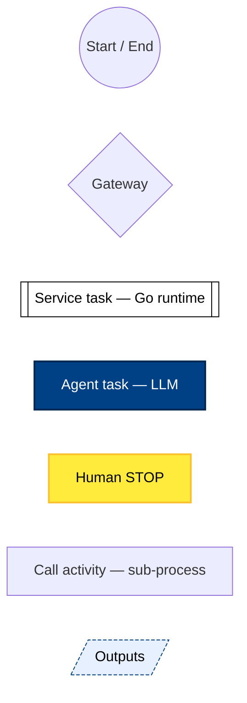

## Runtime Bootstrap (legacy entry — collapses in Phase D)

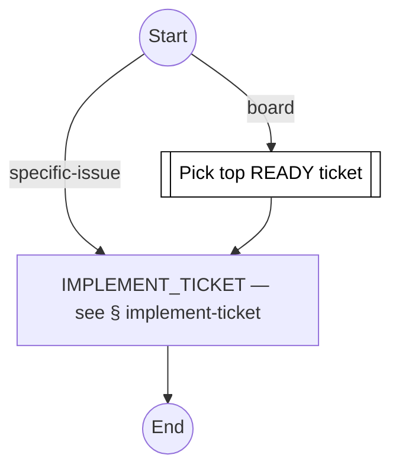

## refine-ticket

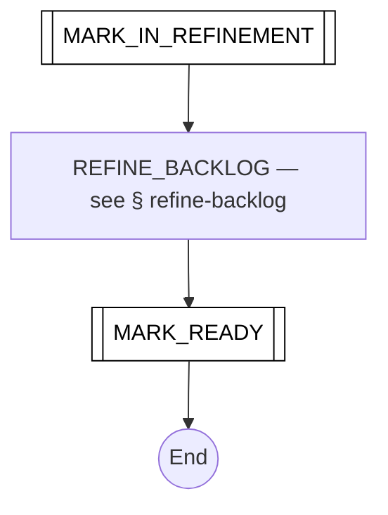

## implement-ticket

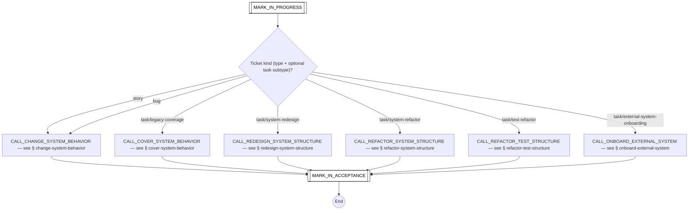

## refactor

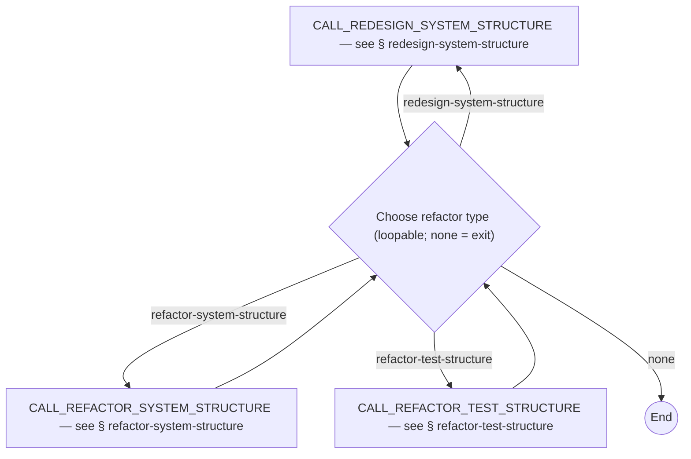

## refine-backlog

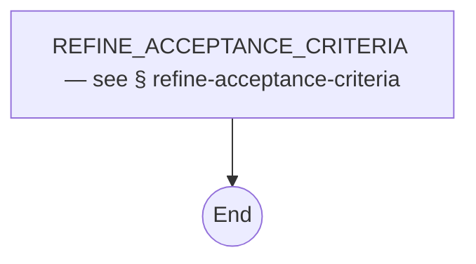

## onboard-external-system

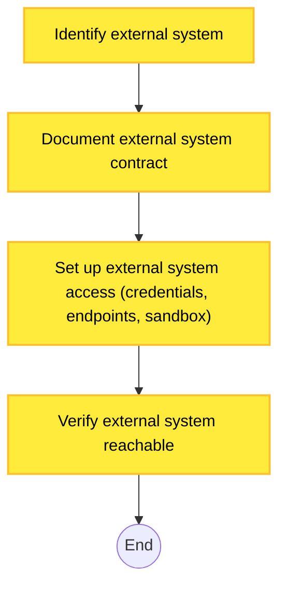

## change-system-behavior

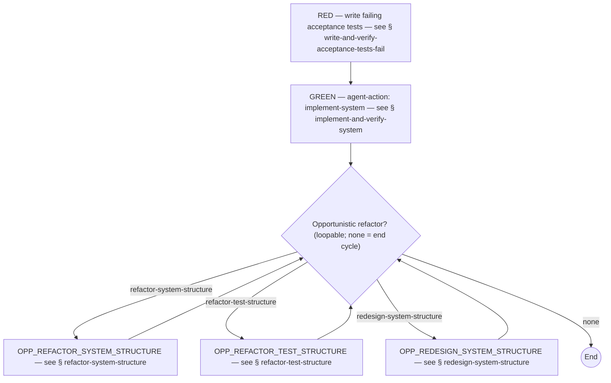

## cover-system-behavior

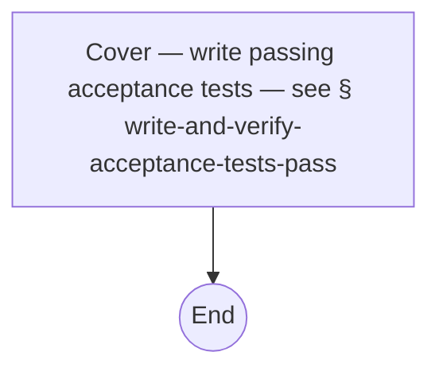

## redesign-system-structure

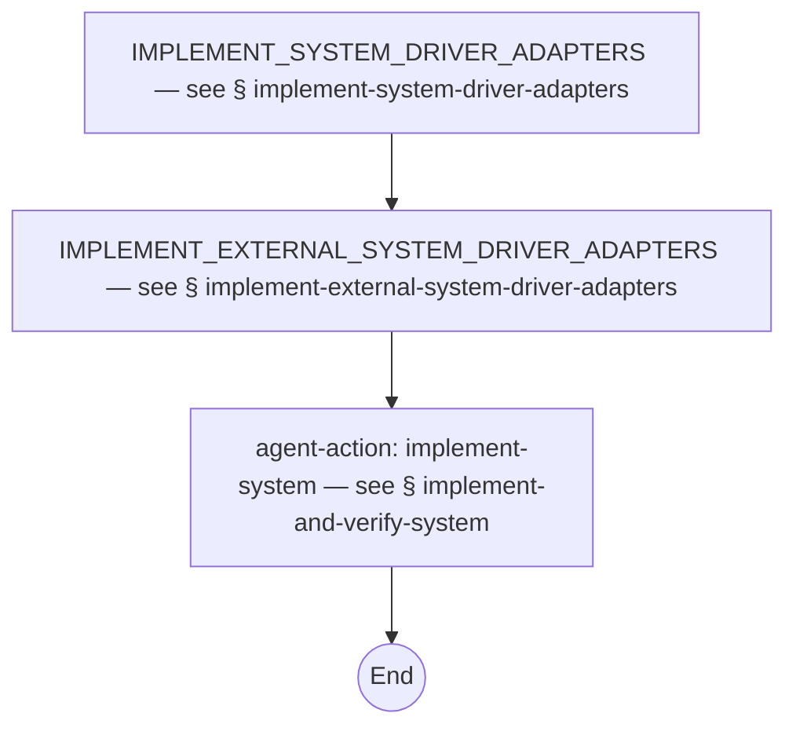

## refactor-system-structure

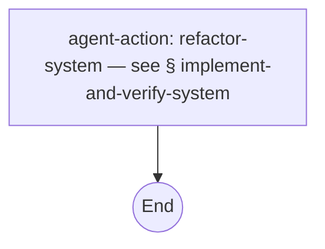

## refactor-test-structure

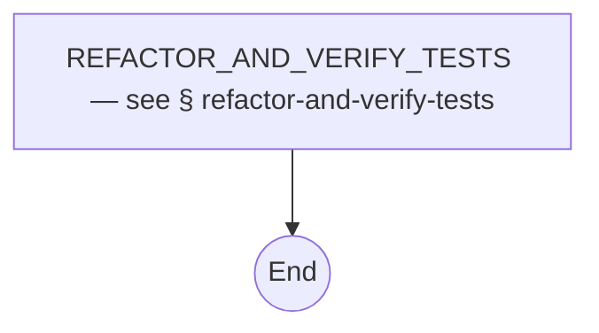

## write-and-verify-acceptance-tests-fail

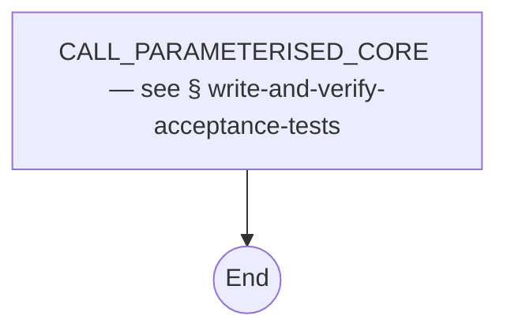

## write-and-verify-acceptance-tests-pass


## write-and-verify-acceptance-tests

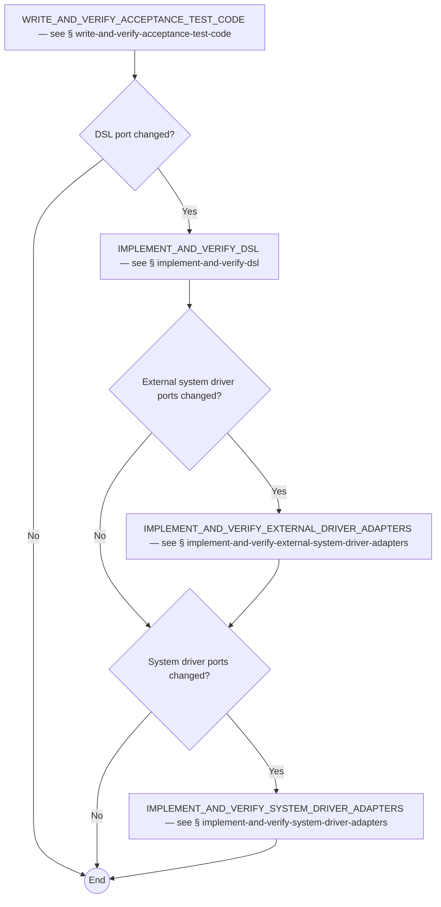

## write-and-verify-acceptance-test-code

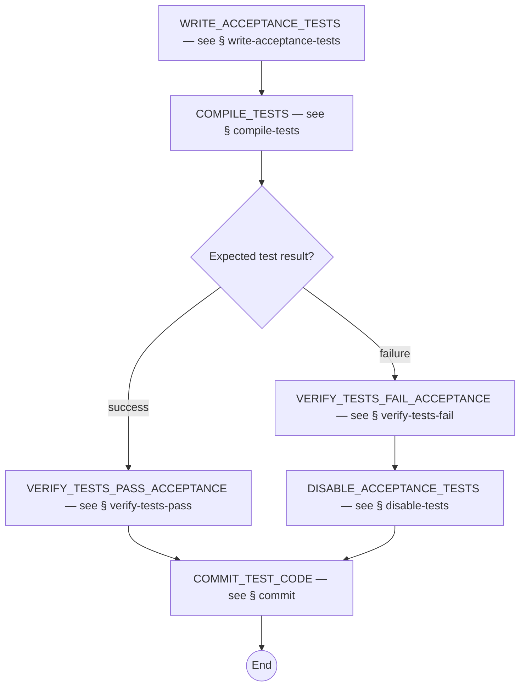

## implement-and-verify-dsl

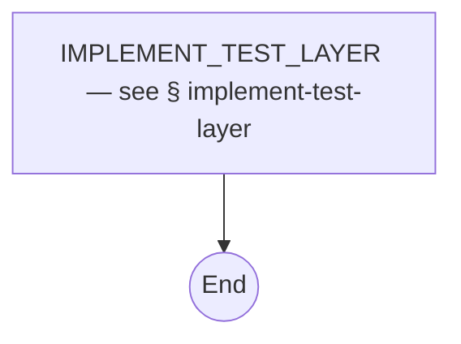

## implement-and-verify-system-driver-adapters


## implement-and-verify-external-system-driver-adapters


## implement-and-verify-external-system-driver-adapters-contract-tests

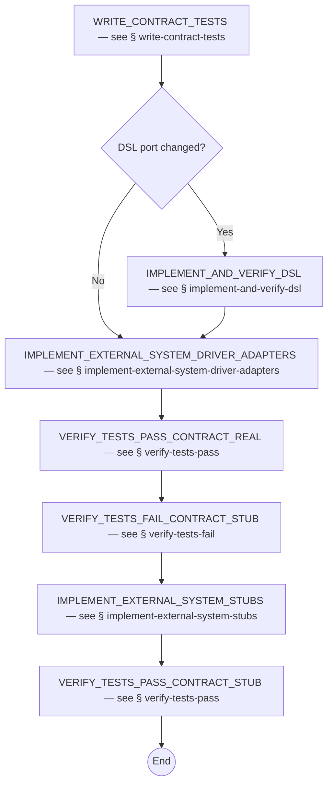

## implement-and-verify-system

```mermaid
flowchart TD
    BUILD_SYSTEM[BUILD_SYSTEM — see § build-system]
    CALL_AGENT_ACTION["agent-action: ${agent-action} — see § ${agent-action}"]
    COMMIT_SYSTEM[COMMIT_SYSTEM — see § commit]
    IMPL_AND_VERIFY_SYSTEM_END((End))
    START_SYSTEM[START_SYSTEM — see § start-system]
    VERIFY_TESTS_PASS[VERIFY_TESTS_PASS — see § verify-tests-pass]

    CALL_AGENT_ACTION --> BUILD_SYSTEM
    BUILD_SYSTEM --> START_SYSTEM
    START_SYSTEM --> VERIFY_TESTS_PASS
    VERIFY_TESTS_PASS --> COMMIT_SYSTEM
    COMMIT_SYSTEM --> IMPL_AND_VERIFY_SYSTEM_END
```

## refactor-and-verify-tests

```mermaid
flowchart TD
    COMMIT_TESTS[COMMIT_TESTS — see § commit]
    COMPILE_TESTS[COMPILE_TESTS — see § compile-tests]
    REFACTOR_AND_VERIFY_TESTS_END((End))
    REFACTOR_TESTS[REFACTOR_TESTS — see § refactor-tests]
    VERIFY_TESTS_PASS[VERIFY_TESTS_PASS — see § verify-tests-pass]

    REFACTOR_TESTS --> COMPILE_TESTS
    COMPILE_TESTS --> VERIFY_TESTS_PASS
    VERIFY_TESTS_PASS --> COMMIT_TESTS
    COMMIT_TESTS --> REFACTOR_AND_VERIFY_TESTS_END
```

## implement-test-layer

```mermaid
flowchart TD
    CALL_AGENT_ACTION["agent-action: ${agent-action} — see § ${agent-action}"]
    COMMIT_LAYER[COMMIT_LAYER — see § commit]
    COMPILE_TESTS[COMPILE_TESTS — see § compile-tests]
    DISABLE_TESTS[DISABLE_TESTS — see § disable-tests]
    ENABLE_TESTS[ENABLE_TESTS — see § enable-tests]
    GATE_EXPECTED_TEST_RESULT{Expected test result?}
    IMPLEMENT_TEST_LAYER_END((End))
    VERIFY_TESTS_FAIL_FILTERED[VERIFY_TESTS_FAIL_FILTERED — see § verify-tests-fail]
    VERIFY_TESTS_PASS_FILTERED[VERIFY_TESTS_PASS_FILTERED — see § verify-tests-pass]

    CALL_AGENT_ACTION --> ENABLE_TESTS
    ENABLE_TESTS --> COMPILE_TESTS
    COMPILE_TESTS --> GATE_EXPECTED_TEST_RESULT
    GATE_EXPECTED_TEST_RESULT -- success --> VERIFY_TESTS_PASS_FILTERED
    GATE_EXPECTED_TEST_RESULT -- failure --> VERIFY_TESTS_FAIL_FILTERED
    VERIFY_TESTS_PASS_FILTERED --> COMMIT_LAYER
    VERIFY_TESTS_FAIL_FILTERED --> DISABLE_TESTS
    DISABLE_TESTS --> COMMIT_LAYER
    COMMIT_LAYER --> IMPLEMENT_TEST_LAYER_END
```

## verify-tests-pass

```mermaid
flowchart TD
    FIX_UNEXPECTED_FAILING_TESTS[FIX_UNEXPECTED_FAILING_TESTS — see § fix-unexpected-failing-tests]
    GATE_TESTS_OUTCOME{All tests passed?}
    RUN_TESTS[RUN_TESTS — see § run-tests]
    VERIFY_PASS_END((End))

    RUN_TESTS --> GATE_TESTS_OUTCOME
    GATE_TESTS_OUTCOME -- pass --> VERIFY_PASS_END
    GATE_TESTS_OUTCOME -- fail --> FIX_UNEXPECTED_FAILING_TESTS
    FIX_UNEXPECTED_FAILING_TESTS --> VERIFY_PASS_END
```

## verify-tests-fail

```mermaid
flowchart TD
    FIX_UNEXPECTED_PASSING_TESTS[FIX_UNEXPECTED_PASSING_TESTS — see § fix-unexpected-passing-tests]
    GATE_TESTS_OUTCOME{Any tests passed?}
    RUN_TESTS[RUN_TESTS — see § run-tests]
    VERIFY_FAIL_END((End))

    RUN_TESTS --> GATE_TESTS_OUTCOME
    GATE_TESTS_OUTCOME -- pass --> FIX_UNEXPECTED_PASSING_TESTS
    GATE_TESTS_OUTCOME -- fail --> VERIFY_FAIL_END
    FIX_UNEXPECTED_PASSING_TESTS --> VERIFY_FAIL_END
```

## write-acceptance-tests

```mermaid
flowchart TD
    EXECUTE_AGENT[EXECUTE_AGENT — see § execute-agent]
    WAT_END((End))

    EXECUTE_AGENT --> WAT_END
```

## write-contract-tests

```mermaid
flowchart TD
    EXECUTE_AGENT[EXECUTE_AGENT — see § execute-agent]
    WCT_END((End))

    EXECUTE_AGENT --> WCT_END
```

## implement-dsl

```mermaid
flowchart TD
    EXECUTE_AGENT[EXECUTE_AGENT — see § execute-agent]
    IMPL_DSL_END((End))

    EXECUTE_AGENT --> IMPL_DSL_END
```

## implement-system

```mermaid
flowchart TD
    EXECUTE_AGENT[EXECUTE_AGENT — see § execute-agent]
    IMPL_SYS_END((End))

    EXECUTE_AGENT --> IMPL_SYS_END
```

## implement-system-driver-adapters

```mermaid
flowchart TD
    EXECUTE_AGENT[EXECUTE_AGENT — see § execute-agent]
    IMPL_SYS_DA_END((End))

    EXECUTE_AGENT --> IMPL_SYS_DA_END
```

## implement-external-system-driver-adapters

```mermaid
flowchart TD
    EXECUTE_AGENT[EXECUTE_AGENT — see § execute-agent]
    IMPL_EXT_DA_END((End))

    EXECUTE_AGENT --> IMPL_EXT_DA_END
```

## implement-external-system-stubs

```mermaid
flowchart TD
    EXECUTE_AGENT[EXECUTE_AGENT — see § execute-agent]
    IMPL_STUBS_END((End))

    EXECUTE_AGENT --> IMPL_STUBS_END
```

## disable-tests

```mermaid
flowchart TD
    DISABLE_END((End))
    EXECUTE_AGENT[EXECUTE_AGENT — see § execute-agent]

    EXECUTE_AGENT --> DISABLE_END
```

## enable-tests

```mermaid
flowchart TD
    ENABLE_END((End))
    EXECUTE_AGENT[EXECUTE_AGENT — see § execute-agent]

    EXECUTE_AGENT --> ENABLE_END
```

## fix-unexpected-passing-tests

```mermaid
flowchart TD
    EXECUTE_AGENT[EXECUTE_AGENT — see § execute-agent]
    FIX_PASS_END((End))

    EXECUTE_AGENT --> FIX_PASS_END
```

## fix-unexpected-failing-tests

```mermaid
flowchart TD
    EXECUTE_AGENT[EXECUTE_AGENT — see § execute-agent]
    FIX_FAIL_END((End))

    EXECUTE_AGENT --> FIX_FAIL_END
```

## refactor-tests

```mermaid
flowchart TD
    EXECUTE_AGENT[EXECUTE_AGENT — see § execute-agent]
    REFACTOR_TESTS_END((End))

    EXECUTE_AGENT --> REFACTOR_TESTS_END
```

## refactor-system

```mermaid
flowchart TD
    EXECUTE_AGENT[EXECUTE_AGENT — see § execute-agent]
    REFACTOR_SYS_END((End))

    EXECUTE_AGENT --> REFACTOR_SYS_END
```

## refine-acceptance-criteria

```mermaid
flowchart TD
    EXECUTE_AGENT[EXECUTE_AGENT — see § execute-agent]
    REFINE_AC_END((End))

    EXECUTE_AGENT --> REFINE_AC_END
```

## compile

```mermaid
flowchart TD
    COMPILE_MID_END((End))
    EXECUTE_COMMAND[EXECUTE_COMMAND — see § execute-command]

    EXECUTE_COMMAND --> COMPILE_MID_END
```

## compile-system

```mermaid
flowchart TD
    COMPILE_SYS_END((End))
    EXECUTE_COMMAND[EXECUTE_COMMAND — see § execute-command]

    EXECUTE_COMMAND --> COMPILE_SYS_END
```

## compile-tests

```mermaid
flowchart TD
    COMPILE_TESTS_END((End))
    EXECUTE_COMMAND[EXECUTE_COMMAND — see § execute-command]

    EXECUTE_COMMAND --> COMPILE_TESTS_END
```

## build-system

```mermaid
flowchart TD
    BUILD_SYS_END((End))
    EXECUTE_COMMAND[EXECUTE_COMMAND — see § execute-command]

    EXECUTE_COMMAND --> BUILD_SYS_END
```

## start-system

```mermaid
flowchart TD
    EXECUTE_COMMAND[EXECUTE_COMMAND — see § execute-command]
    START_SYS_END((End))

    EXECUTE_COMMAND --> START_SYS_END
```

## commit

```mermaid
flowchart TD
    COMMIT_MID_END((End))
    EXECUTE_COMMAND[EXECUTE_COMMAND — see § execute-command]

    EXECUTE_COMMAND --> COMMIT_MID_END
```

## run-tests

```mermaid
flowchart TD
    EXECUTE_COMMAND[EXECUTE_COMMAND — see § execute-command]
    RUN_TESTS_END((End))

    EXECUTE_COMMAND --> RUN_TESTS_END
```

## approve

```mermaid
flowchart TD
    APPROVE_OK_END((End))
    APPROVE_REJECT_END((End))
    ASK_HUMAN["${question}"]
    GATE_APPROVED{Approved?}

    ASK_HUMAN --> GATE_APPROVED
    GATE_APPROVED -- approved --> APPROVE_OK_END
    GATE_APPROVED -- rejected --> APPROVE_REJECT_END

    classDef humanNode fill:#ffeb3b,stroke:#fbc02d,stroke-width:2px,color:#000000
    class ASK_HUMAN humanNode
```

## execute-agent

```mermaid
flowchart TD
    APPROVE_POST[APPROVE_POST — see § approve]
    APPROVE_PRE[APPROVE_PRE — see § approve]
    CALL_FIX[CALL_FIX — see § fix]
    EXECUTE_AGENT_END((End))
    GATE_FIX_ON_FAILURE{Fix on failure?}
    GATE_OUTPUTS_AND_SCOPES_VALID{"Outputs & scopes valid?"}
    RUN_AGENT["Run agent ${task-name}"]
    VALIDATE_OUTPUTS_AND_SCOPES[["Validate outputs (${outputs}) & scopes (${scopes})"]]

    APPROVE_PRE --> RUN_AGENT
    RUN_AGENT --> VALIDATE_OUTPUTS_AND_SCOPES
    VALIDATE_OUTPUTS_AND_SCOPES --> GATE_OUTPUTS_AND_SCOPES_VALID
    GATE_OUTPUTS_AND_SCOPES_VALID -- Yes --> APPROVE_POST
    GATE_OUTPUTS_AND_SCOPES_VALID -- No --> GATE_FIX_ON_FAILURE
    GATE_FIX_ON_FAILURE -- Yes --> CALL_FIX
    GATE_FIX_ON_FAILURE -- No --> APPROVE_POST
    CALL_FIX --> APPROVE_POST
    APPROVE_POST --> EXECUTE_AGENT_END

    classDef serviceNode fill:#ffffff,stroke:#000000,stroke-width:1px,color:#000000
    class VALIDATE_OUTPUTS_AND_SCOPES serviceNode

    classDef agentNode fill:#004085,stroke:#002752,stroke-width:2px,color:#ffffff
    class RUN_AGENT agentNode
```

## execute-command

```mermaid
flowchart TD
    APPROVE_PRE[APPROVE_PRE — see § approve]
    CALL_FIX[CALL_FIX — see § fix]
    EXECUTE_COMMAND_END((End))
    GATE_COMMAND_SUCCEEDED{Command succeeded?}
    RUN_COMMAND[["Run command ${command}"]]

    APPROVE_PRE --> RUN_COMMAND
    RUN_COMMAND --> GATE_COMMAND_SUCCEEDED
    GATE_COMMAND_SUCCEEDED -- Yes --> EXECUTE_COMMAND_END
    GATE_COMMAND_SUCCEEDED -- No --> CALL_FIX
    CALL_FIX --> EXECUTE_COMMAND_END

    classDef serviceNode fill:#ffffff,stroke:#000000,stroke-width:1px,color:#000000
    class RUN_COMMAND serviceNode
```

## fix

```mermaid
flowchart TD
    APPROVE_PRE[APPROVE_PRE — see § approve]
    EXECUTE_AGENT[EXECUTE_AGENT — see § execute-agent]
    FIX_END((End))

    APPROVE_PRE --> EXECUTE_AGENT
    EXECUTE_AGENT --> FIX_END
```

