# ATDD Process Flow

> Generated from `internal/atdd/runtime/statemachine/process-flow.yaml` by `internal/atdd/runtime/diagram`. Do not edit by hand — edit the YAML and regenerate via `gh optivem process show > docs/process-diagram.md`.

Each section corresponds to one named process in the YAML. `call_activity` nodes appear as boxes pointing at the linked sub-process's heading.

## Legend

Node **shape** encodes the BPMN type; **fill color** encodes the executor.

- `((circle))` — start / end event
- `{diamond}` — gateway (decision)
- `[[subroutine]]` — service task — mechanical step run by the Go runtime (white)
- `[rectangle]` — user task — LLM agent (dark blue) or human STOP (yellow); `call_activity` rectangles are unfilled and link to a sub-process heading
- `[/skewed/]` — published outputs of a process (dashed border)

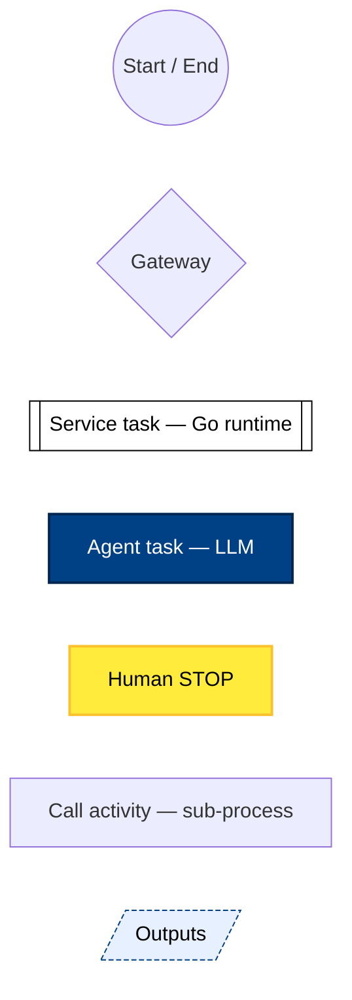

## Ticket Lifecycle

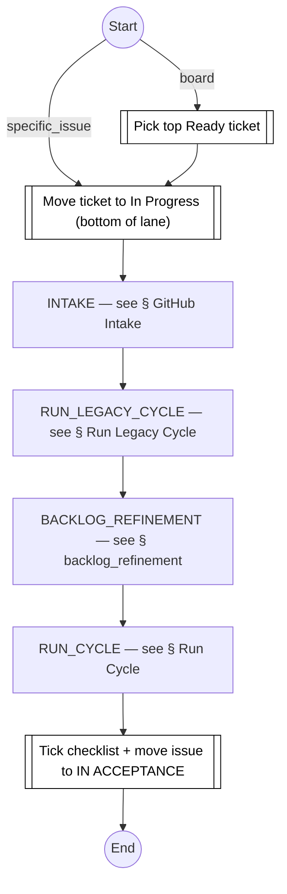

## GitHub Intake

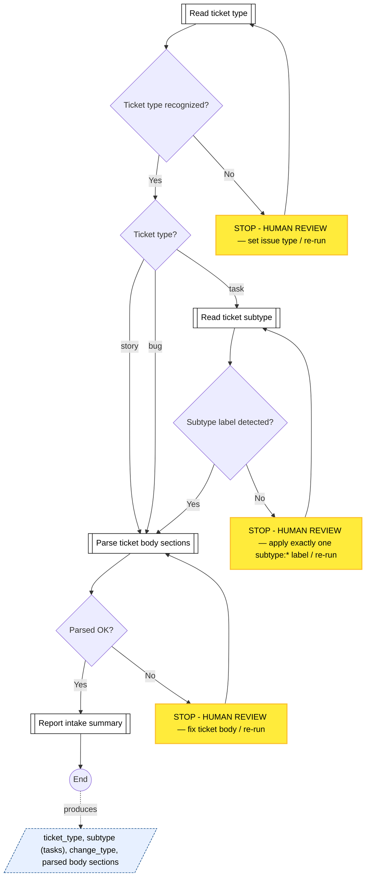

## Run Legacy Cycle

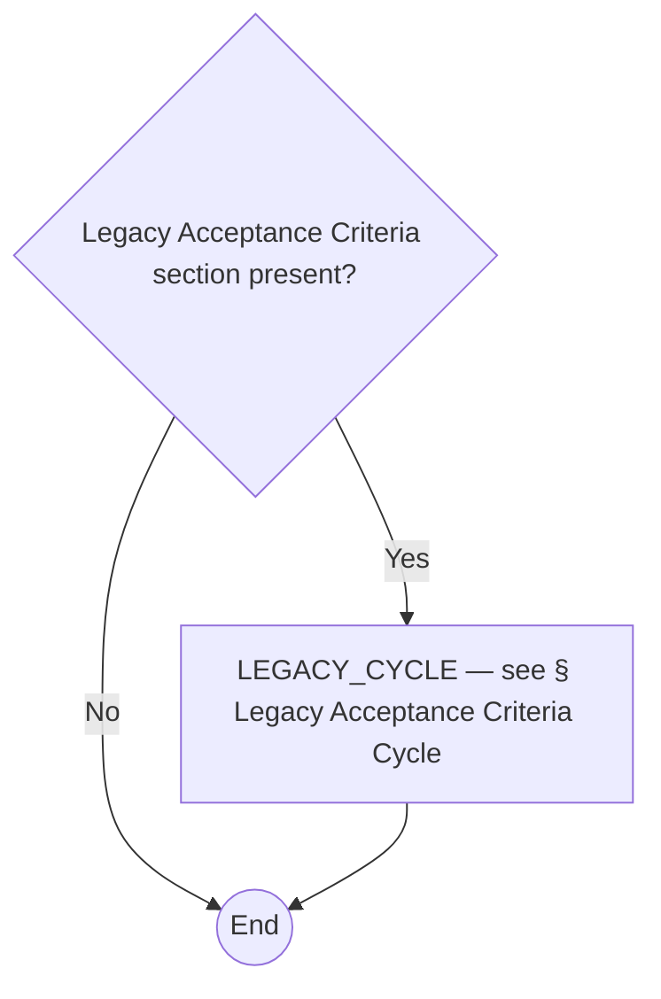

## Run Cycle

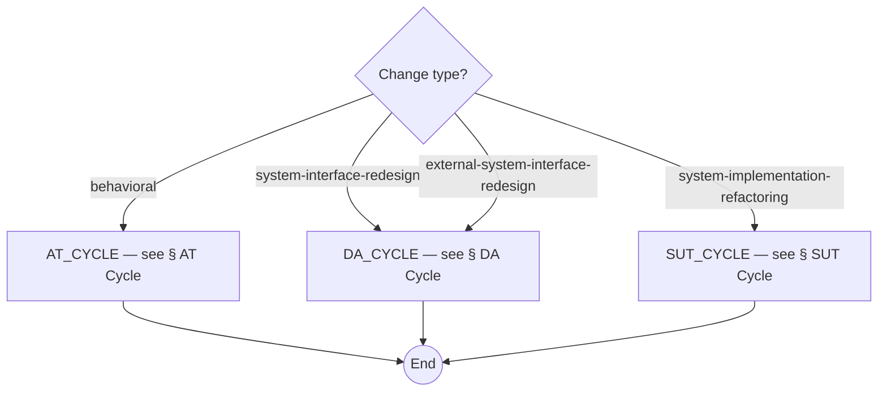

## AT Cycle

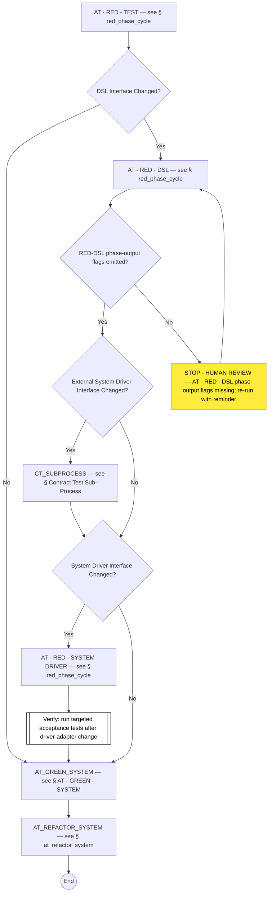

## AT - GREEN - SYSTEM

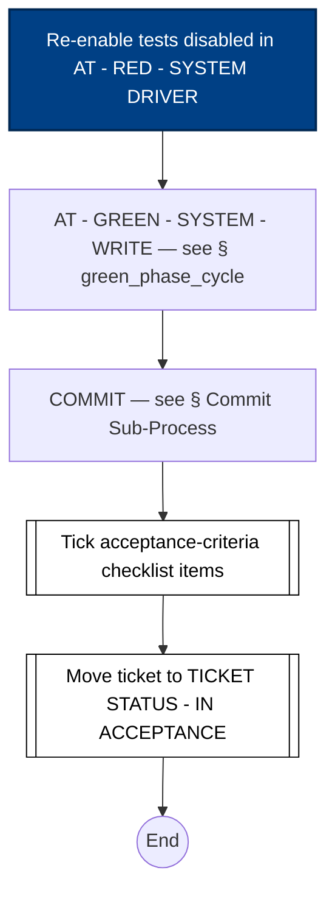

## Contract Test Sub-Process

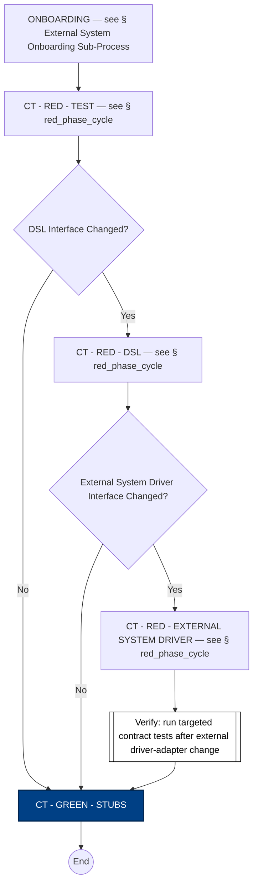

## External System Onboarding Sub-Process

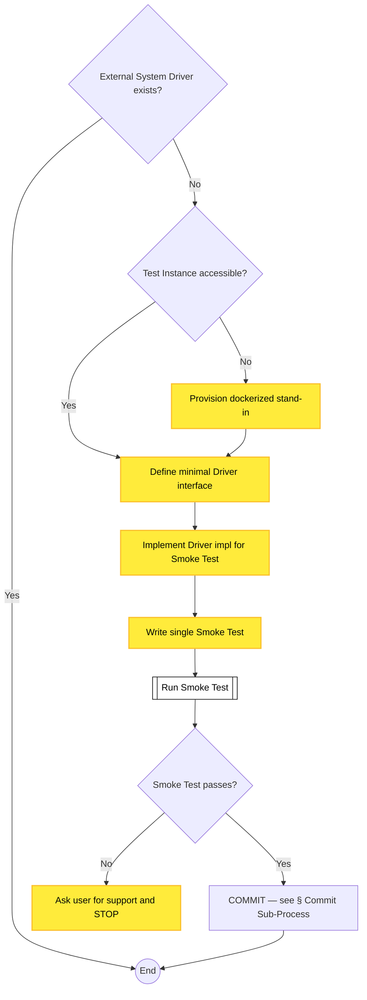

## Structural Cycle (shared)

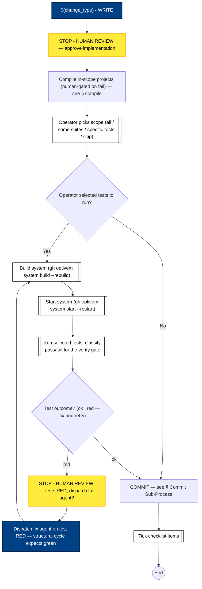

## Commit Sub-Process

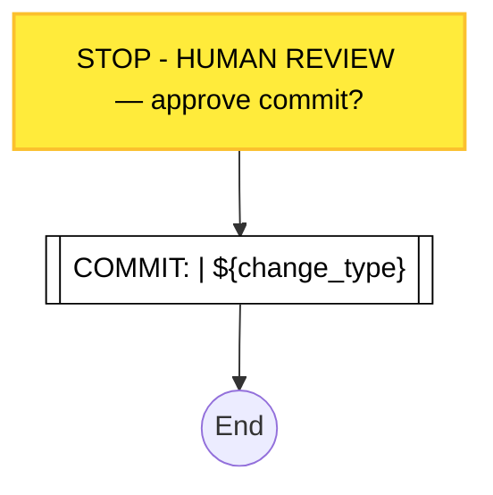

## Legacy Acceptance Criteria Cycle

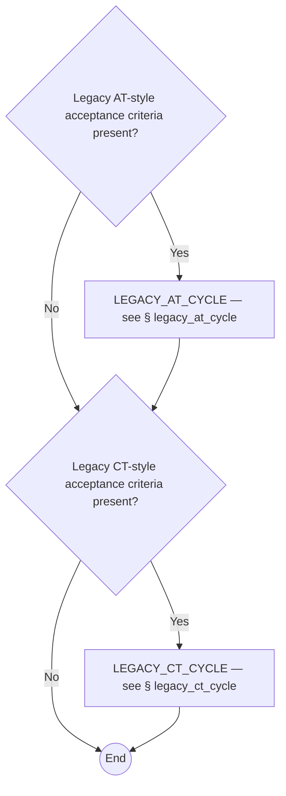

## at_refactor_system

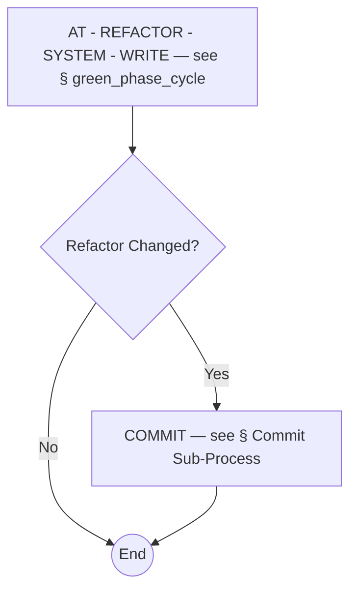

## backlog_refinement

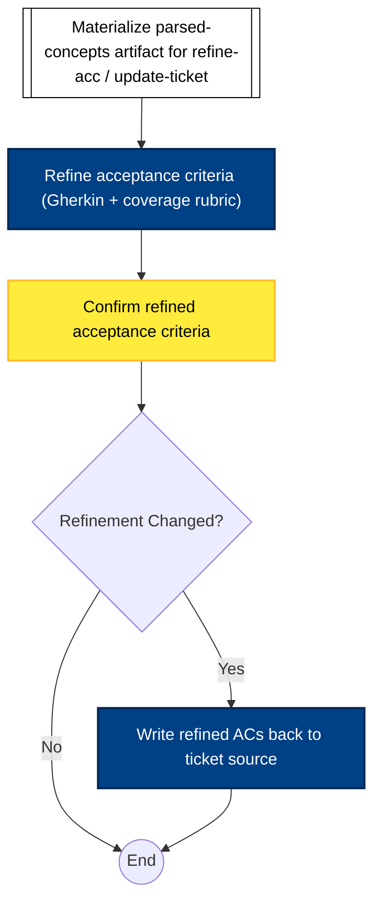

## compile

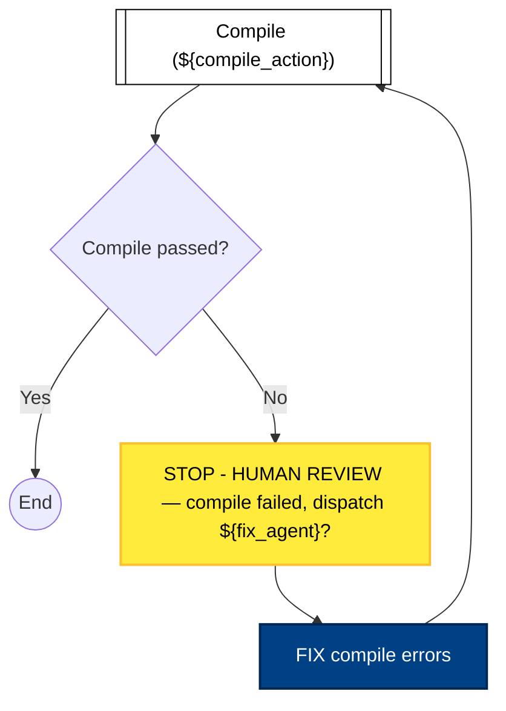

## DA Cycle

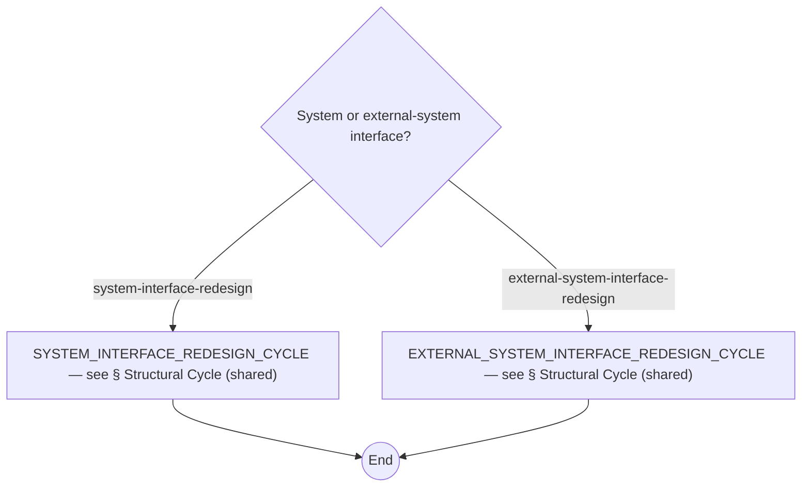

## green_phase_cycle

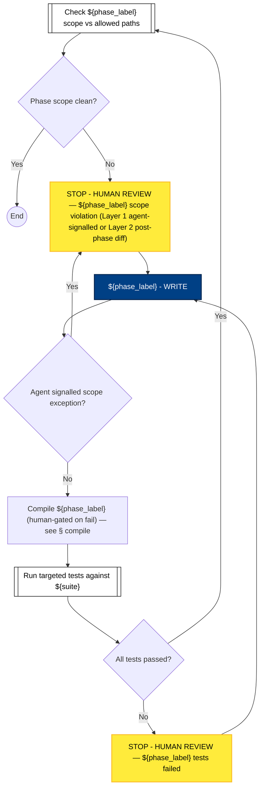

## legacy_at_cycle

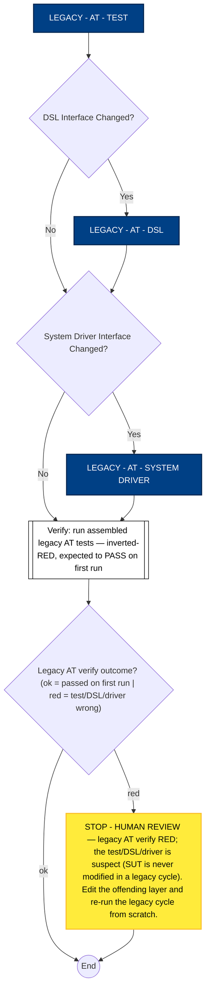

## legacy_ct_cycle

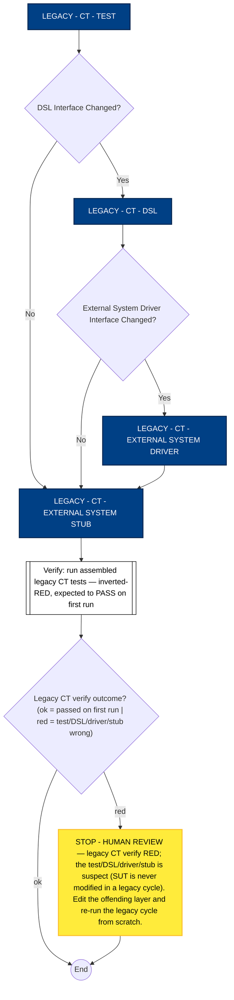

## red_phase_cycle

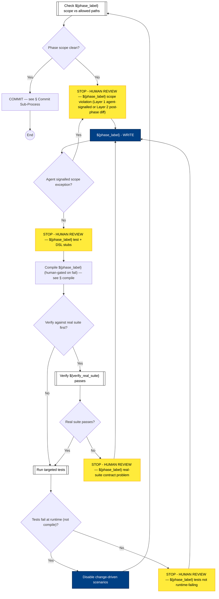

## SUT Cycle

```mermaid
flowchart TD
    SUT_END((End))
    SYSTEM_IMPLEMENTATION_REFACTORING_CYCLE["SYSTEM_IMPLEMENTATION_REFACTORING_CYCLE — see § Structural Cycle (shared)"]

    SYSTEM_IMPLEMENTATION_REFACTORING_CYCLE --> SUT_END
```

