# ATDD Process Flow

> Generated from `internal/atdd/runtime/statemachine/process-flow.yaml` by `internal/atdd/runtime/diagram`. Do not edit by hand — edit the YAML and regenerate via `gh optivem process show > docs/process-diagram.md`.

Each section corresponds to one named process in the YAML. `call-activity` nodes appear as boxes pointing at the linked sub-process's heading.

## Legend

Node **shape** encodes the BPMN type; **fill color** encodes the executor; **border color** (orthogonal) encodes the TDD stage where the author marked one.

- `(( ))` — start / end event (BPMN plain start or end; empty circle, descriptive name lives in the YAML). Start vs end is read from position in the flow — start has no incoming edge, end has no outgoing edge.
- `((⚡))` — error end event (BPMN exceptional exit; red border). Two flavors: **Unknown** (defensive guard — an unhandled gateway branch fired; should never happen at runtime) and **Rejected** (hard-abort — a runtime condition that intentionally halts the run, e.g. agent output rejected post-approve). The descriptive name is in the YAML source; the diagram keeps the icon small.
- `{diamond}` — gateway (decision)
- `[[subroutine]]` — service task — mechanical, automated step (white)
- `[rectangle]` — user task — LLM agent (dark blue) or human (yellow); `call_activity` rectangles are unfilled and link to a sub-process heading
- `[/skewed/]` — published outputs of a process (dashed border)
- **TDD-stage border** — red = RED (failing test), green = GREEN (test passes), blue = REFACTOR (improve without changing behaviour). Only applied where the call site explicitly plays that role.

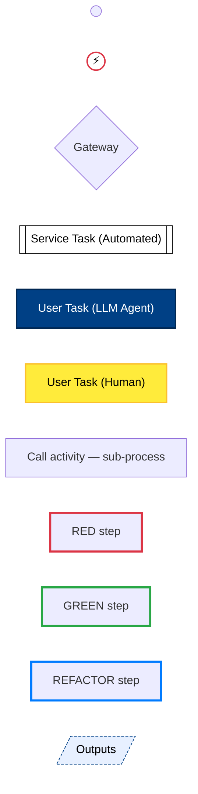

## Main

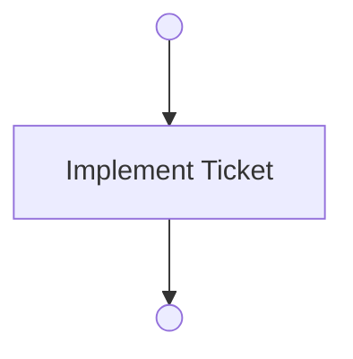

## Refine Ticket

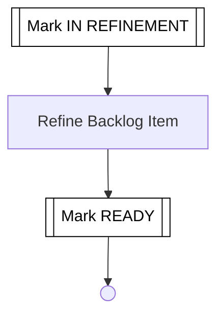

## Implement Ticket

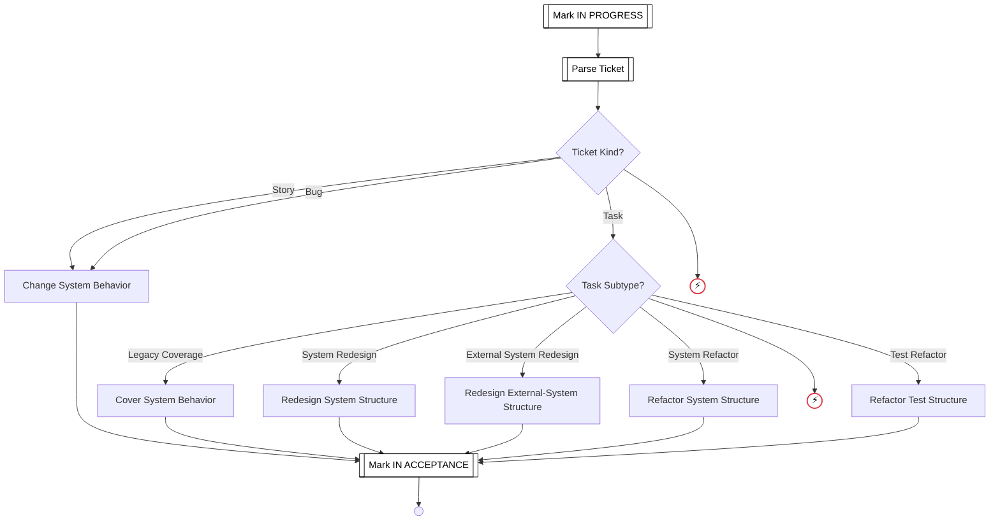

## Refactor


## Refine Backlog Item

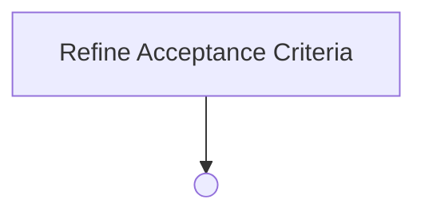

## Change System Behavior

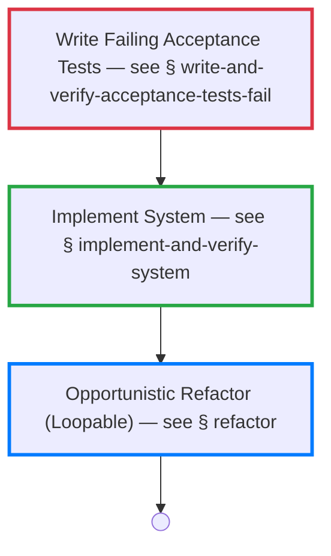

## Cover System Behavior

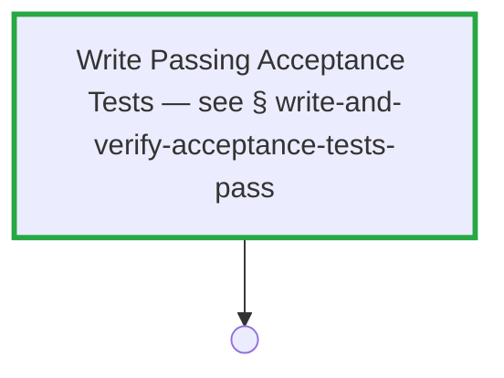

## Redesign System Structure

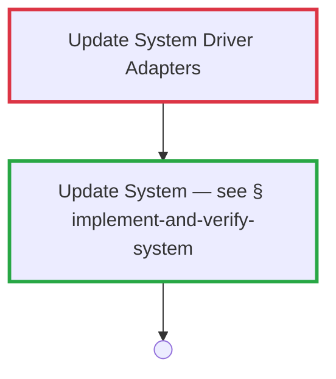

## Refactor System Structure

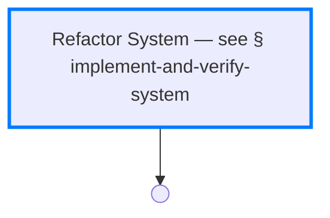

## Refactor Test Structure

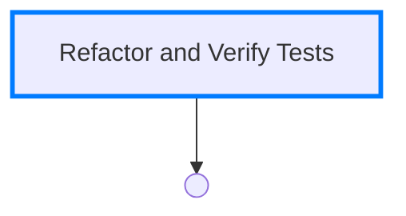

## Write and Verify Acceptance Tests Fail

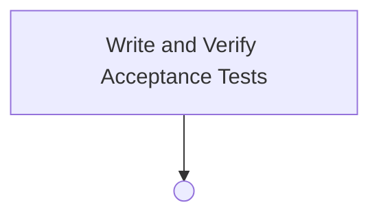

## Write and Verify Acceptance Tests Pass


## Write and Verify Acceptance Tests

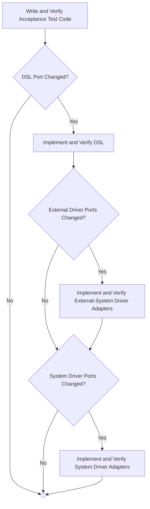

## Write and Verify Acceptance Test Code

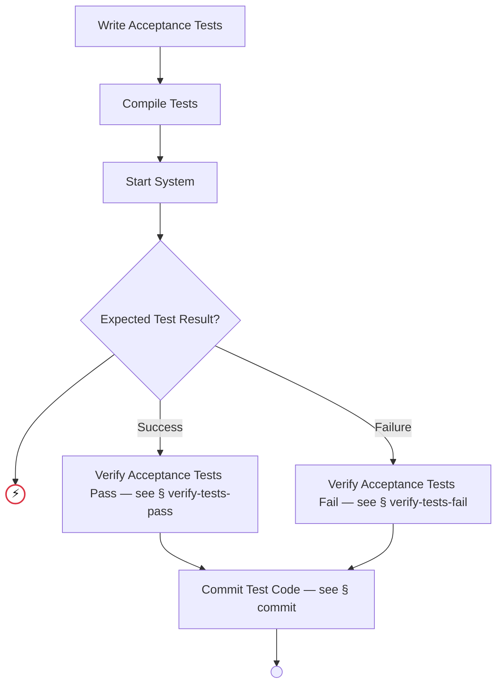

## Implement and Verify DSL

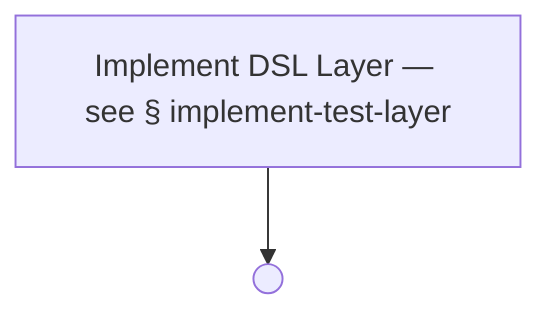

## Implement and Verify System Driver Adapters

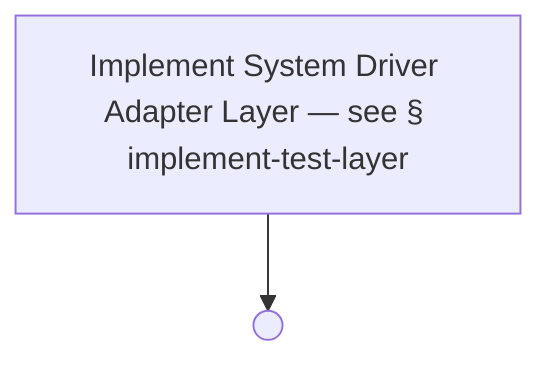

## Implement and Verify External-System Driver Adapters

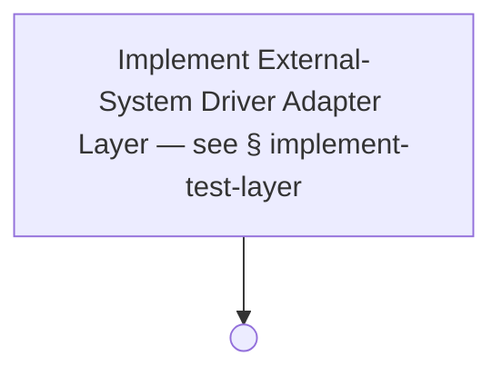

## Implement and Verify External-System Driver Adapters Contract Tests

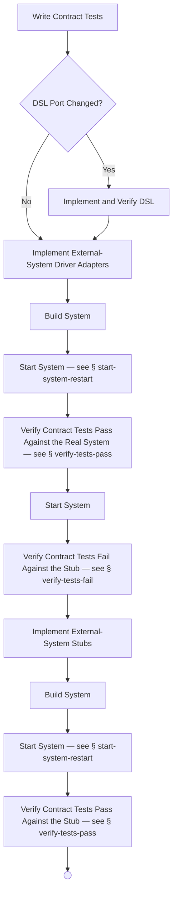

## Implement and Verify System

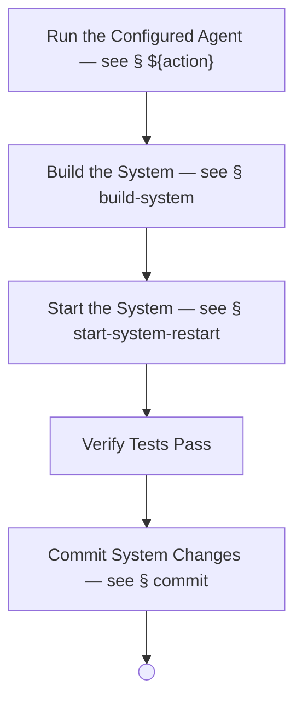

## Refactor and Verify Tests

```mermaid
flowchart TD
    COMMIT_TESTS[Commit Test Changes — see § commit]
    COMPILE_TESTS[Compile Tests]
    REFACTOR_AND_VERIFY_TESTS_END(( ))
    REFACTOR_TESTS[Refactor Tests]
    START_SYSTEM[Start System]
    VERIFY_TESTS_PASS[Verify Tests Pass]

    REFACTOR_TESTS --> COMPILE_TESTS
    COMPILE_TESTS --> START_SYSTEM
    START_SYSTEM --> VERIFY_TESTS_PASS
    VERIFY_TESTS_PASS --> COMMIT_TESTS
    COMMIT_TESTS --> REFACTOR_AND_VERIFY_TESTS_END
```

## Implement Test Layer

```mermaid
flowchart TD
    COMMIT_LAYER[Commit Layer Changes — see § commit]
    COMPILE_TESTS[Compile Tests]
    GATE_EXPECTED_TEST_RESULT{Expected Test Result?}
    IMPLEMENT_TEST_LAYER_END(( ))
    RUN_ACTION["Run the Configured Agent — see § ${action}"]
    START_SYSTEM[Start System]
    UNKNOWN_EXPECTED_TEST_RESULT((⚡))
    VERIFY_TESTS_FAIL_FILTERED[Verify Tests Fail]
    VERIFY_TESTS_PASS_FILTERED[Verify Tests Pass]

    RUN_ACTION --> COMPILE_TESTS
    COMPILE_TESTS --> START_SYSTEM
    START_SYSTEM --> GATE_EXPECTED_TEST_RESULT
    GATE_EXPECTED_TEST_RESULT -- Success --> VERIFY_TESTS_PASS_FILTERED
    GATE_EXPECTED_TEST_RESULT -- Failure --> VERIFY_TESTS_FAIL_FILTERED
    GATE_EXPECTED_TEST_RESULT --> UNKNOWN_EXPECTED_TEST_RESULT
    VERIFY_TESTS_PASS_FILTERED --> COMMIT_LAYER
    VERIFY_TESTS_FAIL_FILTERED --> COMMIT_LAYER
    COMMIT_LAYER --> IMPLEMENT_TEST_LAYER_END

    classDef errorEndNode fill:#ffffff,stroke:#dc3545,stroke-width:2px,color:#000000
    class UNKNOWN_EXPECTED_TEST_RESULT errorEndNode
```

## Verify Tests Pass

```mermaid
flowchart TD
    FIX_LOOP_EXHAUSTED((⚡))
    FIX_UNEXPECTED_FAILING_TESTS[Fix Unexpected Test Failures — see § fix-unexpected-failing-tests]
    GATE_TESTS_OUTCOME{Test Outcome?}
    RUN_TESTS[Run Tests]
    TESTS_INFRA_HALT((⚡))
    UNKNOWN_TESTS_OUTCOME((⚡))
    VERIFY_PASS_END(( ))

    RUN_TESTS --> GATE_TESTS_OUTCOME
    GATE_TESTS_OUTCOME -- Pass --> VERIFY_PASS_END
    GATE_TESTS_OUTCOME -- Fail --> FIX_UNEXPECTED_FAILING_TESTS
    GATE_TESTS_OUTCOME -- Infra --> TESTS_INFRA_HALT
    GATE_TESTS_OUTCOME --> UNKNOWN_TESTS_OUTCOME
    FIX_UNEXPECTED_FAILING_TESTS --> RUN_TESTS

    classDef errorEndNode fill:#ffffff,stroke:#dc3545,stroke-width:2px,color:#000000
    class FIX_LOOP_EXHAUSTED,TESTS_INFRA_HALT,UNKNOWN_TESTS_OUTCOME errorEndNode
```

## Verify Tests Fail

```mermaid
flowchart TD
    FIX_LOOP_EXHAUSTED((⚡))
    FIX_UNEXPECTED_PASSING_TESTS[Fix Unexpectedly Passing Tests — see § fix-unexpected-passing-tests]
    GATE_TESTS_OUTCOME{Test Outcome?}
    RUN_TESTS[Run Tests]
    TESTS_INFRA_HALT((⚡))
    UNKNOWN_TESTS_OUTCOME((⚡))
    VERIFY_FAIL_END(( ))

    RUN_TESTS --> GATE_TESTS_OUTCOME
    GATE_TESTS_OUTCOME -- Pass --> FIX_UNEXPECTED_PASSING_TESTS
    GATE_TESTS_OUTCOME -- Fail --> VERIFY_FAIL_END
    GATE_TESTS_OUTCOME -- Infra --> TESTS_INFRA_HALT
    GATE_TESTS_OUTCOME --> UNKNOWN_TESTS_OUTCOME
    FIX_UNEXPECTED_PASSING_TESTS --> RUN_TESTS

    classDef errorEndNode fill:#ffffff,stroke:#dc3545,stroke-width:2px,color:#000000
    class FIX_LOOP_EXHAUSTED,TESTS_INFRA_HALT,UNKNOWN_TESTS_OUTCOME errorEndNode
```

## Write Acceptance Tests

```mermaid
flowchart TD
    EXECUTE_AGENT[Dispatch the Agent — see § execute-agent]
    WAT_END(( ))

    EXECUTE_AGENT --> WAT_END
    WRITE-ACCEPTANCE-TESTS_OUTPUTS[/dsl-port-changed: bool, test-names?: string-list, scope-exception-files?: string-list, scope-exception-reason?: string/]
    WAT_END -. produces .-> WRITE-ACCEPTANCE-TESTS_OUTPUTS

    classDef outputNode fill:#e7f0ff,stroke:#004085,stroke-width:1px,stroke-dasharray:4 2,color:#000000
    class WRITE-ACCEPTANCE-TESTS_OUTPUTS outputNode
```

## Write Contract Tests

```mermaid
flowchart TD
    EXECUTE_AGENT[Dispatch the Agent — see § execute-agent]
    WCT_END(( ))

    EXECUTE_AGENT --> WCT_END
    WRITE-CONTRACT-TESTS_OUTPUTS[/dsl-port-changed: bool, test-names?: string-list, scope-exception-files?: string-list, scope-exception-reason?: string/]
    WCT_END -. produces .-> WRITE-CONTRACT-TESTS_OUTPUTS

    classDef outputNode fill:#e7f0ff,stroke:#004085,stroke-width:1px,stroke-dasharray:4 2,color:#000000
    class WRITE-CONTRACT-TESTS_OUTPUTS outputNode
```

## Implement DSL

```mermaid
flowchart TD
    EXECUTE_AGENT[Dispatch the Agent — see § execute-agent]
    IMPL_DSL_END(( ))

    EXECUTE_AGENT --> IMPL_DSL_END
    IMPLEMENT-DSL_OUTPUTS[/system-driver-port-changed: bool, external-driver-port-changed: bool, scope-exception-files?: string-list, scope-exception-reason?: string/]
    IMPL_DSL_END -. produces .-> IMPLEMENT-DSL_OUTPUTS

    classDef outputNode fill:#e7f0ff,stroke:#004085,stroke-width:1px,stroke-dasharray:4 2,color:#000000
    class IMPLEMENT-DSL_OUTPUTS outputNode
```

## Implement System

```mermaid
flowchart TD
    EXECUTE_AGENT[Dispatch the Agent — see § execute-agent]
    IMPL_SYS_END(( ))

    EXECUTE_AGENT --> IMPL_SYS_END
```

## Implement System Driver Adapters

```mermaid
flowchart TD
    EXECUTE_AGENT[Dispatch the Agent — see § execute-agent]
    IMPL_SYS_DA_END(( ))

    EXECUTE_AGENT --> IMPL_SYS_DA_END
```

## Implement External-System Driver Adapters

```mermaid
flowchart TD
    EXECUTE_AGENT[Dispatch the Agent — see § execute-agent]
    IMPL_EXT_DA_END(( ))

    EXECUTE_AGENT --> IMPL_EXT_DA_END
```

## Implement External-System Stubs

```mermaid
flowchart TD
    EXECUTE_AGENT[Dispatch the Agent — see § execute-agent]
    IMPL_STUBS_END(( ))

    EXECUTE_AGENT --> IMPL_STUBS_END
```

## Fix Unexpected Passing Tests

```mermaid
flowchart TD
    EXECUTE_AGENT[Dispatch the Agent — see § execute-agent]
    FIX_PASS_END(( ))

    EXECUTE_AGENT --> FIX_PASS_END
```

## Fix Unexpected Failing Tests

```mermaid
flowchart TD
    EXECUTE_AGENT[Dispatch the Agent — see § execute-agent]
    FIX_FAIL_END(( ))

    EXECUTE_AGENT --> FIX_FAIL_END
```

## Refactor Tests

```mermaid
flowchart TD
    EXECUTE_AGENT[Dispatch the Agent — see § execute-agent]
    REFACTOR_TESTS_END(( ))

    EXECUTE_AGENT --> REFACTOR_TESTS_END
```

## Refactor System

```mermaid
flowchart TD
    EXECUTE_AGENT[Dispatch the Agent — see § execute-agent]
    REFACTOR_SYS_END(( ))

    EXECUTE_AGENT --> REFACTOR_SYS_END
```

## Refine Acceptance Criteria

```mermaid
flowchart TD
    EXECUTE_AGENT[Dispatch the Agent — see § execute-agent]
    REFINE_AC_END(( ))

    EXECUTE_AGENT --> REFINE_AC_END
```

## Compile

```mermaid
flowchart TD
    COMPILE_MID_END(( ))
    EXECUTE_COMMAND[Dispatch the Command — see § execute-command]

    EXECUTE_COMMAND --> COMPILE_MID_END
```

## Compile System

```mermaid
flowchart TD
    COMPILE_SYS_END(( ))
    EXECUTE_COMMAND[Dispatch the Command — see § execute-command]

    EXECUTE_COMMAND --> COMPILE_SYS_END
```

## Compile Tests

```mermaid
flowchart TD
    COMPILE_TESTS_END(( ))
    EXECUTE_COMMAND[Dispatch the Command — see § execute-command]

    EXECUTE_COMMAND --> COMPILE_TESTS_END
```

## Build System

```mermaid
flowchart TD
    BUILD_SYS_END(( ))
    EXECUTE_COMMAND[Dispatch the Command — see § execute-command]

    EXECUTE_COMMAND --> BUILD_SYS_END
```

## Start System

```mermaid
flowchart TD
    EXECUTE_COMMAND[Dispatch the Command — see § execute-command]
    START_SYS_END(( ))

    EXECUTE_COMMAND --> START_SYS_END
```

## Commit

```mermaid
flowchart TD
    COMMIT_MID_END(( ))
    EXECUTE_COMMAND[Dispatch the Command — see § execute-command]

    EXECUTE_COMMAND --> COMMIT_MID_END
```

## Run Tests

```mermaid
flowchart TD
    EXECUTE_COMMAND[Dispatch the Command — see § execute-command]
    RUN_TESTS_END(( ))

    EXECUTE_COMMAND --> RUN_TESTS_END
```

## Approve

```mermaid
flowchart TD
    APPROVE_OK_END(( ))
    APPROVE_REJECT_END(( ))
    ASK_HUMAN["${question}"]
    GATE_APPROVED{Approval Outcome?}

    ASK_HUMAN --> GATE_APPROVED
    GATE_APPROVED -- Approved --> APPROVE_OK_END
    GATE_APPROVED -- Rejected --> APPROVE_REJECT_END

    classDef humanNode fill:#ffeb3b,stroke:#fbc02d,stroke-width:2px,color:#000000
    class ASK_HUMAN humanNode
```

## Execute Agent

```mermaid
flowchart TD
    APPROVE_POST[Confirm Approval — see § approve]
    APPROVE_PRE[Request Approval — see § approve]
    EXECUTE_AGENT_END(( ))
    EXECUTE_AGENT_OUTPUT_REJECTED_END((⚡))
    EXECUTE_AGENT_REJECTED_END(( ))
    FIX[Fix the Failure — see § fix]
    GATE_APPROVED_POST{Approval Outcome?}
    GATE_APPROVED_PRE{Approval Outcome?}
    GATE_FIX_ON_FAILURE{Fix on Failure Enabled?}
    GATE_OUTPUTS_AND_SCOPES_VALID{Outputs and Scopes Valid?}
    RUN_AGENT["Run agent ${agent} (task: ${task-name})"]
    SNAPSHOT_WORKING_TREE[["Snapshot working tree (per-phase baseline)"]]
    VALIDATE_OUTPUTS_AND_SCOPES[["Validate outputs & scopes"]]

    APPROVE_PRE --> GATE_APPROVED_PRE
    GATE_APPROVED_PRE -- Approved --> SNAPSHOT_WORKING_TREE
    GATE_APPROVED_PRE -- Rejected --> EXECUTE_AGENT_REJECTED_END
    SNAPSHOT_WORKING_TREE --> RUN_AGENT
    RUN_AGENT --> VALIDATE_OUTPUTS_AND_SCOPES
    VALIDATE_OUTPUTS_AND_SCOPES --> GATE_OUTPUTS_AND_SCOPES_VALID
    GATE_OUTPUTS_AND_SCOPES_VALID -- Yes --> APPROVE_POST
    GATE_OUTPUTS_AND_SCOPES_VALID -- No --> GATE_FIX_ON_FAILURE
    GATE_FIX_ON_FAILURE -- Yes --> FIX
    GATE_FIX_ON_FAILURE -- No --> APPROVE_POST
    FIX --> RUN_AGENT
    APPROVE_POST --> GATE_APPROVED_POST
    GATE_APPROVED_POST -- Approved --> EXECUTE_AGENT_END
    GATE_APPROVED_POST -- Rejected --> EXECUTE_AGENT_OUTPUT_REJECTED_END

    classDef serviceNode fill:#ffffff,stroke:#000000,stroke-width:1px,color:#000000
    class SNAPSHOT_WORKING_TREE,VALIDATE_OUTPUTS_AND_SCOPES serviceNode

    classDef agentNode fill:#004085,stroke:#002752,stroke-width:2px,color:#ffffff
    class RUN_AGENT agentNode

    classDef errorEndNode fill:#ffffff,stroke:#dc3545,stroke-width:2px,color:#000000
    class EXECUTE_AGENT_OUTPUT_REJECTED_END errorEndNode
```

## Execute Command

```mermaid
flowchart TD
    APPROVE_PRE[Request Approval — see § approve]
    EXECUTE_COMMAND_END(( ))
    EXECUTE_COMMAND_REJECTED_END(( ))
    FIX[Fix the Failure — see § fix]
    GATE_APPROVED_PRE{Approval Outcome?}
    GATE_COMMAND_SUCCEEDED{Command Succeeded?}
    GATE_FIX_ON_FAILURE{Fix on Failure Enabled?}
    RUN_COMMAND[["Run command ${command}"]]

    APPROVE_PRE --> GATE_APPROVED_PRE
    GATE_APPROVED_PRE -- Approved --> RUN_COMMAND
    GATE_APPROVED_PRE -- Rejected --> EXECUTE_COMMAND_REJECTED_END
    RUN_COMMAND --> GATE_COMMAND_SUCCEEDED
    GATE_COMMAND_SUCCEEDED -- Yes --> EXECUTE_COMMAND_END
    GATE_COMMAND_SUCCEEDED -- No --> GATE_FIX_ON_FAILURE
    GATE_FIX_ON_FAILURE -- Yes --> FIX
    GATE_FIX_ON_FAILURE -- No --> EXECUTE_COMMAND_END
    FIX --> RUN_COMMAND

    classDef serviceNode fill:#ffffff,stroke:#000000,stroke-width:1px,color:#000000
    class RUN_COMMAND serviceNode
```

## Fix

```mermaid
flowchart TD
    APPROVE_PRE[Request Approval — see § approve]
    EXECUTE_AGENT[Dispatch the Agent — see § execute-agent]
    FIX_END(( ))
    FIX_REJECTED_END(( ))
    GATE_APPROVED_PRE{Approval Outcome?}

    APPROVE_PRE --> GATE_APPROVED_PRE
    GATE_APPROVED_PRE -- Approved --> EXECUTE_AGENT
    GATE_APPROVED_PRE -- Rejected --> FIX_REJECTED_END
    EXECUTE_AGENT --> FIX_END
```

## Redesign External-System Structure

```mermaid
flowchart TD
    IMPLEMENT_AND_VERIFY_SYSTEM[Update System — see § implement-and-verify-system]
    REDESIGN_EXTERNAL_END(( ))
    UPDATE_EXTERNAL_SYSTEM_DRIVER_ADAPTERS[Update External-System Driver Adapters]

    UPDATE_EXTERNAL_SYSTEM_DRIVER_ADAPTERS --> IMPLEMENT_AND_VERIFY_SYSTEM
    IMPLEMENT_AND_VERIFY_SYSTEM --> REDESIGN_EXTERNAL_END

    classDef tddRedNode stroke:#dc3545,stroke-width:3px
    class UPDATE_EXTERNAL_SYSTEM_DRIVER_ADAPTERS tddRedNode

    classDef tddGreenNode stroke:#28a745,stroke-width:3px
    class IMPLEMENT_AND_VERIFY_SYSTEM tddGreenNode
```

## Start System (Restart)

```mermaid
flowchart TD
    EXECUTE_COMMAND[Dispatch the Command — see § execute-command]
    START_SYS_RESTART_END(( ))

    EXECUTE_COMMAND --> START_SYS_RESTART_END
```

## Update External-System Driver Adapters

```mermaid
flowchart TD
    EXECUTE_AGENT[Dispatch the Agent — see § execute-agent]
    UPDATE_EXT_DA_END(( ))

    EXECUTE_AGENT --> UPDATE_EXT_DA_END
```

## Update System

```mermaid
flowchart TD
    EXECUTE_AGENT[Dispatch the Agent — see § execute-agent]
    UPDATE_SYS_END(( ))

    EXECUTE_AGENT --> UPDATE_SYS_END
```

## Update System Driver Adapters

```mermaid
flowchart TD
    EXECUTE_AGENT[Dispatch the Agent — see § execute-agent]
    UPDATE_SYS_DA_END(( ))

    EXECUTE_AGENT --> UPDATE_SYS_DA_END
```

