# ATDD Process Flow

> Generated from `internal/atdd/process/process-flow.yaml` by `internal/atdd/runtime/diagram`. Do not edit by hand — edit the YAML and regenerate via `gh optivem process show > docs/process-diagram.md`.

Each section corresponds to one named process in the YAML. `call-activity` nodes appear as boxes pointing at the linked sub-process's heading.

## Legend

Node **shape** encodes the BPMN type; **fill color** encodes the executor; **border color** (orthogonal) encodes the TDD stage where the author marked one.

- `(( ))` — start / end event (BPMN plain start or end; empty circle, descriptive name lives in the YAML). Start vs end is read from position in the flow — start has no incoming edge, end has no outgoing edge.
- `((⚡))` — error end event (BPMN exceptional exit; red border). Two flavors: **Unknown** (defensive guard — an unhandled gateway branch fired; should never happen at runtime) and **Rejected** (hard-abort — a runtime condition that intentionally halts the run, e.g. agent output rejected post-approve). The descriptive name is in the YAML source; the diagram keeps the icon small.
- `{diamond}` — gateway (decision)
- `[[subroutine]]` — service task — mechanical, automated step (white)
- `[rectangle]` — user task — LLM agent (dark blue) or human (yellow); `call_activity` rectangles are unfilled and link to a sub-process heading
- `[/skewed/]` — published outputs of a process (dashed border)
- **TDD-stage border** — red = RED (failing test), green = GREEN (test passes), blue = REFACTOR (improve without changing behaviour). Only applied where the call site explicitly plays that role.

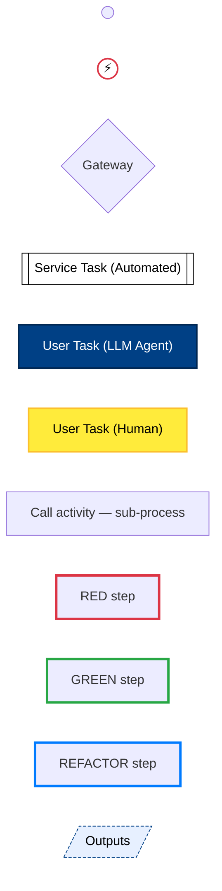

## Main

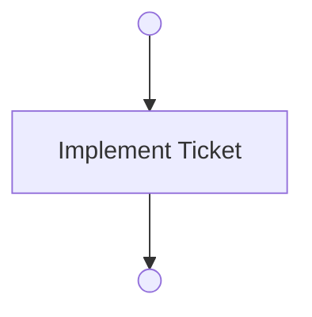

## Refine Ticket

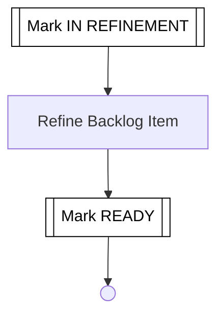

## Implement Ticket

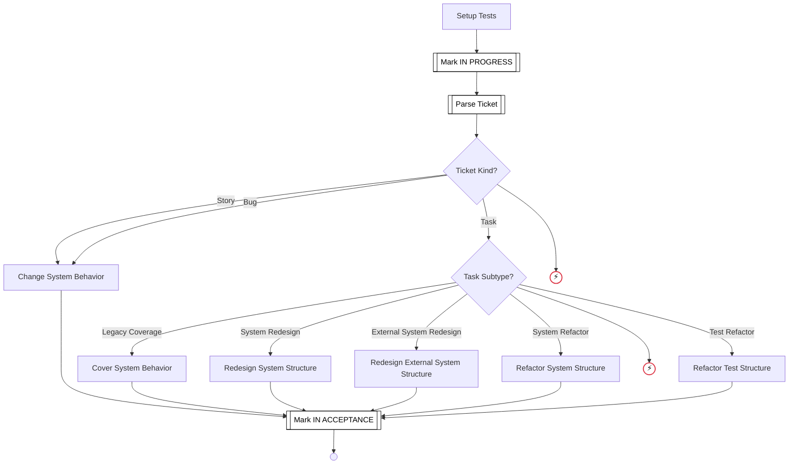

## Refactor

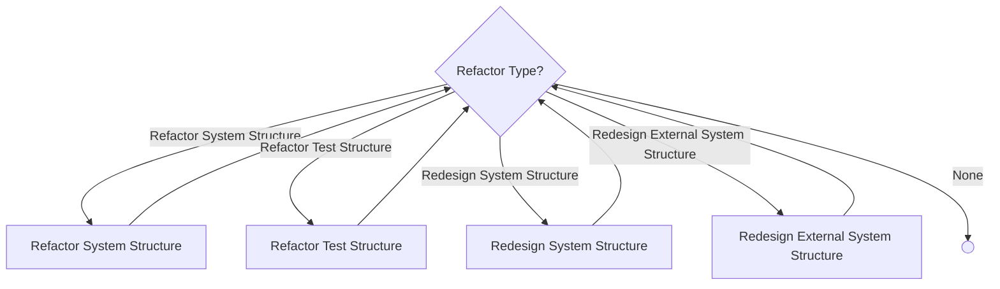

## Refine Backlog Item

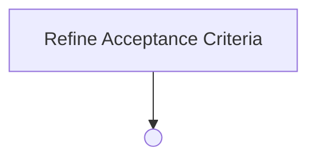

## Change System Behavior

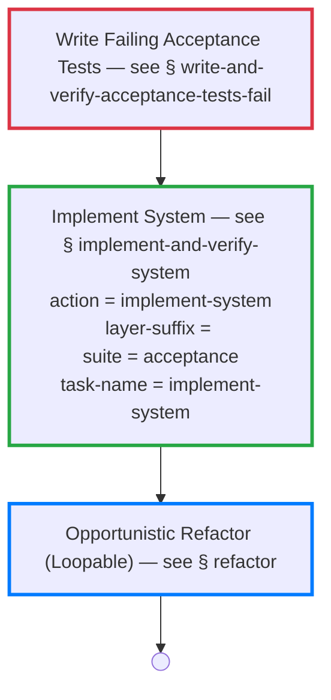

## Cover System Behavior

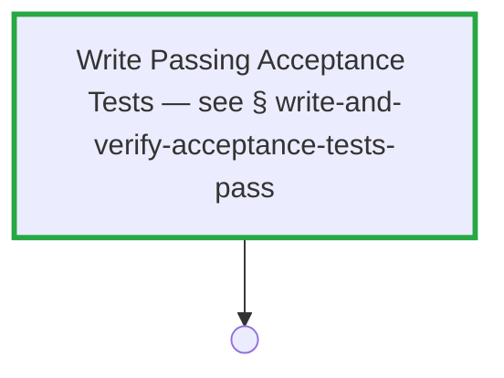

## Redesign System Structure

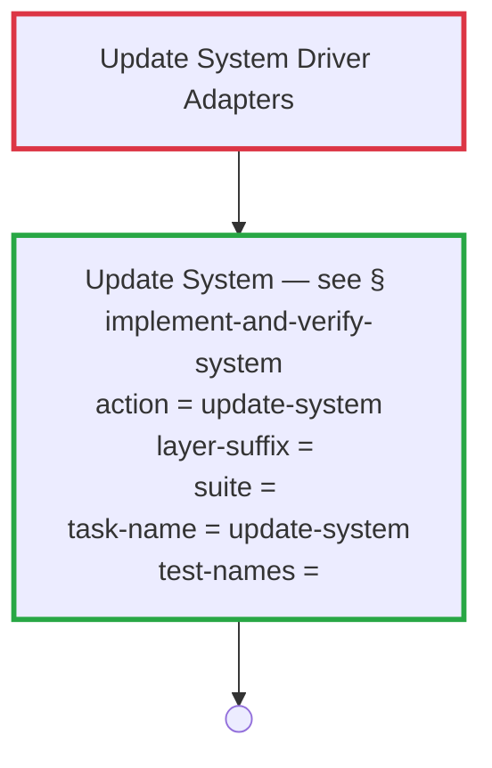

## Refactor System Structure

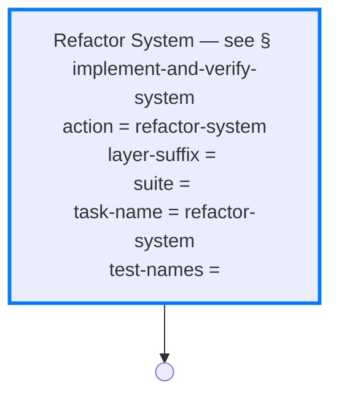

## Refactor Test Structure

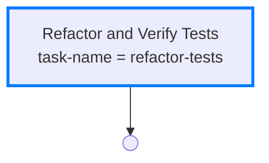

## Write and Verify Acceptance Tests Fail

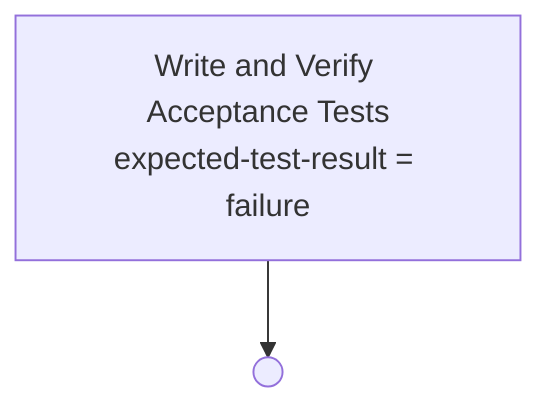

## Write and Verify Acceptance Tests Pass

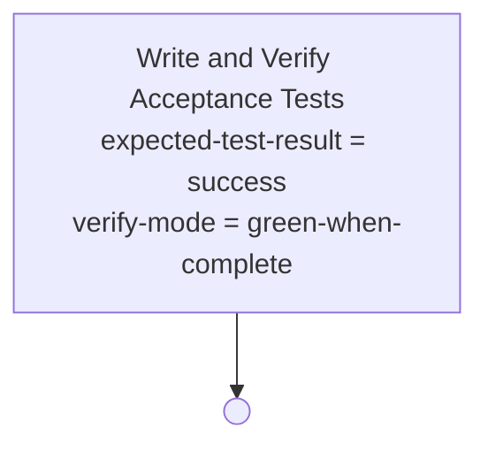

## Write and Verify Acceptance Tests

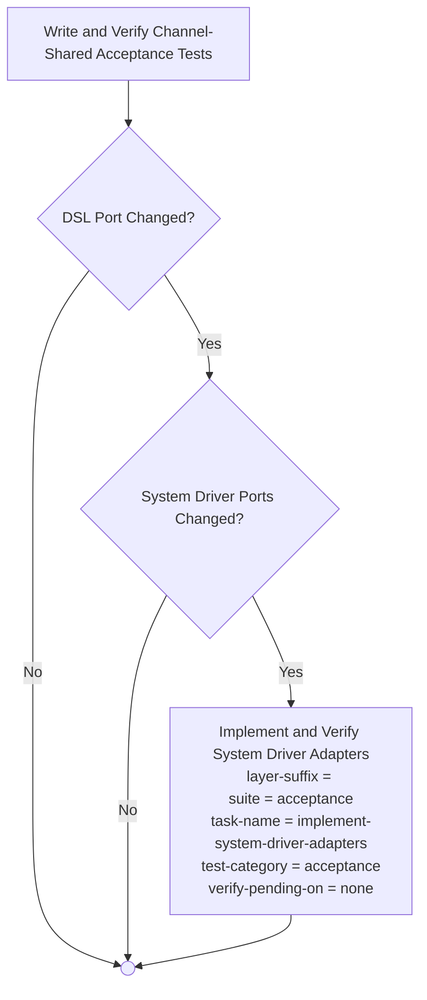

## Write and Verify Channel-Shared Acceptance Tests

```mermaid
flowchart TD
    WRITE_AND_VERIFY_ACCEPTANCE_TEST_CODE["Write and Verify Acceptance Test Code<br/>task-name = write-acceptance-tests<br/>test-category = acceptance<br/>verify-pending-on = dsl"]
    VALIDATE_CHANNELS_REGISTERED[[Validate Touched Channels Are Configured]]
    GATE_DSL_PORT_CHANGED{DSL Port Changed?}
    IMPLEMENT_AND_VERIFY_DSL["Implement and Verify DSL<br/>layer-suffix = <br/>suite = acceptance<br/>task-name = implement-dsl<br/>test-category = acceptance<br/>verify-pending-on = drivers"]
    SHARED_CONTRACT_END(( ))
    GATE_TICKET_HAS_ESCC{Ticket Declares External System Contract Criteria?}
    VALIDATE_EXTERNAL_SYSTEMS_REGISTERED[[Validate Touched External Systems Are Registered]]
    GATE_EXTERNAL_DRIVER_PORTS_CHANGED{External Driver Ports Changed?}
    IMPLEMENT_AND_VERIFY_EXTERNAL_DRIVER_ADAPTERS["Implement and Verify External System Driver Adapters Contract Tests<br/>test-category = contract<br/>verify-mode = red"]
    GATE_AT_TERMINAL_GREEN{Cover Run Needs Terminal AT-Green?}
    START_SYSTEM_AT_TERMINAL[Start System]
    VERIFY_TESTS_PASS_ACCEPTANCE_TERMINAL["Verify Acceptance Tests Pass — see § verify-tests-pass<br/>suite = acceptance"]

    WRITE_AND_VERIFY_ACCEPTANCE_TEST_CODE --> VALIDATE_CHANNELS_REGISTERED
    VALIDATE_CHANNELS_REGISTERED --> GATE_DSL_PORT_CHANGED
    GATE_DSL_PORT_CHANGED -- Yes --> IMPLEMENT_AND_VERIFY_DSL
    GATE_DSL_PORT_CHANGED -- No --> SHARED_CONTRACT_END
    IMPLEMENT_AND_VERIFY_DSL --> GATE_TICKET_HAS_ESCC
    GATE_TICKET_HAS_ESCC -- Yes --> VALIDATE_EXTERNAL_SYSTEMS_REGISTERED
    GATE_TICKET_HAS_ESCC -- No --> GATE_EXTERNAL_DRIVER_PORTS_CHANGED
    GATE_EXTERNAL_DRIVER_PORTS_CHANGED -- Yes --> VALIDATE_EXTERNAL_SYSTEMS_REGISTERED
    GATE_EXTERNAL_DRIVER_PORTS_CHANGED -- No --> SHARED_CONTRACT_END
    VALIDATE_EXTERNAL_SYSTEMS_REGISTERED --> IMPLEMENT_AND_VERIFY_EXTERNAL_DRIVER_ADAPTERS
    IMPLEMENT_AND_VERIFY_EXTERNAL_DRIVER_ADAPTERS --> GATE_AT_TERMINAL_GREEN
    GATE_AT_TERMINAL_GREEN -- Yes --> START_SYSTEM_AT_TERMINAL
    GATE_AT_TERMINAL_GREEN -- No --> SHARED_CONTRACT_END
    START_SYSTEM_AT_TERMINAL --> VERIFY_TESTS_PASS_ACCEPTANCE_TERMINAL
    VERIFY_TESTS_PASS_ACCEPTANCE_TERMINAL --> SHARED_CONTRACT_END

    classDef serviceNode fill:#ffffff,stroke:#000000,stroke-width:1px,color:#000000
    class VALIDATE_CHANNELS_REGISTERED,VALIDATE_EXTERNAL_SYSTEMS_REGISTERED serviceNode
```

## Write and Verify Acceptance Test Code

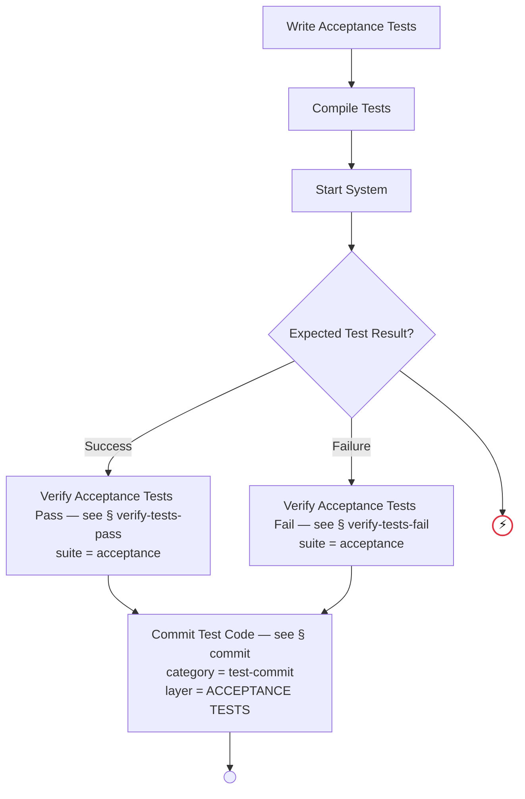

## Implement and Verify DSL

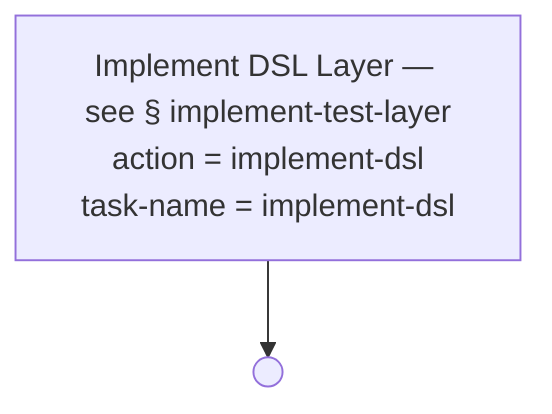

## Implement and Verify System Driver Adapters

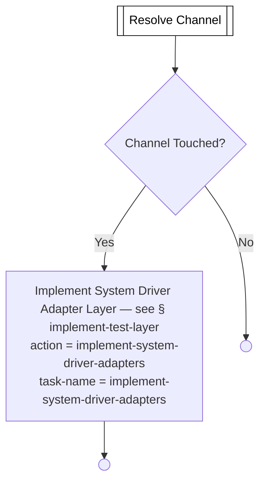

## Implement and Verify External System Driver Adapters Contract Tests

```mermaid
flowchart TD
    RESOLVE_EXTERNAL_SYSTEM[[Resolve External System]]
    GATE_EXTERNAL_SYSTEM_TOUCHED{External System Touched?}
    WRITE_CONTRACT_TESTS["Write External System Contract Tests<br/>expected-test-result = success"]
    EXTERNAL_SYSTEM_SKIPPED(( ))
    WRITE_STUB_FIDELITY_TESTS["Write External System Stub-Fidelity Tests<br/>expected-test-result = success"]
    GATE_DSL_PORT_CHANGED{DSL Port Changed?}
    IMPLEMENT_AND_VERIFY_DSL["Implement and Verify DSL<br/>expected-test-result = success<br/>suite = contract-real<br/>task-name = implement-dsl<br/>test-category = contract<br/>verify-mode = none"]
    IMPLEMENT_EXTERNAL_SYSTEM_DRIVER_ADAPTERS[Implement External System Driver Adapters]
    BUILD_SYSTEM_AFTER_DRIVER[Build System]
    START_SYSTEM_AFTER_DRIVER[Start System — see § start-system-restart]
    PROBE_CONTRACT_REAL["Probe External System Contract Tests Against the Real System — see § run-tests<br/>suite = contract-real"]
    GATE_CONTRACT_REAL_OUTCOME{Contract-Real Outcome?}
    START_SYSTEM_BEFORE_STUB_PROBE[Start System]
    GATE_CONTRACT_REAL_RED_KIND{Real Kind?}
    TESTS_INFRA_HALT((⚡))
    UNKNOWN_TESTS_OUTCOME((⚡))
    PROBE_CONTRACT_STUB["Probe External System Contract Tests Against the Stub — see § run-tests<br/>suite = contract-stub"]
    IMPLEMENT_EXTERNAL_SYSTEM_REAL_SIMULATOR[Implement External System Real Simulator]
    CONTRACT_REAL_UPSTREAM_GAP_HALT((⚡))
    GATE_CONTRACT_STUB_OUTCOME{Contract-Stub Outcome?}
    BUILD_SYSTEM_AFTER_SIMULATOR[Build System]
    GATE_STUB_FIDELITY_PRESENT{Stub-Fidelity Tests Authored?}
    IMPLEMENT_EXTERNAL_SYSTEM_STUBS[Implement External System Stubs]
    START_SYSTEM_AFTER_SIMULATOR[Start System — see § start-system-restart]
    PROBE_CONTRACT_STUB_ISOLATED["Probe Stub-Fidelity Tests Against the Stub — see § run-tests<br/>suite = contract-stub"]
    IMPL_EXT_DRIVER_CT_END(( ))
    BUILD_SYSTEM_AFTER_STUBS[Build System]
    VERIFY_TESTS_PASS_CONTRACT_REAL_AFTER_SIMULATOR["Verify External System Contract Tests Pass Against the Real Simulator — see § verify-tests-pass<br/>suite = contract-real"]
    GATE_CONTRACT_STUB_ISOLATED_OUTCOME{Stub-Fidelity Outcome?}
    START_SYSTEM_AFTER_STUBS[Start System — see § start-system-restart]
    IMPLEMENT_EXTERNAL_SYSTEM_STUBS_ISOLATED[Implement External System Stubs]
    VERIFY_TESTS_PASS_CONTRACT_STUB["Verify External System Contract Tests Pass Against the Stub — see § verify-tests-pass<br/>suite = contract-stub"]
    BUILD_SYSTEM_AFTER_STUBS_ISOLATED[Build System]
    START_SYSTEM_AFTER_STUBS_ISOLATED[Start System — see § start-system-restart]
    VERIFY_TESTS_PASS_CONTRACT_STUB_ISOLATED["Verify Stub-Fidelity Tests Pass Against the Stub — see § verify-tests-pass<br/>suite = contract-stub"]

    RESOLVE_EXTERNAL_SYSTEM --> GATE_EXTERNAL_SYSTEM_TOUCHED
    GATE_EXTERNAL_SYSTEM_TOUCHED -- Yes --> WRITE_CONTRACT_TESTS
    GATE_EXTERNAL_SYSTEM_TOUCHED -- No --> EXTERNAL_SYSTEM_SKIPPED
    WRITE_CONTRACT_TESTS --> WRITE_STUB_FIDELITY_TESTS
    WRITE_STUB_FIDELITY_TESTS --> GATE_DSL_PORT_CHANGED
    GATE_DSL_PORT_CHANGED -- Yes --> IMPLEMENT_AND_VERIFY_DSL
    GATE_DSL_PORT_CHANGED -- No --> IMPLEMENT_EXTERNAL_SYSTEM_DRIVER_ADAPTERS
    IMPLEMENT_AND_VERIFY_DSL --> IMPLEMENT_EXTERNAL_SYSTEM_DRIVER_ADAPTERS
    IMPLEMENT_EXTERNAL_SYSTEM_DRIVER_ADAPTERS --> BUILD_SYSTEM_AFTER_DRIVER
    BUILD_SYSTEM_AFTER_DRIVER --> START_SYSTEM_AFTER_DRIVER
    START_SYSTEM_AFTER_DRIVER --> PROBE_CONTRACT_REAL
    PROBE_CONTRACT_REAL --> GATE_CONTRACT_REAL_OUTCOME
    GATE_CONTRACT_REAL_OUTCOME -- Pass --> START_SYSTEM_BEFORE_STUB_PROBE
    GATE_CONTRACT_REAL_OUTCOME -- Fail --> GATE_CONTRACT_REAL_RED_KIND
    GATE_CONTRACT_REAL_OUTCOME -- Infra --> TESTS_INFRA_HALT
    GATE_CONTRACT_REAL_OUTCOME --> UNKNOWN_TESTS_OUTCOME
    GATE_CONTRACT_REAL_RED_KIND -- Simulator --> IMPLEMENT_EXTERNAL_SYSTEM_REAL_SIMULATOR
    GATE_CONTRACT_REAL_RED_KIND -- Test Instance --> CONTRACT_REAL_UPSTREAM_GAP_HALT
    IMPLEMENT_EXTERNAL_SYSTEM_REAL_SIMULATOR --> BUILD_SYSTEM_AFTER_SIMULATOR
    BUILD_SYSTEM_AFTER_SIMULATOR --> START_SYSTEM_AFTER_SIMULATOR
    START_SYSTEM_AFTER_SIMULATOR --> VERIFY_TESTS_PASS_CONTRACT_REAL_AFTER_SIMULATOR
    VERIFY_TESTS_PASS_CONTRACT_REAL_AFTER_SIMULATOR --> START_SYSTEM_BEFORE_STUB_PROBE
    START_SYSTEM_BEFORE_STUB_PROBE --> PROBE_CONTRACT_STUB
    PROBE_CONTRACT_STUB --> GATE_CONTRACT_STUB_OUTCOME
    GATE_CONTRACT_STUB_OUTCOME -- Pass --> GATE_STUB_FIDELITY_PRESENT
    GATE_CONTRACT_STUB_OUTCOME -- Fail --> IMPLEMENT_EXTERNAL_SYSTEM_STUBS
    GATE_CONTRACT_STUB_OUTCOME -- Infra --> TESTS_INFRA_HALT
    GATE_CONTRACT_STUB_OUTCOME --> UNKNOWN_TESTS_OUTCOME
    IMPLEMENT_EXTERNAL_SYSTEM_STUBS --> BUILD_SYSTEM_AFTER_STUBS
    BUILD_SYSTEM_AFTER_STUBS --> START_SYSTEM_AFTER_STUBS
    START_SYSTEM_AFTER_STUBS --> VERIFY_TESTS_PASS_CONTRACT_STUB
    VERIFY_TESTS_PASS_CONTRACT_STUB --> GATE_STUB_FIDELITY_PRESENT
    GATE_STUB_FIDELITY_PRESENT -- Yes --> PROBE_CONTRACT_STUB_ISOLATED
    GATE_STUB_FIDELITY_PRESENT -- No --> IMPL_EXT_DRIVER_CT_END
    PROBE_CONTRACT_STUB_ISOLATED --> GATE_CONTRACT_STUB_ISOLATED_OUTCOME
    GATE_CONTRACT_STUB_ISOLATED_OUTCOME -- Pass --> IMPL_EXT_DRIVER_CT_END
    GATE_CONTRACT_STUB_ISOLATED_OUTCOME -- Fail --> IMPLEMENT_EXTERNAL_SYSTEM_STUBS_ISOLATED
    GATE_CONTRACT_STUB_ISOLATED_OUTCOME -- Infra --> TESTS_INFRA_HALT
    GATE_CONTRACT_STUB_ISOLATED_OUTCOME --> UNKNOWN_TESTS_OUTCOME
    IMPLEMENT_EXTERNAL_SYSTEM_STUBS_ISOLATED --> BUILD_SYSTEM_AFTER_STUBS_ISOLATED
    BUILD_SYSTEM_AFTER_STUBS_ISOLATED --> START_SYSTEM_AFTER_STUBS_ISOLATED
    START_SYSTEM_AFTER_STUBS_ISOLATED --> VERIFY_TESTS_PASS_CONTRACT_STUB_ISOLATED
    VERIFY_TESTS_PASS_CONTRACT_STUB_ISOLATED --> IMPL_EXT_DRIVER_CT_END

    classDef serviceNode fill:#ffffff,stroke:#000000,stroke-width:1px,color:#000000
    class RESOLVE_EXTERNAL_SYSTEM serviceNode

    classDef errorEndNode fill:#ffffff,stroke:#dc3545,stroke-width:2px,color:#000000
    class CONTRACT_REAL_UPSTREAM_GAP_HALT,TESTS_INFRA_HALT,UNKNOWN_TESTS_OUTCOME errorEndNode
```

## Implement and Verify System

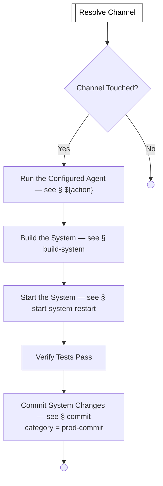

## Refactor and Verify Tests

```mermaid
flowchart TD
    REFACTOR_TESTS[Refactor Tests]
    COMPILE_TESTS[Compile Tests]
    START_SYSTEM[Start System]
    VERIFY_TESTS_PASS["Verify Tests Pass<br/>suite = <br/>test-names = "]
    COMMIT_TESTS["Commit Test Changes — see § commit<br/>category = test-commit<br/>layer = TESTS"]
    REFACTOR_AND_VERIFY_TESTS_END(( ))

    REFACTOR_TESTS --> COMPILE_TESTS
    COMPILE_TESTS --> START_SYSTEM
    START_SYSTEM --> VERIFY_TESTS_PASS
    VERIFY_TESTS_PASS --> COMMIT_TESTS
    COMMIT_TESTS --> REFACTOR_AND_VERIFY_TESTS_END
```

## Implement Test Layer

```mermaid
flowchart TD
    RUN_ACTION["Run the Configured Agent — see § ${action}"]
    COMPILE_TESTS[Compile Tests]
    START_SYSTEM[Start System]
    GATE_EXPECTED_TEST_RESULT{Expected Test Result?}
    VERIFY_TESTS_PASS_FILTERED[Verify Tests Pass]
    VERIFY_TESTS_FAIL_FILTERED[Verify Tests Fail]
    COMMIT_LAYER["Commit Layer Changes — see § commit<br/>category = test-commit"]
    UNKNOWN_EXPECTED_TEST_RESULT((⚡))
    IMPLEMENT_TEST_LAYER_END(( ))

    RUN_ACTION --> COMPILE_TESTS
    COMPILE_TESTS --> START_SYSTEM
    START_SYSTEM --> GATE_EXPECTED_TEST_RESULT
    GATE_EXPECTED_TEST_RESULT -- Success --> VERIFY_TESTS_PASS_FILTERED
    GATE_EXPECTED_TEST_RESULT -- Failure --> VERIFY_TESTS_FAIL_FILTERED
    GATE_EXPECTED_TEST_RESULT -- None --> COMMIT_LAYER
    GATE_EXPECTED_TEST_RESULT --> UNKNOWN_EXPECTED_TEST_RESULT
    VERIFY_TESTS_PASS_FILTERED --> COMMIT_LAYER
    VERIFY_TESTS_FAIL_FILTERED --> COMMIT_LAYER
    COMMIT_LAYER --> IMPLEMENT_TEST_LAYER_END

    classDef errorEndNode fill:#ffffff,stroke:#dc3545,stroke-width:2px,color:#000000
    class UNKNOWN_EXPECTED_TEST_RESULT errorEndNode
```

## Verify Tests Pass

```mermaid
flowchart TD
    RUN_TESTS[Run Tests]
    GATE_TESTS_OUTCOME{Test Outcome?}
    VERIFY_PASS_END(( ))
    CHECK_FIX_PROGRESS[[Check Fix-Loop Progress]]
    TESTS_INFRA_HALT((⚡))
    UNKNOWN_TESTS_OUTCOME((⚡))
    GATE_FIX_PROGRESSING{Fix Loop Progressing?}
    FIX_UNEXPECTED_FAILING_TESTS[Fix Unexpected Test Failures — see § fix-unexpected-failing-tests]
    FIX_LOOP_NO_PROGRESS_EXHAUSTED((⚡))
    GATE_FIX_FLOW_APPROVED{Fixer Dispatch Approved?}
    FIX_FLOW_NOT_APPROVED((⚡))
    FIX_LOOP_EXHAUSTED((⚡))

    RUN_TESTS --> GATE_TESTS_OUTCOME
    GATE_TESTS_OUTCOME -- Pass --> VERIFY_PASS_END
    GATE_TESTS_OUTCOME -- Fail --> CHECK_FIX_PROGRESS
    GATE_TESTS_OUTCOME -- Infra --> TESTS_INFRA_HALT
    GATE_TESTS_OUTCOME --> UNKNOWN_TESTS_OUTCOME
    CHECK_FIX_PROGRESS --> GATE_FIX_PROGRESSING
    GATE_FIX_PROGRESSING -- Yes --> FIX_UNEXPECTED_FAILING_TESTS
    GATE_FIX_PROGRESSING -- No --> FIX_LOOP_NO_PROGRESS_EXHAUSTED
    FIX_UNEXPECTED_FAILING_TESTS --> GATE_FIX_FLOW_APPROVED
    GATE_FIX_FLOW_APPROVED -- Rejected --> FIX_FLOW_NOT_APPROVED
    GATE_FIX_FLOW_APPROVED --> RUN_TESTS

    classDef serviceNode fill:#ffffff,stroke:#000000,stroke-width:1px,color:#000000
    class CHECK_FIX_PROGRESS serviceNode

    classDef errorEndNode fill:#ffffff,stroke:#dc3545,stroke-width:2px,color:#000000
    class FIX_FLOW_NOT_APPROVED,FIX_LOOP_EXHAUSTED,FIX_LOOP_NO_PROGRESS_EXHAUSTED,TESTS_INFRA_HALT,UNKNOWN_TESTS_OUTCOME errorEndNode
```

## Verify Tests Fail

```mermaid
flowchart TD
    RUN_TESTS[Run Tests]
    GATE_TESTS_OUTCOME{Test Outcome?}
    FIX_UNEXPECTED_PASSING_TESTS[Fix Unexpectedly Passing Tests — see § fix-unexpected-passing-tests]
    VERIFY_FAIL_END(( ))
    TESTS_INFRA_HALT((⚡))
    UNKNOWN_TESTS_OUTCOME((⚡))
    GATE_FIX_FLOW_APPROVED{Fixer Dispatch Approved?}
    FIX_FLOW_NOT_APPROVED((⚡))
    FIX_LOOP_EXHAUSTED((⚡))

    RUN_TESTS --> GATE_TESTS_OUTCOME
    GATE_TESTS_OUTCOME -- Pass --> FIX_UNEXPECTED_PASSING_TESTS
    GATE_TESTS_OUTCOME -- Fail --> VERIFY_FAIL_END
    GATE_TESTS_OUTCOME -- Infra --> TESTS_INFRA_HALT
    GATE_TESTS_OUTCOME --> UNKNOWN_TESTS_OUTCOME
    FIX_UNEXPECTED_PASSING_TESTS --> GATE_FIX_FLOW_APPROVED
    GATE_FIX_FLOW_APPROVED -- Rejected --> FIX_FLOW_NOT_APPROVED
    GATE_FIX_FLOW_APPROVED --> RUN_TESTS

    classDef errorEndNode fill:#ffffff,stroke:#dc3545,stroke-width:2px,color:#000000
    class FIX_FLOW_NOT_APPROVED,FIX_LOOP_EXHAUSTED,TESTS_INFRA_HALT,UNKNOWN_TESTS_OUTCOME errorEndNode
```

## Write Acceptance Tests

```mermaid
flowchart TD
    EXECUTE_AGENT["Dispatch the Agent — see § execute-agent<br/>agent = acceptance-test-writer<br/>category = test-agent<br/>task-name = write-acceptance-tests"]
    WAT_END(( ))

    EXECUTE_AGENT --> WAT_END
    WRITE-ACCEPTANCE-TESTS_OUTPUTS[/"dsl-port-changed: bool<br/>test-names?: string-list<br/>scope-exception-files?: string-list<br/>scope-exception-reason?: string"/]
    WAT_END -. produces .-> WRITE-ACCEPTANCE-TESTS_OUTPUTS

    classDef outputNode fill:#e7f0ff,stroke:#004085,stroke-width:1px,stroke-dasharray:4 2,color:#000000
    class WRITE-ACCEPTANCE-TESTS_OUTPUTS outputNode
```

## Write External System Contract Tests

```mermaid
flowchart TD
    EXECUTE_AGENT["Dispatch the Agent — see § execute-agent<br/>agent = contract-test-writer<br/>category = test-agent<br/>task-name = write-contract-tests"]
    WCT_END(( ))

    EXECUTE_AGENT --> WCT_END
    WRITE-CONTRACT-TESTS_OUTPUTS[/"dsl-port-changed: bool<br/>test-names?: string-list<br/>scope-exception-files?: string-list<br/>scope-exception-reason?: string"/]
    WCT_END -. produces .-> WRITE-CONTRACT-TESTS_OUTPUTS

    classDef outputNode fill:#e7f0ff,stroke:#004085,stroke-width:1px,stroke-dasharray:4 2,color:#000000
    class WRITE-CONTRACT-TESTS_OUTPUTS outputNode
```

## Implement DSL

```mermaid
flowchart TD
    EXECUTE_AGENT["Dispatch the Agent — see § execute-agent<br/>agent = dsl-implementer<br/>category = prod-agent<br/>task-name = implement-dsl"]
    IMPL_DSL_END(( ))

    EXECUTE_AGENT --> IMPL_DSL_END
    IMPLEMENT-DSL_OUTPUTS[/"system-driver-port-changed: bool<br/>external-driver-port-changed: bool<br/>scope-exception-files?: string-list<br/>scope-exception-reason?: string"/]
    IMPL_DSL_END -. produces .-> IMPLEMENT-DSL_OUTPUTS

    classDef outputNode fill:#e7f0ff,stroke:#004085,stroke-width:1px,stroke-dasharray:4 2,color:#000000
    class IMPLEMENT-DSL_OUTPUTS outputNode
```

## Implement System

```mermaid
flowchart TD
    EXECUTE_AGENT["Dispatch the Agent — see § execute-agent<br/>agent = system-implementer<br/>category = prod-agent<br/>task-name = implement-system"]
    IMPL_SYS_END(( ))

    EXECUTE_AGENT --> IMPL_SYS_END
```

## Implement System Driver Adapters

```mermaid
flowchart TD
    EXECUTE_AGENT["Dispatch the Agent — see § execute-agent<br/>agent = system-driver-adapter-implementer<br/>category = prod-agent<br/>task-name = implement-system-driver-adapters"]
    IMPL_SYS_DA_END(( ))

    EXECUTE_AGENT --> IMPL_SYS_DA_END
```

## Implement External System Driver Adapters

```mermaid
flowchart TD
    EXECUTE_AGENT["Dispatch the Agent — see § execute-agent<br/>agent = external-system-driver-adapter-implementer<br/>category = prod-agent<br/>task-name = implement-external-system-driver-adapters"]
    IMPL_EXT_DA_END(( ))

    EXECUTE_AGENT --> IMPL_EXT_DA_END
```

## Implement External System Stubs

```mermaid
flowchart TD
    EXECUTE_AGENT["Dispatch the Agent — see § execute-agent<br/>agent = external-system-stub-implementer<br/>category = prod-agent<br/>task-name = implement-external-system-stubs"]
    IMPL_STUBS_END(( ))

    EXECUTE_AGENT --> IMPL_STUBS_END
```

## Fix Unexpected Passing Tests

```mermaid
flowchart TD
    EXECUTE_AGENT["Dispatch the Agent — see § execute-agent<br/>agent = unexpected-passing-tests-fixer<br/>category = human<br/>task-name = fix-unexpected-passing-tests"]
    FIX_PASS_END(( ))

    EXECUTE_AGENT --> FIX_PASS_END
```

## Fix Unexpected Failing Tests

```mermaid
flowchart TD
    EXECUTE_AGENT["Dispatch the Agent — see § execute-agent<br/>agent = unexpected-failing-tests-fixer<br/>category = human<br/>task-name = fix-unexpected-failing-tests"]
    FIX_FAIL_END(( ))

    EXECUTE_AGENT --> FIX_FAIL_END
```

## Refactor Tests

```mermaid
flowchart TD
    EXECUTE_AGENT["Dispatch the Agent — see § execute-agent<br/>agent = test-refactorer<br/>category = test-agent<br/>task-name = refactor-tests"]
    REFACTOR_TESTS_END(( ))

    EXECUTE_AGENT --> REFACTOR_TESTS_END
```

## Refactor System

```mermaid
flowchart TD
    EXECUTE_AGENT["Dispatch the Agent — see § execute-agent<br/>agent = system-refactorer<br/>category = prod-agent<br/>task-name = refactor-system"]
    REFACTOR_SYS_END(( ))

    EXECUTE_AGENT --> REFACTOR_SYS_END
```

## Refine Acceptance Criteria

```mermaid
flowchart TD
    EXECUTE_AGENT["Dispatch the Agent — see § execute-agent<br/>agent = acceptance-criteria-refiner<br/>category = human<br/>task-name = refine-acceptance-criteria"]
    REFINE_AC_END(( ))

    EXECUTE_AGENT --> REFINE_AC_END
```

## Compile Tests

```mermaid
flowchart TD
    EXECUTE_COMMAND["Dispatch the Command — see § execute-command<br/>category = command<br/>command = gh optivem test compile<br/>task-name = compile-tests"]
    COMPILE_TESTS_END(( ))

    EXECUTE_COMMAND --> COMPILE_TESTS_END
```

## Build System

```mermaid
flowchart TD
    EXECUTE_COMMAND["Dispatch the Command — see § execute-command<br/>category = command<br/>command = gh optivem system build<br/>task-name = build-system"]
    BUILD_SYS_END(( ))

    EXECUTE_COMMAND --> BUILD_SYS_END
```

## Start System

```mermaid
flowchart TD
    EXECUTE_COMMAND["Dispatch the Command — see § execute-command<br/>category = command<br/>command = gh optivem system start<br/>task-name = start-system"]
    START_SYS_END(( ))

    EXECUTE_COMMAND --> START_SYS_END
```

## Commit

```mermaid
flowchart TD
    EXECUTE_COMMAND["Dispatch the Command — see § execute-command<br/>command = gh optivem commit --yes --include-untracked<br/>task-name = commit"]
    COMMIT_MID_END(( ))

    EXECUTE_COMMAND --> COMMIT_MID_END
```

## Run Tests

```mermaid
flowchart TD
    EXECUTE_COMMAND["Dispatch the Command — see § execute-command<br/>category = command<br/>command = gh optivem test run<br/>fix-on-failure = false<br/>task-name = run-tests"]
    RUN_TESTS_END(( ))

    EXECUTE_COMMAND --> RUN_TESTS_END
```

## Approve

```mermaid
flowchart TD
    ASK_HUMAN["${question}"]
    GATE_APPROVED{Approval Outcome?}
    APPROVE_OK_END(( ))
    APPROVE_REJECT_END(( ))

    ASK_HUMAN --> GATE_APPROVED
    GATE_APPROVED -- Approved --> APPROVE_OK_END
    GATE_APPROVED -- Rejected --> APPROVE_REJECT_END

    classDef humanNode fill:#ffeb3b,stroke:#fbc02d,stroke-width:2px,color:#000000
    class ASK_HUMAN humanNode
```

## Execute Agent

```mermaid
flowchart TD
    APPROVE_PRE[Request Approval — see § approve]
    GATE_APPROVED_PRE{Approval Outcome?}
    SNAPSHOT_WORKING_TREE[["Snapshot working tree (per-phase baseline)"]]
    EXECUTE_AGENT_REJECTED_END(( ))
    RUN_AGENT["Run agent ${agent} (task: ${task-name})"]
    VALIDATE_OUTPUTS_AND_SCOPES[["Validate outputs & scopes"]]
    GATE_SCOPE_EXCEPTION_REQUESTED{Scope Exception Requested?}
    CATEGORIZE_SCOPE_EXCEPTION[[Categorize Scope Exception]]
    GATE_OUTPUTS_AND_SCOPES_VALID{Outputs and Scopes Valid?}
    GATE_SCOPE_EXCEPTION_NEEDS_ESCC{Scope Exception Needs ESCC?}
    APPROVE_POST[Confirm Approval — see § approve]
    GATE_FIX_ON_FAILURE{Fix on Failure Enabled?}
    ESCC_UNDECLARED_HALT((⚡))
    STOP_SCOPE_VIOLATION((⚡))
    GATE_APPROVED_POST{Approval Outcome?}
    FIX[Fix the Failure — see § fix]
    EXECUTE_AGENT_END(( ))
    EXECUTE_AGENT_OUTPUT_REJECTED_END((⚡))
    AGENT_FIX_EXHAUSTED((⚡))

    APPROVE_PRE --> GATE_APPROVED_PRE
    GATE_APPROVED_PRE -- Approved --> SNAPSHOT_WORKING_TREE
    GATE_APPROVED_PRE -- Rejected --> EXECUTE_AGENT_REJECTED_END
    SNAPSHOT_WORKING_TREE --> RUN_AGENT
    RUN_AGENT --> VALIDATE_OUTPUTS_AND_SCOPES
    VALIDATE_OUTPUTS_AND_SCOPES --> GATE_SCOPE_EXCEPTION_REQUESTED
    GATE_SCOPE_EXCEPTION_REQUESTED -- Yes --> CATEGORIZE_SCOPE_EXCEPTION
    GATE_SCOPE_EXCEPTION_REQUESTED -- No --> GATE_OUTPUTS_AND_SCOPES_VALID
    CATEGORIZE_SCOPE_EXCEPTION --> GATE_SCOPE_EXCEPTION_NEEDS_ESCC
    GATE_SCOPE_EXCEPTION_NEEDS_ESCC -- Yes --> ESCC_UNDECLARED_HALT
    GATE_SCOPE_EXCEPTION_NEEDS_ESCC -- No --> STOP_SCOPE_VIOLATION
    GATE_OUTPUTS_AND_SCOPES_VALID -- Yes --> APPROVE_POST
    GATE_OUTPUTS_AND_SCOPES_VALID -- No --> GATE_FIX_ON_FAILURE
    GATE_FIX_ON_FAILURE -- Yes --> FIX
    GATE_FIX_ON_FAILURE -- No --> APPROVE_POST
    FIX --> RUN_AGENT
    APPROVE_POST --> GATE_APPROVED_POST
    GATE_APPROVED_POST -- Approved --> EXECUTE_AGENT_END
    GATE_APPROVED_POST -- Rejected --> EXECUTE_AGENT_OUTPUT_REJECTED_END

    classDef serviceNode fill:#ffffff,stroke:#000000,stroke-width:1px,color:#000000
    class CATEGORIZE_SCOPE_EXCEPTION,SNAPSHOT_WORKING_TREE,VALIDATE_OUTPUTS_AND_SCOPES serviceNode

    classDef agentNode fill:#004085,stroke:#002752,stroke-width:2px,color:#ffffff
    class RUN_AGENT agentNode

    classDef errorEndNode fill:#ffffff,stroke:#dc3545,stroke-width:2px,color:#000000
    class AGENT_FIX_EXHAUSTED,ESCC_UNDECLARED_HALT,EXECUTE_AGENT_OUTPUT_REJECTED_END,STOP_SCOPE_VIOLATION errorEndNode
```

## Execute Command

```mermaid
flowchart TD
    APPROVE_PRE[Request Approval — see § approve]
    GATE_APPROVED_PRE{Approval Outcome?}
    RUN_COMMAND[["Run command ${command}"]]
    EXECUTE_COMMAND_REJECTED_END(( ))
    GATE_COMMAND_SUCCEEDED{Command Succeeded?}
    EXECUTE_COMMAND_END(( ))
    GATE_FIX_ON_FAILURE{Fix on Failure Enabled?}
    FIX[Fix the Failure — see § fix]
    COMMAND_FIX_EXHAUSTED((⚡))

    APPROVE_PRE --> GATE_APPROVED_PRE
    GATE_APPROVED_PRE -- Approved --> RUN_COMMAND
    GATE_APPROVED_PRE -- Rejected --> EXECUTE_COMMAND_REJECTED_END
    RUN_COMMAND --> GATE_COMMAND_SUCCEEDED
    GATE_COMMAND_SUCCEEDED -- Yes --> EXECUTE_COMMAND_END
    GATE_COMMAND_SUCCEEDED -- No --> GATE_FIX_ON_FAILURE
    GATE_FIX_ON_FAILURE -- Yes --> FIX
    GATE_FIX_ON_FAILURE -- No --> EXECUTE_COMMAND_END
    FIX --> RUN_COMMAND

    classDef serviceNode fill:#ffffff,stroke:#000000,stroke-width:1px,color:#000000
    class RUN_COMMAND serviceNode

    classDef errorEndNode fill:#ffffff,stroke:#dc3545,stroke-width:2px,color:#000000
    class COMMAND_FIX_EXHAUSTED errorEndNode
```

## Fix

```mermaid
flowchart TD
    APPROVE_PRE["Request Approval — see § approve<br/>category = human"]
    GATE_APPROVED_PRE{Approval Outcome?}
    EXECUTE_AGENT["Dispatch the Agent — see § execute-agent<br/>category = human<br/>fix-on-failure = false"]
    FIX_REJECTED_END((⚡))
    FIX_END(( ))

    APPROVE_PRE --> GATE_APPROVED_PRE
    GATE_APPROVED_PRE -- Approved --> EXECUTE_AGENT
    GATE_APPROVED_PRE -- Rejected --> FIX_REJECTED_END
    EXECUTE_AGENT --> FIX_END

    classDef errorEndNode fill:#ffffff,stroke:#dc3545,stroke-width:2px,color:#000000
    class FIX_REJECTED_END errorEndNode
```

## Implement External System Real Simulator

```mermaid
flowchart TD
    EXECUTE_AGENT["Dispatch the Agent — see § execute-agent<br/>agent = external-system-real-simulator-implementer<br/>category = prod-agent<br/>task-name = implement-external-system-real-simulator"]
    IMPL_REAL_SIM_END(( ))

    EXECUTE_AGENT --> IMPL_REAL_SIM_END
```

## Redesign External System Structure

```mermaid
flowchart TD
    UPDATE_EXTERNAL_SYSTEM_DRIVER_ADAPTERS[Update External System Driver Adapters]
    IMPLEMENT_AND_VERIFY_SYSTEM["Update System — see § implement-and-verify-system<br/>action = update-system<br/>layer-suffix = <br/>suite = <br/>task-name = update-system<br/>test-names = "]
    REDESIGN_EXTERNAL_END(( ))

    UPDATE_EXTERNAL_SYSTEM_DRIVER_ADAPTERS --> IMPLEMENT_AND_VERIFY_SYSTEM
    IMPLEMENT_AND_VERIFY_SYSTEM --> REDESIGN_EXTERNAL_END

    classDef tddRedNode stroke:#dc3545,stroke-width:3px
    class UPDATE_EXTERNAL_SYSTEM_DRIVER_ADAPTERS tddRedNode

    classDef tddGreenNode stroke:#28a745,stroke-width:3px
    class IMPLEMENT_AND_VERIFY_SYSTEM tddGreenNode
```

## Setup Tests

```mermaid
flowchart TD
    EXECUTE_COMMAND["Dispatch the Command — see § execute-command<br/>category = command<br/>command = gh optivem test setup<br/>task-name = setup-tests"]
    SETUP_TESTS_END(( ))

    EXECUTE_COMMAND --> SETUP_TESTS_END
```

## Start System (Restart)

```mermaid
flowchart TD
    EXECUTE_COMMAND["Dispatch the Command — see § execute-command<br/>category = command<br/>command = gh optivem system start --restart<br/>task-name = start-system-restart"]
    START_SYS_RESTART_END(( ))

    EXECUTE_COMMAND --> START_SYS_RESTART_END
```

## Update External System Driver Adapters

```mermaid
flowchart TD
    EXECUTE_AGENT["Dispatch the Agent — see § execute-agent<br/>agent = external-system-driver-adapter-updater<br/>category = prod-agent<br/>task-name = update-external-system-driver-adapters"]
    UPDATE_EXT_DA_END(( ))

    EXECUTE_AGENT --> UPDATE_EXT_DA_END
```

## Update System

```mermaid
flowchart TD
    EXECUTE_AGENT["Dispatch the Agent — see § execute-agent<br/>agent = system-updater<br/>category = prod-agent<br/>task-name = update-system"]
    UPDATE_SYS_END(( ))

    EXECUTE_AGENT --> UPDATE_SYS_END
```

## Update System Driver Adapters

```mermaid
flowchart TD
    EXECUTE_AGENT["Dispatch the Agent — see § execute-agent<br/>agent = system-driver-adapter-updater<br/>category = prod-agent<br/>task-name = update-system-driver-adapters"]
    UPDATE_SYS_DA_END(( ))

    EXECUTE_AGENT --> UPDATE_SYS_DA_END
```

## Write External System Stub-Fidelity Tests

```mermaid
flowchart TD
    EXECUTE_AGENT["Dispatch the Agent — see § execute-agent<br/>agent = stub-fidelity-test-writer<br/>category = test-agent<br/>task-name = write-stub-fidelity-tests"]
    WSFT_END(( ))

    EXECUTE_AGENT --> WSFT_END
    WRITE-STUB-FIDELITY-TESTS_OUTPUTS[/"isolated-test-names?: string-list<br/>scope-exception-files?: string-list<br/>scope-exception-reason?: string"/]
    WSFT_END -. produces .-> WRITE-STUB-FIDELITY-TESTS_OUTPUTS

    classDef outputNode fill:#e7f0ff,stroke:#004085,stroke-width:1px,stroke-dasharray:4 2,color:#000000
    class WRITE-STUB-FIDELITY-TESTS_OUTPUTS outputNode
```

