# ATDD Process Flow

> Generated from `internal/atdd/runtime/statemachine/process-flow.yaml` by `internal/atdd/runtime/diagram`. Do not edit by hand — edit the YAML and regenerate via `gh optivem atdd show diagram > docs/process-diagram.md`.

Each section corresponds to one named flow in the YAML. `call_activity` nodes appear as boxes pointing at the linked sub-flow's heading.

## Ticket Lifecycle

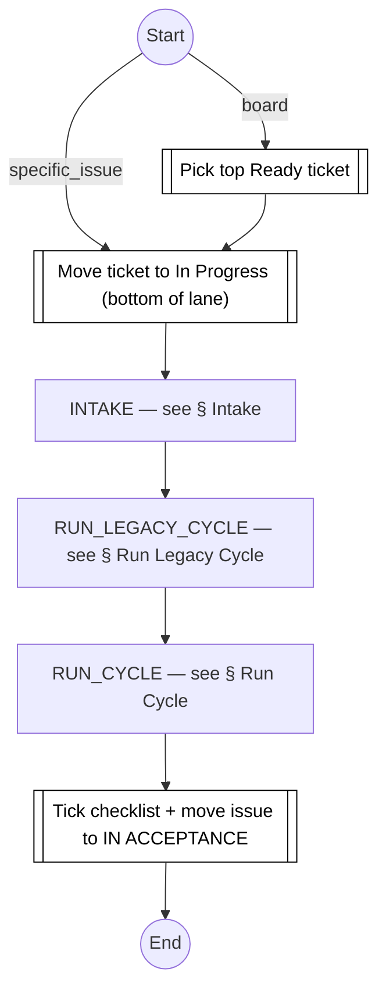

## Intake

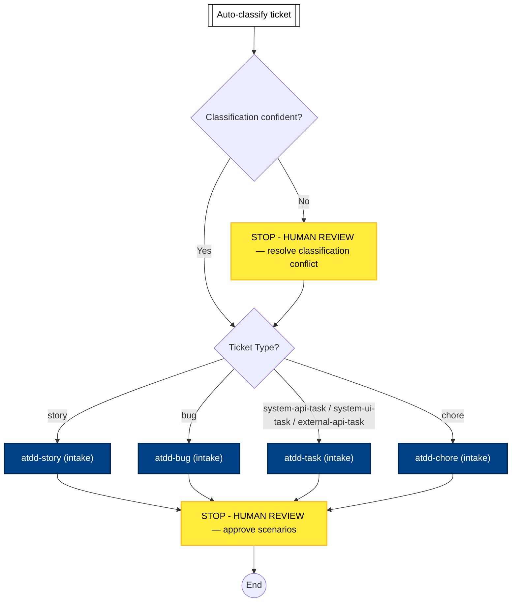

## Run Legacy Cycle

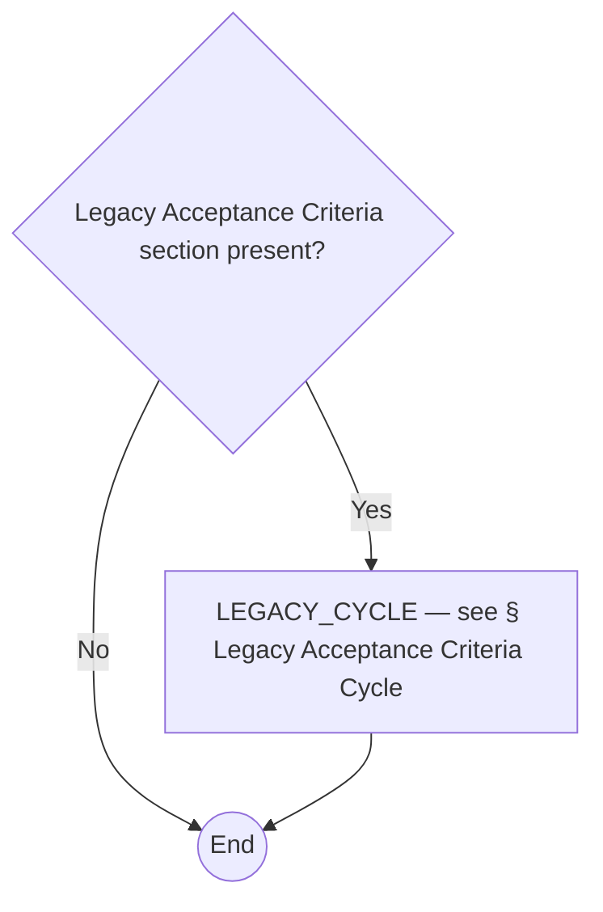

## Run Cycle

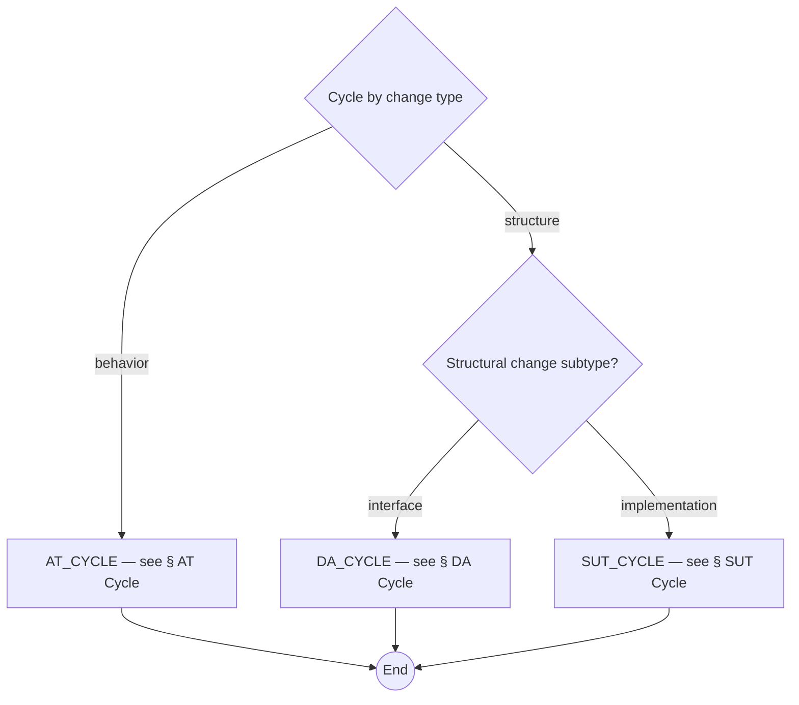

## AT Cycle

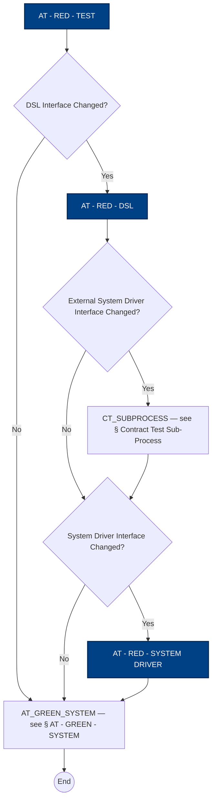

## AT - GREEN - SYSTEM

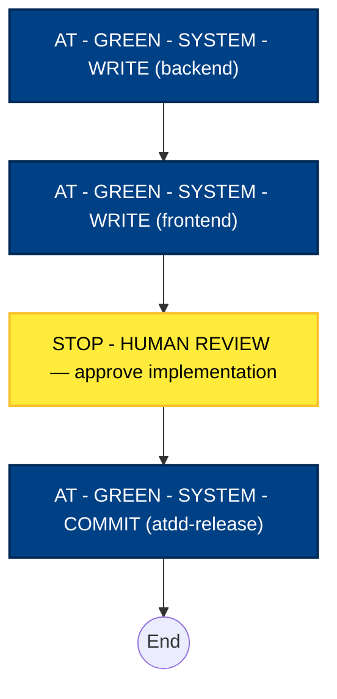

## Contract Test Sub-Process

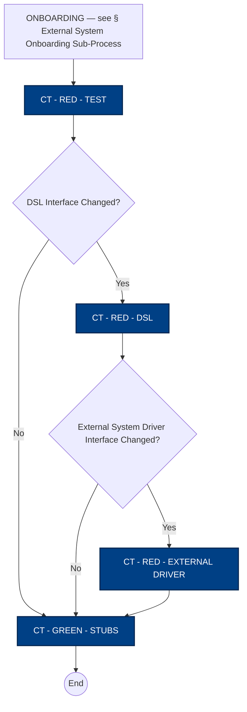

## External System Onboarding Sub-Process

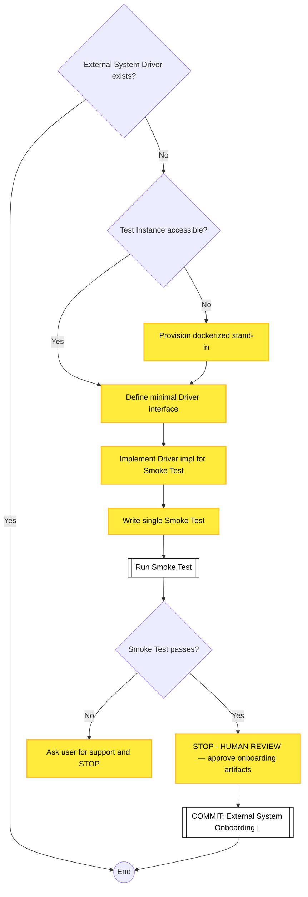

## Structural Cycle (shared)

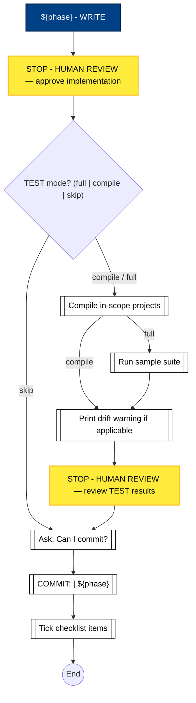

## Legacy Acceptance Criteria Cycle

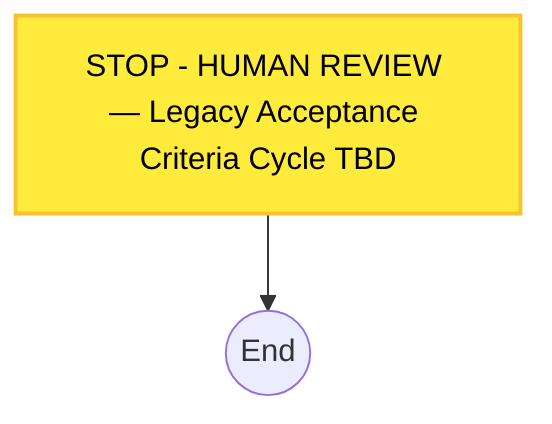

## DA Cycle

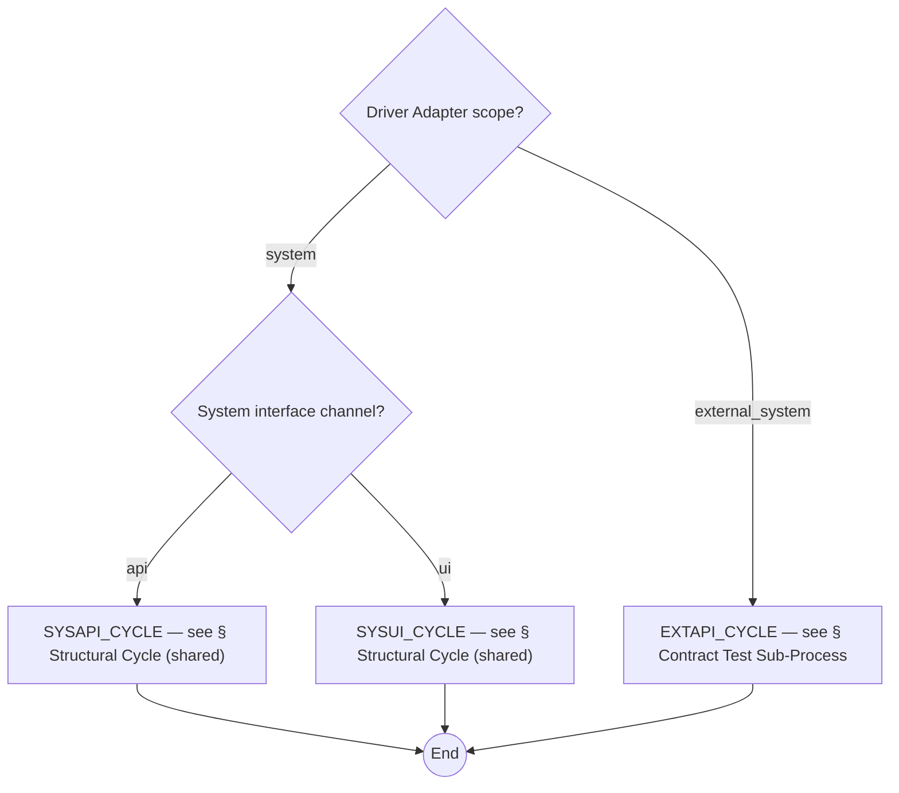

## SUT Cycle

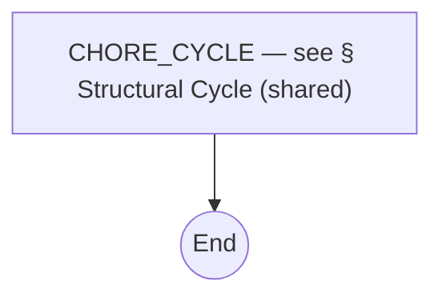

